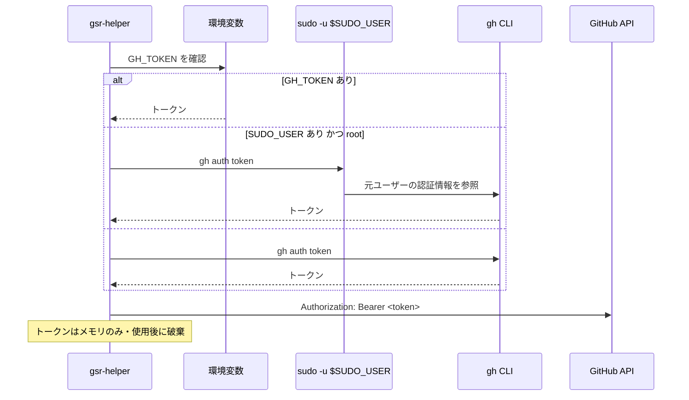

# 外部インターフェース

本ツールは API を提供しない。外部との接点は「GitHub REST API の利用」と「外部コマンドの実行」の 2 つである。ここではその全量を定義する。

前提は [アーキテクチャ設計](../architecture/overview.md)、トークンの扱いは [セキュリティ設計](../architecture/security.md) を参照。

## GitHub REST API

### 認証

トークンは `gh` CLI の認証情報を借用する（優先順は [セキュリティ設計](../architecture/security.md#取得の優先順)）。API アクセスには `google/go-github` を用いる。



### 必要なトークンスコープ

**runner の管理にはスコープごとに異なる権限が必要**であり、不足していると 403 になる。保有スコープの確認は `gh.TokenScopes` が行い、**doctor の「認証・権限」の項目が不足を警告する**（[FR-32](../requirements/functional.md)）。起動時の能力判定（`gh.HasToken`）が見るのはトークンを取得できるかどうかだけで、スコープは見ない——確認は API への往復を要し、起動を待たせるためである。**保有スコープは起動後に 1 度だけ引いて共有状態（`page.StateMsg.Scopes`）に載せ**（`internal/ui/ghscope`）、操作の可否（[画面仕様の「無効な操作の表示」](../ui/screens.md#無効な操作の表示) の 6 段目）はそこから読むだけにする。1 フレームごとの描画から API を呼ばずに済ませるための形である。スコープ不足の判定が効くのは `n`（追加）/ `D`（削除）で、`u`（更新）は塞がない（`internal/ui/page/action` の `missingScope`。Issue #79）。理由はフッタと詳細画面の操作リストにグレーアウトとして出る（`n` は詳細画面の操作リストには載らないため、そこに出るのは `D` だけである）。

**表示だけでなく実行も止まるのは `D` である。** 一括操作の対象にスコープ不足の runner が 1 台でも混じると、Setup タブへの引き渡し自体が起こらず操作全体が中止され、理由が状態行に出る（`internal/ui/page/runners` の `setupBlocked`。Setup タブ内から始める削除・更新にも同じ判定がある）。**`n` は押下を塞がない。** 追加先は Setup タブのフォームで後から決まり対象の runner を持たないため、判定は下表の 4 つ目（登録先が判定できない）に当たって必ず通る。フッタが `n` をグレーアウトするのは選択中の runner のスコープによる表示であり、実行の可否とは一致しない。

**塞ぐのは足りないと分かったときだけで、次の 4 つに当たる間は塞がない。**

| 状況 | 塞がない理由 |
|------|-------------|
| まだ引けていない（起動直後） | 判定前に塞ぐと、権限の足りているトークンで一時的に操作できなくなる |
| 取得に失敗した | 「確認できなかった」と「権限が無い」は違う |
| `X-OAuth-Scopes` を返さないトークン | fine-grained PAT と GitHub App はスコープという概念を持たない（後述）。「スコープが無い」と扱うと権限の十分なトークンを誤って塞ぐ |
| 登録先が判定できない | 必要なスコープが決まらない（Setup タブのメニューなど対象を持たない画面を含む） |

前 2 つは実装上いずれも「取得を終えていない」（`page.ScopeState.Known` が偽）として同じ扱いになる。この 4 つのいずれかに当たって塞がなかった権限不足は、API を呼んだ時点の 403 として現れる（下記「レート制限とエラー」）。

| 対象 | 必要なスコープ（classic PAT / OAuth） | Fine-grained PAT での権限 |
|------|--------------------------------|------------------------|
| repo レベルの runner | `repo` | Repository permissions → Administration (write) |
| **org レベルの runner** | **`admin:org`** | Organization permissions → Self-hosted runners (write) |
| enterprise レベルの runner | `admin:enterprise` | — |

`gh auth login` の既定スコープには `admin:org` が含まれない（既定は `gist`, `read:org`, `repo`, `workflow` 程度）。org レベルの runner を管理する場合は次のようにスコープを追加する必要がある。

```
gh auth refresh -h github.com -s admin:org
```

保有スコープは API レスポンスの `X-OAuth-Scopes` ヘッダから確認できる。doctor では「操作したいスコープに対して権限が足りているか」を判定して提示する。

確認に叩くのは `GET /rate_limit` である。**レート制限を消費しない唯一の endpoint** であり、診断は繰り返し実行されるものなので、確認そのものが制限を削る形にはしない。応答ヘッダは他の endpoint と同じものが載る。

**`X-OAuth-Scopes` を返さないトークンがある。** fine-grained PAT と GitHub App のトークンはスコープという形の権限を持たない。これを「スコープを 0 個持っている」と扱うと、権限の足りている fine-grained PAT に対して `admin:org` がないと誤って警告する。`gh.Scopes.Classic` がヘッダの有無を保持し、doctor は判定不能（SKIP）として区別する。

### 使用するエンドポイント

`{scope}` はスコープに応じて次のいずれかに置き換わる（[データモデル](../architecture/data-model.md#scope)）。

| Scope | パス接頭辞 |
|-------|-----------|
| Repo | `/repos/{owner}/{repo}` |
| Org | `/orgs/{org}` |
| Enterprise | `/enterprises/{enterprise}` |

| 用途 | メソッド・パス | 対応機能 |
|------|--------------|---------|
| 登録トークンの取得 | `POST {scope}/actions/runners/registration-token` | FR-14（追加） |
| 登録解除トークンの取得 | `POST {scope}/actions/runners/remove-token` | FR-17（削除） |
| runner 一覧の取得 | `GET {scope}/actions/runners` | 一覧の照合、孤児検出（**実装済みだが未使用**） |
| runner の削除 | `DELETE {scope}/actions/runners/{runner_id}` | FR-17（**実装済みだが未使用**） |
| runner tarball の取得情報 | `GET {scope}/actions/runners/downloads` | FR-13。OS / アーキテクチャごとの `download_url`・`filename`・`sha256_checksum` を返す |
| ラベルの取得 | `GET {scope}/actions/runners/{runner_id}/labels` | FR-35（設定編集） |
| ラベルの置換 | `PUT {scope}/actions/runners/{runner_id}/labels` | FR-35 |
| ラベルの追加 | `POST {scope}/actions/runners/{runner_id}/labels` | FR-35 |
| ラベルの個別削除 | `DELETE {scope}/actions/runners/{runner_id}/labels/{name}` | FR-35 |
| runner group の一覧 | `GET /orgs/{org}/actions/runner-groups`（enterprise は `GET /enterprises/{enterprise}/actions/runner-groups`） | FR-12、FR-35（org / enterprise のみ。repo スコープには無い） |
| runner group の付け替え | `PUT {org|enterprise}/actions/runner-groups/{runner_group_id}/runners/{runner_id}` | FR-35（org / enterprise のみ） |
| runner 本体の最新版 | `GET /repos/actions/runner/releases/latest` | FR-20（更新の必要性判定） |
| 保有スコープの確認 | `GET /rate_limit` | doctor。応答の `X-OAuth-Scopes` ヘッダから保有スコープを読む。**レート制限を消費しない唯一の endpoint**であるため確認先に選んでいる（前述） |

**tarball の SHA-256 は `downloads` エンドポイントが返す値を使う。** 自前でハッシュ一覧を持たず、取得したチェックサムと展開前のファイルを照合する。

**上表のうち実際に呼んでいるのは 9 つである**（登録トークン / 登録解除トークン / tarball の取得情報 / runner 本体の最新版 / 保有スコープの確認 / runner 一覧 / ラベルの取得・置換 / runner group の一覧・付け替え）。

**runner の削除は `internal/gh` に実装済みだが、本番の呼び出し元がまだ無い**（`DeleteRunner` を呼ぶのはテストだけである）。runner 一覧は Config タブが GitHub 側の runner ID を名前から引き当てるのに使う（ラベルの API が ID を要求するため）。一覧の照合と孤児検出は、3 秒ポーリングで API を呼ばない方針（後述）に沿ってホスト内の情報だけで構成しており、API 側の一覧と突き合わせる画面がまだ無い。削除は `svc.sh stop` → `svc.sh uninstall` → `config.sh remove --token` の 3 本で完結しており（`internal/setup/remove.go`）、**`config.sh remove` が使えない場合に DELETE へ切り替える経路は実装していない**。runner ディレクトリを失ったなどで `config.sh` を起動できない台の後始末は、この DELETE を使う将来の機能に委ねる。

**ラベルは取得と置換、runner group は一覧と付け替えを Config タブ（FR-35）が実装した**（`internal/gh` の `RunnerLabels` / `ReplaceRunnerLabels` / `ListRunnerGroups` / `AddRunnerToGroup`）。**ラベルの追加（POST）と個別削除（DELETE）は実装していない。** 設定編集は現在値を取って全量を置き換える形（GET → PUT）で足りており、呼び出し元の無い公開 API は置かないためである（[コンポーネント設計](../components/overview.md)）。必要になった Issue が同じ共通処理へメソッドとパス末尾を足せる形にしてある。ラベルと runner group は GitHub 側の値なので、変更は再起動を伴わず即時に反映される。runner group は追加のフォームでは名前を入力する形のままで（`config.sh --runnergroup`）、一覧から選ばせるのは Config タブである。**runner group は org / enterprise にしか無く、repo スコープでは `ErrNoRunnerGroups` を返して要求を送らない。** 呼び出しはすべて `internal/gh` の `Client` を通り、**GitHub と通信するパッケージはここ 1 つだけである**（[コンポーネント設計](../components/overview.md#internalgh)）。

### レート制限とエラー

| 状況 | 扱い |
|------|------|
| 403（レート制限） | `X-RateLimit-Reset` を見て待機時間を表示する。自動リトライは行わず、ユーザーに再試行を委ねる |
| 403（権限不足） | 必要なスコープを示す（上表）。`gh auth refresh` のコマンド例を提示する |
| 401 | トークンが無効。`gh auth status` の確認を促す |
| 404 | スコープの指定誤り、または権限不足による隠蔽の可能性を併記する |
| ネットワーク到達不可 | API を要する機能を無効化し、ホスト内の情報のみで動作を継続する |

この表は `gh.APIError` が実装する。失敗は「次に何をすればよいか」（不足しているスコープ、待機時間、確認コマンド）を `Hint` に載せて返し、**自動リトライはしない**。再試行するかどうかは利用者に委ねる。

一覧表示の 3 秒ポーリングでは **API を呼ばない**（ホスト内の情報のみで構成する）。API 呼び出しはユーザーの操作に対応する形でのみ行い、レート制限を消費しない。runner の追加・削除・バージョン更新も、利用者の操作を起点に 1 度だけ呼ぶ（計画を組むときに最新バージョンを 1 回、承認のあとに短命トークンと tarball の取得情報を必要な分だけ）。**短命トークンを取るのは承認のあとである**——承認前に取ると、キャンセルした場合にも有効なトークンを発行してしまう。

## 実行する外部コマンド

すべて `Executor` 経由で実行し、シェルは経由しない。**監査ログには原則として全件記録するが、下記 systemd の表のうち、再検出（`internal/runner/systemd` の `Scan`）が発行する `list-units` / `show` と、ログ追従（`internal/logs` の `Journal`）が発行する `journalctl -u <unit> -n <N>` だけは記録対象外である**（`exec.Options.SkipAudit`。理由と規則は [セキュリティ設計](../architecture/security.md#記録対象外とする読み取りコマンド)）。実行の共通の約束（既定 30 秒のタイムアウト、期限切れ時のプロセスグループへの SIGKILL、親の環境変数の継承、出力の上限）は [コンポーネント設計](../components/overview.md#internalexec) に定める。

### systemd

| コマンド | 用途 | 対応機能 |
|---------|------|---------|
| `systemctl list-units --type=service --all --plain --no-legend --no-pager 'actions.runner.*'` | runner ユニットの列挙 | FR-01、FR-05 |
| `systemctl show <unit> --no-pager -p Id -p LoadState -p ActiveState -p SubState -p UnitFileState -p WorkingDirectory -p MainPID -p User` | ユニット状態の取得。`User` は runner 実行ユーザーの特定に使う（FR-43） | FR-01、FR-03、FR-43 |
| `systemctl start` / `stop` / `restart` / `enable` / `disable` `<unit>` | サービス制御 | FR-06 |
| `systemctl daemon-reload` | drop-in 変更の反映 | FR-35 |
| `systemctl show <unit> --no-pager -p Restart -p WorkingDirectory -p Environment` | doctor の systemd ユニット設定の整合確認。上の `show` とは別物で、再検出が引かない項目（`Restart` / `Environment`）を診断のためだけに引く | doctor |
| `journalctl -u <unit> -n <N> --no-pager` | ユニットログの参照・追従。追従は 2 秒ごとの再発行と差分の送出で行う（`-f` は使わない。理由は [コンポーネント設計](../components/overview.md#journalctl--f-を使わない理由)） | FR-26 |
| `journalctl -k --since <時刻> --no-pager` | OOM Killer の履歴確認 | doctor |
| `timedatectl show -p NTPSynchronized -p NTP -p TimeUSec` | NTP 同期状態の判定 | doctor |
| `timedatectl timesync-status --no-pager` | システム時計のオフセット（ずれ）の取得。**systemd-timesyncd が算出済みの値を読むだけで、NTP サーバへは問い合わせない**（診断が外向きの通信を増やさない）。機械可読な `timedatectl show-timesync` にオフセットのプロパティは無く、算出済みの値を出すのはこのサブコマンドだけである。timesyncd を使わないホスト（chronyd 運用など）では失敗するが、その場合はずれを出さずに同期状態だけを報告し、SKIP には倒さない | doctor |

**上表の `list-units` / `show` は、再検出（`internal/runner/systemd` の `Scan`）が発行する分に限り監査ログに記録しない**（成功・失敗とも。詳細は [セキュリティ設計](../architecture/security.md#記録対象外とする読み取りコマンド)）。3 秒ごとの自動更新か利用者のキー操作（`r`）による手動再読み込みかは問わない。**同じ `systemctl show` でも doctor の `-p Restart -p WorkingDirectory -p Environment` は記録する**——診断 1 回につき runner 1 台あたり 1 本で、繰り返し発行されないためである。**`journalctl -u <unit> -n <N> --no-pager` も、ログ追従（`internal/logs` の `Journal`）が発行する分に限り記録しない。** 同じ `journalctl` でも doctor の `-k --since` は診断 1 回につき 1 本なので記録する。判定するのは発行契機でもコマンド名でもなく発行元である。表の他のコマンドは全件記録する。

**強制停止に `systemctl kill` は使わない。** 対象を main プロセス以外へ広げるフラグの綴りが systemd のバージョンで変わり（`--kill-who` / `--kill-whom`）、既定のままでは main プロセスしか落とせずに `Runner.Worker` が生き残るためである。代わりに検出済みの PID へ直接 `kill -KILL` を送り（上表の「その他のシステムコマンド」）、そのうえで `systemctl stop <unit>` を発行する。シグナルだけでは systemd 側が「停止した」と記録せず、`Restart=` 付きのユニットが戻ってくる。

`systemctl show` は出力順が保証されないため、`KEY=VALUE` を辞書として解釈する。`list-units` は `--plain` を付けても行頭に記号が付く場合があるため、位置ではなく「`actions.runner.` で始まり `.service` で終わるフィールド」を探す。`WorkingDirectory` は `-/path`（存在しなければ無視する指定）を取り得るため、先頭の `-` を除いてから runner ディレクトリと照合する。

`systemctl show` はユニットごとの実行になるため並列に発行する（同時実行数 8）。`ctx` がキャンセルされた時点で残りの発行を打ち切る。1 ユニットの取得に失敗しても全体を止めず、そのユニットは状態不明として扱う（**孤児ユニットには分類しない**。[コンポーネント設計](../components/overview.md#internalrunner)）。

**`list-units` 自体が失敗した場合はユニットの走査全体を中止する。** どのユニットを `show` すべきかが分からないため状態を 1 件も返さず、警告 1 件だけを返す。これは検出処理で最も影響範囲の広い縮退であり、この状態では起動方式を判定できない（[FR-03](../requirements/functional.md#起動方式の-4-状態fr-03) の判定不能）。呼び出し側は「ユニットが 0 件」と区別しなければならない。

`--all` を付けるため `LoadState=not-found` のユニット（`svc.sh uninstall` 後に参照だけが残ったもの）も返ってくる。これは runner に紐付けず、孤児にもせず警告として扱う（[FR-05](../requirements/functional.md#孤児ユニットに含めないものfr-05)）。

### runner 付属スクリプト

いずれも runner ディレクトリを作業ディレクトリとして実行する。

| コマンド | 用途 | 備考 |
|---------|------|------|
| `./config.sh --url <url> --token <token> --name <name> [--labels <labels>] --work <dir> [--runnergroup <group>] --unattended [--ephemeral] [--disableupdate]` | runner の登録 | FR-10、FR-12。`--unattended` で非対話実行する。**`--labels` と `--runnergroup` は値があるときだけ付ける**（空文字を渡さない）。予約ラベル（`self-hosted` / `linux` / `x64`）は runner 側が自動で付けるため `--labels` に含めない。**`--token` はプロセス引数として渡るため [既知の制約](../architecture/security.md#プロセス引数からのトークン読み取り既知の制約) がある** |
| `./config.sh remove --token <token>` | 登録解除 | FR-17 |
| `./svc.sh install [user]` | systemd ユニットの作成 | FR-10 |
| `./svc.sh uninstall` | ユニットの削除 | FR-17。**サービス化されていない runner には発行しない**（存在しないユニットへの `uninstall` は必ず失敗し、そこで計画全体が中止される） |
| `./svc.sh start` / `stop` / `status` | サービス操作 | `systemctl` と等価。ユニット名の解決を任せられる場面で使う |

`config.sh` は対話入力を要求しないよう、必要な引数をすべて与えて実行する。

### docker

| コマンド | 用途 | 対応機能 |
|---------|------|---------|
| `docker system df --format <json>` | イメージ / コンテナ / ボリューム / ビルドキャッシュの使用量 | FR-27 |
| `docker system prune -f` | 未使用リソースの削除 | FR-30 |
| `docker info --format <フォーマット>` | daemon の稼働確認。`docker info` は daemon 不応答でも終了コード 0 を返す版があるため、`--format` で値が取れたことをもって応答と判定する | 能力判定、doctor |
| `docker buildx version` | buildx プラグインの有無とバージョン確認 | FR-43 |

`docker` が無い、または daemon が応答しない場合は docker 関連の項目を除外する（能力判定）。

### gh CLI

| コマンド | 用途 |
|---------|------|
| `gh auth token` / `sudo -u $SUDO_USER gh auth token` | トークンの取得 |

**本ツールが発行する `gh` は `gh auth token` だけである。** doctor の認証・権限の判定も `gh auth status` は使わず、取得したトークンで `gh.Client` を作り `GET /rate_limit` の応答ヘッダを読む経路を通る（`internal/doctor/authz`）。認証ユーザー名は画面に出さない方針なので（[画面仕様](../ui/screens.md#共通レイアウト)）、名前を引くためのコマンドも要らない。`gh auth status` は「レート制限とエラー」の表の 401 で**利用者に案内する**コマンドとして出てくるが、案内するだけでツールが実行するわけではない。

### その他のシステムコマンド

| コマンド / 参照先 | 用途 | 対応機能 |
|-----------------|------|---------|
| `/proc/<pid>/cmdline`、`/proc/<pid>/exe`、`/proc/<pid>` の mtime | runner プロセスの検出と起動時刻 | FR-01、FR-04 |
| `kill -KILL <pid>...` | **強制停止**。`Runner.Listener` と `Runner.Worker` の PID をまとめて 1 回で送る | FR-06 |
| `/proc/mounts`（`hidepid` の確認） | トークン読み取りリスクの判定 | doctor |
| ファイルシステムの統計（容量・inode） | 残量の取得 | FR-29、doctor |
| ディレクトリの再帰走査 | ディスク使用量の集計 | FR-27。外部の `du` は使わず自前で走査し、進捗を出せるようにする |
| `git` / `node` などの存在とバージョン | 依存コマンドの確認 | doctor |
| `sudo -l -U <runner-user>` | パスワード不要 sudo（`NOPASSWD`）の判定 | FR-43。**出力は権限情報のため監査ログに残さない**（[セキュリティ設計](../architecture/security.md#パスワード不要-sudo-の要求への対応)） |
| `os/user.LookupId`（`/etc/passwd`・NSS 経由） | UID から runner 実行ユーザー名の解決（`RunAsUser`） | FR-01、FR-43。**引けない場合は UID の 10 進表記を使う**（静的リンクで NSS が使えないビルド、LDAP 上のユーザー）。[データモデル](../architecture/data-model.md#runasuser-の決定と-uid-フォールバック) |
| `/etc/group` の参照（`os/user` 経由） | runner 実行ユーザーの docker グループ所属の判定 | FR-43 |
| `/proc/<pid>/status` の `Groups` | 稼働中の `Runner.Listener` に docker グループが反映されているかの判定 | FR-43。`usermod` 後に runner を再起動していない状態を検出する |

### ネットワーク到達性チェック（doctor）

TCP 接続の成否とレイテンシを確認する。到達先は runner が実際に使用するホスト。

| 到達先 | 用途 |
|-------|------|
| `github.com:443` | git 操作 |
| `api.github.com:443` | API |
| `*.actions.githubusercontent.com:443` | Actions のサービス（runner の待ち受け先） |
| `pkg.actions.githubusercontent.com:443` / `ghcr.io:443` | パッケージ・コンテナイメージの取得 |
| results-receiver（`results-receiver.actions.githubusercontent.com:443`） | ログ・成果物のアップロード |

プロキシ環境変数（`https_proxy` / `http_proxy` / `no_proxy`）が設定されている場合はそれを経由した到達性を確認し、runner の `.env` に設定されたプロキシとホストの環境変数が食い違っていないかも判定する。

## 改訂履歴

| 版 | 日付 | 変更内容 | 変更理由 |
|----|------|---------|---------|
| 1.0 | 2026-08-21 | 新規作成 | 初版 |
| 1.1 | 2026-08-21 | `systemctl show` に `User` を追加。`docker buildx version` / `sudo -l -U` / `/etc/group` / `/proc/<pid>/status` を追加 | ジョブ実行の前提チェック（FR-43）で runner 実行ユーザーの権限とグループを判定する必要が生じたため |
| 1.2 | 2026-08-22 | `docker info` を `docker info --format <フォーマット>` に変更 | 能力判定の実装（`internal/appconfig`）で `--format` の出力の有無を daemon 応答の判定に使うため |
| 1.3 | 2026-08-22 | `systemctl show` の並列発行・キャンセル時の打ち切り・失敗時の扱い、`WorkingDirectory` の `-` 接頭辞を追記 | 20 台規模で `show` が支配的になるため並列化した。取得失敗ユニットを孤児と誤分類する欠陥があった |
| 1.4 | 2026-08-22 | `list-units` 自体の失敗が走査全体を中止することと `LoadState=not-found` のユニットの扱いを追記。`os/user.LookupId` をその他のシステムコマンドに追加。実行の共通の約束への参照を追加 | 「1 ユニットの失敗で全体を止めない」だけを書いていたため、最も影響範囲の広い縮退が仕様から読み取れなかった。`RunAsUser` の取得元に NSS 参照があることが未記載だった |
| 1.5 | 2026-08-22 | 再検出が発行する `list-units` / `show` が監査ログの記録対象外であることを注記 | 「すべて Executor 経由で実行し、監査ログに記録する」と systemd の表が無条件のままで、記録対象外になった当のコマンドが表に載っていた |
| 1.6 | 2026-08-22 | 記録対象外の判定を発行契機ではなく発行元（再検出の `Scan`）に統一し、「利用者の操作を起点に発行する場合は記録する」を削除 | 手動再読み込み（`r`）も同じ `Scan` を通るため記録されず、記述が実装と矛盾していた |
| 1.7 | 2026-08-23 | `journalctl` の行を実装に合わせ、追従を `-f` ではなく `-n <N> --no-pager` の再発行と差分の送出で行うことに変更。ログ追従が発行する `journalctl` を監査ログの記録対象外に追加し、doctor の `-k --since` は記録することを明記 | ログ閲覧を実装した（Issue #9）。`Executor` は 1 回の実行の出力をまとめて返す契約であり `-f` はタイムアウトまで 1 行も届かない（理由は [コンポーネント設計](../components/overview.md#journalctl--f-を使わない理由)）。追従中は同じ読み取りが繰り返し発行され、記録すると破壊的操作のレコードを押し流す |
| 1.8 | 2026-08-23 | 強制停止が発行する `kill -KILL <pid>...` を「その他のシステムコマンド」に追加し、`systemctl kill` を使わない理由と停止まで打つ理由を注記 | サービス制御（Issue #5）で強制停止を実装したため。本節はツールが起動する外部コマンドを網羅する表であり、`kill` だけが載っていない状態になっていた |
| 1.9 | 2026-08-23 | GitHub REST API のエンドポイントが `internal/gh` から実際に呼ばれるようになったことを反映し、4 つ（登録トークン / 登録解除トークン / tarball の取得情報 / 最新版）が使用中、runner 一覧の取得と runner の削除は `internal/gh` に実装済みだが呼び出し元がテストしか無いこと、ラベルの 4 つと runner group の一覧は実装自体が無いことを表と表の直後に明記。DELETE の行が謳っていた「`config.sh remove` が使えない場合の代替」経路は `internal/setup/remove.go` に存在しないため取り消し。保有スコープの確認（`X-OAuth-Scopes`）が未実装で、権限不足は 403 として現れることを「必要なトークンスコープ」に追記。「レート制限とエラー」の表が `gh.APIError` の実装であることと、API を呼ぶ契機（計画を組むときに 1 回、短命トークンは承認のあと）を追記。`config.sh` の `--labels` / `--runnergroup` が値のあるときだけ付くことと予約ラベルを渡さないこと、`svc.sh uninstall` をサービス化されていない runner には発行しないことを注記 | runner の追加・削除・バージョン更新（Issue #8）を実装したため。本節は「外部との接点の全量」を定める文書なので、**どのエンドポイントが実際に呼ばれているのかが読めないと、レート制限やスコープの議論の対象範囲が決まらない**。「起動時と doctor で保有スコープを確認する」は実装が無いまま残っており、[画面仕様](../ui/screens.md#無効な操作の表示)が「スコープ不足の判定は未実装」と書いているのと正面から食い違っていた。`config.sh` の行は空の値でも常にオプションを付ける形に読め、そのとおりに実装すると runner group を指定しない追加が失敗する |
| 1.10 | 2026-08-23 | 保有スコープの確認を「未実装」から実装済み（`gh.TokenScopes`）へ改め、doctor の「認証・権限」が不足を警告することを明記。確認に `GET /rate_limit` を使う理由（レート制限を消費しない唯一の endpoint）と、`X-OAuth-Scopes` を返さないトークン（fine-grained PAT / GitHub App）を「スコープ 0 個」と区別する理由を追記。操作の可否は認証の有無までで判定し続けることと、その理由（確認が API への往復を要する）を明記（**この記述は 1.12 で撤回した。** Issue #79 が可否の判定にスコープを組み込んだため） | doctor（Issue #11）が `gh.TokenScopes` を実装したため。「未実装」のままだと、実装したコードがどこから呼ばれているのかを本書から辿れない。とくに fine-grained PAT の扱いは、書かれていないと「スコープが空＝権限不足」と実装され、権限の足りているトークンに対して警告が出続ける |
| 1.11 | 2026-08-23 | エンドポイント表に `GET /rate_limit`（保有スコープの確認）を追加し、実際に呼んでいるのは 4 つではなく 5 つであると訂正。systemd の表に doctor の `systemctl show <unit> --no-pager -p Restart -p WorkingDirectory -p Environment` を追加し、`journalctl -k --since` に `--no-pager` を補い、`timedatectl show` の 1 行を `show -p NTPSynchronized -p NTP -p TimeUSec` と `timesync-status --no-pager` の 2 行へ分割。表の直後の注記に、doctor の `systemctl show` は記録対象であることを `journalctl` と同じ形で明記。gh CLI の表から `gh auth status` の行を削除し、本ツールが発行する `gh` は `gh auth token` だけであることと、401 の案内に出る `gh auth status` は利用者が打つコマンドであることを注記 | doctor（Issue #11）の実装と表が食い違っていた。**本節は「外部との接点の全量」を定める表なので、載っていないコマンドは無いものとして扱われる**——`/rate_limit` が抜けたまま「呼んでいるのは 4 つ」と断言しており、doctor の `systemctl show` が抜けたまま「`show` は記録しない」と読める注記が残っていた。`gh auth status` は実装が無いうえ、[画面仕様](../ui/screens.md#共通レイアウト)の「`gh` の認証ユーザー名は出さない」とも用途の記述が矛盾していた。`timedatectl` を 2 行に分けたのは、機械可読な `show-timesync` にオフセットのプロパティが無く（`busctl introspect org.freedesktop.timesync1` で確認）、算出済みのずれを出すのは `timesync-status` だけであるため、どちらを発行するかが仕様から一意に決まる必要があるからである |
| 1.12 | 2026-08-24 | 「必要なトークンスコープ」の可否判定を、認証の有無までで判定するという記述から **保有スコープを起動後に 1 度だけ引いて共有状態に載せ、不足していれば `n` / `D` を塞ぐ**（`u` は塞がない）へ改め、塞がない 4 条件（判定前 / 取得失敗 / スコープの概念を持たないトークン / 登録先が判定できない）を表にした。判定が効くのは `n` / `D` だが、**表示だけでなく実行も止まるのは `D` だけである**こと（一括操作では 1 台でも不足すれば Setup タブへの引き渡し自体が起こらず操作全体が中止される。`internal/ui/page/runners` の `setupBlocked`）と、`n` は対象の runner を持たないため 4 条件の 4 つ目に当たって押下を塞がず、フッタのグレーアウトが実行の可否と一致しないことを明記した。グレーアウトの出どころも、`n` が詳細画面の操作リストに載らない点を含めて書き分けた。1.10 の「可否は認証の有無までで判定し続ける」に撤回の注記を付けた | Issue #79（PR #90）が `internal/ui/page/action` の `missingScope` でスコープ不足の判定を実装したため。同 PR が [画面仕様](../ui/screens.md#無効な操作の表示) を「フッタと詳細画面の操作リストの双方で `n` / `D` を塞ぐ」へ書き換えており、本書だけが「認証の有無までで判定する」と述べて 2 文書が正面から矛盾していた。**本書は外部との接点の全量を定める文書なので、可否の判定にスコープを使わないと書かれていると、後続 Issue が塞ぐ判定を余計な実装として外しうる** |
