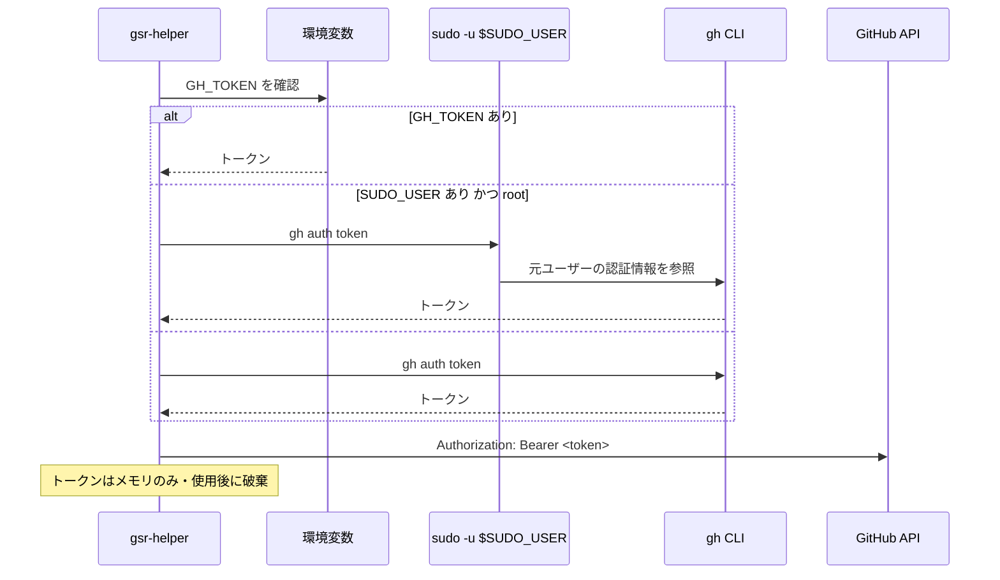

# 外部インターフェース

本ツールは API を提供しない。外部との接点は「GitHub REST API の利用」と「外部コマンドの実行」の 2 つである。ここではその全量を定義する。

前提は [アーキテクチャ設計](../architecture/overview.md)、トークンの扱いは [セキュリティ設計](../architecture/security.md) を参照。

## GitHub REST API

### 認証

トークンは `gh` CLI の認証情報を借用する（優先順は [セキュリティ設計](../architecture/security.md#取得の優先順)）。API アクセスには `google/go-github` を用いる。



### 必要なトークンスコープ

**runner の管理にはスコープごとに異なる権限が必要**であり、不足していると 403 になる。起動時と doctor で保有スコープを確認する。

| 対象 | 必要なスコープ（classic PAT / OAuth） | Fine-grained PAT での権限 |
|------|--------------------------------|------------------------|
| repo レベルの runner | `repo` | Repository permissions → Administration (write) |
| **org レベルの runner** | **`admin:org`** | Organization permissions → Self-hosted runners (write) |
| enterprise レベルの runner | `admin:enterprise` | — |

`gh auth login` の既定スコープには `admin:org` が含まれない（既定は `gist`, `read:org`, `repo`, `workflow` 程度）。org レベルの runner を管理する場合は次のようにスコープを追加する必要がある。

```
gh auth refresh -h github.com -s admin:org
```

保有スコープは API レスポンスの `X-OAuth-Scopes` ヘッダから確認できる。doctor では「操作したいスコープに対して権限が足りているか」を判定して提示する。

### 使用するエンドポイント

`{scope}` はスコープに応じて次のいずれかに置き換わる（[データモデル](../architecture/data-model.md#scope)）。

| Scope | パス接頭辞 |
|-------|-----------|
| Repo | `/repos/{owner}/{repo}` |
| Org | `/orgs/{org}` |
| Enterprise | `/enterprises/{enterprise}` |

| 用途 | メソッド・パス | 対応機能 |
|------|--------------|---------|
| 登録トークンの取得 | `POST {scope}/actions/runners/registration-token` | FR-14（追加） |
| 登録解除トークンの取得 | `POST {scope}/actions/runners/remove-token` | FR-17（削除） |
| runner 一覧の取得 | `GET {scope}/actions/runners` | 一覧の照合、孤児検出 |
| runner の削除 | `DELETE {scope}/actions/runners/{runner_id}` | FR-17（`config.sh remove` が使えない場合の代替） |
| runner tarball の取得情報 | `GET {scope}/actions/runners/downloads` | FR-13。OS / アーキテクチャごとの `download_url`・`filename`・`sha256_checksum` を返す |
| ラベルの取得 | `GET {scope}/actions/runners/{runner_id}/labels` | FR-35（設定編集） |
| ラベルの置換 | `PUT {scope}/actions/runners/{runner_id}/labels` | FR-35 |
| ラベルの追加 | `POST {scope}/actions/runners/{runner_id}/labels` | FR-35 |
| ラベルの個別削除 | `DELETE {scope}/actions/runners/{runner_id}/labels/{name}` | FR-35 |
| runner group の一覧 | `GET /orgs/{org}/actions/runner-groups` | FR-12、FR-35（org / enterprise のみ） |
| runner 本体の最新版 | `GET /repos/actions/runner/releases/latest` | FR-20（更新の必要性判定） |

**tarball の SHA-256 は `downloads` エンドポイントが返す値を使う。** 自前でハッシュ一覧を持たず、取得したチェックサムと展開前のファイルを照合する。

### レート制限とエラー

| 状況 | 扱い |
|------|------|
| 403（レート制限） | `X-RateLimit-Reset` を見て待機時間を表示する。自動リトライは行わず、ユーザーに再試行を委ねる |
| 403（権限不足） | 必要なスコープを示す（上表）。`gh auth refresh` のコマンド例を提示する |
| 401 | トークンが無効。`gh auth status` の確認を促す |
| 404 | スコープの指定誤り、または権限不足による隠蔽の可能性を併記する |
| ネットワーク到達不可 | API を要する機能を無効化し、ホスト内の情報のみで動作を継続する |

一覧表示の 3 秒ポーリングでは **API を呼ばない**（ホスト内の情報のみで構成する）。API 呼び出しはユーザーの操作に対応する形でのみ行い、レート制限を消費しない。

## 実行する外部コマンド

すべて `Executor` 経由で実行し、シェルは経由しない。**監査ログには原則として全件記録するが、下記 systemd の表のうち、再検出（`internal/runner/systemd` の `Scan`）が発行する `list-units` / `show` と、ログ追従（`internal/logs` の `Journal`）が発行する `journalctl -u <unit> -n <N>` だけは記録対象外である**（`exec.Options.SkipAudit`。理由と規則は [セキュリティ設計](../architecture/security.md#記録対象外とする読み取りコマンド)）。実行の共通の約束（既定 30 秒のタイムアウト、期限切れ時のプロセスグループへの SIGKILL、親の環境変数の継承、出力の上限）は [コンポーネント設計](../components/overview.md#internalexec) に定める。

### systemd

| コマンド | 用途 | 対応機能 |
|---------|------|---------|
| `systemctl list-units --type=service --all --plain --no-legend --no-pager 'actions.runner.*'` | runner ユニットの列挙 | FR-01、FR-05 |
| `systemctl show <unit> --no-pager -p Id -p LoadState -p ActiveState -p SubState -p UnitFileState -p WorkingDirectory -p MainPID -p User` | ユニット状態の取得。`User` は runner 実行ユーザーの特定に使う（FR-43） | FR-01、FR-03、FR-43 |
| `systemctl start` / `stop` / `restart` / `enable` / `disable` `<unit>` | サービス制御 | FR-06 |
| `systemctl daemon-reload` | drop-in 変更の反映 | FR-35 |
| `journalctl -u <unit> -n <N> --no-pager` | ユニットログの参照・追従。追従は 2 秒ごとの再発行と差分の送出で行う（`-f` は使わない。理由は [コンポーネント設計](../components/overview.md#journalctl--f-を使わない理由)） | FR-26 |
| `journalctl -k --since <時刻>` | OOM Killer の履歴確認 | doctor |
| `timedatectl show` | NTP 同期状態と時刻ずれの確認 | doctor |

**上表の `list-units` / `show` は、再検出（`internal/runner/systemd` の `Scan`）が発行する分に限り監査ログに記録しない**（成功・失敗とも。詳細は [セキュリティ設計](../architecture/security.md#記録対象外とする読み取りコマンド)）。3 秒ごとの自動更新か利用者のキー操作（`r`）による手動再読み込みかは問わない。**`journalctl -u <unit> -n <N> --no-pager` も、ログ追従（`internal/logs` の `Journal`）が発行する分に限り記録しない。** 同じ `journalctl` でも doctor の `-k --since` は診断 1 回につき 1 本なので記録する。判定するのは発行契機でもコマンド名でもなく発行元である。表の他のコマンドは全件記録する。

**強制停止に `systemctl kill` は使わない。** 対象を main プロセス以外へ広げるフラグの綴りが systemd のバージョンで変わり（`--kill-who` / `--kill-whom`）、既定のままでは main プロセスしか落とせずに `Runner.Worker` が生き残るためである。代わりに検出済みの PID へ直接 `kill -KILL` を送り（上表の「その他のシステムコマンド」）、そのうえで `systemctl stop <unit>` を発行する。シグナルだけでは systemd 側が「停止した」と記録せず、`Restart=` 付きのユニットが戻ってくる。

`systemctl show` は出力順が保証されないため、`KEY=VALUE` を辞書として解釈する。`list-units` は `--plain` を付けても行頭に記号が付く場合があるため、位置ではなく「`actions.runner.` で始まり `.service` で終わるフィールド」を探す。`WorkingDirectory` は `-/path`（存在しなければ無視する指定）を取り得るため、先頭の `-` を除いてから runner ディレクトリと照合する。

`systemctl show` はユニットごとの実行になるため並列に発行する（同時実行数 8）。`ctx` がキャンセルされた時点で残りの発行を打ち切る。1 ユニットの取得に失敗しても全体を止めず、そのユニットは状態不明として扱う（**孤児ユニットには分類しない**。[コンポーネント設計](../components/overview.md#internalrunner)）。

**`list-units` 自体が失敗した場合はユニットの走査全体を中止する。** どのユニットを `show` すべきかが分からないため状態を 1 件も返さず、警告 1 件だけを返す。これは検出処理で最も影響範囲の広い縮退であり、この状態では起動方式を判定できない（[FR-03](../requirements/functional.md#起動方式の-4-状態fr-03) の判定不能）。呼び出し側は「ユニットが 0 件」と区別しなければならない。

`--all` を付けるため `LoadState=not-found` のユニット（`svc.sh uninstall` 後に参照だけが残ったもの）も返ってくる。これは runner に紐付けず、孤児にもせず警告として扱う（[FR-05](../requirements/functional.md#孤児ユニットに含めないものfr-05)）。

### runner 付属スクリプト

いずれも runner ディレクトリを作業ディレクトリとして実行する。

| コマンド | 用途 | 備考 |
|---------|------|------|
| `./config.sh --url <url> --token <token> --name <name> --labels <labels> --work <dir> --runnergroup <group> --unattended [--ephemeral] [--disableupdate]` | runner の登録 | FR-10、FR-12。`--unattended` で非対話実行する。**`--token` はプロセス引数として渡るため [既知の制約](../architecture/security.md#プロセス引数からのトークン読み取り既知の制約) がある** |
| `./config.sh remove --token <token>` | 登録解除 | FR-17 |
| `./svc.sh install [user]` | systemd ユニットの作成 | FR-10 |
| `./svc.sh uninstall` | ユニットの削除 | FR-17 |
| `./svc.sh start` / `stop` / `status` | サービス操作 | `systemctl` と等価。ユニット名の解決を任せられる場面で使う |

`config.sh` は対話入力を要求しないよう、必要な引数をすべて与えて実行する。

### docker

| コマンド | 用途 | 対応機能 |
|---------|------|---------|
| `docker system df --format <json>` | イメージ / コンテナ / ボリューム / ビルドキャッシュの使用量 | FR-27 |
| `docker system prune -f` | 未使用リソースの削除 | FR-30 |
| `docker info --format <フォーマット>` | daemon の稼働確認。`docker info` は daemon 不応答でも終了コード 0 を返す版があるため、`--format` で値が取れたことをもって応答と判定する | 能力判定、doctor |
| `docker buildx version` | buildx プラグインの有無とバージョン確認 | FR-43 |

`docker` が無い、または daemon が応答しない場合は docker 関連の項目を除外する（能力判定）。

### gh CLI

| コマンド | 用途 |
|---------|------|
| `gh auth token` / `sudo -u $SUDO_USER gh auth token` | トークンの取得 |
| `gh auth status` | 認証状態とアカウント名の確認（doctor での表示用） |

### その他のシステムコマンド

| コマンド / 参照先 | 用途 | 対応機能 |
|-----------------|------|---------|
| `/proc/<pid>/cmdline`、`/proc/<pid>/exe`、`/proc/<pid>` の mtime | runner プロセスの検出と起動時刻 | FR-01、FR-04 |
| `kill -KILL <pid>...` | **強制停止**。`Runner.Listener` と `Runner.Worker` の PID をまとめて 1 回で送る | FR-06 |
| `/proc/mounts`（`hidepid` の確認） | トークン読み取りリスクの判定 | doctor |
| ファイルシステムの統計（容量・inode） | 残量の取得 | FR-29、doctor |
| ディレクトリの再帰走査 | ディスク使用量の集計 | FR-27。外部の `du` は使わず自前で走査し、進捗を出せるようにする |
| `git` / `node` などの存在とバージョン | 依存コマンドの確認 | doctor |
| `sudo -l -U <runner-user>` | パスワード不要 sudo（`NOPASSWD`）の判定 | FR-43。**出力は権限情報のため監査ログに残さない**（[セキュリティ設計](../architecture/security.md#パスワード不要-sudo-の要求への対応)） |
| `os/user.LookupId`（`/etc/passwd`・NSS 経由） | UID から runner 実行ユーザー名の解決（`RunAsUser`） | FR-01、FR-43。**引けない場合は UID の 10 進表記を使う**（静的リンクで NSS が使えないビルド、LDAP 上のユーザー）。[データモデル](../architecture/data-model.md#runasuser-の決定と-uid-フォールバック) |
| `/etc/group` の参照（`os/user` 経由） | runner 実行ユーザーの docker グループ所属の判定 | FR-43 |
| `/proc/<pid>/status` の `Groups` | 稼働中の `Runner.Listener` に docker グループが反映されているかの判定 | FR-43。`usermod` 後に runner を再起動していない状態を検出する |

### ネットワーク到達性チェック（doctor）

TCP 接続の成否とレイテンシを確認する。到達先は runner が実際に使用するホスト。

| 到達先 | 用途 |
|-------|------|
| `github.com:443` | git 操作 |
| `api.github.com:443` | API |
| `*.actions.githubusercontent.com:443` | Actions のサービス（runner の待ち受け先） |
| `pkg.actions.githubusercontent.com:443` / `ghcr.io:443` | パッケージ・コンテナイメージの取得 |
| results-receiver（`results-receiver.actions.githubusercontent.com:443`） | ログ・成果物のアップロード |

プロキシ環境変数（`https_proxy` / `http_proxy` / `no_proxy`）が設定されている場合はそれを経由した到達性を確認し、runner の `.env` に設定されたプロキシとホストの環境変数が食い違っていないかも判定する。

## 改訂履歴

| 版 | 日付 | 変更内容 | 変更理由 |
|----|------|---------|---------|
| 1.0 | 2026-08-21 | 新規作成 | 初版 |
| 1.1 | 2026-08-21 | `systemctl show` に `User` を追加。`docker buildx version` / `sudo -l -U` / `/etc/group` / `/proc/<pid>/status` を追加 | ジョブ実行の前提チェック（FR-43）で runner 実行ユーザーの権限とグループを判定する必要が生じたため |
| 1.2 | 2026-08-22 | `docker info` を `docker info --format <フォーマット>` に変更 | 能力判定の実装（`internal/appconfig`）で `--format` の出力の有無を daemon 応答の判定に使うため |
| 1.3 | 2026-08-22 | `systemctl show` の並列発行・キャンセル時の打ち切り・失敗時の扱い、`WorkingDirectory` の `-` 接頭辞を追記 | 20 台規模で `show` が支配的になるため並列化した。取得失敗ユニットを孤児と誤分類する欠陥があった |
| 1.4 | 2026-08-22 | `list-units` 自体の失敗が走査全体を中止することと `LoadState=not-found` のユニットの扱いを追記。`os/user.LookupId` をその他のシステムコマンドに追加。実行の共通の約束への参照を追加 | 「1 ユニットの失敗で全体を止めない」だけを書いていたため、最も影響範囲の広い縮退が仕様から読み取れなかった。`RunAsUser` の取得元に NSS 参照があることが未記載だった |
| 1.5 | 2026-08-22 | 再検出が発行する `list-units` / `show` が監査ログの記録対象外であることを注記 | 「すべて Executor 経由で実行し、監査ログに記録する」と systemd の表が無条件のままで、記録対象外になった当のコマンドが表に載っていた |
| 1.6 | 2026-08-22 | 記録対象外の判定を発行契機ではなく発行元（再検出の `Scan`）に統一し、「利用者の操作を起点に発行する場合は記録する」を削除 | 手動再読み込み（`r`）も同じ `Scan` を通るため記録されず、記述が実装と矛盾していた |
| 1.7 | 2026-08-23 | `journalctl` の行を実装に合わせ、追従を `-f` ではなく `-n <N> --no-pager` の再発行と差分の送出で行うことに変更。ログ追従が発行する `journalctl` を監査ログの記録対象外に追加し、doctor の `-k --since` は記録することを明記 | ログ閲覧を実装した（Issue #9）。`Executor` は 1 回の実行の出力をまとめて返す契約であり `-f` はタイムアウトまで 1 行も届かない（理由は [コンポーネント設計](../components/overview.md#journalctl--f-を使わない理由)）。追従中は同じ読み取りが繰り返し発行され、記録すると破壊的操作のレコードを押し流す |
| 1.8 | 2026-08-23 | 強制停止が発行する `kill -KILL <pid>...` を「その他のシステムコマンド」に追加し、`systemctl kill` を使わない理由と停止まで打つ理由を注記 | サービス制御（Issue #5）で強制停止を実装したため。本節はツールが起動する外部コマンドを網羅する表であり、`kill` だけが載っていない状態になっていた |
