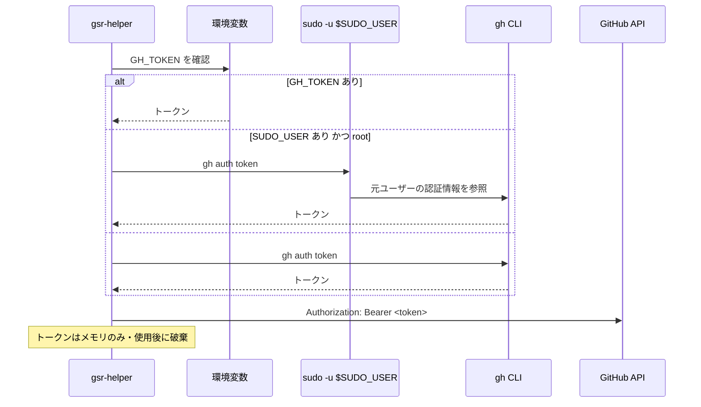

# 外部インターフェース

本ツールは API を提供しない。外部との接点は「GitHub REST API の利用」と「外部コマンドの実行」の 2 つである。ここではその全量を定義する。

前提は [アーキテクチャ設計](../architecture/overview.md)、トークンの扱いは [セキュリティ設計](../architecture/security.md) を参照。

## GitHub REST API

### 認証

トークンは `gh` CLI の認証情報を借用する（優先順は [セキュリティ設計](../architecture/security.md#取得の優先順)）。API アクセスには `google/go-github` を用いる。



### 必要なトークンスコープ

**runner の管理にはスコープごとに異なる権限が必要**であり、不足していると 403 になる。起動時と doctor で保有スコープを確認する。

| 対象 | 必要なスコープ（classic PAT / OAuth） | Fine-grained PAT での権限 |
|------|--------------------------------|------------------------|
| repo レベルの runner | `repo` | Repository permissions → Administration (write) |
| **org レベルの runner** | **`admin:org`** | Organization permissions → Self-hosted runners (write) |
| enterprise レベルの runner | `admin:enterprise` | — |

`gh auth login` の既定スコープには `admin:org` が含まれない（既定は `gist`, `read:org`, `repo`, `workflow` 程度）。org レベルの runner を管理する場合は次のようにスコープを追加する必要がある。

```
gh auth refresh -h github.com -s admin:org
```

保有スコープは API レスポンスの `X-OAuth-Scopes` ヘッダから確認できる。doctor では「操作したいスコープに対して権限が足りているか」を判定して提示する。

### 使用するエンドポイント

`{scope}` はスコープに応じて次のいずれかに置き換わる（[データモデル](../architecture/data-model.md#scope)）。

| Scope | パス接頭辞 |
|-------|-----------|
| Repo | `/repos/{owner}/{repo}` |
| Org | `/orgs/{org}` |
| Enterprise | `/enterprises/{enterprise}` |

| 用途 | メソッド・パス | 対応機能 |
|------|--------------|---------|
| 登録トークンの取得 | `POST {scope}/actions/runners/registration-token` | FR-14（追加） |
| 登録解除トークンの取得 | `POST {scope}/actions/runners/remove-token` | FR-17（削除） |
| runner 一覧の取得 | `GET {scope}/actions/runners` | 一覧の照合、孤児検出 |
| runner の削除 | `DELETE {scope}/actions/runners/{runner_id}` | FR-17（`config.sh remove` が使えない場合の代替） |
| runner tarball の取得情報 | `GET {scope}/actions/runners/downloads` | FR-13。OS / アーキテクチャごとの `download_url`・`filename`・`sha256_checksum` を返す |
| ラベルの取得 | `GET {scope}/actions/runners/{runner_id}/labels` | FR-35（設定編集） |
| ラベルの置換 | `PUT {scope}/actions/runners/{runner_id}/labels` | FR-35 |
| ラベルの追加 | `POST {scope}/actions/runners/{runner_id}/labels` | FR-35 |
| ラベルの個別削除 | `DELETE {scope}/actions/runners/{runner_id}/labels/{name}` | FR-35 |
| runner group の一覧 | `GET /orgs/{org}/actions/runner-groups` | FR-12、FR-35（org / enterprise のみ） |
| runner 本体の最新版 | `GET /repos/actions/runner/releases/latest` | FR-20（更新の必要性判定） |

**tarball の SHA-256 は `downloads` エンドポイントが返す値を使う。** 自前でハッシュ一覧を持たず、取得したチェックサムと展開前のファイルを照合する。

### レート制限とエラー

| 状況 | 扱い |
|------|------|
| 403（レート制限） | `X-RateLimit-Reset` を見て待機時間を表示する。自動リトライは行わず、ユーザーに再試行を委ねる |
| 403（権限不足） | 必要なスコープを示す（上表）。`gh auth refresh` のコマンド例を提示する |
| 401 | トークンが無効。`gh auth status` の確認を促す |
| 404 | スコープの指定誤り、または権限不足による隠蔽の可能性を併記する |
| ネットワーク到達不可 | API を要する機能を無効化し、ホスト内の情報のみで動作を継続する |

一覧表示の 3 秒ポーリングでは **API を呼ばない**（ホスト内の情報のみで構成する）。API 呼び出しはユーザーの操作に対応する形でのみ行い、レート制限を消費しない。

## 実行する外部コマンド

すべて `Executor` 経由で実行し、監査ログに記録する。シェルは経由しない。

### systemd

| コマンド | 用途 | 対応機能 |
|---------|------|---------|
| `systemctl list-units --type=service --all --plain --no-legend --no-pager 'actions.runner.*'` | runner ユニットの列挙 | FR-01、FR-05 |
| `systemctl show <unit> --no-pager -p Id -p LoadState -p ActiveState -p SubState -p UnitFileState -p WorkingDirectory -p MainPID` | ユニット状態の取得 | FR-01、FR-03 |
| `systemctl start` / `stop` / `restart` / `enable` / `disable` `<unit>` | サービス制御 | FR-06 |
| `systemctl daemon-reload` | drop-in 変更の反映 | FR-35 |
| `journalctl -u <unit> -n <N>` / `-f` | ユニットログの参照・追従 | FR-26 |
| `journalctl -k --since <時刻>` | OOM Killer の履歴確認 | doctor |
| `timedatectl show` | NTP 同期状態と時刻ずれの確認 | doctor |

`systemctl show` は出力順が保証されないため、`KEY=VALUE` を辞書として解釈する。`list-units` は `--plain` を付けても行頭に記号が付く場合があるため、位置ではなく「`actions.runner.` で始まり `.service` で終わるフィールド」を探す。

### runner 付属スクリプト

いずれも runner ディレクトリを作業ディレクトリとして実行する。

| コマンド | 用途 | 備考 |
|---------|------|------|
| `./config.sh --url <url> --token <token> --name <name> --labels <labels> --work <dir> --runnergroup <group> --unattended [--ephemeral] [--disableupdate]` | runner の登録 | FR-10、FR-12。`--unattended` で非対話実行する。**`--token` はプロセス引数として渡るため [既知の制約](../architecture/security.md#プロセス引数からのトークン読み取り既知の制約) がある** |
| `./config.sh remove --token <token>` | 登録解除 | FR-17 |
| `./svc.sh install [user]` | systemd ユニットの作成 | FR-10 |
| `./svc.sh uninstall` | ユニットの削除 | FR-17 |
| `./svc.sh start` / `stop` / `status` | サービス操作 | `systemctl` と等価。ユニット名の解決を任せられる場面で使う |

`config.sh` は対話入力を要求しないよう、必要な引数をすべて与えて実行する。

### docker

| コマンド | 用途 | 対応機能 |
|---------|------|---------|
| `docker system df --format <json>` | イメージ / コンテナ / ボリューム / ビルドキャッシュの使用量 | FR-27 |
| `docker system prune -f` | 未使用リソースの削除 | FR-30 |
| `docker info` | daemon の稼働確認 | 能力判定、doctor |

`docker` が無い、または daemon が応答しない場合は docker 関連の項目を除外する（能力判定）。

### gh CLI

| コマンド | 用途 |
|---------|------|
| `gh auth token` / `sudo -u $SUDO_USER gh auth token` | トークンの取得 |
| `gh auth status` | 認証状態とアカウント名の確認（doctor での表示用） |

### その他のシステムコマンド

| コマンド / 参照先 | 用途 | 対応機能 |
|-----------------|------|---------|
| `/proc/<pid>/cmdline`、`/proc/<pid>/exe`、`/proc/<pid>` の mtime | runner プロセスの検出と起動時刻 | FR-01、FR-04 |
| `/proc/mounts`（`hidepid` の確認） | トークン読み取りリスクの判定 | doctor |
| ファイルシステムの統計（容量・inode） | 残量の取得 | FR-29、doctor |
| ディレクトリの再帰走査 | ディスク使用量の集計 | FR-27。外部の `du` は使わず自前で走査し、進捗を出せるようにする |
| `git` / `node` などの存在とバージョン | 依存コマンドの確認 | doctor |

### ネットワーク到達性チェック（doctor）

TCP 接続の成否とレイテンシを確認する。到達先は runner が実際に使用するホスト。

| 到達先 | 用途 |
|-------|------|
| `github.com:443` | git 操作 |
| `api.github.com:443` | API |
| `*.actions.githubusercontent.com:443` | Actions のサービス（runner の待ち受け先） |
| `pkg.actions.githubusercontent.com:443` / `ghcr.io:443` | パッケージ・コンテナイメージの取得 |
| results-receiver（`results-receiver.actions.githubusercontent.com:443`） | ログ・成果物のアップロード |

プロキシ環境変数（`https_proxy` / `http_proxy` / `no_proxy`）が設定されている場合はそれを経由した到達性を確認し、runner の `.env` に設定されたプロキシとホストの環境変数が食い違っていないかも判定する。

## 改訂履歴

| 版 | 日付 | 変更内容 | 変更理由 |
|----|------|---------|---------|
| 1.0 | 2026-08-21 | 新規作成 | 初版 |
