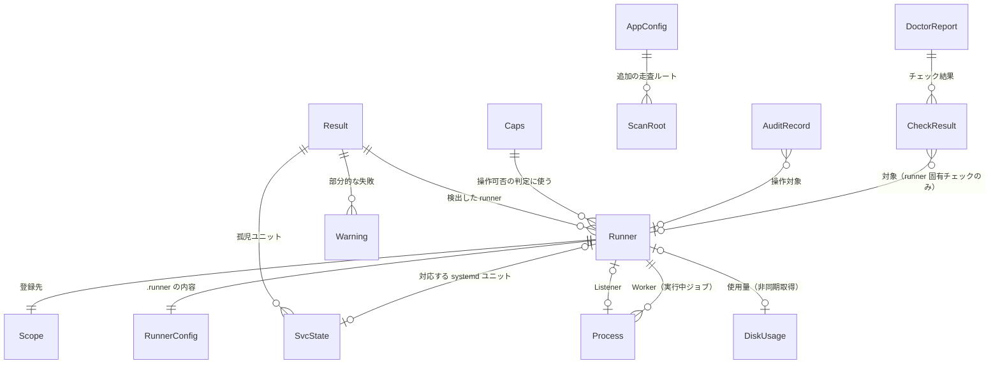
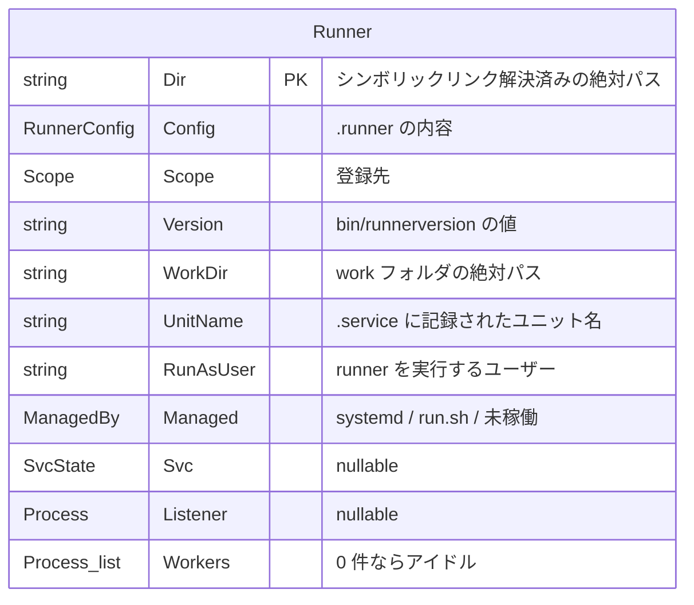

# データモデル

本ツールはデータベースを持たない。扱うデータは「実行時にホストから読み取る内部モデル」と「ディスク上のファイル」の 2 種類である。ここでは両方のスキーマを定義する。

構成の前提は [アーキテクチャ設計](overview.md)、パーミッションとトークンの扱いは [セキュリティ設計](security.md) を参照。

## 全体像



`Runner` が中心のエンティティであり、**ディレクトリの実パスが同一性のキー**になる。

## 内部モデル

### Runner

検出された 1 つの runner インスタンス。3 つの情報源をマージした結果。



| フィールド | 型 | 由来 | 備考 |
|-----------|-----|------|------|
| `Dir` | string | ディスク走査 / プロセス / ユニット | 主キー。`filepath.EvalSymlinks` 後の絶対パス |
| `Config` | RunnerConfig | `<Dir>/.runner` | 下記 |
| `Scope` | Scope | `Config.GitHubURL` から導出 | 下記 |
| `Version` | string | `<Dir>/bin/runnerversion` | 読めない場合は空 |
| `WorkDir` | string | `Config.WorkFolder` を絶対パス化 | 既定は `<Dir>/_work` |
| `UnitName` | string | `<Dir>/.service` | `svc.sh install` が書き出す。未サービス化なら空 |
| `RunAsUser` | string | `systemctl show -p User` / `Listener` の UID | runner を実行するユーザー。ジョブ実行の前提チェック（[FR-43](../requirements/functional.md)）の判定対象。`User=` が空の場合は root。**ユーザー名が解決できない場合は UID の 10 進表記**（下記） |
| `Managed` | ManagedBy | 判定結果 | 4 値。`systemd` / `run.sh` / 未稼働 / 判定不能（[FR-03 の起動方式の 4 状態](../requirements/functional.md#起動方式の-4-状態fr-03)） |
| `Svc` | *SvcState | systemd | 対応ユニットがない場合 nil |
| `Listener` | *Process | `/proc` | 稼働していなければ nil |
| `Workers` | []Process | `/proc` | 1 件以上あればジョブ実行中 |

派生値: `Name()`（`Config.AgentName`、空ならディレクトリ名）、`Running()`（Listener の有無）、`Busy()`（Worker の有無）、`JobElapsed()`（最も古い Worker の経過時間）。

#### `RunAsUser` の決定と UID フォールバック

決定は次の順で行う。**`SvcState.User` を採るのはユニットの実体がある場合に限る**（`Load` が空でも `not-found` でもない）。`systemctl show` に失敗したプレースホルダや `svc.sh uninstall` 後の残骸ユニットの `User=` は空であり、そのまま採ると全 runner が root と表示される。

1. ユニットの実体がある場合はその `User=`。空なら `root`（systemd の `User=` 未指定は root 起動）
2. それ以外で `Listener` が居る場合は `Listener.UID` からユーザー名を引く
3. どちらも無ければ空文字

**2 の名前解決に失敗した場合は UID の 10 進表記を返す。** 静的リンクで NSS が使えないビルドや、`/etc/passwd` に居ない LDAP ユーザーではこうなる。空文字より UID の方が情報量があるため意図的にこの縮退を採っている。したがって `RunAsUser` は `"runner"` にも `"1001"` にもなり得る。

**FR-43 の実装はこれを前提にすること。** `sudo -l -U <user>` はユーザー名しか受け付けず、UID を渡す場合は `#1001` の形式が必要である。数値をそのまま渡すと「そのユーザーは存在しない」という失敗になり、`NOPASSWD` が設定されていないケースと区別できない。

### RunnerConfig

`.runner` の内容。**読み取り専用**として扱い、本ツールから直接書き換えない（変更が必要な項目は `config.sh` による再登録で反映する）。

| フィールド | JSON キー | 型 | 備考 |
|-----------|----------|-----|------|
| AgentID | `agentId` | int64 | GitHub 側の runner ID |
| AgentName | `agentName` | string | runner 名 |
| PoolID | `poolId` | int64 | — |
| PoolName | `poolName` | string | runner group に対応 |
| ServerURL | `serverUrl` | string | Actions のサービス URL |
| GitHubURL | `gitHubUrl` | string | スコープ判定の入力 |
| WorkFolder | `workFolder` | string | 既定 `_work` |
| Ephemeral | `ephemeral` | bool | ジョブ 1 件で登録解除される runner |
| DisableUpdate | `disableUpdate` | bool | 自動更新の無効化。バージョン一括更新の必要性に関わる |

### Scope

runner の登録先。`GitHubURL` のパスから判定する。型は `internal/runner/scope` パッケージに置く（`scope.Scope` / `scope.Kind`、判定は `scope.Parse`）。純粋な文字列処理のみなので、ホスト走査を含む `internal/runner` から分離してある（[コンポーネント設計](../components/overview.md#internalrunnerscope)）。

| Kind | 判定条件（パス） | 例 | 表示 |
|------|----------------|-----|------|
| Repo | `/<owner>/<repo>` | `https://github.com/foo/bar` | `foo/bar` |
| Org | `/orgs/<org>` または `/<org>` | `https://github.com/orgs/foo` | `org:foo` |
| Enterprise | `/enterprises/<slug>` | `https://github.com/enterprises/foo` | `ent:foo` |
| Unknown | — | — | `-` |

ホストを含まない URL（`github.com/foo/bar` のようにスキームが無いもの）と、`orgs` / `enterprises` の単独指定（`https://github.com/orgs`）は誤りとして拒否する。これらを黙って Repo / Org と解釈すると、存在しないスコープに対する API 呼び出しを組み立ててしまう。

**`scope.Parse` は Unknown を返さない。** 判定できない入力は必ず error になる。Kind Unknown が画面に現れるのは、`Parse` が失敗した runner を `Discover` がゼロ値の `Scope` のまま一覧に残し、失敗を `Result.Warnings` へ積むためである（1 台の `.runner` が壊れていても他の runner の表示を続けるという方針）。つまり `-` は「判定した結果が Unknown」ではなく「判定できず警告を出した」ことを表す。

Scope は GitHub API のパス生成にも使う（[外部インターフェース](../api/external-interfaces.md)）。この用途のために `internal/gh` が `internal/runner` 全体へ依存せずに済むよう、下位パッケージに切り出してある。

### Process

`/proc` から検出した runner プロセス。

| フィールド | 型 | 取得元 | 備考 |
|-----------|-----|-------|------|
| PID | int | `/proc/<pid>` | — |
| Kind | ProcKind | 実行ファイル名 | `Runner.Listener` / `Runner.Worker` |
| Dir | string | 実行ファイルパス | `<Dir>/bin/Runner.*` から親の親を取る。取れない場合は `cwd` にフォールバック。**`exe` / `cwd` のどちらから取った場合も末尾の ` (deleted)` は落とす**（下記「削除済みディレクトリで稼働する runner」） |
| Started | time.Time | `/proc/<pid>` の mtime | プロセス生成時刻。ジョブの経過時間算出に使う（下記「`Started` に `/proc/<pid>` の mtime を使う根拠」） |
| Exe | string | `/proc/<pid>/exe`、失敗時は `cmdline[0]` | 他ユーザーのプロセスは root でないと `exe` が読めない。**こちらは ` (deleted)` を落とさない**（自動更新の途中かを判断する手掛かりになるため） |
| UID | int | `/proc/<pid>` の所有者 | プロセスの実行ユーザー。runner 実行ユーザーの特定（`RunAsUser`）に使う。取得できない場合は `-1`（`0` は root という有効値のため兼用しない） |

#### 削除済みディレクトリで稼働する runner

runner を停止せずにディレクトリを削除すると、`/proc/<pid>/cwd` の readlink は `/opt/runners/foo (deleted)` を返す。この印を落とさずに `Dir` へ入れると、実在しないパスとして runner ディレクトリと照合され、**異常として報告することすらできない**。そのため `Dir` に入れる前に印を落とす。

**この runner は一覧（`Runners`）には出さない。** `Runners` に載る条件は「`.runner` を読めたディレクトリ」であり（上記）、ディレクトリが消えている以上 `.runner` は読めない。名前・スコープ・バージョンのいずれも分からないものを行として組み立てることはできず、`svc.*` / `runner.*` の操作対象にもできない。

**代わりに `Result.Warnings` に 1 件出す。** 稼働中の runner が一覧から黙って消えるのは、ディレクトリだけ消えたユニットを孤児として出す [FR-05](../requirements/functional.md#孤児ユニットに含めないものfr-05) と同じ「片側だけ消えた」異常系であり、検出した事実を握り潰さずに残す。**ただしこの警告が現状の画面で届く範囲は他の警告と変わらず、状態行に `警告 N 件` の件数として合算されるだけである**（[画面仕様](../ui/screens.md#状態行)、`internal/ui` の状態行の組み立て）。警告の本文を読む経路は現時点で無いため、利用者が見るのは N が 1 増えることまでで、この警告から消失の原因まで辿れるわけではない。本文を読ませる経路が要るのはこの警告に限らず `Result.Warnings` 全体に共通する制約であり、本節の対象外とする。判定は「導出した `Dir` が実在しないこと」に限る（権限不足などの他の `stat` 失敗は、ディレクトリが消えた根拠にならないため報告しない）。同じディレクトリを指すプロセスが複数あっても警告は 1 件にまとめる。

#### `Started` に `/proc/<pid>` の mtime を使う根拠

`Started` は Runners タブの `JOB` 列、Jobs タブの `ELAPSED` 列、ドレイン停止の待機表示に直結するため、取得方法の妥当性を実機で確認した。

| 項目 | 内容 |
|------|------|
| 確認環境 | Linux 6.8.0-136-generic / procfs / `CLK_TCK=100` |
| 確認内容 1 | 稼働中の全プロセス 567 件について `/proc/<pid>` の mtime と `btime + starttime/CLK_TCK` を比較 |
| 結果 1 | 完全一致は 225 件。差がある 342 件も差は数秒（中央値 +1〜+3 秒、最大 +157 秒）で、mtime が常に同じか新しい |
| 確認内容 2 | プロセスを生成し、`/proc/<pid>` に一切触れずに 9 秒待ってから `stat` |
| 結果 2 | mtime は生成時の壁時計と一致（差 0 秒）。その後 `/proc/<pid>/status` を読んでも mtime は動かない |

差の出どころは mtime 側ではなく `btime + starttime/CLK_TCK` 側である。`btime` は uptime から逆算した値で NTP 補正やサスペンドの影響を受け、`starttime/CLK_TCK` は整数除算で切り捨てられる。procfs は PID ディレクトリの inode を task の生成時に現在時刻で刻み、その後の読み取りでは更新しない（確認内容 2）。したがって **mtime のほうが壁時計上の生成時刻に近い**。

以上より mtime を採る。1 回の `os.Stat` で `Started` と `UID` を同時に取れるため、PID が再利用されて両者が別プロセスのものになることも避けられる。

**差は表示に出る。** 経過時間の表示は 1 分未満が秒、1 時間未満が分秒であり（`internal/ui/atom` の `Duration`）、最大 +157 秒の差は `2m37s` として画面に現れる。「表示単位が粗いので差は見えない」という理由で mtime を選んでいるのではない。選ぶ根拠は差の出どころであり、上記のとおり差は mtime 側ではなく `btime` の逆算側に生じる。NTP 補正やサスペンド／レジュームで `btime` が大きく狂う場面ほど差は開くが、そのときも壁時計上の生成時刻を保っているのは mtime の側である（確認内容 2）。したがって表示に出る値としても mtime のほうが正しい。

### SvcState

systemd ユニットの状態。

| フィールド | 取得元 | 備考 |
|-----------|-------|------|
| Unit | `systemctl list-units` / `show` の `Id` | `actions.runner.<scope>.<name>.service` |
| Load | `LoadState` | `loaded` / `not-found` |
| Active | `ActiveState` | `active` / `inactive` / `failed` |
| Sub | `SubState` | `running` / `dead` |
| FileState | `UnitFileState` | `enabled` / `disabled` / `static` |
| WorkingDir | `WorkingDirectory` | runner ディレクトリとの照合に使う。空の場合もある。`-/path` 形式で返ることがあるため先頭の `-` を除去する |
| User | `User` | ユニットの `User=`。空の場合は root で起動する |
| MainPID | `MainPID` | — |

runner との紐付けは `UnitName`（`.service` ファイル）を第一に、`WorkingDir` を第二の手段として照合する。`Load` が `not-found` のユニットはどちらのキーでも紐付けない（[FR-05 の除外](../requirements/functional.md#孤児ユニットに含めないものfr-05)）。

**同じユニット名を名乗る runner ディレクトリが複数ある場合、`UnitName` は照合キーにしない。** 1 つのユニットが 2 つのディレクトリで動くことはないので、どちらかは古い `.service` の残骸である。どちらが残骸かは `.service` の側からは決められず、先着で決めると外れた側は `Svc == nil` になり、systemd 管理の runner が MANAGED 列に `run.sh` と出る。第二の照合キーである `WorkingDir` は systemd 自身がそのユニットで使うディレクトリとして持っている値なので、重複した `.service` より確かである。重複した事実は警告 1 件として残す（下記「`Result` の警告」）。ディレクトリごと複製して runner を増やすとこの状態になる——`.runner` は `config.sh` の再登録で書き換わるが、`.service` は `svc.sh install` を実行するまで複製元のユニット名のまま残る。

`Load` が空のユニットは `systemctl show` に失敗したプレースホルダであり、`Unit` 以外のフィールドは埋まっていない。**「ユニットが無い」（`Runner.Svc == nil`）とは別の状態**であり、画面上も別の記号で描く（[画面仕様の記号表](../ui/screens.md#runners-タブ)）。

### 表示用の派生値

モデル側が持つ表示用のメソッドは次の 2 つである。いずれも**一覧向けの短い表記**であり、これ以外に短い表記を作らない。

| 派生値 | 返す値 | 呼び出し元 |
|-------|-------|-----------|
| `ManagedBy.String()` | `systemd` / `run.sh` / `-`（未稼働）/ `?`（判定不能） | MANAGED 列 |
| `ProcKind.String()` | `Runner.Listener` / `Runner.Worker` / `unknown` | `Result.Warnings` の文言（どの種別のプロセスかを示す） |

**MANAGED 列は `ManagedBy.String()` をそのまま出す。** 一方 SVC 列は記号を伴うため UI 側（`atom.StatusText` / `atom.StatusUnknown`）が組み立てる。記号を伴う表記をドメイン層に置くと、色と記号の対の定義（`token`）が 2 箇所に分かれる。

**呼び出し元の無い表示用メソッドは置かない。** `SvcState` にも記号を持たない素の表記を返す `Label()` があったが、SVC 列も詳細画面も `atom.StatusText` を通しており呼び出し元が無かったため削除した。ドメイン層に 2 つ目の表示用の写像を残すと、表示の変更が片方にしか入らずに食い違う。記号を要さない表記が必要になった時点で、その用途に合わせて追加する。

詳細画面で「何が分かっていないのか」を文で示す言い換え（`-` → `未稼働（サービス登録なし・プロセスなし）` など）も表示側の関心事であり、`internal/ui/page/runnerdetail` が持つ（[画面仕様](../ui/screens.md#詳細画面enter)）。

### Result

検出処理の戻り値。

| フィールド | 型 | 意味 |
|-----------|-----|------|
| Runners | []Runner | 検出した runner。スコープ→名前でソート |
| OrphanUnits | []SvcState | 対応する runner ディレクトリが見つからないユニット（異常） |
| Warnings | []error | 部分的な失敗。1 件の失敗で全体を止めないため集約する |

`Runners` に含める runner は「`.runner` を読めたディレクトリ」である。スコープの判定に失敗した runner は**一覧から落とさず**、ゼロ値の `Scope`（表示は `-`）と警告 1 件で残す。

#### `Options`

`Discover` の入力。

| フィールド | 型 | 意味 |
|-----------|-----|------|
| Roots | []string | 走査ルート。`SkipDefaultRoots` が偽なら既定のルート（[FR-01](../requirements/functional.md#既定の走査ルートfr-01)）に足す |
| SkipDefaultRoots | bool | 既定の走査ルートを使わない指定。**既定は偽（使う）**。指定を忘れた呼び出しが runner を見落とす側に倒れないようにするため。真にしても FR-02 の補完は止まらない。合成規約は[コンポーネント設計](../components/overview.md#走査ルートの合成--root--scan_roots--skipdefaultroots) |
| Depth | int | ルート配下を掘る深さ。**0 以下は既定値 2 に丸める**（設定の `scan_depth` を省略した場合と同じ挙動になる） |
| Exec | Executor | systemd を参照するための実行経路。**`nil` は「systemctl が無い環境」を意味する**。ユニットを一切参照せず、警告も出さない（3 秒ごとのポーリングで同じ警告が積み上がらないようにするため）。この場合の起動方式は判定不能（`?`）になる |

#### `Result` の警告

`Warnings` に載る文言のうち、検出の解釈に関わるものを定める。件数は状態行の `警告 N 件` に出る。

| 状況 | 文言 |
|------|------|
| `systemctl list-units` 自体の失敗 | `systemctl list-units の実行に失敗しました: <原因>`（`systemd.ErrListUnits` を包む。呼び出し側は `errors.Is` で「ユニット 0 件」と区別する） |
| 1 ユニットの `systemctl show` の失敗 | `systemctl show <unit> の実行に失敗しました: <原因>` |
| `LoadState=not-found` のユニット | `<unit>: systemd にユニットの実体がありません（LoadState=not-found）。svc.sh uninstall 後に参照だけが残っている可能性があります` |
| 既に別のユニットが紐付いた runner ディレクトリを指す 2 本目のユニット | `<unit>: runner ディレクトリ <dir> には既にユニット <unit> が紐付いているため無視します。重複した、または古いユニットファイルが残っている可能性があります` |
| `.runner` の読み取り失敗 / スコープ判定の失敗 | `<dir>: <原因>`（どの runner の警告か分かるようディレクトリを添える。前置するのは runner ディレクトリであって `<dir>/.runner` ではない。runner を識別する単位はディレクトリであり、固定名の `.runner` を足しても手がかりは増えないため、2 つの失敗で前置を同じ形にそろえる） |
| 同じユニット名を名乗る 2 つ目以降の runner ディレクトリ | `<dir>: .service に記録されたユニット名 <unit> が runner ディレクトリ <dir> と重複しています。どちらのディレクトリのユニットかを .service からは決められないため、WorkingDirectory で紐付けます。ディレクトリを複製した際に .service が残っている可能性があります`（前置するのは 2 つ目以降のディレクトリ、文中に出るのは先に見つかったディレクトリ。走査結果はパス順にそろえてあるため組み合わせは決定的） |
| 稼働中の runner プロセスの runner ディレクトリが実在しない | `<dir>: runner ディレクトリが見つかりません。<Runner.Listener\|Runner.Worker>（PID <pid>）が稼働したままディレクトリが削除された可能性があります` |

後ろの 2 つは**黙って落とさないために出す**。前者は `svc.sh uninstall` の残骸、後者は重複した・古いユニットファイルであり、いずれも UI から見えないままにすると原因の分からない不整合として残る。

### Caps

起動時に 1 回判定する能力。UI の操作可否の判定に使う。

| フィールド | 判定方法 |
|-----------|---------|
| Root | 実効 UID が 0 |
| Systemd | `systemctl` が存在する |
| Docker | `docker` が存在し daemon が応答する |
| Journal | `journalctl` が存在する |
| GitHubToken | トークンを取得できた |
| SudoUser | `SUDO_USER` の値（設定・ログの配置先の決定に使う） |

### DiskUsage

非同期に集計するディスク使用量。

| フィールド | 意味 |
|-----------|------|
| Target | 集計対象の種別（`_work/<repo>` / `_tool` / `_temp` / `_diag` / docker の各項目） |
| Path | 対象パス（docker 項目では空） |
| Bytes | 使用量 |
| Files | ファイル数（inode 消費の目安） |
| State | 集計中 / 完了 / 失敗 |

ファイルシステム単位で容量残量と inode 残量も別途保持する。

### DoctorReport / CheckResult

| フィールド | 意味 |
|-----------|------|
| ID | チェックの識別子 |
| Category | 認証・権限 / ネットワーク / 時刻 / リソース / 障害履歴 / docker / **ジョブ実行の前提** / 依存コマンド / systemd / 構成整合 |
| Target | 対象 runner（ホスト全体のチェックでは空） |
| Status | OK / WARN / FAIL / SKIP |
| Summary | 一覧の CHECK 列に出す 1 行の要約（`NTP 未同期`） |
| Detail | 判定の根拠（実測値など）。詳細画面の「検出内容」 |
| Impact | 放置すると何が起きるか。詳細画面の「影響」 |
| Remedy | 推奨する対処。詳細画面の「推奨する対処」。**表示するだけで実行しない** |
| Startup | 起動時の自動実行の対象か（[FR-44](../requirements/functional.md)） |

`Summary` と `Impact` は[画面仕様](../ui/screens.md#doctor-タブ)が要求する。一覧は 1 行で「何がどうなっているか」を示す必要があり（`Detail` は実測値を含むため長すぎる）、詳細画面は 検出内容 / 影響 / 推奨する対処 の 3 節を持つ。`Impact` を `Detail` に畳むと、「何が起きているか」と「放置するとどうなるか」が 1 つの段落に混ざり、対処の要否を判断できない。

**1 つの `Check` が複数の `CheckResult` を返すことがある。** runner ごとに判定する項目（パーミッション・docker グループ所属）は runner の数だけ行が並ぶ。

`SKIP` は能力不足で実行できなかったチェック（docker が無い等）に使い、失敗と区別する。

`Startup` が真のチェックは起動時にも実行される。対象はホスト内の読み取りと軽量なコマンドで完結するもの（ジョブ実行の前提）に限り、ネットワーク到達性やディスク集計を伴うものは含めない。

## ディスク上のファイル

### 読み書きの対象一覧

| パス | 形式 | アクセス | 備考 |
|------|------|---------|------|
| `<runner>/.runner` | JSON（UTF-8 BOM の可能性あり） | 読み取りのみ | runner 本体が書き出す。変更は `config.sh` 経由 |
| `<runner>/.credentials` | JSON | **読まない** | パーミッションと所有者のみ確認する（[セキュリティ設計](security.md)） |
| `<runner>/.env` | `KEY=VALUE` 行 | 読み書き | 順序とコメントを保持して書き戻す |
| `<runner>/.path` | 1 行のパス文字列 | 読み書き | — |
| `<runner>/.service` | ユニット名 1 行 | 読み取りのみ | `svc.sh install` が生成 |
| `<runner>/bin/runnerversion` | バージョン文字列 1 行 | 読み取りのみ | 例: `2.311.0` |
| `<runner>/_diag/*.log` | テキスト | 読み取り / 削除 | `Runner_*.log` / `Worker_*.log` |
| `<runner>/_work/**` | — | 参照 / 削除 | 削除は段階的な確認を経る |
| systemd ユニット / drop-in | INI | 読み取り / 書き込み | 本体ユニットは編集せず drop-in を作る |
| 自前設定 | YAML | 読み書き | 下記 |
| 監査ログ | JSON Lines | 追記のみ | 下記 |

`.runner` は BOM 付きで書き出される場合があるため、パース前に除去する。

### `.env` の扱い

runner の `.env` はシェルスクリプトではなく単純な `KEY=VALUE` の羅列として読まれる。編集時に差分を最小化するため、**コメント行と空行を含めた全行を順序どおり保持**し、変更したキーの行だけを置き換える。

| 用途 | キー例 |
|------|-------|
| ジョブ環境 | `PATH`、`LANG`、`ImageOS` |
| プロキシ | `https_proxy`、`http_proxy`、`no_proxy` |
| job hooks | `ACTIONS_RUNNER_HOOK_JOB_STARTED`、`ACTIONS_RUNNER_HOOK_JOB_COMPLETED` |

### 自前設定（YAML）

配置先は実行ユーザー（`sudo` 実行時は `SUDO_USER`）の設定ディレクトリ。root のホームには置かない。

```yaml
# 追加の走査ルート（既定の設置場所に加えて探索する）
scan_roots:
  - /opt/runners
  - /data/actions-runner

# ルート配下を掘る深さ。runner ディレクトリを見つけたらその配下は掘らない
scan_depth: 2

# 一覧の自動更新間隔（秒）
refresh_interval: 3

# ディスク使用率の警告閾値（%）。判定に使うのは Disk タブの要約行と doctor のリソース診断（設定編集の画面は表示するだけ）
disk_thresholds:
  warn: 80
  critical: 90

# 監査ログの出力先
audit_log: /var/log/gsr-helper/audit.jsonl

# runner 追加時の既定値
defaults:
  # runner 名のプレフィクス。空ならホスト名を使う
  name_prefix: ""
  # インストール先のベースディレクトリ
  install_base: /opt/runners
  labels:
    - self-hosted-extra
  ephemeral: false
```

すべての項目に既定値を持たせ、設定ファイルが存在しない場合も動作する。ファイルが無い場合とコメントだけの場合は既定値になる。

**設定ファイルが無い場合は初回起動時に対話ウィザードを出す（[FR-41](../requirements/functional.md)）。** 有無の判定は `appconfig.Exists` が行い（`Load` はファイルが無くても既定値を返すため戻り値からは区別できない）、`cmd` が結果を UI へ渡して Config タブがウィザードを開く。ウィザードで編集するのは走査ルート・ポーリング間隔・ディスク閾値・監査ログ出力先の 4 つで、以後も Config タブから編集し直せる（FR-42）。

**有無を確かめられなかった場合（権限など）はウィザードを出さない。** 毎回ウィザードが立ち上がったうえで書き込みも失敗し続けるより、既定値の読み取り専用で使える方がよいためである。

#### 検証と既定値

**値の検証は起動時に行い、範囲外は起動を止める。** 黙って既定値へ丸めると、`refresh_interval: 0` のような打ち間違いが「なぜか設定が効かない」として現れ、原因が設定ファイルにあると気付けない。一方 **未指定（0 / 空）は既定値**である。

| キー | 許す範囲 | 未指定時 |
|------|---------|---------|
| `scan_depth` | 1〜10 | 2 |
| `refresh_interval` | 1〜3600（秒） | 3 |
| `disk_thresholds.warn` | 1〜99 | 80 |
| `disk_thresholds.critical` | 1〜100 | 90 |
| `disk_thresholds`（関係） | `warn` < `critical` | — |
| `audit_log` / `defaults.install_base` | 絶対パスで `..` を含まない（`Clean` の**前**に判定する） | 上記の既定値 |
| `scan_roots` | 各要素は絶対パスで `..` を含まないこと。**相対パスは絶対化せず拒否する**（`appconfig.CleanScanRoot`）。通った値は `Clean` した上で重複除去し、空要素は捨て、結果が空なら未設定として扱う | 既定のルートのみ |
| `defaults.name_prefix` | 前後の空白を除いた上で、先頭が `-` のもの・空白を含むものを拒否 | 空（ホスト名を使う） |
| `defaults.labels` | 各要素を trim・重複除去し、先頭が `-` のものを拒否 | 空 |

**`disk_thresholds` を判定に使うのは 2 か所である。** Disk タブの要約行（`⚠ 警告閾値超過`。[画面仕様](../ui/screens.md)）が `warn` を、doctor のリソース診断（`internal/doctor/hostres`）が `warn`（WARN）と `critical`（FAIL）の両方を使う。どちらも比較は「以上」である。**当てる入力もそろっている。** どちらも対象のファイルシステムについて**ディスク使用率と inode 使用率の重い方**を同じ閾値に当てる（Disk タブは `warnExceeded` の `max(used, inodes) >= warn`、doctor は `internal/doctor/hostres` の `judge` が `worse(band(used, th), band(inodes, th))` を採る）。**残る違いは対象にするファイルシステムの範囲と段の数である。** Disk タブが見るのは表示中の 1 つ（要約の対象）だけなのに対し、doctor は各 runner の `Dir` / `WorkDir` と `/tmp` を対象に行を分けて判定する。また Disk タブの印は真偽値 1 つなので `warn` しか区別せず、`critical`（FAIL）の段を持つのは doctor だけである。**判定に限れば `critical` を読むのは doctor の FAIL だけである。** 診断が独立の閾値を持っていた間、`critical` はどの判定にも使われず、設定を変えても Disk タブの表示しか動かなかった（Issue #89）。なお設定編集の画面（`internal/config/edit`）は `warn` / `critical` の両方をフォームの初期値と差分行へ写すが、これは値を見せるだけで判定はしない。

**2 つの画面が同じ値を見るのは、設定が読み込みの時点で正規化されているためである。** 未指定（0）を既定（80 / 90）で埋めるのは `appconfig` の `normalizeThresholds` であり、`Load` と `Save` が必ずここを通す。その後の値を `page.StateMsg.Disk.Thresholds` と `check.Input.DiskThresholds` が配るので、両者の手元に 0 は届かない。

**ゼロ値のときの縮退は読み手ごとに違う。** doctor は `in.DiskThresholds.OrDefault()` を通すため 0 は既定へ戻り、85% は WARN になる。Disk タブの `warnExceeded` は `OrDefault` を通さず、`warn <= 0` なら偽を返して印を出さない（0 を閾値として扱うとあらゆる使用率が超過になり、警告が常に出るため）。つまり閾値が 0 のまま配られれば、同じ 85% に対して doctor は WARN を出し Disk タブは何も言わない。**この食い違いが本番で起きないのは、正規化を通らない設定が配られないからであって、ゼロ埋めが 1 か所に閉じているからではない。** `Load` を経ずに `StateMsg` や `Input` を組み立てる経路（テストなど）では、この差はそのまま出る。

`..` を `Clean` の前に判定するのは、`/var/log/../../etc/passwd` のような指定が `Clean` 後には正当な絶対パスに見えてしまうためである。`-` 始まりを拒むのは、`config.sh` の引数として渡ったときにオプションと解釈されるためである。

**同じ設定を CLI フラグからも与えられる場合、有効範囲と検査は入口をまたいで 1 つである。** 上の表は設定ファイルのキー名で書いてあるが、対応するフラグにも同じ範囲・同じ検査が適用される。入口ごとに範囲が違うと、`--refresh 86400` は通るのに `refresh_interval: 86400` は起動を止めるという食い違いになり、どちらが仕様なのか利用者から判断できない。

| 設定 | 設定ファイル | CLI フラグ | 共通の検査 |
|------|------------|-----------|-----------|
| 自動更新間隔 | `refresh_interval` | `--refresh` | 1〜3600 秒（`appconfig.ValidateRefresh`） |
| 走査ルート | `scan_roots` | `--root` | 絶対パスで `..` を含まない（`appconfig.CleanScanRoot`） |

走査ルートは 2 つの入口から与えられるため、**重複除去も入口をまたいで行う**（`appconfig.MergeScanRoots`）。設定ファイル内の重複と、`scan_roots` と `--root` に同じルートを書いた場合の重複を同じ実装で落とす。合成の順序は[コンポーネント設計](../components/overview.md#走査ルートの合成--root--scan_roots--skipdefaultroots)を参照。

#### 起動を止める読み込みエラー

次のいずれかに当たると設定を読めず、起動しない（終了コード 1）。**手で編集したファイルの誤りを黙って無視しない**方針である。無視すると、書いたつもりの設定が効いていない状態に気付けない。

| 状況 | 理由 |
|------|------|
| 未知のキーがある | キー名の打ち間違い（`refresh_intervall` など）を検出するため。YAML のデコードを `KnownFields(true)` で行う |
| `---` で区切られた 2 つ目のドキュメントがある | 2 つ目が黙って無視されるため |
| ファイルが 1 MiB を超える | 設定ファイルとして想定される大きさを超えており、取り違えの可能性が高い |

### 監査ログ（JSON Lines）

本ツールが実行した外部コマンドと、**外部コマンドを伴わない破壊的操作**（`internal/disk` が行うファイルの再帰削除）を 1 行 1 レコードで追記する。記録対象外は再検出とログ追従が発行する 2 種の読み取りコマンドだけである（[セキュリティ設計](security.md#記録対象外とする読み取りコマンド)）。

```json
{"ts":"2026-08-21T12:00:00+09:00","uid":0,"sudo_user":"ousiass","action":"svc.stop","runner":"build01-2","dir":"/opt/runners/build01-2","command":["systemctl","stop","actions.runner.foo-bar.build01-2.service"],"exit_code":0,"duration_ms":412}
{"ts":"2026-08-21T12:01:20+09:00","uid":0,"sudo_user":"ousiass","action":"runner.add","runner":"build01-4","dir":"/opt/runners/build01-4","command":["./config.sh","--url","https://github.com/orgs/foo","--token","***","--name","build01-4","--labels","self-hosted,linux,x64","--unattended"],"exit_code":0,"duration_ms":3180}
{"ts":"2026-08-23T12:00:00+09:00","uid":0,"sudo_user":"ousiass","action":"disk.clean","runner":"build01-1","dir":"/opt/runners/build01-1","command":["(削除)","/opt/runners/build01-1/_work/repo"],"exit_code":0,"duration_ms":42}
```

| フィールド | 意味 |
|-----------|------|
| `ts` | RFC 3339 のタイムスタンプ |
| `uid` | 実効 UID |
| `sudo_user` | `SUDO_USER`（無ければ空） |
| `action` | 操作の識別子（`svc.stop` / `runner.add` / `disk.clean` など） |
| `runner` | 対象 runner 名（ホスト全体の操作では空） |
| `dir` | 対象 runner ディレクトリ |
| `command` | 実行したコマンドと引数。**トークンは `***` にマスクする**。外部コマンドを伴わない破壊的操作では実行したコマンドが無いため、コマンドではない表記が入る（下記） |
| `exit_code` | 終了コード |
| `duration_ms` | 所要時間 |
| `error` | 失敗時のエラーメッセージ（任意）。**外部コマンドの出力を含めない**（下記） |

追記は 1 レコードずつ行い、書き込みが途中で切れても以降のレコードが読めるようにする。`ts` はレコードを書き出す排他区間の内側で採るため、タイムスタンプの順序と行の順序が一致する。

#### 外部コマンドを伴わない破壊的操作のレコード

`internal/disk` のファイルの再帰削除は `os.Remove` を直接呼ぶだけで外部コマンドを起動しないため、`command` に載せる実行コマンドが存在しない。この場合は `["(削除)", <削除したパス>]` という**実在しないコマンドの表記**を載せる。

- **`rm` や `rm -rf` のような実在するコマンド名は使わない。** 実行していないコマンドを書くと、読み手が「`rm` を起動した」と誤読する。`(削除)` はコマンド名の語彙（英数字とハイフン）に現れない見た目なので、一覧を眺めただけでコマンドではないと分かる。
- `action` は `docker system prune -f` と同じ `disk.clean` を使う。実行手段で action を分けると、同じ「ディスクのクリーンアップ」を読み手が 2 つの action で追うことになる。
- 1 対象につき 1 レコードを書く。保護（ジョブ実行中の `_work` など）やパス検証で**中止した対象も記録する**（`exit_code: 1` と `error` に理由）。削除に入ったあとでキャンセルされた対象も同じく失敗として記録し、`error` には `<対象の表示名> の削除に失敗しました: 削除を中断しました: context canceled` が入る。削除できた対象だけを記録すると、「対象になったが記録が無い」行が監査ログの欠落と見分けられなくなる。
- **記録されるのは記録の起点（`removeTarget`）を通った対象だけである。** `Apply` は対象ごとの削除の前にキャンセルを確認し、検知した時点で残りの対象を `removeTarget` へ通さずに戻るため、打ち切りで削除に着手しないまま残った対象にはレコードが 1 行も出ない。レコードが無いのはこの場合だけで、記録が無いことと削除を試みていないことが一致しているため欠落と紛れない。画面側も、削除中にキャンセルされた対象は「失敗」、着手しないまま残った対象は「未実行」として数え分ける（[画面仕様](../ui/screens.md#disk-タブ)）。

記録の起点は `internal/disk` の `removeTarget` 1 箇所に固定してある。設計上の位置づけと契約を広げた経緯は [セキュリティ設計](security.md#2-確認を経ない破壊的経路を作らない) にある。

#### `error` フィールドに入れるもの

| 失敗の種類 | `error` に入る文言 |
|-----------|------------------|
| 外部コマンドの終了コードが 0 でない | `<マスク済みコマンド行> が終了コード N で失敗しました`。**コマンドの標準エラー出力は一切入らない** |
| 外部コマンドがそれ以外で失敗した（起動できない・タイムアウトなど） | マスク済みのエラーメッセージ |
| 外部コマンドを伴わない破壊的操作を中止・失敗した | 中止・失敗の理由（`<対象の表示名> の削除を中止しました: <理由>` / `<対象の表示名> の削除に失敗しました: <理由>`）。この場合の `exit_code` は `1` である |

**終了コード失敗のレコードにコマンド出力を入れない**のは、出力に権限情報や資格情報が混ざり得るためである（`sudo -l -U <user>` は実行の事実と終了コードのみを記録するという [セキュリティ設計](security.md#パスワード不要-sudo-の要求への対応) の要求を、特定のコマンドだけでなく全体の規則として満たす）。標準エラー出力は画面向けのエラー文言にだけ含め、監査ログには載せない。

**`error` の長さの上限は記録経路によって違う。** 外部コマンドのレコードでは 4096 バイトで打ち切り、末尾に `…（以下略）` を付ける（UTF-8 の文字境界で切る）。コマンドの失敗の文言は際限なく伸び得るため、1 行が伸びきって JSON Lines として読めなくなることを防ぐ必要がある。

**外部コマンドを伴わない破壊的操作のレコードには上限を置いていない。** `internal/disk` は組み立てたエラーの文をそのまま載せ、追記を行う `audit.Logger` も切り詰めない。ここに載るのは上表のとおり本ツール自身が組み立てた 1 行（`<対象の表示名> の削除を中止しました: <理由>` など）であり、外部プロセスの出力のように長さが外から決まる余地が無いためである。

#### ローテーション

ローテーションは `logrotate` に委ねる。**`copytruncate` は不要である。** 追記のたびに設定パスの dev+ino を保持中の fd と比べ、入れ替わっていれば同じ検証を通して開き直すため、`logrotate` の既定の `create` 方式でもレコードが unlink 済みの inode に消えることはない。

## 改訂履歴

| 版 | 日付 | 変更内容 | 変更理由 |
|----|------|---------|---------|
| 1.0 | 2026-08-21 | 新規作成 | 初版 |
| 1.1 | 2026-08-21 | `Runner.RunAsUser` を追加。`CheckResult` に `Startup` とカテゴリ「ジョブ実行の前提」を追加 | ジョブ実行の前提チェック（FR-43）と起動時の自動判定（FR-44）を追加したため |
| 1.2 | 2026-08-22 | `Process.UID` と `SvcState.User` を追加 | `RunAsUser` の決定に必要な取得元が未定義だったため。systemd の `User=` を第一とし、ユニットが無い場合は Listener プロセスの所有者から引く |
| 1.3 | 2026-08-22 | `Scope` の置き場所を `internal/runner/scope` と明記し、拒否する入力を追記 | GitHub API のパス生成に使うため `internal/gh` から参照できる位置に分離した。スキームの無い URL や `orgs` 単独を黙って解釈する欠陥があった |
| 1.4 | 2026-08-22 | `Managed` を 4 値に更新し、`RunAsUser` の UID フォールバックと FR-43 への影響を追記。表示用の派生値・`Discover` の `Options`・`Result.Warnings` の文言一覧を追加。Kind Unknown が `Parse` の戻りではないことを明記。自前設定の検証範囲と起動を止める読み込みエラー、監査ログの `error` フィールドの規則とローテーションの扱いを追加 | ユニット一覧が取れない状態を「ユニットが無い」と同一視すると起動方式を誤表示する。`RunAsUser` が UID になり得ることを知らずに `sudo -l -U` へ渡すと判定が失敗する。設定の検証・警告の文言・監査ログに残す内容がいずれも実装のみに存在し、仕様から読み取れなかった |
| 1.5 | 2026-08-22 | `Process.Dir` の ` (deleted)` の扱いを明記し、削除済みディレクトリで稼働する runner の扱い（一覧に出さず警告 1 件）と `Started` に mtime を使う根拠（実機確認の記録）を追加 | どちらも実装に検証されていない仮定として残っており、稼働中の runner が一覧から黙って消える経路になっていた |
| 1.6 | 2026-08-22 | `Discover` の `Options` に `SkipDefaultRoots` を追加 | 既定の走査ルートが実ホストのパスを直接 glob するため、`Discover` / `collectDirs` を通る検証が実ホストの状態に依存していた |
| 1.7 | 2026-08-22 | 表示用の派生値から `SvcState.Label()` を削除し、残る 2 つに呼び出し元を明記 | 呼び出し元が無く、ドメイン層に 2 つ目の表示用の写像を残すと表示の変更が片方にしか入らない |
| 1.8 | 2026-08-22 | 同じ設定の有効範囲・検査・重複除去が入口（設定ファイル / CLI フラグ）をまたいで 1 つであることを明記 | `--refresh` は上限が無く `--root` は絶対パス・`..` の検査を迂回しており、同じ設定に 2 つの有効範囲があった |
| 1.9 | 2026-08-22 | 削除済みディレクトリの警告が現状どこまで届くか（状態行の件数のみで本文を読む経路が無い）を明記。`scan_roots` の検証を実装どおり「相対パスは絶対化せず拒否」に修正 | 警告を出せば利用者に原因が伝わるかのような記述だった。`scan_roots` の行が「絶対パス化」となっており、同じ節の CLI フラグの表の記述とも矛盾していた |
| 1.10 | 2026-08-22 | `Started` に mtime を採る根拠から「差は表示単位（分）に出ない」という説明を削除し、差の出どころが `btime` の逆算側であることに置き換え | 経過時間の表示は 1 分未満が秒・1 時間未満が分秒であり、同じ節が記録している最大 +157 秒の差は `2m37s` として表示に出る。根拠が実際の表示形式と矛盾していた |
| 1.11 | 2026-08-23 | `CheckResult` に `Summary`（一覧の CHECK 列）と `Impact`（詳細画面の「影響」）を追加し、1 つの `Check` が複数の `CheckResult` を返しうることを明記。`Remedy` が表示専用であることを追記 | doctor（Issue #11）を実装したため。[画面仕様](../ui/screens.md#doctor-タブ)の一覧は 1 行の要約を、詳細画面は 検出内容 / 影響 / 推奨する対処 の 3 節を要求しており、`Detail` と `Remedy` の 2 つでは足りない。**「何が起きているか」と「放置するとどうなるか」を 1 つの欄に混ぜると、対処の要否を判断できない。** 複数行を返す点も、runner ごとに判定する項目が TARGET 列に runner 名を出す以上、モデル側に書かれていないと単数で実装される |
| 1.12 | 2026-08-23 | `Result` の警告表の `.runner` 読み取り失敗の行に、前置するのが `<dir>/.runner` ではなく runner ディレクトリであることを明記 | 表の `<dir>` がディレクトリともファイルパスとも読め、`LoadConfig` が `<dir>/.runner` を前置する実装になっていた。同じ行のスコープ判定失敗はディレクトリを前置しており、1 つの行に 2 つの形が混在していた |
| 1.13 | 2026-08-24 | 監査ログの記録対象に外部コマンドを伴わない破壊的操作（`internal/disk` のファイル削除）を追加し、`command` にコマンドではない表記 `["(削除)", <path>]` が入ることとその理由を「外部コマンドを伴わない破壊的操作のレコード」として明記。`error` の表を外部コマンドと破壊的操作で分け、`error` の 4096 バイトの打ち切りが外部コマンドの記録経路だけの規則であることと、打ち切りで削除に着手しないまま残った対象にだけレコードが出ないこと（削除中にキャンセルされた対象は失敗として記録される）を明記した | 節が「本ツールが実行した外部コマンド」のままで、Issue #71 で追加したファイル削除のレコードを反映していなかった。`command` に実在しないコマンド名が入ることが仕様から読み取れず、`exit_code` が 0 でない行の `error` も外部コマンド用の文言しか書かれていなかった。打ち切りと「中止した対象も記録する」を無条件の規則として書くと、上限の無い削除のレコードと、キャンセルで `removeTarget` を通らなかった対象を、いずれも仕様違反として読むことになる。記録の有無の境目が「削除を試みたかどうか」にあることは security.md と同じ範囲で書く |
| 1.14 | 2026-08-24 | `disk_thresholds` を**判定に**使うのが Disk タブの要約行と doctor のリソース診断の 2 か所であることを検証と既定値の節に明記し、`critical` を判定で読むのが doctor の FAIL だけであること・設定編集の画面は両方を表示するだけであることを追記。2 つの画面が同じ値を見る根拠を読み込み時の正規化（`appconfig` の `normalizeThresholds`）に置き、閾値が 0 のときの縮退が読み手ごとに違うこと（doctor は `OrDefault` で既定へ戻し、Disk タブは印を出さない）とそれが本番で起きない理由を明記。YAML サンプルのコメントも同じ言い分けにそろえた（「読む」ではなく「判定に使う」とし、設定編集の画面は表示するだけである旨を添えた）。あわせて、2 か所が同じにするのは閾値の値と比較の向きだけで、当てる入力は違う（doctor はディスクと inode の両方を見て重い方を採る）ことを明記 | doctor が設定を読まず独立の定数（80 / 90）で判定していたため、`critical` は検証されるだけでどの判定にも使われない値だった。本書は範囲と既定値しか書いておらず、この値を変えると何が動くのかが読み取れなかった（Issue #89）。一方で「ゼロ埋めは `OrDefault` の 1 か所に閉じる」は事実でない——Disk タブの `warnExceeded` は `OrDefault` を通さず 0 を「印を出さない」として扱うため、0 が配られれば同じ使用率に 2 つの画面が違うことを言う。保証の出どころを正規化に言い直さないと、後続 Issue が `Load` を経ない経路でも一致すると読んで組み立ててしまう。加えて「どちらも比較は『以上』」だけでは 2 つの判定が同じ入力を見るとも読め、実際には doctor だけが inode を同じ閾値で判定する（`hostres` の `judge`）ため、正規化を通った設定でもディスク 10% / inode 85% の行で doctor だけが WARN を出す。YAML サンプルのコメントだけが「読む」のままだと、本文が 2 か所と書く一方でコメントは設定編集の画面（`internal/config/edit`）という 3 つ目の読み手を落としており、同じ文書が食い違ったことを言う |
| 1.15 | 2026-08-24 | Disk タブの要約行が判定に使う入力を Issue #127 の実装（ディスク使用率と inode 使用率の重い方）に合わせ、2 か所の違いが当てる入力ではなく対象にするファイルシステムの範囲と段の数（`critical` の段を持つのは doctor だけ）であることに書き直した | Issue #127 で `warnExceeded` が `max(used, inodes) >= warn` になり、Disk タブも重い方を見るようになったのに、本節は「Disk タブはディスク使用率だけを見る」「inode だけが閾値に達した行では正規化された設定でも doctor だけが WARN を出す」のままだった。[画面仕様](../ui/screens.md)がこの節をリンク先に指しているため、変更した行から古い記述へ読者を送っていた |
| 1.16 | 2026-08-24 | 本書が持つ参照アンカーのリンク切れ 3 箇所を直した。FR-05 を指す 1 箇所を `../requirements/functional.md#孤児ユニットの検出`（実在しない見出し）から `#孤児ユニットに含めないものfr-05` へ、走査ルートの合成を指す 2 箇所を `../components/overview.md#走査ルートの合成---root--scan_roots--skipdefaultroots`（`合成` の直後のハイフンが 1 個多い）から `#走査ルートの合成--root--scan_roots--skipdefaultroots` へ改めた | いずれも本 PR が変更した行ではなく、以前から残っていた既存のリンク切れであり、PR #134 の 2 周目レビューで検出したものである。実在しないアンカーはリンク先ファイルの先頭へ着地するだけで、参照した節へは届かない。本書はこの 3 箇所で「除外の規約」「合成の順序」という**規約の一次情報が別書にあること**を示しているため、着地点が先頭になると読者は規約に辿り着けないまま本書の要約だけを根拠にする。正しいアンカーはいずれもリポジトリ内の他所が既に使っており（`#孤児ユニットに含めないものfr-05` は `external-interfaces.md` / `screens.md` / `components/overview.md` と本書の別の箇所、`#走査ルートの合成--root--...` は全角の丸括弧がスラッグ生成で除去されるだけでハイフンにはならないという同じ規則）、本書の 3 箇所だけが取り残されていた |
| 1.17 | 2026-09-04 | `UnitName` による照合が、同じユニット名を名乗る runner ディレクトリが複数ある場合には成立しないことを明記し、その場合は `WorkingDir` に委ねること・重複を警告 1 件として出すことを「`Result` の警告」の表に追加した | `UnitName` の重複を先着で決めており、外れた側の runner は `Svc == nil` になって MANAGED 列に `run.sh` と出ていた。同じ「重複した・古いユニットファイル」の異常でも `WorkingDirectory` 側の重複には警告があり、扱いが非対称だった。ディレクトリごと複製して runner を増やすと `.service` が複製元のユニット名のまま残るため、実際に起こりうる状態である |
