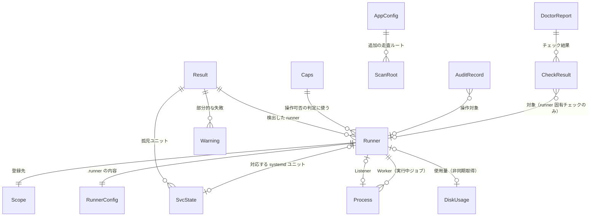
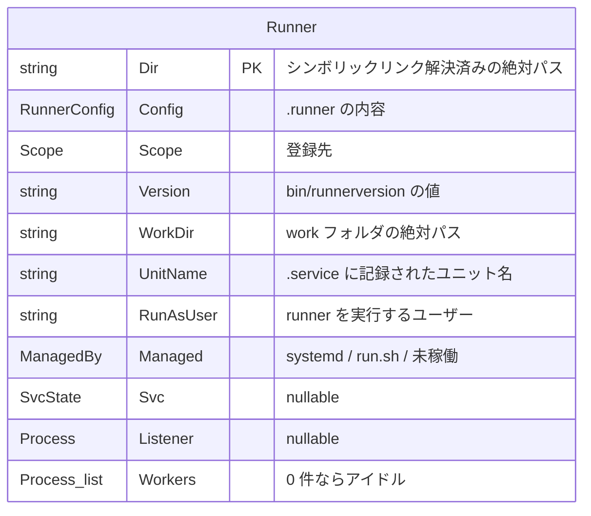

# データモデル

本ツールはデータベースを持たない。扱うデータは「実行時にホストから読み取る内部モデル」と「ディスク上のファイル」の 2 種類である。ここでは両方のスキーマを定義する。

構成の前提は [アーキテクチャ設計](overview.md)、パーミッションとトークンの扱いは [セキュリティ設計](security.md) を参照。

## 全体像



`Runner` が中心のエンティティであり、**ディレクトリの実パスが同一性のキー**になる。

## 内部モデル

### Runner

検出された 1 つの runner インスタンス。3 つの情報源をマージした結果。



| フィールド | 型 | 由来 | 備考 |
|-----------|-----|------|------|
| `Dir` | string | ディスク走査 / プロセス / ユニット | 主キー。`filepath.EvalSymlinks` 後の絶対パス |
| `Config` | RunnerConfig | `<Dir>/.runner` | 下記 |
| `Scope` | Scope | `Config.GitHubURL` から導出 | 下記 |
| `Version` | string | `<Dir>/bin/runnerversion` | 読めない場合は空 |
| `WorkDir` | string | `Config.WorkFolder` を絶対パス化 | 既定は `<Dir>/_work` |
| `UnitName` | string | `<Dir>/.service` | `svc.sh install` が書き出す。未サービス化なら空 |
| `RunAsUser` | string | `systemctl show -p User` / `Listener` の UID | runner を実行するユーザー。ジョブ実行の前提チェック（[FR-43](../requirements/functional.md)）の判定対象。`User=` が空の場合は root |
| `Managed` | ManagedBy | 判定結果 | `systemd` / `run.sh` / 未稼働 |
| `Svc` | *SvcState | systemd | 対応ユニットがない場合 nil |
| `Listener` | *Process | `/proc` | 稼働していなければ nil |
| `Workers` | []Process | `/proc` | 1 件以上あればジョブ実行中 |

派生値: `Name()`（`Config.AgentName`、空ならディレクトリ名）、`Running()`（Listener の有無）、`Busy()`（Worker の有無）、`JobElapsed()`（最も古い Worker の経過時間）。

### RunnerConfig

`.runner` の内容。**読み取り専用**として扱い、本ツールから直接書き換えない（変更が必要な項目は `config.sh` による再登録で反映する）。

| フィールド | JSON キー | 型 | 備考 |
|-----------|----------|-----|------|
| AgentID | `agentId` | int64 | GitHub 側の runner ID |
| AgentName | `agentName` | string | runner 名 |
| PoolID | `poolId` | int64 | — |
| PoolName | `poolName` | string | runner group に対応 |
| ServerURL | `serverUrl` | string | Actions のサービス URL |
| GitHubURL | `gitHubUrl` | string | スコープ判定の入力 |
| WorkFolder | `workFolder` | string | 既定 `_work` |
| Ephemeral | `ephemeral` | bool | ジョブ 1 件で登録解除される runner |
| DisableUpdate | `disableUpdate` | bool | 自動更新の無効化。バージョン一括更新の必要性に関わる |

### Scope

runner の登録先。`GitHubURL` のパスから判定する。

| Kind | 判定条件（パス） | 例 | 表示 |
|------|----------------|-----|------|
| Repo | `/<owner>/<repo>` | `https://github.com/foo/bar` | `foo/bar` |
| Org | `/orgs/<org>` または `/<org>` | `https://github.com/orgs/foo` | `org:foo` |
| Enterprise | `/enterprises/<slug>` | `https://github.com/enterprises/foo` | `ent:foo` |
| Unknown | 上記以外 | — | `-` |

Scope は GitHub API のパス生成にも使う（[外部インターフェース](../api/external-interfaces.md)）。

### Process

`/proc` から検出した runner プロセス。

| フィールド | 型 | 取得元 | 備考 |
|-----------|-----|-------|------|
| PID | int | `/proc/<pid>` | — |
| Kind | ProcKind | 実行ファイル名 | `Runner.Listener` / `Runner.Worker` |
| Dir | string | 実行ファイルパス | `<Dir>/bin/Runner.*` から親の親を取る。取れない場合は `cwd` にフォールバック |
| Started | time.Time | `/proc/<pid>` の mtime | プロセス生成時刻。ジョブの経過時間算出に使う |
| Exe | string | `/proc/<pid>/exe`、失敗時は `cmdline[0]` | 他ユーザーのプロセスは root でないと `exe` が読めない |

### SvcState

systemd ユニットの状態。

| フィールド | 取得元 | 備考 |
|-----------|-------|------|
| Unit | `systemctl list-units` / `show` の `Id` | `actions.runner.<scope>.<name>.service` |
| Load | `LoadState` | `loaded` / `not-found` |
| Active | `ActiveState` | `active` / `inactive` / `failed` |
| Sub | `SubState` | `running` / `dead` |
| FileState | `UnitFileState` | `enabled` / `disabled` / `static` |
| WorkingDir | `WorkingDirectory` | runner ディレクトリとの照合に使う。空の場合もある |
| MainPID | `MainPID` | — |

runner との紐付けは `UnitName`（`.service` ファイル）を第一に、`WorkingDir` を第二の手段として照合する。

### Result

検出処理の戻り値。

| フィールド | 型 | 意味 |
|-----------|-----|------|
| Runners | []Runner | 検出した runner。スコープ→名前でソート |
| OrphanUnits | []SvcState | 対応する runner ディレクトリが見つからないユニット（異常） |
| Warnings | []error | 部分的な失敗。1 件の失敗で全体を止めないため集約する |

### Caps

起動時に 1 回判定する能力。UI の操作可否の判定に使う。

| フィールド | 判定方法 |
|-----------|---------|
| Root | 実効 UID が 0 |
| Systemd | `systemctl` が存在する |
| Docker | `docker` が存在し daemon が応答する |
| Journal | `journalctl` が存在する |
| GitHubToken | トークンを取得できた |
| SudoUser | `SUDO_USER` の値（設定・ログの配置先の決定に使う） |

### DiskUsage

非同期に集計するディスク使用量。

| フィールド | 意味 |
|-----------|------|
| Target | 集計対象の種別（`_work/<repo>` / `_tool` / `_temp` / `_diag` / docker の各項目） |
| Path | 対象パス（docker 項目では空） |
| Bytes | 使用量 |
| Files | ファイル数（inode 消費の目安） |
| State | 集計中 / 完了 / 失敗 |

ファイルシステム単位で容量残量と inode 残量も別途保持する。

### DoctorReport / CheckResult

| フィールド | 意味 |
|-----------|------|
| ID | チェックの識別子 |
| Category | 認証・権限 / ネットワーク / 時刻 / リソース / 障害履歴 / docker / **ジョブ実行の前提** / 依存コマンド / systemd / 構成整合 |
| Target | 対象 runner（ホスト全体のチェックでは空） |
| Status | OK / WARN / FAIL / SKIP |
| Detail | 判定の根拠（実測値など） |
| Remedy | 推奨する対処 |
| Startup | 起動時の自動実行の対象か（[FR-44](../requirements/functional.md)） |

`SKIP` は能力不足で実行できなかったチェック（docker が無い等）に使い、失敗と区別する。

`Startup` が真のチェックは起動時にも実行される。対象はホスト内の読み取りと軽量なコマンドで完結するもの（ジョブ実行の前提）に限り、ネットワーク到達性やディスク集計を伴うものは含めない。

## ディスク上のファイル

### 読み書きの対象一覧

| パス | 形式 | アクセス | 備考 |
|------|------|---------|------|
| `<runner>/.runner` | JSON（UTF-8 BOM の可能性あり） | 読み取りのみ | runner 本体が書き出す。変更は `config.sh` 経由 |
| `<runner>/.credentials` | JSON | **読まない** | パーミッションと所有者のみ確認する（[セキュリティ設計](security.md)） |
| `<runner>/.env` | `KEY=VALUE` 行 | 読み書き | 順序とコメントを保持して書き戻す |
| `<runner>/.path` | 1 行のパス文字列 | 読み書き | — |
| `<runner>/.service` | ユニット名 1 行 | 読み取りのみ | `svc.sh install` が生成 |
| `<runner>/bin/runnerversion` | バージョン文字列 1 行 | 読み取りのみ | 例: `2.311.0` |
| `<runner>/_diag/*.log` | テキスト | 読み取り / 削除 | `Runner_*.log` / `Worker_*.log` |
| `<runner>/_work/**` | — | 参照 / 削除 | 削除は段階的な確認を経る |
| systemd ユニット / drop-in | INI | 読み取り / 書き込み | 本体ユニットは編集せず drop-in を作る |
| 自前設定 | YAML | 読み書き | 下記 |
| 監査ログ | JSON Lines | 追記のみ | 下記 |

`.runner` は BOM 付きで書き出される場合があるため、パース前に除去する。

### `.env` の扱い

runner の `.env` はシェルスクリプトではなく単純な `KEY=VALUE` の羅列として読まれる。編集時に差分を最小化するため、**コメント行と空行を含めた全行を順序どおり保持**し、変更したキーの行だけを置き換える。

| 用途 | キー例 |
|------|-------|
| ジョブ環境 | `PATH`、`LANG`、`ImageOS` |
| プロキシ | `https_proxy`、`http_proxy`、`no_proxy` |
| job hooks | `ACTIONS_RUNNER_HOOK_JOB_STARTED`、`ACTIONS_RUNNER_HOOK_JOB_COMPLETED` |

### 自前設定（YAML）

配置先は実行ユーザー（`sudo` 実行時は `SUDO_USER`）の設定ディレクトリ。root のホームには置かない。

```yaml
# 追加の走査ルート（既定の設置場所に加えて探索する）
scan_roots:
  - /opt/runners
  - /data/actions-runner

# ルート配下を掘る深さ。runner ディレクトリを見つけたらその配下は掘らない
scan_depth: 2

# 一覧の自動更新間隔（秒）
refresh_interval: 3

# ディスク使用率の警告閾値（%）
disk_thresholds:
  warn: 80
  critical: 90

# 監査ログの出力先
audit_log: /var/log/gsr-helper/audit.jsonl

# runner 追加時の既定値
defaults:
  # runner 名のプレフィクス。空ならホスト名を使う
  name_prefix: ""
  # インストール先のベースディレクトリ
  install_base: /opt/runners
  labels:
    - self-hosted-extra
  ephemeral: false
```

すべての項目に既定値を持たせ、設定ファイルが存在しない場合も動作する（初回起動時にウィザードを出す）。

### 監査ログ（JSON Lines）

本ツールが実行した外部コマンドを 1 行 1 レコードで追記する。

```json
{"ts":"2026-08-21T12:00:00+09:00","uid":0,"sudo_user":"ousiass","action":"svc.stop","runner":"build01-2","dir":"/opt/runners/build01-2","command":["systemctl","stop","actions.runner.foo-bar.build01-2.service"],"exit_code":0,"duration_ms":412}
{"ts":"2026-08-21T12:01:20+09:00","uid":0,"sudo_user":"ousiass","action":"runner.add","runner":"build01-4","dir":"/opt/runners/build01-4","command":["./config.sh","--url","https://github.com/orgs/foo","--token","***","--name","build01-4","--labels","self-hosted,linux,x64","--unattended"],"exit_code":0,"duration_ms":3180}
```

| フィールド | 意味 |
|-----------|------|
| `ts` | RFC 3339 のタイムスタンプ |
| `uid` | 実効 UID |
| `sudo_user` | `SUDO_USER`（無ければ空） |
| `action` | 操作の識別子（`svc.stop` / `runner.add` / `disk.clean` など） |
| `runner` | 対象 runner 名（ホスト全体の操作では空） |
| `dir` | 対象 runner ディレクトリ |
| `command` | 実行したコマンドと引数。**トークンは `***` にマスクする** |
| `exit_code` | 終了コード |
| `duration_ms` | 所要時間 |
| `error` | 失敗時のエラーメッセージ（任意） |

追記は 1 レコードずつ行い、書き込みが途中で切れても以降のレコードが読めるようにする。ローテーションは `logrotate` に委ねる。

## 改訂履歴

| 版 | 日付 | 変更内容 | 変更理由 |
|----|------|---------|---------|
| 1.0 | 2026-08-21 | 新規作成 | 初版 |
| 1.1 | 2026-08-21 | `Runner.RunAsUser` を追加。`CheckResult` に `Startup` とカテゴリ「ジョブ実行の前提」を追加 | ジョブ実行の前提チェック（FR-43）と起動時の自動判定（FR-44）を追加したため |
