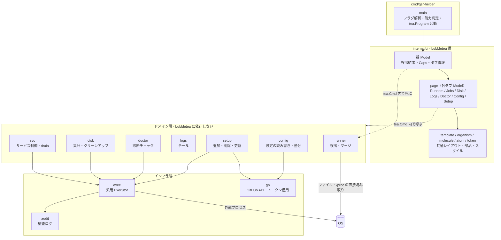
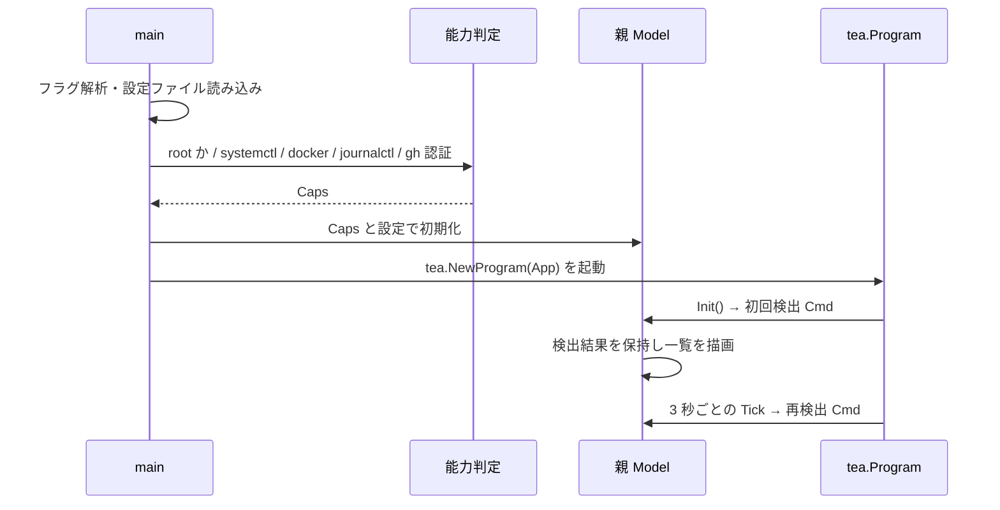
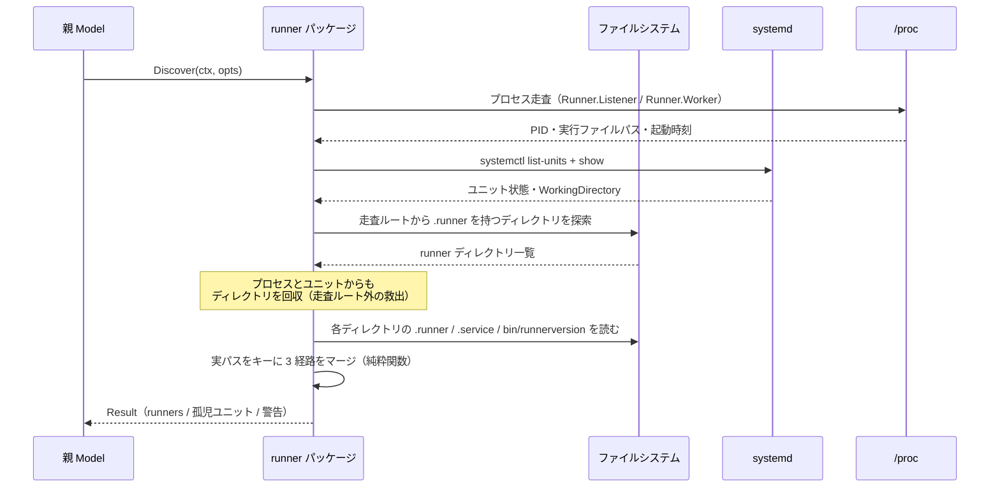
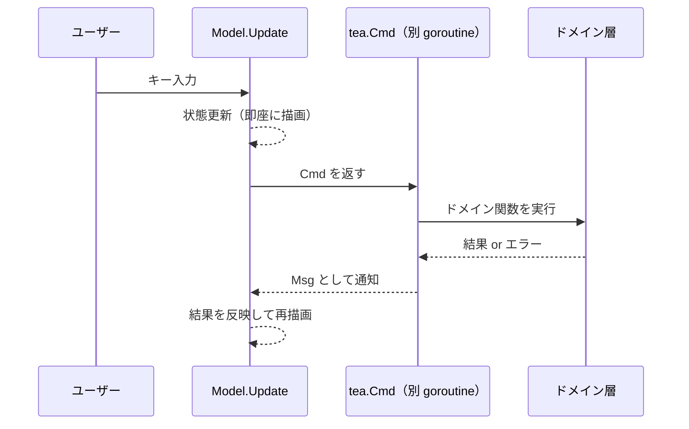

# アーキテクチャ設計

機能一覧は [機能要件](../requirements/functional.md)、性能・テスト方針は [非機能要件](../requirements/non-functional.md)、権限とトークンの扱いは [セキュリティ設計](security.md) を参照。

## 全体構成



### 依存の方向

- **ドメイン層は bubbletea を知らない。** ドメインの関数は `context.Context` を取り値を返す普通の関数であり、UI 層がそれを `tea.Cmd` でラップして非同期に実行する。これによりドメインロジックを TUI なしでテストできる。
- **ドメイン層は UI に依存しない。** 進捗の通知が必要な処理はチャネルまたはコールバックで結果を流し、UI 層がそれを `tea.Msg` に変換する。
- **外部プロセスの実行は必ず `exec` 層を経由する。** ドメイン層が `os/exec` を直接呼ぶことを禁止する。監査ログとタイムアウトを漏れなく適用するための制約である。
- **UI 層の内部も階層化する。** `internal/ui` は Atomic Design に沿って token / atom / molecule / organism / template / page に分け、依存の方向をパッケージの import で強制する。ドメイン層を `tea.Cmd` で呼ぶのは page のみとする（[TUI コンポーネント設計](../ui/atomic-design.md)）。

## 技術選定

| 選定 | 理由 |
|------|------|
| Go | 単一バイナリで runner ホストに配布でき、`/proc` の読み取りと外部プロセス実行が素直に書ける。runner ホストに追加のランタイムを入れずに済む |
| Bubble Tea | 非同期処理を `Cmd` / `Msg` に分離するモデルが本ツールの中心的な要件（ディスク集計・ログ追従・コマンド実行を UI から切り離す）と一致する |
| huh | 追加ウィザードと設定編集の入力検証・確認ステップを担う。`tea.Model` を実装しているため既存のタブ構成にそのまま組み込める |
| 汎用 Executor 1 本 | 外部コマンドの抽象化を 1 つの interface に集約する。テストでは発行されたコマンド列を検証でき、監査ログの記録点も 1 箇所に収まる |
| 親 Model が状態を保持 | 検出結果を親が 1 つ持ち各タブへ渡す。同じ検出処理が重複実行されず、タブ間でデータの一貫性が保てる |

## 起動シーケンスと能力判定

権限や依存コマンドの有無による機能の有効・無効判定を各所に散らさないため、**起動時に 1 回だけ能力を判定し、結果を `Caps` として持ち回る**。



判定する能力:

| 能力 | 判定方法 | 無い場合の縮退 |
|------|---------|--------------|
| root 権限 | 実効 UID | サービス制御・追加・削除・クリーンアップを無効化。一覧とログは読める範囲で表示 |
| systemd | `systemctl` の存在 | サービス制御タブを無効化。`run.sh` 直起動の検出のみ行う |
| docker | `docker` の存在と daemon 応答 | ディスク内訳から docker 項目を除外 |
| journalctl | `journalctl` の存在 | ログタブから journal ビューを除外 |
| GitHub トークン | `gh auth token` の取得成否 | 追加・削除・ラベル操作・最新版確認を無効化 |

UI では無効な操作をグレーアウトし、その理由（「root 権限が必要」「gh が未認証」など）を表示する。

## 検出のデータフロー

runner の同一性は **runner ディレクトリの実パス**（シンボリックリンク解決後の絶対パス）で判定する。



マージ処理は正規化済みの入力を受け取る純粋関数として実装し、ファイル・プロセス・ユニットの組み合わせをテーブルテストで網羅する。

### 起動方式の判定

| systemd ユニット | Listener プロセス | 判定 |
|---|---|---|
| あり | あり | systemd 管理・稼働中 |
| あり | なし | systemd 管理・停止中 |
| なし | あり | `run.sh` 直起動（systemd 操作の対象外） |
| なし | なし | 未稼働・未登録 |
| あり（対応ディレクトリなし） | — | 孤児ユニット（異常として報告） |

## 非同期処理モデル

重い処理はすべて `tea.Cmd` として UI の外で実行し、結果を `tea.Msg` で受け取る。



### 更新の駆動

| 対象 | 方式 |
|------|------|
| runner 一覧 | `tea.Tick` による 3 秒間隔のポーリング（設定で変更可）。手動更新キーも用意する |
| ログ | `fsnotify` によるファイル監視。イベントを Msg に変換して反映する |
| ディスク集計 | 対象ごとに非同期実行し、判明順に Msg を送る |
| 進捗のある処理（追加・更新・クリーンアップ） | 進捗をチャネルで受け、UI 層が Msg に変換する |
| ドレイン停止の待機 | ポーリングで `Runner.Worker` の消滅を監視。`context` のキャンセルで中断できる |

長時間の処理は必ずキャンセル可能にする。`tea.Cmd` に渡す `context` を Model 側で保持し、キャンセルキーで打ち切る。

## 外部コマンドの実行

```go
// Executor は外部プロセス実行の唯一の経路。
type Executor interface {
    Run(ctx context.Context, name string, args ...string) (Result, error)
}

type Result struct {
    Stdout   []byte
    Stderr   []byte
    ExitCode int
}
```

- 実装は 2 つ。実プロセスを起動するものと、テスト用に発行コマンドを記録するもの。
- 実装側で**監査ログの記録とタイムアウトの適用を行う**。呼び出し側が忘れられない構造にする。
- 標準入力を必要とする対話的なコマンドは扱わない。`config.sh` は必要な引数をすべて与えて非対話で実行する。

## エラーハンドリング

| 層 | 方針 |
|----|------|
| ドメイン層 | `error` を返す。複数対象を扱う処理は「1 件の失敗で全体を止めず、失敗を集約して返す」 |
| UI 層 | エラーをステータス行に表示し、詳細は専用のパネルで確認できるようにする。エラーで画面遷移を巻き戻さない |
| 起動時 | 設定ファイルの破損など致命的な場合のみ、端末を汚さずにメッセージを出して終了する |
| panic | `tea.Program` の実行を包んで復帰処理を行い、端末状態を復元してからスタックトレースを出力する（TUI が端末を掌握しているため、素の panic は端末を壊す） |

## ディレクトリ構成

```
cmd/gsr-helper/          エントリポイント
internal/
  runner/                検出・マージ・runner ディレクトリの読み取り
  svc/                   サービス制御・ドレイン停止
  setup/                 追加・削除・バージョン更新
  disk/                  使用量集計・クリーンアップ
  logs/                  ログ一覧・テール
  doctor/                診断チェック
  config/                runner 側の設定ファイルの読み書き・差分・バックアップ
  appconfig/             本ツール自身の設定（YAML）と能力判定
  gh/                    GitHub API・トークン借用
  exec/                  汎用 Executor
  audit/                 監査ログ
  ui/                    親 Model・各タブ・フォーム
```

責務とパッケージ間の依存の詳細は [コンポーネント設計](../components/overview.md)。

## 主要な設計判断

| 判断 | 選んだ理由 | 却下した案 |
|------|-----------|-----------|
| runner の同一性をディレクトリ実パスで判定 | 3 つの情報源すべてから導出できる唯一の共通キー。runner 名は変更可能で、agentId は GitHub 側にしか無い | runner 名をキーにする案（改名で追跡できなくなる） |
| プロセス・ユニットからもディレクトリを回収 | 走査ルート外に置かれた runner を取りこぼさない。「動いているのに一覧に出ない」が最も困る失敗 | ディスク走査のみ（設定漏れで検出できない） |
| ドメイン層を bubbletea から独立させる | TUI なしでテストでき、将来 CLI サブコマンドを足す余地も残る | Model の中にロジックを書く（テストが困難になる） |
| 能力判定を起動時 1 回に集約 | 権限・依存コマンドの有無による分岐が各所に散るのを防ぐ | 操作の直前に毎回判定（分岐が散り、挙動が読みにくい） |
| 外部コマンドを Executor 1 本に集約 | 監査ログとタイムアウトの適用漏れを構造的に防ぐ | 各ドメインが `os/exec` を直接呼ぶ（記録漏れが起きる） |
| 削除処理でパス検証を必須化 | root で動作するため、パス誤りの被害が大きい | 呼び出し側の責任にする |

## 改訂履歴

| 版 | 日付 | 変更内容 | 変更理由 |
|----|------|---------|---------|
| 1.0 | 2026-08-21 | 新規作成 | 初版 |
| 1.1 | 2026-08-21 | ディレクトリ構成に appconfig を追加 | コンポーネント設計で本ツール自身の設定と能力判定を担うパッケージを分離したため |
