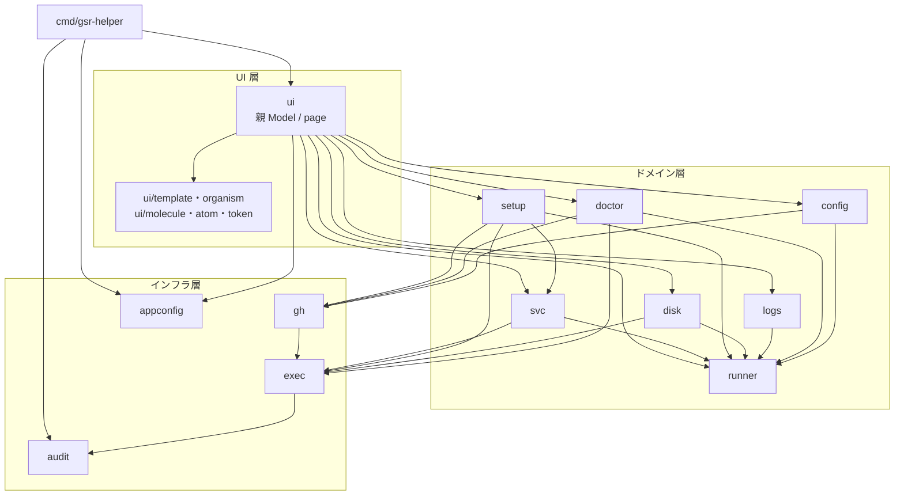

# コンポーネント設計

パッケージの分割・責務・依存関係を定める。全体構成は [アーキテクチャ設計](../architecture/overview.md)、内部モデルは [データモデル](../architecture/data-model.md) を参照。

## 依存関係



### 依存の規則

| 規則 | 理由 |
|------|------|
| ドメイン層は `ui` に依存しない | TUI なしでテストできるようにする |
| ドメイン層は bubbletea に依存しない | 同上。UI 層が `tea.Cmd` でラップする |
| ドメイン層は `os/exec` を直接使わない | 監査ログとタイムアウトの適用漏れを防ぐ（`exec` 経由に限定） |
| `runner` は他のドメインパッケージに依存しない | 最下層のモデルとして全体から参照されるため |
| `exec` はドメインを知らない | 汎用のプロセス実行に留める |
| ドメイン層を呼ぶのは `ui/page` のみ | 副作用の発生点を UI の 1 階層に閉じる。詳細は [TUI コンポーネント設計](../ui/atomic-design.md#依存の規則) |
| 循環依存を作らない | — |

## パッケージ責務

### `cmd/gsr-helper`

エントリポイント。フラグ解析、設定の読み込み、能力判定、`tea.Program` の起動と panic からの端末復元を行う。ロジックを持たない。

| フラグ | 意味 |
|-------|------|
| `--root <path>` | 追加の走査ルート（複数指定可） |
| `--config <path>` | 設定ファイルのパスを指定 |
| `--refresh <秒>` | 自動更新間隔の上書き |
| `--no-color` | 色を使わない（`NO_COLOR` も尊重） |
| `--version` | バージョン表示 |

### `internal/runner`

runner の検出とモデル定義。**最下層**であり、他のドメインパッケージに依存しない。

| 要素 | 責務 |
|------|------|
| `Runner` / `Config` / `Scope` / `Process` / `SvcState` / `Result` | モデル定義 |
| `Discover(ctx, Options) Result` | 3 経路から収集してマージ |
| `IsRunnerDir` / `LoadConfig` | runner ディレクトリの判定と `.runner` の読み取り |
| `ScanProcesses` | `/proc` の走査 |
| `ScanUnits` | systemd ユニットの列挙と状態取得 |
| `ParseScope` | `gitHubUrl` からのスコープ判定 |
| `attach`（非公開） | 正規化済み入力を受け取る**純粋関数**。プロセス・ユニットの紐付けと孤児ユニットの抽出 |

パースと判定は I/O から分離し、`parseConfig` / `parseListUnits` / `parseShow` / `attach` を個別にテストする。

### `internal/svc`

サービス制御とドレイン停止。

| 要素 | 責務 |
|------|------|
| `Start` / `Stop` / `Restart` / `Enable` / `Disable` | `systemctl` の呼び出し |
| `DaemonReload` | drop-in 変更の反映 |
| `Drain(ctx, Runner, progress)` | `Runner.Worker` の消滅を待ってから停止。無制限に待ち、`ctx` のキャンセルで中断 |
| `CanControl(Runner, Caps) (bool, string)` | 操作可否と不可の理由を返す。`run.sh` 直起動・非 root・systemd 不在を判定 |

`CanControl` を 1 箇所に集約し、UI 側で操作可否の判断を再実装しない。

### `internal/setup`

runner の追加・削除・バージョン更新。最も破壊的な操作を担う。

| 要素 | 責務 |
|------|------|
| `PlanAdd(spec) (Plan, error)` | 追加の計画を立てる。作成するディレクトリと実行コマンドを**確定させてから**返す |
| `Apply(ctx, Plan, progress)` | 計画を順に実行。失敗した時点で中止し、成功分と失敗理由を返す |
| `NextIndex(existing []string, prefix string) int` | 命名の連番決定（**純粋関数**） |
| `PlanRemove` / `PlanUpdate` | 削除・更新の計画 |
| `FetchTarball(ctx, info)` | tarball の取得と SHA-256 検証 |

**計画（Plan）と実行（Apply）を分離する。** これにより実行前プレビュー（FR-16）が計画をそのまま表示するだけで実現でき、表示と実行の食い違いが起きない。

### `internal/disk`

使用量の集計とクリーンアップ。

| 要素 | 責務 |
|------|------|
| `Scan(ctx, Runner, out chan<- Usage)` | 対象ごとに非同期集計し、判明順に送出 |
| `FSStats(path)` | 容量と inode の残量 |
| `DockerUsage(ctx)` | `docker system df` の解析 |
| `PlanClean(targets) (CleanPlan, error)` | 削除計画。対象パスと解放見込み容量を確定させる（ドライラン） |
| `ValidatePath(base, target) error` | **削除パスの検証**。基準ディレクトリ配下であること、`..` を含まないこと、許可サブツリー内であることを判定 |
| `Apply(ctx, CleanPlan, progress)` | 削除の実行。シンボリックリンクは辿らず、リンク自体のみを削除 |

`ValidatePath` は `Apply` から必ず呼ばれる構造にし、検証を通らないパスを削除できないようにする。異常系のテストを必須とする（[セキュリティ設計](../architecture/security.md#1-削除パスの検証を必須にする)）。

### `internal/logs`

ログの一覧と追従。

| 要素 | 責務 |
|------|------|
| `List(Runner) []LogFile` | `_diag` 配下のログを更新時刻順に列挙 |
| `Tail(ctx, path, out chan<- Line)` | `fsnotify` による追記の検知と送出 |
| `Journal(ctx, unit, out chan<- Line)` | `journalctl -f` の出力を送出 |
| `LatestWorker(Runner)` | 直近ジョブの Worker ログを特定 |

### `internal/doctor`

環境診断。チェックを追加しやすい構造にする。

```go
// Check は 1 つの診断項目。
type Check interface {
    ID() string
    Category() string
    Run(ctx context.Context, in Input) CheckResult
}
```

- 各チェックを独立した `Check` の実装とし、レジストリに登録する。項目の追加が既存コードに影響しない。
- `Run(ctx, in)` は並列に実行される。`Input` に runner 一覧と `Caps` を渡す。
- 能力不足で実行できないチェックは `SKIP` を返し、失敗と区別する。

### `internal/config`

runner 側の設定ファイルの読み書き。

| 要素 | 責務 |
|------|------|
| `EnvFile` | `.env` の表現。**コメントと空行を含む全行を順序どおり保持**し、変更行のみ置換する |
| `LoadEnv` / `SaveEnv` | 読み書き |
| `PathFile` | `.path` の読み書き |
| `DropIn` | systemd drop-in の生成・読み書き |
| `Diff(before, after) string` | 差分の生成（書き込み前のプレビュー用） |
| `Backup(path) error` | 書き込み前のバックアップ作成。所有者とパーミッションを維持 |
| `Validate*` | ラベル・runner 名・パスの検証（**純粋関数**） |

ラベルと runner group の変更は GitHub API 側なので `gh` パッケージに委譲する。

### `internal/gh`

GitHub API とトークンの取得。

| 要素 | 責務 |
|------|------|
| `Token(ctx) (string, error)` | 優先順に従ってトークンを取得（環境変数 → `SUDO_USER` の `gh` → `gh`） |
| `Client` | `go-github` のラッパー。スコープに応じたパスの切り替えを内部で処理 |
| `RegistrationToken` / `RemoveToken` | 短命トークンの取得 |
| `ListRunners` / `DeleteRunner` | runner 情報の取得と削除 |
| `RunnerDownloads` | tarball の URL と SHA-256 の取得 |
| `Labels` 系 | ラベルの取得・置換・追加・削除 |
| `LatestRunnerVersion` | runner 本体の最新版 |
| `TokenScopes(ctx)` | 保有スコープの取得（doctor 用） |

### `internal/exec`

外部プロセス実行の唯一の経路。

```go
type Executor interface {
    Run(ctx context.Context, name string, args ...string) (Result, error)
}
```

| 実装 | 用途 |
|------|------|
| 実行実装 | プロセスを起動する。タイムアウトの適用、監査ログの記録、トークンのマスクを行う |
| テスト実装 | 発行されたコマンド列を記録し、あらかじめ設定した結果を返す |

- 作業ディレクトリと環境変数を指定できるオプションを持つ（runner ディレクトリでの `config.sh` 実行に必要）。
- シェルを経由しない。
- マスク処理はここに実装し、呼び出し側が忘れられない構造にする。

### `internal/audit`

監査ログの記録。JSON Lines で追記する。`exec` から呼ばれる。

### `internal/appconfig`

本ツール自身の設定（YAML）の読み書き。

| 要素 | 責務 |
|------|------|
| `Load(path) (Config, error)` | 読み込み。すべての項目に既定値を持たせ、ファイルが無くても動作する |
| `Save(Config, path) error` | 書き込み。**`SUDO_USER` の所有権で作成**する |
| `DefaultPath()` | 配置先の決定（`SUDO_USER` を考慮） |
| `Caps` の判定 | root / systemd / docker / journalctl / トークンの能力判定 |

### `internal/ui`

bubbletea の Model 群。**内部を Atomic Design で階層化する。** 部品一覧・デザイントークン・画面との対応は [TUI コンポーネント設計](../ui/atomic-design.md) に定める。ここでは階層と責務の対応のみを示す。

| サブパッケージ | 階層 | 責務 |
|--------------|------|------|
| `ui`（`app.go`） | 親 Model | 検出結果と `Caps` を保持し、page を切り替える。3 秒ごとの再検出を駆動する |
| `ui/page` | page | タブ 1 枚。organism を構成し、キー入力をドメイン層の `tea.Cmd` に変換する |
| `ui/template` | template | 画面共通の枠（ヘッダ / タブ / 本体 / 状態行 / フッタ、モーダル、2 ペイン）。中身を知らない |
| `ui/organism` | organism | ローカル状態を持つ部品。一覧（`Table`）、確認ダイアログ（`Confirm`）、ログペイン、進捗、`huh` フォーム |
| `ui/molecule` | molecule | 1 行 / 1 区画の描画。純粋関数 |
| `ui/atom` | atom | 最小の表示単位。純粋関数 |
| `ui/token` | token | 色・記号・幅の定数。色と記号を対で定義し、`NO_COLOR` の縮退をここに閉じる |

- タブ間で共有する状態は親のみが持つ。page が独自に検出処理を走らせることはしない。
- 一覧と確認ダイアログはそれぞれ `organism.Table` / `organism.Confirm` の 1 実装に統一する。個別のダイアログを追加しないことで「確認を経ない破壊的操作の経路を作らない」を構造として守る。
- キーマップは有効・無効の判定を含めて一元管理する。可否の判断は page がドメイン層（`svc.CanControl` など）に問い合わせ、`atom.KeyHint` は受け取った可否と理由を描くだけとする。
- `atom` / `molecule` / `template` は bubbletea を import しない。

## 主要な interface 一覧

| interface | 定義場所 | 差し替えの目的 |
|-----------|---------|--------------|
| `Executor` | `exec` | テストで発行コマンドを検証する |
| `Check` | `doctor` | 診断項目を独立して追加する |
| `tea.Model` | bubbletea | タブとフォームの共通化 |

interface はこの 3 つに留める。ドメインごとの interface は、差し替えの必要が生じた時点で追加する。

## テストの配置

| 対象 | テストの置き場所 |
|------|---------------|
| `parseConfig` / `parseListUnits` / `parseShow` / `attach` / `ParseScope` | `internal/runner` の内部テスト。testdata にフィクスチャを置く |
| `NextIndex` | `internal/setup` のテーブルテスト |
| `ValidatePath` | `internal/disk`。異常系（`..`、基準外、リンクによる逸脱、基準自身）を網羅 |
| `Validate*`（ラベル・名前・パス） | `internal/config` のテーブルテスト |
| コマンド発行を伴う処理 | 各ドメインで `Executor` のテスト実装に差し替え、発行コマンド列を検証 |
| マスク処理 | `internal/exec`。キー名ベースと値一致ベースの両方 |
| UI の表示部品（`atom` / `molecule` / `template`） | 各パッケージ。純粋関数として期待文字列と比較する（[TUI コンポーネント設計](../ui/atomic-design.md#テストの配置)） |
| UI の状態を持つ部品（`organism` / `page`） | 各パッケージ。キー入力列に対する状態遷移と発行される `tea.Msg` / `tea.Cmd` を検証 |

## 改訂履歴

| 版 | 日付 | 変更内容 | 変更理由 |
|----|------|---------|---------|
| 1.0 | 2026-08-21 | 新規作成 | 初版 |
| 1.1 | 2026-08-21 | `internal/ui` を Atomic Design の階層構成に置き換え、UI 内部の依存規則とテスト配置を追加 | UI 層の部品分割を [TUI コンポーネント設計](../ui/atomic-design.md) として定義したため |
