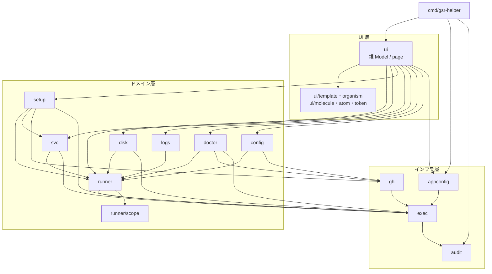

# コンポーネント設計

パッケージの分割・責務・依存関係を定める。全体構成は [アーキテクチャ設計](../architecture/overview.md)、内部モデルは [データモデル](../architecture/data-model.md) を参照。

## 依存関係



### 依存の規則

| 規則 | 理由 |
|------|------|
| ドメイン層は `ui` に依存しない | TUI なしでテストできるようにする |
| ドメイン層は bubbletea に依存しない | 同上。UI 層が `tea.Cmd` でラップする |
| ドメイン層は `os/exec` を直接使わない | 監査ログとタイムアウトの適用漏れを防ぐ（`exec` 経由に限定） |
| `runner` は他のドメインパッケージに依存しない | 最下層のモデルとして全体から参照されるため |
| `exec` はドメインを知らない | 汎用のプロセス実行に留める |
| ドメイン層を呼ぶのは `ui/page` のみ | 副作用の発生点を UI の 1 階層に閉じる。詳細は [TUI コンポーネント設計](../ui/atomic-design.md#依存の規則) |
| 循環依存を作らない | — |

## パッケージ責務

### `cmd/gsr-helper`

エントリポイント。フラグ解析、設定の読み込み、監査ログのオープン、能力判定、色を使うかの判定、`tea.Program` の起動を行う。ロジックを持たない。

代替スクリーンへの切り替えは親 Model が宣言し、panic からの端末復元は bubbletea が行う。`cmd` は `tea.NewProgram(app).Run()` を呼ぶだけで、どちらも自分では扱わない（扱う箇所を 2 つ持つと、片方だけが効いた状態を追えなくなる）。

色を使うかは `NO_COLOR` / `--no-color` / 非 TTY から**ここで 1 つの値に決めて**親 Model に渡す。判定箇所を分散させない。背景の明暗は起動後に端末へ問い合わせるため、親 Model が受け持つ（[アーキテクチャ設計](../architecture/overview.md#起動シーケンスと能力判定)）。

| フラグ | 意味 |
|-------|------|
| `--root <path>` | 追加の走査ルート（複数指定可）。`scan_roots` と同じ検査を通す（絶対パスで `..` を含まない） |
| `--config <path>` | 設定ファイルのパスを指定 |
| `--refresh <秒>` | 自動更新間隔の上書き。`refresh_interval` と同じ有効範囲（1〜3600 秒） |
| `--no-color` | 色を使わない（`NO_COLOR` も尊重） |
| `--version` | バージョン表示 |
| `-h` / `--help` | 使い方を標準出力へ出して終了（終了コード 0） |

#### 終了コード

| コード | 意味 |
|-------|------|
| 0 | 正常終了。`--version` / `--help` もこれ |
| 1 | 起動または実行の失敗（設定の読み込み失敗、`tea.Program` の失敗など） |
| 2 | 引数の誤り。メッセージと使い方を**標準エラー出力**へ出す |
| 3 | panic からの復帰 |

`--version` / `--help` は標準出力、引数の誤りは標準エラー出力に出す。パイプで受けたときに正常な出力とエラーが混ざらないようにするためである。

#### 監査ログを開けない場合の縮退

監査ログを開けなくても**起動は続ける**。ホスト内の状態を読むだけの一覧表示が、ログの出力先の権限で使えなくなることを避けるためである。

| 状況 | 挙動 |
|------|------|
| `audit_log` を開けない・検証に落ちた | 記録しない書き込み先（`audit.Discard()`）に差し替え、`警告: 監査ログを開けませんでした（記録せずに続行します）: <原因>` を標準エラー出力へ 1 行出す。代替スクリーンへ入る前に出すため、終了後の画面に残る |
| 実行中の記録の書き込みに失敗した | 実行そのものは成功として扱い、失敗を集計する。TUI の終了後に `警告: 監査ログの記録に N 件失敗しました（最初の失敗: <原因>）` を標準エラー出力へ出す |
| 終了時に監査ログを閉じられなかった | TUI の終了後に `警告: 監査ログのクローズに失敗しました: <原因>` を標準エラー出力へ出す。**捨てない。** 開けなかった場合と記録に失敗した場合は警告が出るのに閉じ損ないだけが見えないと、書けなかったレコードの存在に気付けない |

**縮退した場合は「全外部コマンドの監査ログ記録」（[セキュリティ設計](../architecture/security.md)）が効いていない。** 記録が要件である運用では、この警告を起動の失敗として扱う運用手順を用意すること。TUI の実行中に標準エラー出力へ書かないのは、描画が壊れて画面が読めなくなるためである。

### `internal/runner`

runner の検出とモデル定義。**最下層**であり、他のドメインパッケージに依存しない。

| 要素 | 責務 |
|------|------|
| `Runner` / `Config` / `Process` / `SvcState` / `Result` | モデル定義 |
| `Discover(ctx, Options) Result` | 3 経路から収集してマージ |
| `IsRunnerDir` / `LoadConfig` | runner ディレクトリの判定と `.runner` の読み取り |
| `ScanProcesses` | `/proc` の走査 |
| `ScanUnits(ctx, Executor) ([]SvcState, []error)` | systemd ユニットの列挙と状態取得。`Executor` が `nil` のとき systemd を参照せず、**警告も返さない**（systemctl 不在時の縮退。3 秒ごとのポーリングで同じ警告が積み上がらないようにするため。可否は起動時の `Caps` としてヘッダに出る） |
| `DefaultRoots()` | 既定の走査ルート（10 個の glob パターン）を展開して返す。全量は [FR-01](../requirements/functional.md#既定の走査ルートfr-01) |
| `scanRoots`（非公開） | 実際に掘るルートを決める。`Options.SkipDefaultRoots` が偽なら `DefaultRoots()` に `Options.Roots` を足し、真なら `Options.Roots` だけを返す |
| `findRunnerDirs`（非公開） | ルート配下の探索。`.runner` を見つけた時点で**その配下は掘らず**そのディレクトリを返し、降りる途中で名前が `_work` / `_diag` のディレクトリは辿らない |
| `attach`（非公開） | 正規化済み入力を受け取る**純粋関数**。プロセス・ユニットの紐付け、孤児ユニットの抽出、`Runner.Managed` の決定、警告の生成 |
| `resolveRunAsUser`（非公開） | runner の実行ユーザーの決定。`SvcState.User` を第一、`Listener` の UID を第二の情報源とする（UID → 名前の解決関数を引数で受ける純粋関数） |

`attach` は紐付け以外に次も決める。**表示の決定性を保つために必要な処理をここに集めている。**

- `Runner.Managed` の 4 値。判定に「ユニット一覧が取れたか」を引数で受け取る（[FR-03](../requirements/functional.md#起動方式の-4-状態fr-03)）。取れていない場合に「ユニットが無い」と読み替えない
- `Workers` を PID 順に並べる。`/proc` の走査順に依存すると、同じ状態でも表示が入れ替わる
- 同じ runner に複数の `Listener` が見つかった場合は `Started` の新しいものを採る（古い残骸プロセスを稼働中として出さない）
- ユニット照合は `UnitName` を第一パス、`WorkingDirectory` を第二パスの 2 段で行う。1 パスで回すと、あるユニットの `WorkingDirectory` 一致が別のユニットの `UnitName` 一致を上書きしうる

#### 走査ルートの合成（`--root` / `scan_roots` / `SkipDefaultRoots`）

走査ルートは 3 つの入口から決まる。合成の順序と既定値を次に定める。

| 入口 | 与えるもの | 既定 |
|------|-----------|------|
| `DefaultRoots()` | [FR-01](../requirements/functional.md#既定の走査ルートfr-01) の 10 個の glob を展開したもの | **使う**（`Options.SkipDefaultRoots` が偽） |
| 設定ファイルの `scan_roots` | 追加の走査ルート | 空 |
| `--root <path>`（複数指定可） | 追加の走査ルート | 空 |

`cmd/gsr-helper` は `scan_roots` の後ろに `--root` を並べて `Options.Roots` に渡し、`internal/runner` はその前に `DefaultRoots()` を置く。したがって最終的な走査順は **既定ルート → `scan_roots` → `--root`** である。

**`--root` は `scan_roots` と同じ検査を通し（`appconfig.CleanScanRoot`）、重複除去も入口をまたいで行う（`appconfig.MergeScanRoots`）。** 検査を入口ごとに分けると、安全上の根拠がある絶対パス・`..` の検査が `--root` だけ効かない状態になる。重複除去を入口ごとに分けると、`scan_roots` と `--root` に同じルートを書いたときに同じディレクトリを 2 度走査する。同じ runner が 2 度一覧に出ることは `collectDirs` が実パスで畳むため起きないが、走査そのものは 2 度走る。

**`--root` は「既定ルートの置き換え」ではなく「追加」である。** 既定を置き換える指定にすると、`--root` を 1 つ足しただけで既定の設置場所にある runner が一覧から消える。runner を見落とす側に倒れる既定は取らない。

`Options.SkipDefaultRoots` は**既定ルートを使わない**ことを呼び出し側が明示するための指定で、既定は偽（使う）である。テストのように走査対象を完全に固定したい呼び出しのために用意してあり、`cmd/gsr-helper` からは設定できない（利用者向けのフラグ・設定項目は持たない）。真にしても [FR-02](../requirements/functional.md#検出一覧fr-01fr-05) の補完（稼働プロセスと systemd ユニット由来のディレクトリ回収）は止まらない。走査ルートは「どこを掘るか」の指定であって、検出全体の範囲ではないためである。

`resolveRunAsUser` が `SvcState.User` を採るのは**ユニットの実体がある場合に限る**（`Load` が空でも `not-found` でもない）。`systemctl show` に失敗したプレースホルダと `svc.sh uninstall` 後の残骸ユニットは `User=` が空であり、そのまま採ると全 runner が root と表示される。名前が解決できないときは UID の 10 進表記になる（[データモデル](../architecture/data-model.md#runasuser-の決定と-uid-フォールバック)）。

パースと判定は I/O から分離し、`parseConfig` / `parseListUnits` / `parseShow` / `attach` を個別にテストする。

`ScanUnits` の所要時間は「1 コマンドのタイムアウト（既定 30 秒）× ceil(ユニット数 / 8)」まで伸びるため、呼び出し側は deadline 付きの `ctx` を渡す。`systemctl show` の同時実行数は 8 である。`ctx` のキャンセル後は残りの `systemctl show` を発行しない。

**`systemctl list-units` 自体が失敗した場合は状態を 1 件も返さない。** ユニットの一覧が無ければどのユニットを `show` すべきかも分からないためである。この場合の警告は `systemd.ErrListUnits` を包んだ 1 件だけで、呼び出し側は `errors.Is` で「ユニットが 0 件」と「一覧が取れていない」を区別する。区別しないと起動方式を誤判定する（[FR-03](../requirements/functional.md#起動方式の-4-状態fr-03)）。**これが検出処理で最も影響範囲の広い縮退である。**

**次の 2 種のユニットは孤児として扱わない。** どちらも「対応する runner ディレクトリが無い」わけではないため、孤児区画（[FR-05](../requirements/functional.md#孤児ユニットに含めないものfr-05)）に出さず `Result.Warnings` に集約する。

- `systemctl show` に失敗したユニット。状態が取れないと `WorkingDirectory` が空になるため、`.service` ファイルを持たない runner のユニットが「対応ディレクトリなし」と誤判定される。警告は `ScanUnits` が既に返しているので二重に報告しない
- `LoadState=not-found` のユニット。`svc.sh uninstall` 後に参照だけが残っている状態で、runner ディレクトリは存在する。**runner への紐付けも行わない**（存在しないユニットに対してサービス制御を提示しないため。`resolveRunAsUser` も同じ理由で `not-found` を除いている）

紐付けを行わないユニットと、既に別のユニットが紐付いた runner ディレクトリを指す 2 本目のユニットは、黙って落とさず警告として出す。文言は [データモデルの `Result` の警告](../architecture/data-model.md#result-の警告) に定める。

### `internal/runner/procs`・`internal/runner/systemd`

`internal/runner` の収集経路のうち、`/proc` の走査（`procs`）と systemd の参照（`systemd`）を行数上限のために切り出したもの。**`internal/runner` から一方向に import し、逆向きの参照は作らない。** `Process` / `ProcKind` / `SvcState` / `ScanProcesses` / `ScanUnits` は `internal/runner` の別名として再公開してあるため、呼び出し側は分割を意識しなくてよい。

| パッケージ | 主な要素 |
|-----------|---------|
| `runner/procs` | `Process` / `Kind` / `Scan`。`/proc/<pid>/exe` の末尾に付く ` (deleted)` を照合の前に落とす（runner の自動更新でバイナリが差し替わっても稼働中の runner を見落とさない）。`Process.Exe` には印を残した生の値を保つ |
| `runner/systemd` | `State` / `Scan` / `ErrListUnits`。`list-units` と並列の `show`、`WorkingDirectory` の先頭 `-` の除去 |

### `internal/runner/scope`

`.runner` の `gitHubUrl` からスコープ（repo / org / enterprise）を判定する。**純粋な文字列処理のみ**で、ホスト走査・`/proc`・systemd に依存しない。

| 要素 | 責務 |
|------|------|
| `Scope` / `Kind` | スコープのモデル定義（`Runner.Scope` の型） |
| `Parse(gitHubUrl) (Scope, error)` | スコープ判定。ホストを含まない URL・`orgs` / `enterprises` の単独指定は誤りとして拒否する |

`internal/runner` の下位に置くのは 2 つの理由による。`Scope` は GitHub API のパス生成にも使うため（[データモデル](../architecture/data-model.md#scope)）、`internal/gh` が `internal/runner` 全体を import せずにスコープだけを参照できる。また `internal/runner` の行数上限（1 ディレクトリ 2000 行）に対する余裕を確保する。

行数チェック（`linterly`）の集計は直下のファイルのみを対象とする。現在の使用量は `internal/runner` 1558 / `runner/systemd` 544 / `runner/procs` 317 / `runner/scope` 165 行である。**`internal/runner` は残り 400 行強しか無い。** サービス制御や追加・削除の Issue が `runner` へ機能を足す場合は、先に切り出し先を決めること。

`Parse` は判定できない入力を必ず error にする。**Unknown を error 無しで返すことはない**（[データモデル](../architecture/data-model.md#scope)）。

### `internal/svc`

サービス制御とドレイン停止。

| 要素 | 責務 |
|------|------|
| `Start` / `Stop` / `Restart` / `Enable` / `Disable` | `systemctl` の呼び出し |
| `DaemonReload` | drop-in 変更の反映 |
| `Drain(ctx, Runner, progress)` | `Runner.Worker` の消滅を待ってから停止。無制限に待ち、`ctx` のキャンセルで中断 |
| `CanControl(Runner, Caps) (bool, string)` | 操作可否と不可の理由を返す。`run.sh` 直起動・非 root・systemd 不在を判定 |

`CanControl` を 1 箇所に集約し、UI 側で操作可否の判断を再実装しない。

### `internal/setup`

runner の追加・削除・バージョン更新。最も破壊的な操作を担う。

| 要素 | 責務 |
|------|------|
| `PlanAdd(spec) (Plan, error)` | 追加の計画を立てる。作成するディレクトリと実行コマンドを**確定させてから**返す |
| `Apply(ctx, Plan, progress)` | 計画を順に実行。失敗した時点で中止し、成功分と失敗理由を返す |
| `NextIndex(existing []string, prefix string) int` | 命名の連番決定（**純粋関数**） |
| `PlanRemove` / `PlanUpdate` | 削除・更新の計画 |
| `FetchTarball(ctx, info)` | tarball の取得と SHA-256 検証 |

**計画（Plan）と実行（Apply）を分離する。** これにより実行前プレビュー（FR-16）が計画をそのまま表示するだけで実現でき、表示と実行の食い違いが起きない。

### `internal/disk`

使用量の集計とクリーンアップ。

| 要素 | 責務 |
|------|------|
| `Scan(ctx, Runner, out chan<- Usage)` | 対象ごとに非同期集計し、判明順に送出 |
| `FSStats(path)` | 容量と inode の残量 |
| `DockerUsage(ctx)` | `docker system df` の解析 |
| `PlanClean(targets) (CleanPlan, error)` | 削除計画。対象パスと解放見込み容量を確定させる（ドライラン） |
| `ValidatePath(base, target) error` | **削除パスの検証**。基準ディレクトリ配下であること、`..` を含まないこと、許可サブツリー内であることを判定 |
| `Apply(ctx, CleanPlan, progress)` | 削除の実行。シンボリックリンクは辿らず、リンク自体のみを削除 |

`ValidatePath` は `Apply` から必ず呼ばれる構造にし、検証を通らないパスを削除できないようにする。異常系のテストを必須とする（[セキュリティ設計](../architecture/security.md#1-削除パスの検証を必須にする)）。

### `internal/logs`

ログの一覧と追従。

| 要素 | 責務 |
|------|------|
| `List(Runner) []LogFile` | `_diag` 配下のログを更新時刻順に列挙 |
| `Tail(ctx, path, out chan<- Line)` | `fsnotify` による追記の検知と送出 |
| `Journal(ctx, unit, out chan<- Line)` | `journalctl -f` の出力を送出 |
| `LatestWorker(Runner)` | 直近ジョブの Worker ログを特定 |

### `internal/doctor`

環境診断。チェックを追加しやすい構造にする。

```go
// Check は 1 つの診断項目。
type Check interface {
    ID() string
    Category() string
    Startup() bool // 起動時の自動実行（FR-44）の対象か
    Run(ctx context.Context, in Input) CheckResult
}
```

- 各チェックを独立した `Check` の実装とし、レジストリに登録する。項目の追加が既存コードに影響しない。
- `Run(ctx, in)` は並列に実行される。`Input` に runner 一覧と `Caps` を渡す。
- 能力不足で実行できないチェックは `SKIP` を返し、失敗と区別する。
- `Startup()` が真のチェックは起動時にも実行する（[FR-44](../requirements/functional.md)）。判定はレジストリの絞り込みだけで済み、doctor タブと起動時で実装が分かれない。対象はホスト内の読み取りと軽量なコマンドで完結するものに限る。

### `internal/config`

runner 側の設定ファイルの読み書き。

| 要素 | 責務 |
|------|------|
| `EnvFile` | `.env` の表現。**コメントと空行を含む全行を順序どおり保持**し、変更行のみ置換する |
| `LoadEnv` / `SaveEnv` | 読み書き |
| `PathFile` | `.path` の読み書き |
| `DropIn` | systemd drop-in の生成・読み書き |
| `Diff(before, after) string` | 差分の生成（書き込み前のプレビュー用） |
| `Backup(path) error` | 書き込み前のバックアップ作成。所有者とパーミッションを維持 |
| `Validate*` | ラベル・runner 名・パスの検証（**純粋関数**） |

ラベルと runner group の変更は GitHub API 側なので `gh` パッケージに委譲する。

### `internal/gh`

GitHub API とトークンの取得。

| 要素 | 責務 |
|------|------|
| `Token(ctx) (string, error)` | 優先順に従ってトークンを取得（環境変数 → `SUDO_USER` の `gh` → `gh`） |
| `Client` | `go-github` のラッパー。スコープに応じたパスの切り替えを内部で処理 |
| `RegistrationToken` / `RemoveToken` | 短命トークンの取得 |
| `ListRunners` / `DeleteRunner` | runner 情報の取得と削除 |
| `RunnerDownloads` | tarball の URL と SHA-256 の取得 |
| `Labels` 系 | ラベルの取得・置換・追加・削除 |
| `LatestRunnerVersion` | runner 本体の最新版 |
| `TokenScopes(ctx)` | 保有スコープの取得（doctor 用） |

### `internal/exec`

外部プロセス実行の唯一の経路。

```go
type Executor interface {
    Run(ctx context.Context, name string, args ...string) (Result, error)
}
```

| 実装 | 用途 |
|------|------|
| 実行実装 | プロセスを起動する。タイムアウトの適用、監査ログの記録、トークンのマスクを行う |
| テスト実装 | 発行されたコマンド列を記録し、あらかじめ設定した結果を返す |

- シェルを経由しない。
- マスク処理はここに実装し、呼び出し側が忘れられない構造にする。

`Executor` は `Run` 1 メソッドに固定する（interface を増やさない規則）。そのため 1 回の実行ごとに変わるパラメータは `ctx` に載せて渡す。

#### 実行ごとのオプション（`Options`）

| フィールド | 用途 |
|-----------|------|
| `Action` | 監査ログの `action`（`svc.stop` / `runner.add` など） |
| `Runner` | 監査ログの `runner`。ホスト全体の操作では空 |
| `Dir` | 作業ディレクトリ。監査ログの `dir` にもこの値を記録する（runner ディレクトリでの `config.sh` 実行に必要） |
| `Env` | 追加の環境変数（`KEY=VALUE`） |
| `SkipAudit` | この実行を監査ログに記録しない指定。**既定は偽（記録する）**。使ってよいのは読み取り専用の定期実行だけ（[セキュリティ設計の監査ログ](../architecture/security.md#記録対象外とする読み取り専用の定期実行)） |

`exec.WithOptions(ctx, o)` で載せ、実行側が `exec.OptionsFrom(ctx)` で取り出す。**監査レコードの `action` と `runner` を埋める経路はこれだけである。** 未設定でもエラーにはせず、`action` が空のレコードとして残る（記録漏れにはしない）。

**子プロセスは親の環境変数をすべて継承する**（`Env` は追加であって置き換えではない）。したがって `GH_TOKEN` を持って起動した場合、`config.sh` を含む全ての子プロセスがそれを受け取る。この点は [セキュリティ設計のトークン露出](../architecture/security.md) の前提である。

#### タイムアウトとプロセスグループ

| 項目 | 値・挙動 |
|------|---------|
| 既定のタイムアウト | 30 秒 |
| `WithTimeout(d)` | `d <= 0` は**黙って無視**して既定値を保つ（0 を「無制限」と読み替えて UI を固めないため） |
| 呼び出し側の deadline | タイムアウトと min を取る。**短くする方向にしか働かない**（呼び出し側の期限をこの層が延ばさない） |
| 期限切れ / キャンセル | 子プロセスグループへ SIGKILL を送る（`Setpgid` で起動しているため `-pid` を指定する）。`./config.sh` や `svc.sh` の孫プロセスが孤児として生き残らない。既に終了していた場合はエラーにしない |
| `WaitDelay` | SIGKILL の後、出力の読み取りを打ち切るまで 5 秒 |

#### 出力の上限

| 対象 | 上限 |
|------|------|
| `Result.Stderr` | 先頭 1 MiB まで取り込む（プロセス自体は中断しない） |
| `Result.Stdout` | **上限なし。** `systemctl show` / `list-units` の出力を呼び出し側が解析するため、切ると解析が壊れる |
| 監査レコードの `error` | 4096 バイト（[データモデル](../architecture/data-model.md#error-フィールドに入れるもの)） |

#### 分割したパッケージ

行数上限のため 3 つに分ける。依存は **`exec/command` → `exec`・`exec/mask` の一方向**である。契約（`Executor` / `Result` / `Options`）を最下層に置き、それを実装する側が上に乗る形なので、`exec` はどちらのサブパッケージも import しない。

| パッケージ | 置くもの |
|-----------|---------|
| `exec` | `Executor` / `Result` / `Options` / `WithOptions` / `OptionsFrom` / `LookPath` / テスト実装 |
| `exec/mask` | `Args` / `String` / `Placeholder`。マスクの規則（[セキュリティ設計](../architecture/security.md)） |
| `exec/command` | 実行実装。`Command` / `New` / `NoSecrets` / `WithTimeout` / `WithAudit` / `WithAuditErrorFunc` / `ExitError` / `AuditError` |

実行前のコマンド表示（確認ダイアログのプレビュー）は `mask.Args(args, secrets...)` を直接呼ぶ。`Executor` は `Run` 1 メソッドに固定されており、プレビュー用のメソッドを生やせないためである。**マスクする秘密情報を明示的に渡すこと。**

### `internal/audit`

監査ログの記録。JSON Lines で追記する。`exec` から呼ばれる。形式とフィールドは [データモデル](../architecture/data-model.md#監査ログjson-lines)。

| 要素 | 責務 |
|------|------|
| `Open(path)` | 出力先を開く。新規作成は `O_EXCL｜O_NOFOLLOW` の後に 0600、**既存ファイルはモードを変えず**、開いた fd 上で検証する（通常ファイル・`Nlink == 1`・所有者が実効 UID・内容が空か先頭が `{`）。検証に落ちたらエラーを返す |
| `Discard()` | 記録しない書き込み先。開けなかった場合の縮退（[`cmd/gsr-helper`](#cmdgsr-helper)） |
| `Logger` | レコードの追記。タイムスタンプは排他区間の内側で採るため、`ts` の順序と行の順序が一致する |

- **親ディレクトリはこのツールが作る場合のみ 0700 にする。** 既存のディレクトリのモードは変えない。`/var/log` や他の所有者のディレクトリのパーミッションを書き換えないためである。したがって「監査ログのディレクトリは 700」は**このツールが作ったディレクトリに限る**保証である（ファイル自体は常に 0600）。
- `O_NOFOLLOW` を使うのは、出力先がシンボリックリンクに差し替えられている場合に辿らないためである。FIFO を指定されても開いたまま止まらない。
- ローテーションは書き込みごとに dev+ino を確認して追従する（[データモデル](../architecture/data-model.md#ローテーション)）。`copytruncate` は不要。
- `WithClock` を渡す場合、その関数は `Logger` をロックした状態で呼ばれる。**`Logger` を再入してはならない。**

#### 記録の失敗の扱い

`Executor.Run` が返すエラーは「コマンド自体が失敗した」ことのみを表す。**監査の書き込み失敗は別経路で通知する。**

| 経路 | 挙動 |
|------|------|
| `command.WithAuditErrorFunc` を設定した場合 | `*command.AuditError`（`Unwrap` で書き込み側のエラー）を渡す |
| 設定しない場合 | 標準エラー出力へ 1 行だけ出す |

**bubbletea の画面を持つ場合は必ずハンドラを設定すること。** 標準エラー出力への書き込みは描画を壊す。`cmd/gsr-helper` はハンドラで件数を集計し、TUI の終了後にまとめて出す。

### `internal/appconfig`

本ツール自身の設定（YAML）の読み書き。

| 要素 | 責務 |
|------|------|
| `Load(path) (Config, error)` | 読み込み。すべての項目に既定値を持たせ、ファイルが無くても動作する。値の検証と起動を止めるエラーは [データモデル](../architecture/data-model.md#検証と既定値) |
| `Save(Config, path) error` | 書き込み。一時ファイル + rename で常に 0600・**`SUDO_USER` の所有権**にする |
| `DefaultPath() (string, error)` | 配置先の決定（`SUDO_USER` を考慮） |
| `Detect(ctx, Executor, Options) Caps` | root / systemd / docker / journalctl / トークンの能力判定（下記） |

**呼び出し元の無い公開 API は置かない。** 設定ファイルの有無を返す `Exists` は初回起動ウィザード（FR-41）のための API として用意してあったが、FR-41 が未実装で呼び出し元が無く、実際の必要に対して形が正しいかを確かめる手段が無かったため削除した。FR-41 を実装する際に、その時の必要に合わせて追加する。

#### 能力判定（`appconfig/hostcaps`）

判定方法は項目ごとに違う。**すべてを `Executor` に通すわけではない。**

| 項目 | 判定方法 |
|------|---------|
| Root | `os.Geteuid() == 0`。プロセスを起動しない |
| Systemd / Journal | `LookPath` でコマンドの存在を見る。プロセスを起動しない |
| Docker | `Executor.Run` で `docker info --format …` を実行し、値が取れたことをもって daemon 応答とみなす |
| GitHubToken | `Executor.Run` 経由でトークンを取得できたか（差し替え可能。下記 `Options`） |

外部プロセスを起動するのは docker とトークンの 2 つだけであり、この 2 つは互いに独立なので並行実行する。

| 上限 | 値 |
|------|-----|
| 1 プローブあたり | 500 ms |
| `Detect` 全体 | 800 ms |

**`Detect` は同期的に呼ぶ。** 全体を 800 ms で打ち切ることで「起動から一覧表示まで 1 秒以内」（[非機能要件](../requirements/non-functional.md#応答性性能)）の内側に収める。構造的には「先に描画してから能力を `Msg` で折り込む」方が望ましいが、それは UI 層の変更を伴うため現時点では採っていない。**時間の保証はこの 800 ms の上限のみである。**

`Options` で呼び出し側が判定を差し替えられる。

| フィールド | 用途 |
|-----------|------|
| `HasToken TokenFunc` | トークン判定の差し替え（テスト、および `gh` に依存しない判定を持ち込む場合） |
| `Timeout time.Duration` | 1 プローブあたりの上限の上書き。0 以下は既定値（500 ms） |

#### 分割したパッケージ

| パッケージ | 置くもの |
|-----------|---------|
| `appconfig` | `Config` / `Default` / `Load` / `Save` / 検証 |
| `appconfig/confpath` | 配置先の決定、所有者の決定、`SUDO_USER` の検証、所有権付きの原子的な書き込み |
| `appconfig/hostcaps` | 能力判定 |

`Caps` / `Options` / `TokenFunc` / `Detect` / `DefaultPath` / `SudoUser` は `appconfig` の別名として再公開してあるため、呼び出し側は分割を意識しなくてよい。

#### 設定ファイルの配置とパーミッション（`appconfig/confpath`）

| 対象 | 挙動 |
|------|------|
| 設定ファイル | 常に 0600・所有者に合わせる。一時ファイル + rename で置き換える |
| 末端のディレクトリ（名前が `gsr-helper` で、**かつ**所有者のホーム配下） | 作成時 0700。既存でも 0700 に締め直し、所有者に合わせる。root が 0755 で作ったまま残っていると、次に非 root で起動したときに一時ファイルを作れない |
| 作成した中間ディレクトリ（ホーム配下） | `MkdirAll` が 0700 で作り、所有者に合わせる。**既存のディレクトリには触らない**（`~/.config` のような共有の祖先を chown しないため） |
| ホームの外のディレクトリ（`--config /etc/gsr-helper/…` など） | `MkdirAll` 0700 で作るが、**chmod も chown もしない**。既存ディレクトリのモードも変えない |
| 所有者のホームが無い / ディレクトリでない | 所有者を実行ユーザーへ落とす（ホームを持たないサービスアカウントでも書ける）。その実行ユーザーのホームも無い場合はエラーになる |

線引きを「名前」と「ホーム配下であること」の**両方**で行うのは、名前だけで判断すると `--config /etc/gsr-helper/config.yaml` の指定で root が `/etc/gsr-helper` を 0700 にして非特権ユーザー所有へ chown してしまうためである。本ツールへの `sudo` だけを許されたユーザーにとっては権限昇格になる。

chmod は `O_NOFOLLOW｜O_DIRECTORY` で開いた fd に対して行い、chown も `lchown` を使う。`MkdirAll` から所有者変更までの隙にリンクを差し込まれても、root が任意のパスのモードや所有者を書き換えないためである。

### `internal/ui`

bubbletea の Model 群。**内部を Atomic Design で階層化する。** 部品一覧・デザイントークン・画面との対応は [TUI コンポーネント設計](../ui/atomic-design.md) に定める。ここでは階層と責務の対応のみを示す。

| サブパッケージ | 階層 | 責務 |
|--------------|------|------|
| `ui`（`app.go`） | 親 Model | 検出結果・`Caps`・端末サイズ・背景の明暗を保持し、page を切り替える。自動更新（既定 3 秒）の再検出を駆動する。キーの配送を担う（`ctrl+c` のみ親が直接解釈し、他は有効タブへ渡す） |
| `ui/page` | page | タブ共通の `Msg`（`StateMsg` / `ChromeMsg` / `TabMsg` / `GlobalKeyMsg`）、操作の可否と理由の判定、モーダルの重なり（`Overlay`） |
| `ui/page/<tab>` | page | タブ 1 枚（`tea.Model`）。organism を構成し、キー入力をドメイン層の `tea.Cmd` に変換する |
| `ui/template` | template | 画面共通の枠（ヘッダ / タブ / 本体 / 状態行 / フッタ、モーダル、2 ペイン）。中身を知らない |
| `ui/organism` | organism | カーソルと選択を持つ対話的な部品（`ChoiceList`）。`tea.Model` は実装せず `bubbles` 流の署名に揃える |
| `ui/organism/table` | organism | 区画に分かれた一覧の共通実装（`bubbles/table` のラッパー） |
| `ui/organism/pane` | organism | スクロールする表示専用の領域（`Detail` / `Help`） |
| `ui/molecule` | molecule | 1 行 / 1 区画の描画。行はセル列（`[]string`）を返す。純粋関数 |
| `ui/atom` | atom | 最小の表示単位。純粋関数 |
| `ui/keymap` | keymap | キー定義とヘルプ文言（`bubbles/key.Binding`）。読み手の範囲は [TUI コンポーネント設計の依存の規則](../ui/atomic-design.md#依存の規則) |
| `ui/token` | token | 色・記号・幅。色は背景の明暗で解決し、色を使わない場合の縮退をここに閉じる。`huh.Theme` もここで組み立てる |

- タブ間で共有する状態は親のみが持つ。**検出（`runner.Discover`）を呼ぶのは親 Model だけで、page は呼ばない。** page は親から配られたスナップショット（`page.StateMsg`）を描画に使う。端末サイズも親が持ち、`template.BodySize` で算出した領域を配る。
- 一覧と確認ダイアログはそれぞれ `organism/table.Model` / `organism/dialog.Confirm` の 1 実装に統一する。個別のダイアログを追加しないことで「確認を経ない破壊的操作の経路を作らない」を構造として守る（`organism/dialog` は未実装。[TUI コンポーネント設計の実装状況](../ui/atomic-design.md#実装状況)）。
- 操作の起点は複数あるが（一覧の直接キー / 詳細画面の操作リスト / Jobs タブ、[FR-45〜FR-47](../requirements/functional.md)）、いずれも同じ確認ダイアログを経る。選択肢を並べる UI は `organism.ChoiceList` の 1 実装に統一する。
- キーの定義は `ui/keymap` に集約する。可否の判断は page がドメイン層（`svc.CanControl` など）に問い合わせ、`atom.KeyHint` は受け取った可否と理由を描くだけとする。`?` の全キー一覧は `bubbles/help` に描かせるが、フッタは無効キーをグレーアウトする必要があるため自前で描く。
- キーは最上位のモーダルにのみ配り、入力中（絞り込み・フィルタ・フォーム）はグローバルキーを解釈しない。**この閉じ込めを担うのは page 自身である**（グローバルキーを親へ差し戻さないことで実現する。[TUI コンポーネント設計](../ui/atomic-design.md#キー入力の配送)）。
- `atom` / `molecule` / `template` は bubbletea / bubbles を import しない。

## 主要な interface 一覧

| interface | 定義場所 | 差し替えの目的 |
|-----------|---------|--------------|
| `Executor` | `exec` | テストで発行コマンドを検証する |
| `Check` | `doctor` | 診断項目を独立して追加する |
| `tea.Model` | bubbletea | タブ・モーダルの共通化。独自の interface を作らずに「キーを `Update` で受け、`View` で描く」約束を表す |

interface はこの 3 つに留める。ドメインごとの interface は、差し替えの必要が生じた時点で追加する。

## テストの配置

| 対象 | テストの置き場所 |
|------|---------------|
| `parseConfig` / `parseListUnits` / `parseShow` / `attach` | `internal/runner` の内部テスト。testdata にフィクスチャを置く |
| `scope.Parse` | `internal/runner/scope` のテーブルテスト |
| `normalize`（自前設定の検証） | `internal/appconfig` のテーブルテスト。範囲外・相対パス・`..`・`-` 始まりを網羅 |
| `NextIndex` | `internal/setup` のテーブルテスト |
| `ValidatePath` | `internal/disk`。異常系（`..`、基準外、リンクによる逸脱、基準自身）を網羅 |
| `Validate*`（ラベル・名前・パス） | `internal/config` のテーブルテスト |
| コマンド発行を伴う処理 | 各ドメインで `Executor` のテスト実装に差し替え、発行コマンド列を検証 |
| マスク処理 | `internal/exec/mask`。キー名ベースと値一致ベースの両方 |
| UI の表示部品（`atom` / `molecule` / `template`） | 各パッケージ。純粋関数として期待文字列と比較する（[TUI コンポーネント設計](../ui/atomic-design.md#テストの配置)） |
| UI の状態を持つ部品（`organism` / `page`） | 各パッケージ。キー入力列に対する状態遷移と発行される `tea.Msg` / `tea.Cmd` を検証。入力モード中にグローバルキーを解釈しないこと、モーダル表示中に背後へキーが流れないことを含める |
| キー定義（`keymap`） | `internal/ui/keymap`。すべてのキーに説明文があること、同一画面でキーが重複していないこと |

## 改訂履歴

| 版 | 日付 | 変更内容 | 変更理由 |
|----|------|---------|---------|
| 1.0 | 2026-08-21 | 新規作成 | 初版 |
| 1.1 | 2026-08-21 | `internal/ui` を Atomic Design の階層構成に置き換え、UI 内部の依存規則とテスト配置を追加 | UI 層の部品分割を [TUI コンポーネント設計](../ui/atomic-design.md) として定義したため |
| 1.2 | 2026-08-21 | `Check` interface に `Startup()` を追加 | 起動時の前提チェック（FR-44）を doctor のレジストリと共通の実装で扱うため |
| 1.3 | 2026-08-21 | 操作の起点が複数でも `Confirm` / `ChoiceList` は 1 実装に統一することを明記 | FR-45〜FR-47 で操作の入口を増やしたため。入口ごとに確認の実装が分かれることを防ぐ |
| 1.4 | 2026-08-21 | `ui/keymap` を追加。organism と `bubbles` 部品の対応、キーの配送、端末サイズと色の所有者、`cmd` での色判定を明記 | キー定義の置き場所と `bubbles` の使い方が仕様として未定義だったため。キーの二重解釈とサイズの渡し忘れを構造で防ぐ |
| 1.5 | 2026-08-22 | 依存関係に `runner --> exec` を追加。`ScanUnits` が `Executor` を受けることと `resolveRunAsUser` を責務表に追記 | `runner` が `os/exec` を直接使っていたのを `Executor` 経由に変えたため。ドメイン層が `os/exec` を直接使わない規則に合わせた |
| 1.6 | 2026-08-22 | 依存関係に `appconfig --> exec` を追加。`appconfig` の責務表に `Exists` と能力判定の並行実行を追記 | `appconfig` の能力判定が `Executor` 経由で外部コマンドを発行しており、グラフに依存が無かったため |
| 1.7 | 2026-08-22 | スコープ判定を `internal/runner/scope` として分離。`ScanUnits` の所要時間とキャンセルの契約、`systemctl show` 失敗ユニットを孤児にしない規則を追記 | `Scope` は GitHub API のパス生成にも使うため、`internal/gh` が `internal/runner` 全体に依存せず参照できる形にした。`show` 失敗ユニットは `WorkingDirectory` が空になるため孤児と誤判定される欠陥があった |
| 1.8 | 2026-08-22 | `exec` の実行オプション・タイムアウト・プロセスグループ・出力上限、`audit` の縮退と記録失敗の通知、`appconfig` の能力判定の上限（800 ms）と設定ファイルの配置規則、`cmd` の終了コードと監査ログの縮退を追記。`exec` / `appconfig` / `runner` のサブパッケージ分割を記載。`attach` が決める値と `list-units` 失敗時の縮退を明記。`cmd` から代替スクリーンと panic 復元の記述を削除 | これらはいずれも実装のみに存在する契約で、仕様からは値も縮退の範囲も読み取れなかった。代替スクリーンは親 Model が宣言し panic 復元は bubbletea が行うため、`cmd` の責務としていた記述が実装と食い違っていた |
| 1.9 | 2026-08-22 | 走査ルートの合成規約（`--root` / `scan_roots` / `SkipDefaultRoots`）と `scanRoots` を追加。`exec.Options` に `SkipAudit` を追記。呼び出し元の無い `appconfig.Exists` と `State.Label()` を削除 | 既定の走査ルートが実ホストのパスを glob するため検証がホストに依存していた。読み取り専用の定期実行が監査ログを埋めていた。呼び出し元の無い公開 API は実際の必要に対して形が正しいかを確かめられない |
| 1.10 | 2026-08-22 | `--refresh` / `--root` が設定ファイルと同じ有効範囲・検査を通すことと、走査ルートの重複除去が入口をまたぐことを明記 | `--refresh` に上限が無く、`--root` が `scan_roots` の絶対パス・`..` 検査を迂回していた |
| 1.11 | 2026-08-22 | 監査ログのクローズ失敗を利用者に報告することを縮退の表に追加 | クローズのエラーを捨てており、監査ログのエラーのうちこれだけが利用者に見えなかった |
