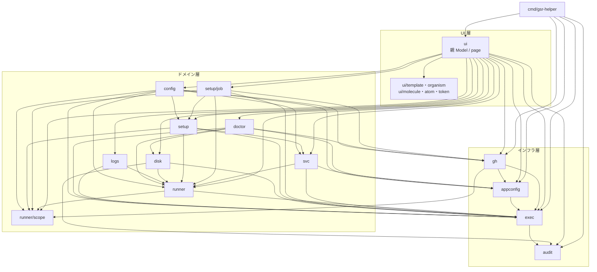

# コンポーネント設計

パッケージの分割・責務・依存関係を定める。全体構成は [アーキテクチャ設計](../architecture/overview.md)、内部モデルは [データモデル](../architecture/data-model.md) を参照。

## 依存関係



**UI 層の 2 ノードは粒度の要約である。** `UIApp` は親 Model（`internal/ui` 直下）と `ui/page` 以下に加えて、`ui/discovery` / `ui/startup` / `ui/workscan` / `ui/ghscope` / `ui/hostreq` / `ui/tabset` / `ui/chrome` / `ui/keymap` を畳んだものであり、`UIParts` は `ui/template` / `organism` / `molecule` / `atom` / `token` を束ねたものである。**畳んだパッケージがドメイン層を直に import する辺は、すべて `UIApp` 発の辺として上のグラフに描かれている**——`ui/tabset` → `runner` / `appconfig` / `exec`、`ui/workscan` → `disk` / `runner`、`ui/hostreq` → `doctor`、`ui/ghscope` → `gh` / `exec`、`ui/discovery` → `runner` / `exec` のいずれも辺がある。**Issue #148 で新設した `ui/startup` も 1 辺も増やしていない**——`startup.Input` が持つ `runner` / `appconfig` / `exec` はいずれも既存の `UIApp` 発の辺で描かれており、`doctor` への辺も `ui/hostreq` の側に既にある。**「その依存は無い」と読まれる辺の欠落は本書のグラフには無い。** **Issue #139 で `ui/discovery` / `ui/hostreq` が周期と 1 度きりの状態（`State`）を持つようになっても、この一覧は 1 辺も増えていない**——`discovery.Input` は間隔・走査ルート・深さ・`Executor` というプリミティブだけを持ち、設定ファイルとフラグの合成は親 Model が済ませて渡すため、`ui/discovery` → `appconfig` の辺は生じない。

**この一致は機械的に検査している。** `internal/buildconfig/docs_mermaid_test.go` が上のグラフをパースして辺と `subgraph` を読み取り（`dependencyMermaid` / `parseDepGraph`）、`docs_depgraph_test.go` が読み取った辺を `go list -json ./...` の直接 import（本番ファイルの import だけで、テストの import は含まない）と**両方向で**突き合わせる——実装にある層をまたぐ import に辺が無ければ落ち（その辺を生んでいる import を最大 3 件添える）、実装から消えた依存が辺として残っていても落ちる。畳んだノードの内訳（直前の段落の列挙）は `docs_depnodes_test.go` が `internal/ui` 直下の実装と突き合わせるので、パッケージを増やしたときに散文だけが古くなることは無い。**同種の辺の欠落が改訂 1.22 / 1.27 / 1.29 / 1.32 / 1.33 / 1.40 で 6 度再発したのが検査を置いた理由である**——人手の棚卸しでは次の Issue で再発する（Issue #151）。**ただし検査が及ぶのは畳んだ後の辺までである**——直前の段落が挙げているパッケージ単位の内訳（`ui/tabset` → `runner` / `appconfig` / `exec` など、その辺を実際に生んでいるのがどのパッケージか）はどの検査も見ていない。`ui/hostreq` に `logs` の import を足しても `UIApp --> Logs` の辺が既にあるので検査は 4 本とも緑になる。**内訳の粒度は人手で保つ必要がある。**

**ただし「どのノードへ畳むか」を検査が止める範囲は限られる。** ノード対応表（`graphNodeRules`）は最長プレフィックス一致なので、既存のどのプレフィックスにも当たらない新設パッケージ（新しい最上位のツリー）だけが、対応表へ足すまで `TestEveryPackageIsMappedToGraphNode` で落ちる。既存プレフィックス配下のサブパッケージは親ノードへ畳まれるが、**畳み込みが消すのは同一ノード内部の辺だけである**——サブパッケージが層をまたいで import すれば、その辺は**親ノード発の辺として上のグラフに要求され**、描いていなければ `TestDependencyGraphDrawsEveryCrossLayerImport` が落ちる。現に `Doctor --> Disk` を生んでいる唯一の import 元は `internal/doctor/hostres` で、`Config --> GH` は `internal/config/edit`、`Exec --> Audit` は `internal/exec/command` である——**いずれもサブパッケージが図に辺を足した実例であり、サブパッケージを足すときグラフを触らなくてよいとは限らない**（`runner/procs` が辺を増やしていないのは畳まれるからではなく、import が標準ライブラリだけだからである）。対応表へ規則を足す判断が要るのは、`RScope`（`runner/scope`）や `SetupJob`（`setup/job`）のように**独自ノードを与えたい**ときだけである。**例外は `internal/ui` 直下で**、ここに新設したパッケージは `TestCollapsedUINodesMatchDoc` が上の「畳んだノード」の段落の列挙との一致を要求するため落ちる（対応表ではなく散文の側で拾う）。

**本書が描かないのは UI パッケージ同士の依存である**——ただし粒度の要約である 2 ノードの間の 1 本（`UIApp --> UIParts`）だけは例外で、上のグラフに描いてある。`organism` → `keymap` のような UI 層の内部の辺は [TUI コンポーネント設計](../ui/atomic-design.md#依存の方向)の依存グラフが持つ——同じ辺を 2 か所で維持すると片方だけが古くなるため、本書は層と層の間だけを描く。**この除外が効くのは辺の欠落を見る向きだけである**——実装の import に辺を要求する `TestDependencyGraphDrawsEveryCrossLayerImport` は UI 層のノードをグラフの `subgraph UI` から読み取り、両端が UI 層の辺を対象外にする（検査側にノード名をベタ書きすると、図と検査で同じ一覧を 2 か所で維持することになる）。対になる `TestDependencyGraphHasNoStaleEdge` は除外せず**描いてある辺をすべて**実装の import で裏取りするので、`UIApp --> UIParts` も実装から import が消えれば落ちる。

**UI 層が `setup` と `gh` を直に参照するのは値の型のためである。** 実行前プレビュー（FR-16）は `setup.Plan` をそのまま描くので `ui/page` 以下が `setup` を import し（本番ファイル 7 本）、短命トークンの預け先 `gh.Secrets` は起動時に `cmd` が 1 つ作って UI へ配るため `cmd` と `ui` の双方が `gh` を import する。**実行そのものを呼ぶのは `setup/job` だけである**——UI は `setup.Apply` を直接叩かない。

### 依存の規則

| 規則 | 理由 |
|------|------|
| ドメイン層は `ui` に依存しない | TUI なしでテストできるようにする |
| ドメイン層は bubbletea に依存しない | 同上。UI 層が `tea.Cmd` でラップする |
| ドメイン層は `os/exec` を直接使わない | 監査ログとタイムアウトの適用漏れを防ぐ（`exec` 経由に限定） |
| `runner` は他のドメインパッケージに依存しない | 最下層のモデルとして全体から参照されるため |
| `exec` はドメインを知らない | 汎用のプロセス実行に留める |
| ドメイン層を呼ぶのは `ui/page` のみ | 副作用の発生点を UI の 1 階層に閉じる。詳細は [TUI コンポーネント設計](../ui/atomic-design.md#依存の規則) |
| 循環依存を作らない | — |

## パッケージ責務

### `cmd/gsr-helper`

エントリポイント。フラグ解析、設定の読み込み、監査ログのオープン、能力判定、色を使うかの判定、`tea.Program` の起動を行う。ロジックを持たない。

**秘密情報の提供元（`gh.Secrets`）と、トークン有無の判定手段（`gh.HasToken`）を組み立てるのもここである。** どちらも `internal/gh` の実装を、それを知らない側（`internal/exec/command` と `internal/appconfig/hostcaps`）へ渡す配線であり、依存の向きを増やさずに実装を 1 つに保つための一手である。`gh.Secrets` は `command.New` の値一致マスク（段 2）の提供元と、Setup タブが取得した短命トークンの預け先を兼ねる**同じ 1 つの実体**で、預けた値がそのまま監査ログとエラー文言のマスクに効く（[セキュリティ設計](../architecture/security.md#監査ログでのマスク)）。

代替スクリーンへの切り替えは親 Model が宣言し、panic からの端末復元は bubbletea が行う。`cmd` は `tea.NewProgram(app).Run()` を呼ぶだけで、どちらも自分では扱わない（扱う箇所を 2 つ持つと、片方だけが効いた状態を追えなくなる）。

色を使うかは `NO_COLOR` / `--no-color` / 非 TTY から**ここで 1 つの値に決めて**親 Model に渡す。判定箇所を分散させない。背景の明暗は起動後に端末へ問い合わせるため、親 Model が受け持つ（[アーキテクチャ設計](../architecture/overview.md#起動シーケンスと能力判定)）。

| フラグ | 意味 |
|-------|------|
| `--root <path>` | 追加の走査ルート（複数指定可）。`scan_roots` と同じ検査を通す（絶対パスで `..` を含まない） |
| `--config <path>` | 設定ファイルのパスを指定 |
| `--refresh <秒>` | 自動更新間隔の上書き。`refresh_interval` と同じ有効範囲（1〜3600 秒） |
| `--no-color` | 色を使わない（`NO_COLOR` も尊重） |
| `--version` | バージョン表示 |
| `-h` / `--help` | 使い方を標準出力へ出して終了（終了コード 0） |

#### 終了コード

| コード | 意味 |
|-------|------|
| 0 | 正常終了。`--version` / `--help` もこれ |
| 1 | 起動または実行の失敗（設定の読み込み失敗、`tea.Program` の失敗など） |
| 2 | 引数の誤り。メッセージと使い方を**標準エラー出力**へ出す |
| 3 | panic からの復帰 |

`--version` / `--help` は標準出力、引数の誤りは標準エラー出力に出す。パイプで受けたときに正常な出力とエラーが混ざらないようにするためである。

#### 監査ログを開けない場合の縮退

監査ログを開けなくても**起動は続ける**。ホスト内の状態を読むだけの一覧表示が、ログの出力先の権限で使えなくなることを避けるためである。

| 状況 | 挙動 |
|------|------|
| `audit_log` を開けない・検証に落ちた | 記録しない書き込み先（`audit.Discard()`）に差し替え、`警告: 監査ログを開けませんでした（記録せずに続行します）: <原因>` を標準エラー出力へ 1 行出す。代替スクリーンへ入る前に出すため、終了後の画面に残る |
| 実行中の記録の書き込みに失敗した | 実行そのものは成功として扱い、失敗を集計する。TUI の終了後に `警告: 監査ログの記録に N 件失敗しました（最初の失敗: <原因>）` を標準エラー出力へ出す |
| 終了時に監査ログを閉じられなかった | TUI の終了後に `警告: 監査ログのクローズに失敗しました: <原因>` を標準エラー出力へ出す。**捨てない。** 開けなかった場合と記録に失敗した場合は警告が出るのに閉じ損ないだけが見えないと、書けなかったレコードの存在に気付けない |

**縮退した場合は「外部コマンドと、それに準ずる破壊的操作の監査ログ記録」（[セキュリティ設計](../architecture/security.md#監査ログ)）が効いていない。** 外部コマンドの記録だけでなく、`internal/disk` のファイル削除の記録も残らない。記録が要件である運用では、この警告を起動の失敗として扱う運用手順を用意すること。TUI の実行中に標準エラー出力へ書かないのは、描画が壊れて画面が読めなくなるためである。

### `internal/runner`

runner の検出とモデル定義。**最下層**であり、他のドメインパッケージに依存しない。

| 要素 | 責務 |
|------|------|
| `Runner` / `Config` / `Process` / `SvcState` / `Result` | モデル定義 |
| `Discover(ctx, Options) Result` | 3 経路から収集してマージする**唯一の入口**。`Options.Exec` が `nil` のとき systemd を参照せず、**警告も返さない**（systemctl 不在時の縮退。3 秒ごとのポーリングで同じ警告が積み上がらないようにするため。可否は起動時の `Caps` としてヘッダに出る） |
| `IsRunnerDir` / `LoadConfig` | runner ディレクトリの判定と `.runner` の読み取り |
| `DefaultRoots()` | 既定の走査ルート（10 個の glob パターン）を展開して返す。全量は [FR-01](../requirements/functional.md#既定の走査ルートfr-01) |
| `scanRoots`（非公開） | 実際に掘るルートを決める。`Options.SkipDefaultRoots` が偽なら `DefaultRoots()` に `Options.Roots` を足し、真なら `Options.Roots` だけを返す |
| `findRunnerDirs`（非公開） | ルート配下の探索。`.runner` を見つけた時点で**その配下は掘らず**そのディレクトリを返し、降りる途中で名前が `_work` / `_diag` のディレクトリは辿らない |
| `attach`（非公開） | 正規化済み入力を受け取る**純粋関数**。プロセス・ユニットの紐付け、孤児ユニットの抽出、`Runner.Managed` の決定、警告の生成 |
| `resolveRunAsUser`（非公開） | runner の実行ユーザーの決定。`SvcState.User` を第一、`Listener` の UID を第二の情報源とする（UID → 名前の解決関数を引数で受ける純粋関数） |

`attach` は紐付け以外に次も決める。**表示の決定性を保つために必要な処理をここに集めている。**

- `Runner.Managed` の 4 値。判定に「ユニット一覧が取れたか」を引数で受け取る（[FR-03](../requirements/functional.md#起動方式の-4-状態fr-03)）。取れていない場合に「ユニットが無い」と読み替えない
- `Workers` を PID 順に並べる。`/proc` の走査順に依存すると、同じ状態でも表示が入れ替わる
- 同じ runner に複数の `Listener` が見つかった場合は `Started` の新しいものを採る（古い残骸プロセスを稼働中として出さない）
- ユニット照合は `UnitName` を第一パス、`WorkingDirectory` を第二パスの 2 段で行う。1 パスで回すと、あるユニットの `WorkingDirectory` 一致が別のユニットの `UnitName` 一致を上書きしうる

#### 走査ルートの合成（`--root` / `scan_roots` / `SkipDefaultRoots`）

走査ルートは 3 つの入口から決まる。合成の順序と既定値を次に定める。

| 入口 | 与えるもの | 既定 |
|------|-----------|------|
| `DefaultRoots()` | [FR-01](../requirements/functional.md#既定の走査ルートfr-01) の 10 個の glob を展開したもの | **使う**（`Options.SkipDefaultRoots` が偽） |
| 設定ファイルの `scan_roots` | 追加の走査ルート | 空 |
| `--root <path>`（複数指定可） | 追加の走査ルート | 空 |

`internal/ui` は走査を始めるたびに `scan_roots` の後ろに `--root` を並べて `runner.Options.Roots` に渡し（`discover.go` の `scanRoots()`）、`internal/runner` はその前に `DefaultRoots()` を置く。したがって最終的な走査順は **既定ルート → `scan_roots` → `--root`** である。

**合成は走査のたびにやり直す（Issue #132）。** `cmd/gsr-helper` が起動時に 1 度だけ合成していた頃は、Config タブで `scan_roots` を編集して保存しても、設定ファイルには書けているのに走査の入力は再起動まで古いままだった。`cmd` が `ui.Options.Roots` へ渡すのは `--root` の値だけであり、設定ファイル側の値は親 Model が持つ設定（`a.cfg.ScanRoots`。保存のたびに `page.ConfigSavedMsg` で差し替わる）から毎回引く。**`--root` は保存後も効き続ける**——明示的に渡したルートを設定の保存で消すと、起動コマンドを変えていないのに走査対象が減る。

**`--root` は `scan_roots` と同じ検査を通し（`appconfig.CleanScanRoot`）、重複除去も入口をまたいで行う（`appconfig.MergeScanRoots`）。** 検査を入口ごとに分けると、安全上の根拠がある絶対パス・`..` の検査が `--root` だけ効かない状態になる。重複除去を入口ごとに分けると、`scan_roots` と `--root` に同じルートを書いたときに同じディレクトリを 2 度走査する。同じ runner が 2 度一覧に出ることは `collectDirs` が実パスで畳むため起きないが、走査そのものは 2 度走る。

**`--root` は「既定ルートの置き換え」ではなく「追加」である。** 既定を置き換える指定にすると、`--root` を 1 つ足しただけで既定の設置場所にある runner が一覧から消える。runner を見落とす側に倒れる既定は取らない。

`Options.SkipDefaultRoots` は**既定ルートを使わない**ことを呼び出し側が明示するための指定で、既定は偽（使う）である。テストのように走査対象を完全に固定したい呼び出しのために用意してあり、`cmd/gsr-helper` からは設定できない（利用者向けのフラグ・設定項目は持たない）。真にしても [FR-02](../requirements/functional.md#検出一覧fr-01fr-05) の補完（稼働プロセスと systemd ユニット由来のディレクトリ回収）は止まらない。走査ルートは「どこを掘るか」の指定であって、検出全体の範囲ではないためである。

`resolveRunAsUser` が `SvcState.User` を採るのは**ユニットの実体がある場合に限る**（`Load` が空でも `not-found` でもない）。`systemctl show` に失敗したプレースホルダと `svc.sh uninstall` 後の残骸ユニットは `User=` が空であり、そのまま採ると全 runner が root と表示される。名前が解決できないときは UID の 10 進表記になる（[データモデル](../architecture/data-model.md#runasuser-の決定と-uid-フォールバック)）。

パースと判定は I/O から分離し、`parseConfig` / `parseListUnits` / `parseShow` / `attach` を個別にテストする。

`Discover` の systemd 参照の所要時間は「1 コマンドのタイムアウト（既定 30 秒）× ceil(ユニット数 / 8)」まで伸びるため、呼び出し側は deadline 付きの `ctx` を渡す。`systemctl show` の同時実行数は 8 である。`ctx` のキャンセル後は残りの `systemctl show` を発行しない。

**`systemctl list-units` 自体が失敗した場合は状態を 1 件も返さない。** ユニットの一覧が無ければどのユニットを `show` すべきかも分からないためである。この場合の警告は `systemd.ErrListUnits` を包んだ 1 件だけで、呼び出し側は `errors.Is` で「ユニットが 0 件」と「一覧が取れていない」を区別する。区別しないと起動方式を誤判定する（[FR-03](../requirements/functional.md#起動方式の-4-状態fr-03)）。**これが検出処理で最も影響範囲の広い縮退である。**

**次の 2 種のユニットは孤児として扱わない。** どちらも「対応する runner ディレクトリが無い」わけではないため、孤児区画（[FR-05](../requirements/functional.md#孤児ユニットに含めないものfr-05)）に出さず `Result.Warnings` に集約する。

- `systemctl show` に失敗したユニット。状態が取れないと `WorkingDirectory` が空になるため、`.service` ファイルを持たない runner のユニットが「対応ディレクトリなし」と誤判定される。警告は systemd の参照が既に返しているので二重に報告しない
- `LoadState=not-found` のユニット。`svc.sh uninstall` 後に参照だけが残っている状態で、runner ディレクトリは存在する。**runner への紐付けも行わない**（存在しないユニットに対してサービス制御を提示しないため。`resolveRunAsUser` も同じ理由で `not-found` を除いている）

紐付けを行わないユニットと、既に別のユニットが紐付いた runner ディレクトリを指す 2 本目のユニットは、黙って落とさず警告として出す。文言は [データモデルの `Result` の警告](../architecture/data-model.md#result-の警告) に定める。

### `internal/runner/procs`・`internal/runner/systemd`

`internal/runner` の収集経路のうち、`/proc` の走査（`procs`）と systemd の参照（`systemd`）を行数上限のために切り出したもの。**`internal/runner` から一方向に import し、逆向きの参照は作らない。** `Process` / `ProcKind` / `SvcState` は `internal/runner` の別名として再公開してあるため、呼び出し側は分割を意識しなくてよい。**下位パッケージの `Scan` は再公開しない。** 個別の経路を外から呼ぶと 3 経路の突き合わせ（`Discover`）を通らない結果が生まれ、`systemd.ErrListUnits` の解釈のような `Discover` 内の判断を呼び出し側が再実装することになるためである（同じ理由で `ErrListUnits` も再公開しない）。

| パッケージ | 主な要素 |
|-----------|---------|
| `runner/procs` | `Process` / `Kind` / `Scan`。`/proc/<pid>/exe` の末尾に付く ` (deleted)` を照合の前に落とす（runner の自動更新でバイナリが差し替わっても稼働中の runner を見落とさない）。`Process.Exe` には印を残した生の値を保つ |
| `runner/systemd` | `State` / `Scan` / `ErrListUnits`。`list-units` と並列の `show`、`WorkingDirectory` の先頭 `-` の除去 |

### `internal/runner/scope`

`.runner` の `gitHubUrl` からスコープ（repo / org / enterprise）を判定する。**純粋な文字列処理のみ**で、ホスト走査・`/proc`・systemd に依存しない。

| 要素 | 責務 |
|------|------|
| `Scope` / `Kind` | スコープのモデル定義（`Runner.Scope` の型） |
| `Parse(gitHubUrl) (Scope, error)` | スコープ判定。ホストを含まない URL・`orgs` / `enterprises` の単独指定は誤りとして拒否する |

`internal/runner` の下位に置くのは 2 つの理由による。`Scope` は GitHub API のパス生成にも使うため（[データモデル](../architecture/data-model.md#scope)）、`internal/gh` が `internal/runner` 全体を import せずにスコープだけを参照できる。また `internal/runner` の行数上限（1 ディレクトリ 2000 行）に対する余裕を確保する。

行数チェック（`linterly`）の集計は直下のファイルのみを対象とする。現在の使用量は `internal/runner` 1704 / `runner/systemd` 552 / `runner/procs` 426 / `runner/scope` 165 行である。**`internal/runner` は残り 296 行しか無い。** サービス制御や追加・削除の Issue が `runner` へ機能を足す場合は、先に切り出し先を決めること。

`Parse` は判定できない入力を必ず error にする。**Unknown を error 無しで返すことはない**（[データモデル](../architecture/data-model.md#scope)）。

### `internal/svc`

サービス制御とドレイン停止。外部プロセスは `exec.Executor` 経由でのみ起動する。

| 要素 | 責務 |
|------|------|
| `Op` | サービス制御操作の識別子（`OpStart` / `OpStop` / `OpKill` / `OpDrain` / `OpRestart` / `OpEnable`） |
| `Start` / `Stop` / `Restart` / `Enable` / `Disable` | `systemctl <verb> <unit>` の呼び出し。ユニット名が空なら実行せず `ErrNoUnit` を返す |
| `Kill(ctx, Executor, Runner)` | **強制停止**。`Runner.Listener` と `Runner.Worker` の PID へ `kill -KILL` を 1 回発行し、ユニット名があれば続けて `systemctl stop` を発行する。systemd 管理でなくても動く。**PID もユニット名も無ければ 1 本も発行せず `ErrNoKillTarget` を返す** |
| `DaemonReload` | drop-in 変更の反映 |
| `Drain(ctx, Executor, Runner, progress)` / `Drainer` | `Runner.Worker` の消滅を待ってから停止。無制限に待ち、`ctx` のキャンセルで中断（このとき停止処理は行わない）。**ユニット名が無ければ待機に入らず `ErrNoUnit` を返す**（待ち切った先の `systemctl stop` が必ず失敗すると分かっているため）。`Drainer` は走査手段・間隔・時刻を差し替えられる |
| `CommandLine(Op, Runner) []string` | 操作が発行するコマンドを実行順に返す。確認ダイアログの「実行するコマンド全文」がこれを読む |
| `Enabled(Runner) bool` | ユニットが enable 済みかを返す。`OpEnable` が enable / disable のどちらへ倒れるかの判定を 1 箇所に置く |
| `CanControl(Op, Runner, Caps) (bool, string)` | 操作可否と不可の理由を返す。非 root・systemd 不在・`run.sh` 直起動・管理状態の判定不能を、この順に判定する。後ろ 2 段は同じ 5 操作（強制停止以外）を塞ぎ、理由の文言だけが違う |
| `ReasonRoot` / `ReasonSystemd` / `ReasonStandalone` / `ReasonManagedUnknown` / `ReasonNoCommand` | 不可の理由の文言。表示側が同じ文言を持たないよう公開する |

`CanControl` が `Op` を取るのは、[無効な操作の表示](../ui/screens.md#無効な操作の表示) の判定表が操作ごとに塞ぐ範囲を変えるためである（root が要るのは開始・停止・強制停止・再起動の 4 つで、ドレイン停止と enable の切替は要らない）。`CanControl` を 1 箇所に集約し、UI 側で操作可否の判断を再実装しない。

**`run.sh` 直起動（3 段目）と管理状態の判定不能（4 段目）は同じ 5 つ（開始・停止・ドレイン停止・再起動・enable の切替）を塞ぎ、違うのは理由の文言だけである。** どちらも「`systemctl` を安全に駆動できない」点で同じ状況で、理由が「systemd 管理外だと判明している」のか「そもそも判定できない」のかだけが違う。どちらの段でも通すのは強制停止だけで、worker のプロセスへ直接シグナルを送る操作は `systemctl` の可否に依らないためである。**ドレイン停止を塞ぐ**のは、待機そのものは `/proc` の走査だけでも Worker が消えたあとに発行するのは停止とまったく同じ `systemctl stop` だからで、停止が塞がれた runner に対しドレイン停止だけが確認も猶予も無く同じコマンドを発行することになる（Worker が 0 件なら `Drainer.Drain` は初回走査で即停止へ抜ける。`run.sh` 直起動ではそもそも待機に入る前に `ErrNoUnit` を返す）。**enable の切替を塞ぐ**のは、`systemctl enable` / `disable` が [FR-09](../requirements/functional.md) の言う systemd 操作そのもので、管理状態が判定できないときに塞ぐ以上、管理外と判明しているときに通す理由が無いためである。

**`ReasonNoCommand` は `CanControl` が返す理由ではない。** `CanControl` の 4 段が見るのは起動方式と能力だけで、対象そのものの有無は見ない。可否を通っても `CommandLine` が空になる runner（未稼働かつサービス未インストールで、PID もユニット名も無い）は残るため、UI 側（`ui/page/runnerop`）が**確認ダイアログを開く前に**この理由で対象から外す。文言だけを `svc` に置くのは、理由の出どころを 1 箇所に保つためである。

**確認ダイアログに出すコマンド全文は `CommandLine` から引く。** 表示側で `"systemctl " + verb + " " + unit` を組み直すと、承認した文面と実際に発行される内容が食い違いうる。「実行コマンド全文の提示と `y/N`」（[画面仕様の操作フロー](../requirements/functional.md)）は、提示と実行が同じ 1 箇所から出ていて初めて意味を持つ。

**`Kill` は `systemctl kill` を使わない。** 対象を main プロセス以外へ広げるフラグの綴りが systemd のバージョンで変わり（`--kill-who` / `--kill-whom`）、既定のままでは main プロセスしか落とせずに worker が生き残るためである。プロセスを落とした後に `systemctl stop` まで打つのは、シグナルだけでは systemd 側が「停止した」と記録せず `Restart=` 付きのユニットが戻ってくるためである。`kill` が失敗しても `stop` は試み、両方の結果を `errors.Join` でまとめる。**どちらの段も対象を持たない場合は 1 本も発行せず `ErrNoKillTarget` を返す。** 発行が 0 本のまま `errors.Join(nil...)` を返すと nil になり、何もしていない実行が「成功」として報告されて、止まっていない runner を止まったものとして扱わせてしまう。

### `internal/setup`

runner の追加・削除・バージョン更新。最も破壊的な操作を担う。

| 要素 | 責務 |
|------|------|
| `Kind` | 計画の種類（`KindAdd` / `KindRemove` / `KindUpdate`）。`String()` が確認ダイアログの見出しに出る表示名（`追加` / `削除` / `バージョン更新`）を返す |
| `Plan` / `Unit` / `Step` | 確定した計画。`Plan` は台ごとの `Unit`、`Unit` は実行順の `Step` を持つ。`Step.Kind` は `StepCommand` / `StepMkdir` / `StepExtract` / `StepDrain` の 4 種 |
| `PlanAdd(AddSpec) (Plan, error)` | 追加の計画を立てる。作成するディレクトリと実行コマンドを**確定させてから**返す。検証に落ちた時点でエラーにし、途中まで作った計画は返さない |
| `PlanRemove(RemoveSpec)` / `PlanUpdate(UpdateSpec)` | 削除・更新の計画。削除は `svc.sh stop` → `svc.sh uninstall` → `config.sh remove --token` の順（FR-17。ユニットが無い runner には `svc.sh` の 2 手順を入れない）、更新は「ドレイン停止 → 展開 → 起動」の順（FR-22） |
| `Apply(ctx, ApplyInput) (Result, error)` | 計画を順に実行。失敗した時点で中止し、成功分と失敗理由を `Result` に載せて返す（FR-15）。`error` は `Result.Err` と同じもの |
| `Progress` / `Result` / `StepError` | 1 手順ごとの進捗、実行結果（成功した台 / 失敗した台とフェーズ / 着手しなかった台）、どの台のどのフェーズで失敗したかを保つエラー |
| `NextIndex(existing []string, prefix string) int` / `RunnerName` / `Names` | 命名の連番決定（**純粋関数**。ホストの状態を一切読まない） |

**計画（Plan）と実行（Apply）を分離する。** これにより実行前プレビュー（FR-16）が計画をそのまま表示するだけで実現でき、表示と実行の食い違いが起きない。

**短命トークンは計画に載せない。** `Step.TokenIndex` が「`Args` のどこにトークンが入るか」だけを持ち、`Args` にはマスクのプレースホルダ（`mask.Placeholder`）が入ったままである。実際の値は `Apply` が `Args` の複製に対して実行の直前に差し込む。プレビューが参照するのは常にプレースホルダのままの `Args` なので、**承認画面にトークンが載る経路が構造として存在しない**（[セキュリティ設計](../architecture/security.md#保持と出力)）。

**短命トークンの渡し方は 2 系統ある。** `ApplyInput.Token` は全台で共通の 1 本（追加はスコープが 1 つなので使い回せる。FR-14）、`ApplyInput.TokenFor` は台ごとに引く関数で、設定されていればこちらが優先する。削除の対象は複数のスコープにまたがりうるうえ remove token はスコープごとに発行されるため、1 本を使い回すと別スコープの台で必ず失敗する。

**トークンの取得と tarball の手配はこのパッケージに入れない。** `internal/setup` が知るのは計画とその実行だけで、GitHub API もネットワークも触らない（`internal/gh` を import しない）。外部資源を揃える側は `internal/setup/job` である。

#### 分割したパッケージ

1 ディレクトリ 2000 行（テスト込み）の上限に対する分散と、責務の切り分けを兼ねる。依存は **`setup/job` → `setup` → `setup/tarball` / `setup/valid`** の一方向で、逆向きは無い。**`setup/job` は `setup/tarball` も直に import する**（取得情報を `tarball.Info` に詰めて `tarball.Fetch` を呼ぶのが `setup/job` の役目のため）。`setup` を経由しなければならない決まりではなく、下位のパッケージを飛び越して参照してよい。

| パッケージ | 置くもの |
|-----------|---------|
| `setup` | `Plan` / `Unit` / `Step` / `PlanAdd` / `PlanRemove` / `PlanUpdate` / `Apply` / `NextIndex` |
| `setup/valid` | 入力検証（`Name` / `Labels` / `Dir` / `URL` / `Count`）とその理由の文言。**外部コマンドを一切起動しない純粋な判定**であり、[セキュリティ設計の「入力を検証してから渡す」](../architecture/security.md#外部コマンド実行の安全性) の表を実装する |
| `setup/setuptest` | `internal/setup` のテストが共用するフィクスチャ（`AddSpec` / `Runner` / `Phases` / `FindExtract` / `MakeTarball` / `Issued` / `AddPlanIn`）。`_test.go` ではなく通常のパッケージなのは 1 ディレクトリ 2000 行の上限に収めるためで（Issue #103）、**テスト専用で本番からは import しない**（`page/pagetest/import_test.go` の `fixtures` へ登録済み。`TestNoProductionCodeImportsTestFixtures` が検査する）。先例は `ui/organism/table/tabletest` |
| `setup/tarball` | tarball の取得（`Fetch`）・検証（`Verify`）・展開（`Extract`）・上書きしない名前（`PreservedNames`。FR-21）。**内部パッケージを 1 つも import しない**（`net/http` と `os` だけで完結する） |
| `setup/job` | 短命トークンの取得と tarball の手配を済ませて `setup.Apply` を呼ぶ（`Deps` / `Input` / `Run` / `LatestVersion`）。`internal/gh` を import する唯一のドメイン側 |

**`setup/job` を UI 層から分けたのは、この一連が bubbletea を知らない普通の関数として書けるためである。** TUI なしでテストでき、UI 層に残るのは「進捗を画面へ流す」ことだけになる。`Run` を呼ぶのは承認のあとだけである——承認前に呼ぶと、キャンセルした場合にも有効な短命トークンを発行してしまう。

`setup/job` は短命トークンをスコープと操作の組でキャッシュし、期限内なら使い回す（FR-14）。取得したトークンは `gh.Secrets` へ預け、実行を終えたら忘れる。預けている間だけ監査ログとエラー文言の値一致マスクが効く（[セキュリティ設計](../architecture/security.md#監査ログでのマスク)）。tarball も 1 回だけ取得して各ディレクトリへ展開に使い、終わったら消す（FR-13）。

**`setup/tarball` は展開の前に SHA-256 を必ず検証する。** 検証に失敗した場合は展開せず、取得したファイルを消してエラーを返す。root 権限で動くため展開は tar の中身を信用せず、`os.OpenRoot` で展開先を根に固定したうえで絶対パス・`..` を含むエントリ・展開先の外を指すリンク・**保持対象（`PreservedNames`）へリンクで潜り込むエントリ**を拒否し、1 エントリ 1 GiB / 合計 2 GiB の上限も置く（展開量で埋め尽くされないため）。最後の 1 つ（`ErrPreservedLink`、`keeplink.go`）が FR-21 の保持を守る検査である。`os.OpenRoot` は展開先の**外**への逸脱しか防がないため、`link -> .runner` の直後に `link/pwned` を並べる tar は、名前だけを見る保持判定をすり抜けて `.runner` の中へ書き込める。この展開で作ったリンクの向き先を覚え、**見かけの名前ではなく実際に書き込まれる場所**で保持判定を行う。 展開そのものは展開先の中の一時ディレクトリ（`.gsr-stage-<乱数>`）で行い、済んでから `rename` で最終位置へ移す（`stage.go`）——更新中に強制終了されても中途半端なファイルを残さないためである。移動は 1 件ずつなので新旧の混在までは防げない。詳細は[セキュリティ設計](../architecture/security.md#ネットワーク)。

### `internal/disk`

使用量の集計とクリーンアップ。

| 要素 | 責務 |
|------|------|
| `Scan(ctx, Runner, out chan<- Usage)` | 対象ごとに非同期集計し、判明順に送出。Disk タブの内訳 |
| `WorkUsage(ctx, Runner) (int64, error)` | runner 1 台の `_work` **合計**だけを返す（Runners タブの `_WORK` 列と runner 詳細）。内訳を要さないぶんチャネルも goroutine も持たない。`_work` が無い runner は 0 とエラー無し、**それ以外の理由で読めない場合はエラー**（0 を返すと未集計が「0 バイト」という確定値として一覧に出る） |
| `FSStats(path)` | 容量と inode の残量 |
| `DockerUsage(ctx, ex)` | `docker system df --format {{json .}}` の解析 |
| `PlanClean(targets) (CleanPlan, error)` | 削除計画。対象パスと解放見込み容量を確定させる（ドライラン）。保護された対象（`Target.Protected` が空でない）を 1 件でも含めば計画を作らない |
| `PruneReclaimable(items) int64` | `docker system prune -f` が実際に回収する見込みの容量（Containers / Build Cache のみ） |
| `pathguard.Validate(base, target) error` | **削除パスの検証**（`internal/disk/pathguard`）。基準ディレクトリ配下であること、`..` を含まないこと、許可サブツリー内であることを判定 |
| `Apply(ctx, ex, lg, CleanPlan, progress)` | 削除の実行。シンボリックリンクは辿らず、リンク自体のみを削除 |
| `DockerLabel` | docker の削除の進捗（`Progress.Label`）に出る表示名。**公開しているのは表示側が名前で行を突き合わせるためである**（`page/disk/cleanview.Mark`）。写しを持つと、こちらを変えた瞬間に docker の行だけ永久に未着手で残り報告の件数もずれる。コンパイルもテストも通ってしまうので、名前の一致は型で保証する |

`DockerUsage` と `Apply` が `exec.Executor` を取るのは、外部プロセス実行の唯一の経路が `internal/exec` だからである（上記「依存の規則」）。`docker system prune -f` は `exec.Options.Action` に `disk.clean` を設定して発行し、破壊的操作として監査ログに全件記録される（[セキュリティ設計](../architecture/security.md#監査ログ)）。

`Apply` が取る `lg *audit.Logger` は、ファイル削除（`removeTree`）を監査ログへ記録するための入口である（下記「ファイル削除の監査ログ」、[`internal/audit`](#internalaudit)）。`internal/disk` がこれを持つのはドメイン層で唯一の例外で、他のドメイン実装は `audit.Logger` を直接呼ばない。

**シンボリックリンクの扱いは「読む」と「消す」で分ける。** `WorkUsage` は `_work` 自体がリンクでも`filepath.EvalSymlinks` で辿る——`_work` を別ボリュームへ寄せた構成があり、辿らないと `filepath.WalkDir` がroot を `Lstat` で見てリンク 1 件ぶんを数え、**集計できていないのに 0 バイトという確定値**を一覧に出すためである（未集計は `-` に縮退させるのが本来の扱い）。`Scan` は集計対象が `_work` の**子**なのでリンクは経路の途中にあり、明示的に辿らなくても同じ実サイズが得られる（走査の root がリンクになるのは `WorkUsage` だけ）。一方 `Apply` の削除は辿らない。リンク先の実体を消さないための約束であり（[セキュリティ設計](../architecture/security.md#1-削除パスの検証を必須にする)）、読むだけの集計とは要件が違う。

**`internal/disk` は一度警告帯（2000 行超）に入り、Issue #101 で戻した。** 2181 行（エラー境界の 2200 まで 19 行）まで詰まっていたものを、削除パスの検証を `internal/disk/pathguard` へ切り出して 1927 行・残り 73 行・pass にした。**その後の回帰テストの追加で現在は 1980 行・残り 20 行である**（Issue #123）。判断と理由は `docs/ui/atomic-design.md` の「UI 層の外のディレクトリ」に記録した（同書の「行数の予算」と同じ規範を `internal/` 側にも適用する）。実測値の一次情報は同書の表であり、本書はここを重複して持たない。

#### 分割したパッケージ

| パッケージ | 置くもの |
|-----------|---------|
| `disk/pathguard` | 削除してよいパスかの検証（`Validate` / `WorkDir` / `DiagDir`）。依存は **`disk` → `disk/pathguard`** の一方向で、こちらは `disk` の型（`Target` / `CleanPlan`）を一切知らない。判定に要るのは基準ディレクトリと対象パスの 2 つだけなので、「計画に載っているから通す」ような迂回を書けない |

**`Scan` の `out` は閉じない。** 呼び出し側が runner ごとの `Scan` を 1 本のチャネルへ集約するため、閉じる責務は集約する側にある。`Scan` は全対象を送り終えてから返るので、呼び出し側は `WaitGroup` で待ってから閉じられる。

集計と削除の対象は runner ディレクトリ直下の `_work` / `_diag` に固定する。`scan.go` の `workDirName` / `diagDirName` は `pathguard.WorkDir` / `pathguard.DiagDir` **そのものを参照する**ので、集計に出た対象が計画の段階で弾かれる食い違いは構造として起きない（リテラルの写しは Issue #101 で消した）。

`pathguard.Validate` は `PlanClean` と `Apply` の**両方**から呼ばれる構造にし、検証を通らないパスを削除できないようにする。`Apply` が削除直前にもう一度呼ぶのは、計画を組み立てずに `Apply` を呼ぶ経路が将来できても検証を迂回できないようにするためである。異常系のテストを必須とする（[セキュリティ設計](../architecture/security.md#1-削除パスの検証を必須にする)）。

**ジョブ実行中の保護（[FR-31](../requirements/functional.md)）も同じ形で二重にする。** `Scan` が判定した理由は `Usage.Reason` から `Target.Protected` へ引き継ぎ、`PlanClean` と `Apply` の両方が空でない `Protected` を拒否する。可否を UI（選択できない行）にだけ持たせると、`Target` を直接組む呼び出しが 1 つ増えた時点で保護が外れる（[セキュリティ設計](../architecture/security.md#3-ジョブ実行中の操作をガードする)）。

**`docker system prune -f` の解放見込みは内訳の合計ではない。** 発行するのはこの 1 本だけで、`--volumes` が無いためボリュームは消えず、`-a` が無いため dangling 以外の未使用イメージも残る。したがって解放見込みには `PruneReclaimable` が返す種別（Containers / Build Cache）だけを載せ、イメージとボリュームの `Reclaimable` は内訳の表示（[FR-27](../requirements/functional.md)）に留める。

**ファイル削除も監査ログに残る（Issue #71）。** ファイルの再帰削除（`removeTree`）は外部コマンドを起動しないため `Executor` を通らないが、`Apply` が呼ぶ `removeTarget`（1 対象の削除ごとに必ず通る 1 箇所）が `lg.Report` で記録する。`action` は docker と同じ `disk.clean`、`command` には実行したコマンドが無いため `["(削除)", <削除したパス>]` を載せる（`rm` のような実在するコマンド名にしないのは、実行していないコマンドを起動したと誤読させないため。[セキュリティ設計](../architecture/security.md#監査ログ)）。保護・検証で中止した対象も `exit_code: 1` と `error` 付きで記録し、「削除しなかった」事実を後から追えるようにする。この階層が発行する docker の 2 コマンドも**どちらも記録される**。`docker system df`（`Action: disk.df`）と `docker system prune -f`（`Action: disk.clean`）のいずれも `SkipAudit` を付けない。記録対象外にするのは、再検出（`internal/runner/systemd` の `Scan`）が発行する `systemctl list-units` / `systemctl show` と、ログ追従（`internal/logs` の `Journal`）が発行する `journalctl -u <unit> -n <N> --no-pager` の **2 種だけ**である（規則と根拠は[セキュリティ設計](../architecture/security.md#記録対象外とする読み取りコマンド)、発行するコマンドの形は[外部インターフェース](../api/external-interfaces.md#systemd)）。

### `internal/logs`

ログの一覧・追従と、Worker ログ本文の解析。

| 要素 | 責務 |
|------|------|
| `List(Runner) ([]File, error)` | `_diag` 配下の `Runner_*.log` / `Worker_*.log` を更新時刻の降順で列挙（サイズ・更新時刻付き） |
| `LatestWorker(Runner) (File, bool)` | 直近ジョブの Worker ログを特定（`l` の宛先） |
| `Tail(ctx, path, out chan<- Line) error` | `fsnotify` による追記の検知と送出 |
| `Journal(ctx, Executor, unit, out chan<- Line) error` | systemd ユニットのログを一定間隔で取得し、増えた分を送出 |
| `Classify(text) Level` | 行の重大度（`ERROR` / `WARN`）の判定。強調表示（FR-25）の入力 |
| `ParseWorker(dir, name) (JobInfo, error)` | Worker ログからジョブのリポジトリ名と作業ディレクトリを取り出す（Jobs タブの `REPOSITORY` / `_work`） |
| `WorkspaceFallback(workDir, repository) string` | 作業ディレクトリがログから取れない場合の `<_work>/<repo>/<repo>` |

**`ParseWorker` はパスを 1 本の文字列で受けず、ディレクトリとファイル名を分けて受ける。** 読み出しを `os.DirFS` で `_diag` の中に閉じ、`..` や絶対パスを含む名前を `io/fs` に弾かせるためである。exported で呼び出し側を選べない関数なので、閉じ込めをコメントの約束にしない。

**抽出は 1 行ずつ行い、両方の値が見つかった時点で読むのをやめる。** マーカー以降をファイル全体から探すと、途中で切れたログで次の行のログ本文まで巻き込み、改行を含む値が列に出て表の描画が崩れる。取り出し口はいずれもジョブ開始直後に出るので、正常なログでは先頭のわずかしか読まない。

**上限は 2 つ持つ。** 全体 8 MiB（取り出し口が 1 つも無いログで際限なく読まないための歯止め）と、1 行 4 MiB（Job message の JSON ダンプは 1 行で数 MB になるため、`bufio.Scanner` の既定 64 KiB ではその行で読み取りが止まり、後ろの行を一切見られない）。

**取り出せなくてもエラーにしない。** 開けない・形式が想定外・まだ書かれていない、いずれも空の `JobInfo` を返し、呼び出し側が `-` に縮退する。ジョブの一覧が解析の失敗で落ちてはならない。

型名にパッケージ名を重ねない規約に従い、ログファイル 1 件は `File` と呼ぶ（`logs.LogFile` とはしない）。

**`Tail` / `Journal` は戻るときに `out` を閉じる。** 受け手（`ui/page/logs`）は閉じたことで購読の終わりを知り、読み直しの `tea.Cmd` を発行し続けずに済む。したがって `out` は 1 本の購読専用に作る。

**色は決めない。** 強調表示に使うのは `Level`（値）であり、色を割り当てるのは表示層である（[依存の規則](#依存の規則)）。

#### `journalctl -f` を使わない理由

`Journal` は `journalctl -u <unit> -n <N> --no-pager` を 2 秒ごとに発行し、前回の出力との重なりを除いた差分を送る。`-f`（follow）は使わない。

`Executor` は 1 回の実行の出力をまとめて返す契約であり（`Run(ctx, name, args...) (Result, error)`）、`-f` を渡すと**タイムアウトまで 1 行も届かない**。追従のためだけに標準出力をストリームで受け取る経路を開けると、外部プロセスの実行が `Executor` 1 本ではなくなり、タイムアウト・監査記録・マスクの適用漏れを構造的に防ぐという `internal/exec` の目的が崩れる。取得のたびにプロセスを起こす費用より、実行経路を 1 本に保つほうを採る。

重なりの判定は行の内容だけで行うため、**同じ文言が連続して出力された場合は重なりを長く取りすぎて数行を出し損ねることがある**。`journalctl` の行は時刻を含むため実際にはまれで、取りこぼしても次の取得で末尾側は必ず届く。

取得は監査ログに記録しない（`exec.Options.SkipAudit`）。理由は [セキュリティ設計](../architecture/security.md#記録対象外とする読み取りコマンド) を参照。

### `internal/doctor`

環境診断。チェックを追加しやすい構造にする。

```go
// Check は 1 つの診断項目。型は internal/doctor/check にある。
type Check interface {
    ID() string
    Category() string
    Startup() bool // 起動時の自動実行（FR-44）の対象か
    Run(ctx context.Context, in Input) []Result
}
```

- 各チェックを独立した `Check` の実装とし、レジストリ（`doctor.Default()`）に並べる。項目の追加が既存コードに影響しない。
- `Run(ctx, in)` は並列に実行される。`Input` に runner 一覧・`Caps`・`Executor`・設定のディスク使用率の閾値（`DiskThresholds`）と、テストのための差し替え口（`Now` / `Dial` / `Getenv` / `LookPath` / `FSRoot` / `NewClient`）を渡す。差し替え口はゼロ値のままなら実環境を見る既定へ落ちるので、本番の組み立て側はドメインの値だけを詰めればよい。
- 能力不足で実行できないチェックは `SKIP` を返し、失敗と区別する。`SKIP` は影響も対処も持たない（対処すべき不備が見つかっていない）。
- `Startup()` が真のチェックは起動時にも実行する（[FR-44](../requirements/functional.md)）。判定はレジストリの絞り込み（`doctor.Startup`）だけで済み、doctor タブと起動時で実装が分かれない。対象はホスト内の読み取りと軽量なコマンドで完結するものに限る。

**`Run` の戻りは複数である。** パーミッションや docker グループ所属のように runner ごとに判定する項目は runner の数だけ行が並ぶ（[画面仕様](../ui/screens.md#doctor-タブ)の TARGET 列）。単数に固定すると、レジストリが runner 一覧を知る前に項目を組み立てられないか、複数 runner の結果を 1 行へ畳んで TARGET 列を捨てるかの二択になる。前者はレジストリを検出結果に依存させ、後者は画面仕様を満たせない。

#### パッケージの分割

1 ディレクトリ 2000 行（テストを含む）の上限に対し、10 分類ぶんの項目とその検査を 1 つのディレクトリへ置くと収まらない。分類ごとに下位パッケージへ分ける。

| パッケージ | 持つもの |
|-----------|---------|
| `doctor/check` | `Check` / `Input` / `Result` / `Status` と、`Input` の補助（`Probe` / `ReadFile` / `DialAddr` / `Client`）。`Input` は runner 一覧・能力・`Executor` に加えて設定のディスク使用率の閾値（`DiskThresholds`）を運び、判定が Disk タブの要約行と同じ設定を見るようにする。**葉のパッケージ**であり、項目もレジストリも import しない |
| `doctor` | `check` の型の別名、レジストリ（`Default`）、並列実行と整列（`Run` / `Sort` / `Replace`）、件数の集計（`Count`） |
| `doctor/authz` | 認証・権限（パーミッション・`hidepid`・トークンスコープ） |
| `doctor/netcheck` | ネットワーク（到達性・プロキシ設定の整合） |
| `doctor/hostres` | 時刻・リソース・障害履歴（NTP・ディスク / inode・メモリ / swap・OOM 履歴） |
| `doctor/jobreq` | docker daemon とジョブ実行の前提（[FR-43](../requirements/functional.md) の 4 点） |
| `doctor/hostcfg` | 依存コマンド・systemd の整合・構成整合（孤児ユニット・ユニット名の不一致・重複ユニット） |

**型を葉に置くのは import の循環を避けるためである。** レジストリは項目を import し、項目は型を import する。型をレジストリと同じパッケージに置くと、この 2 本が逆向きに交わる。呼び出し側（UI）が名指しするのは `doctor` の別名（`doctor.Check` / `doctor.CheckResult`）であり、`doctor/check` を直に import するのは項目の実装だけである。

**項目の型はどのパッケージでも公開しない。** 入口は分類ごとの `Checks() []check.Check` 1 つに絞る。顔ぶれと並びの判断を分類の中だけで完結させるためであり、レジストリ側で個々の型を名指しできる形にすると、並びの規定が 2 箇所に散る。

**`internal/runner` は変更しない。** `systemd.State` は `Restart` も `Environment` も持たないが、それを足すのは runner の検出（3 経路の突き合わせ）の責務であって診断の都合ではない。検出は 3 秒ごとに全 runner ぶん走るので、診断のためだけに `systemctl show` の項目を増やすとポーリングが重くなる。要る値は `doctor/hostcfg` から自分で `systemctl show` を発行して読む。

### `internal/config`

runner 側の設定ファイルの読み書き。

| 要素 | 責務 |
|------|------|
| `EnvFile` | `.env` の表現。**コメントと空行を含む全行を順序どおり保持**し、変更行のみ置換する |
| `LoadEnv` / `SaveEnv` | 読み書き |
| `PathFile` | `.path` の読み書き |
| `DropIn` | systemd drop-in の生成・読み書き |
| `Diff(before, after) string` | 差分の生成（書き込み前のプレビュー用） |
| `Backup(path) error` | 書き込み前のバックアップ作成。所有者とパーミッションを維持 |
| `Validate*` | ラベル・runner 名・パスの検証（**純粋関数**） |

ラベルと runner group の変更は GitHub API 側なので `gh` パッケージに委譲する。

実体は下位パッケージに分かれており、上の名前は `internal/config` が別名として見せる。

| サブパッケージ | 責務 |
|---------------|------|
| `config/fileio` | どう読み書きするか。シンボリックリンクの拒否（`O_NOFOLLOW`）・一時ファイル + rename の原子的な置き換え・**既存ファイルの所有者とパーミッションの引き継ぎ**・`Backup` |
| `config/envfile` | `.env` と `.path` の表現 |
| `config/dropin` | drop-in の表現と配置（`<root>/<unit>.d/override.conf`）。ユニット名は `.service` 由来で runner 実行ユーザーが書き換えられるため、パス区切りを含む名前を拒む |
| `config/apply` | 反映方法（[FR-39](../requirements/functional.md)）。ドレイン再起動は `svc` に無いので `svc.Drain` と `svc.Start` を組み合わせる |
| `config/edit` | 設定項目ごとの変更の組み立て・差分・書き込み・ラベルの API 呼び出し。Config タブから tea に依らない部分を切り出したもの |

**分ける理由は 1 ディレクトリ 2000 行の上限だけではない。** 書き込みの安全策（リンクの拒否・原子的な置き換え・所有者の引き継ぎ）を `fileio` に集めておけば、対象が `.env` / `.path` / drop-in と増えても守り方が分岐しない。

### `internal/gh`

GitHub API とトークンの取得。**GitHub と通信するのはこのパッケージだけである。** ドメイン層は `Client` のメソッド越しにしか API を触らず、`go-github` の型は外へ出さない。

| 要素 | 責務 | 状況 |
|------|------|------|
| `Source` / `Token(ctx, Executor)` | 優先順に従ってトークンを取得（環境変数 `GH_TOKEN` → `SUDO_USER` の `gh` → `gh`）。`Source` は環境変数・実効 UID・`LookPath` を差し替えられる | 実装済み |
| `HasToken(ctx, Executor, timeout) bool` | 取得できるかだけを返す。**値そのものは返さない**（`hostcaps.TokenFunc` として渡す。下記「能力判定」） | 実装済み |
| `Client` / `New` / `WithHTTPClient` / `WithBaseURL` | `go-github` のラッパー。スコープ（repo / org / enterprise）に応じたパスの切り替えを内部で処理する。`WithHTTPClient` / `WithBaseURL` はテスト（`httptest`）とプロキシ環境のための差し替え | 実装済み |
| `RegistrationToken` / `RemoveToken` | 短命トークンの取得。戻りの `ShortToken` は `String()` がマスク済みで、書式指定子で誤って出力しても平文にならない。`Valid(now)` で使い回しの可否を判定する（FR-14） | 実装済み |
| `ListRunners` / `DeleteRunner` | runner 情報の取得と削除。一覧はページングを最後まで辿る | 実装済み |
| `RunnerDownloads` / `PickDownload` / `HostArch` | tarball の URL と SHA-256 の取得と、OS / アーキテクチャに合う 1 件の選択。GitHub の表記（amd64 は `x64`）への読み替えを 1 箇所に置く | 実装済み |
| `LatestRunnerVersion` | runner 本体の最新版。タグの先頭の `v` を落として `bin/runnerversion` と同じ表記に揃える | 実装済み |
| `APIError` | 失敗を「次に何をすればよいか」まで含めて表す（不足スコープ・待機時間・確認コマンドを `Hint` に載せる）。**自動リトライはしない**（レート制限を再消費しないため） | 実装済み |
| `Secrets` | マスク対象の秘密文字列をメモリ上だけで保持する。`command.New` の秘密情報の提供元として渡す（下記） | 実装済み |
| `Labels` 系 | ラベルの取得・置換 | 実装済み（`RunnerLabels` / `ReplaceRunnerLabels`。FR-35 の設定編集で使う）。**追加（POST）と個別削除（DELETE）は未実装**——全量の置き換えで足り、呼び出し元の無い公開 API は置かないため |
| `RunnerGroups` 系 | runner group の一覧と付け替え | 実装済み（`ListRunnerGroups` / `AddRunnerToGroup`。**org / enterprise のみ**で、repo スコープは `ErrNoRunnerGroups`） |
| `TokenScopes` / `Scopes` / `RequiredScope` | 保有スコープの取得と、必要なスコープを満たすかの判定。`X-OAuth-Scopes` を返さないトークン（fine-grained PAT / GitHub App）を「スコープを持たない」と区別する（`Scopes.Classic`）。判定は `admin:x ⊃ write:x ⊃ read:x` の包含を辿る | 実装済み（doctor の「認証・権限」が使う） |

**`Secrets` は `command.New` の契約を満たすために、保持済みの値を複製して返すだけの実装にしてある。** 提供元は `Run` のたびに呼ばれるので並行安全であることと、**外部コマンドを起動しないこと**が要る（起動すると `gh auth token` が無限に再帰する）。`cmd/gsr-helper` が 1 つ作って `command.New` と UI（`page.StateMsg.Setup.Secrets`）の両方へ渡し、`setup/job` が取得した短命トークンをここへ預ける。

### `internal/exec`

外部プロセス実行の唯一の経路。

```go
type Executor interface {
    Run(ctx context.Context, name string, args ...string) (Result, error)
}
```

| 実装 | 用途 |
|------|------|
| 実行実装 | プロセスを起動する。タイムアウトの適用、監査ログの記録、トークンのマスクを行う |
| テスト実装 | 発行されたコマンド列を記録し、あらかじめ設定した結果を返す |

- シェルを経由しない。
- マスク処理はここに実装し、呼び出し側が忘れられない構造にする。

`Executor` は `Run` 1 メソッドに固定する（interface を増やさない規則）。そのため 1 回の実行ごとに変わるパラメータは `ctx` に載せて渡す。

#### 実行ごとのオプション（`Options`）

| フィールド | 用途 |
|-----------|------|
| `Action` | 監査ログの `action`（`svc.stop` / `runner.add` など） |
| `Runner` | 監査ログの `runner`。ホスト全体の操作では空 |
| `Dir` | 作業ディレクトリ。監査ログの `dir` にもこの値を記録する（runner ディレクトリでの `config.sh` 実行に必要） |
| `Env` | 追加の環境変数（`KEY=VALUE`） |
| `SkipAudit` | この実行を監査ログに記録しない指定。**既定は偽（記録する）**。使ってよいのは再検出（`internal/runner/systemd` の `Scan`）とログ追従（`internal/logs` の `Journal`）が発行する読み取り専用コマンドだけ（[セキュリティ設計の監査ログ](../architecture/security.md#記録対象外とする読み取りコマンド)） |

`exec.WithOptions(ctx, o)` で載せ、実行側が `exec.OptionsFrom(ctx)` で取り出す。**監査レコードの `action` と `runner` を埋める経路はこれだけである。** 未設定でもエラーにはせず、`action` が空のレコードとして残る（記録漏れにはしない）。

**子プロセスは親の環境変数をすべて継承する**（`Env` は追加であって置き換えではない）。したがって `GH_TOKEN` を持って起動した場合、`config.sh` を含む全ての子プロセスがそれを受け取る。この点は [セキュリティ設計のトークン露出](../architecture/security.md) の前提である。

#### タイムアウトとプロセスグループ

| 項目 | 値・挙動 |
|------|---------|
| 既定のタイムアウト | 30 秒 |
| `WithTimeout(d)` | `d <= 0` は**黙って無視**して既定値を保つ（0 を「無制限」と読み替えて UI を固めないため） |
| 呼び出し側の deadline | タイムアウトと min を取る。**短くする方向にしか働かない**（呼び出し側の期限をこの層が延ばさない） |
| 期限切れ / キャンセル | 子プロセスグループへ SIGKILL を送る（`Setpgid` で起動しているため `-pid` を指定する）。`./config.sh` や `svc.sh` の孫プロセスが孤児として生き残らない。既に終了していた場合はエラーにしない |
| `WaitDelay` | SIGKILL の後、出力の読み取りを打ち切るまで 5 秒 |

#### 出力の上限

| 対象 | 上限 |
|------|------|
| `Result.Stderr` | 1 MiB まで取り込む。あふれたら**古い先頭を捨てて末尾を残す**（プロセス自体は中断しない） |
| `Result.Stdout` | **上限なし。** `systemctl show` / `list-units` の出力を呼び出し側が解析するため、切ると解析が壊れる |
| 監査レコードの `error` | 4096 バイト（[データモデル](../architecture/data-model.md#error-フィールドに入れるもの)） |

#### 分割したパッケージ

行数上限のため 3 つに分ける。依存は **`exec/command` → `exec`・`exec/mask` の一方向**である。契約（`Executor` / `Result` / `Options`）を最下層に置き、それを実装する側が上に乗る形なので、`exec` はどちらのサブパッケージも import しない。

| パッケージ | 置くもの |
|-----------|---------|
| `exec` | `Executor` / `Result` / `Options` / `WithOptions` / `OptionsFrom` / `LookPath` / テスト実装 |
| `exec/mask` | `Args` / `String` / `Placeholder`。マスクの規則（[セキュリティ設計](../architecture/security.md)） |
| `exec/command` | 実行実装。`Command` / `New` / `NoSecrets` / `WithTimeout` / `WithAudit` / `WithAuditErrorFunc` / `ExitError` / `AuditError` |

実行前のコマンド表示（確認ダイアログのプレビュー）は `mask.Args(args, secrets...)` を直接呼ぶ。`Executor` は `Run` 1 メソッドに固定されており、プレビュー用のメソッドを生やせないためである。**マスクする秘密情報を明示的に渡すこと。**

### `internal/audit`

監査ログの記録。JSON Lines で追記する。呼ぶのは `internal/exec/command`（外部コマンドの実行実装）と `internal/disk`（外部コマンドを伴わないファイル削除。Issue #71）の 2 層に限る。形式とフィールドは [データモデル](../architecture/data-model.md#監査ログjson-lines)。

| 要素 | 責務 |
|------|------|
| `Open(path)` | 出力先を開く。新規作成は `O_EXCL｜O_NOFOLLOW` の後に 0600、**既存ファイルはモードを変えず**、開いた fd 上で検証する（通常ファイル・`Nlink == 1`・所有者が実効 UID・内容が空か先頭が `{`）。検証に落ちたらエラーを返す |
| `Discard()` | 記録しない書き込み先。開けなかった場合の縮退（[`cmd/gsr-helper`](#cmdgsr-helper)） |
| `Logger` | レコードの追記。タイムスタンプは排他区間の内側で採るため、`ts` の順序と行の順序が一致する |
| `Logger.Write(rec) error` | 1 レコードを書く。`internal/exec/command` はこれを使い、失敗を `*command.AuditError` として `WithAuditErrorFunc` へ渡す |
| `Logger.Report(rec)` | `Write` の破壊的操作向けの入口。**戻り値を持たない**。記録の書き込み失敗を呼び出し側の操作の失敗に混ぜないためで、失敗は `WithErrorFunc` の通知先へ渡す（未設定なら標準エラー出力へ 1 行）。`internal/disk` の `removeTarget` が使う |
| `WithErrorFunc(fn)` | `Report` の書き込み失敗の通知先。`command.WithAuditErrorFunc` と同じ役割で、TUI から呼ぶ場合は必ず設定する |

**契約を「`exec` の実行実装だけ」から「外部コマンドと、それに準ずる破壊的操作」へ広げてある。** ファイルの再帰削除は `os.Remove` を直接呼ぶだけで外部コマンドを起動しないため、記録の起点を `Executor` 側の 1 箇所に寄せる形では拾えなかった。契約を広げても記録漏れが構造的に増えないのは、層ごとに記録の起点を 1 関数へ固定しているためである（`internal/exec/command` は `Run`、`internal/disk` は `removeTarget`）。[セキュリティ設計](../architecture/security.md#監査ログ)も参照。

- **親ディレクトリはこのツールが作る場合のみ 0700 にする。** 既存のディレクトリのモードは変えない。`/var/log` や他の所有者のディレクトリのパーミッションを書き換えないためである。したがって「監査ログのディレクトリは 700」は**このツールが作ったディレクトリに限る**保証である（ファイル自体は常に 0600）。
- `O_NOFOLLOW` を使うのは、出力先がシンボリックリンクに差し替えられている場合に辿らないためである。FIFO を指定されても開いたまま止まらない。
- ローテーションは書き込みごとに dev+ino を確認して追従する（[データモデル](../architecture/data-model.md#ローテーション)）。`copytruncate` は不要。
- `WithClock` を渡す場合、その関数は `Logger` をロックした状態で呼ばれる。**`Logger` を再入してはならない。**

#### 記録の失敗の扱い

`Executor.Run` が返すエラーは「コマンド自体が失敗した」ことのみを表す。**監査の書き込み失敗は別経路で通知する。**

| 経路 | 挙動 |
|------|------|
| `command.WithAuditErrorFunc` を設定した場合 | `*command.AuditError`（`Unwrap` で書き込み側のエラー）を渡す |
| 設定しない場合 | 標準エラー出力へ 1 行だけ出す |

**bubbletea の画面を持つ場合は必ずハンドラを設定すること。** 標準エラー出力への書き込みは描画を壊す。`cmd/gsr-helper` はハンドラで件数を集計し、TUI の終了後にまとめて出す。

### `internal/appconfig`

本ツール自身の設定（YAML）の読み書き。

| 要素 | 責務 |
|------|------|
| `Load(path) (Config, error)` | 読み込み。すべての項目に既定値を持たせ、ファイルが無くても動作する。値の検証と起動を止めるエラーは [データモデル](../architecture/data-model.md#検証と既定値) |
| `Save(Config, path) error` | 書き込み。一時ファイル + rename で常に 0600・**`SUDO_USER` の所有権**にする |
| `DefaultPath() (string, error)` | 配置先の決定（`SUDO_USER` を考慮） |
| `Detect(ctx, Executor, Options) Caps` | root / systemd / docker / journalctl / トークンの能力判定（下記） |

`Exists(path) (bool, error)` は設定ファイルの有無を返す。`Load` はファイルが無くても既定値を返すため、戻り値からは初回起動を判別できない。初回設定ウィザード（[FR-41](../requirements/functional.md)）の判定に使う。

**権限などで確認できなかった場合を「無い」に丸めない。** 丸めると、ウィザードが毎回立ち上がったうえで書き込みも失敗し続ける状態を黙って作ることになる。呼び出し側（`cmd`）はエラーを報告したうえでウィザードを出さずに起動する。

なお `Exists` は一度削除されている。**呼び出し元の無い公開 API は置かない**という規則に従い、FR-41 が未実装の間は形が正しいかを確かめる手段が無かったためである。Issue #12 で呼び出し元ができたので、その必要に合わせて戻した。

#### 能力判定（`appconfig/hostcaps`）

判定方法は項目ごとに違う。**すべてを `Executor` に通すわけではない。**

| 項目 | 判定方法 |
|------|---------|
| Root | `os.Geteuid() == 0`。プロセスを起動しない |
| Systemd / Journal | `LookPath` でコマンドの存在を見る。プロセスを起動しない |
| Docker | `Executor.Run` で `docker info --format …` を実行し、値が取れたことをもって daemon 応答とみなす |
| GitHubToken | `Executor.Run` 経由でトークンを取得できたか。判定手段は注入する（下記 `Options`）。`cmd/gsr-helper` が `gh.HasToken` を渡す |

外部プロセスを起動するのは docker とトークンの 2 つだけであり、この 2 つは互いに独立なので並行実行する。

| 上限 | 値 |
|------|-----|
| 1 プローブあたり | 500 ms |
| `Detect` 全体 | 800 ms |

**`Detect` は同期的に呼ぶ。** 全体を 800 ms で打ち切ることで「起動から一覧表示まで 1 秒以内」（[非機能要件](../requirements/non-functional.md#応答性性能)）の内側に収める。構造的には「先に描画してから能力を `Msg` で折り込む」方が望ましいが、それは UI 層の変更を伴うため現時点では採っていない。**時間の保証はこの 800 ms の上限のみである。**

`Options` で呼び出し側が判定を差し替えられる。

**`HasToken` に既定の実装を持たせない**のは、取得の優先順（[セキュリティ設計](../architecture/security.md#取得の優先順)）の実装を `internal/gh` の 1 箇所に閉じるためである。`appconfig` から `gh` への依存を作らずに済み、規定 1 つに対して実装も 1 つに保てる。渡し忘れた起動は「認証されていない」として縮退し、追加・削除・バージョン更新がグレーアウトする。**判定関数は取得した値そのものを返さない。** 判定のためだけに取り出したトークンが `Caps` や画面に載る経路を作らないためである（[セキュリティ設計の「保持と出力」](../architecture/security.md#保持と出力)）。

`TokenFunc` が 1 コマンドあたりの上限（`timeout`）を受け取るのは、判定が取得元を優先順に試すため複数のコマンドを逐次で発行しうるからである。全体の上限（800 ms）だけでは、1 本目が応答しないときに 2 本目を試す余地が無くなる。

| フィールド | 用途 |
|-----------|------|
| `HasToken TokenFunc` | トークン判定。`TokenFunc` は `func(ctx, exec.Executor, timeout time.Duration) bool` で、**`nil` のときはトークン無しとして扱う**（既定の判定を持たない） |
| `Timeout time.Duration` | 1 プローブあたりの上限の上書き。0 以下は既定値（500 ms） |

#### 分割したパッケージ

| パッケージ | 置くもの |
|-----------|---------|
| `appconfig` | `Config` / `Default` / `Load` / `Save` / 検証 |
| `appconfig/confpath` | 配置先の決定、所有者の決定、`SUDO_USER` の検証、所有権付きの原子的な書き込み |
| `appconfig/hostcaps` | 能力判定 |

`Caps` / `Options` / `TokenFunc` / `Detect` / `DefaultPath` / `SudoUser` は `appconfig` の別名として再公開してあるため、呼び出し側は分割を意識しなくてよい。

#### 設定ファイルの配置とパーミッション（`appconfig/confpath`）

| 対象 | 挙動 |
|------|------|
| 設定ファイル | 常に 0600・所有者に合わせる。一時ファイル + rename で置き換える |
| 末端のディレクトリ（名前が `gsr-helper` で、**かつ**所有者のホーム配下） | 作成時 0700。既存でも 0700 に締め直し、所有者に合わせる。root が 0755 で作ったまま残っていると、次に非 root で起動したときに一時ファイルを作れない |
| 作成した中間ディレクトリ（ホーム配下） | `MkdirAll` が 0700 で作り、所有者に合わせる。**既存のディレクトリには触らない**（`~/.config` のような共有の祖先を chown しないため） |
| ホームの外のディレクトリ（`--config /etc/gsr-helper/…` など） | `MkdirAll` 0700 で作るが、**chmod も chown もしない**。既存ディレクトリのモードも変えない |
| 所有者のホームが無い / ディレクトリでない | 所有者を実行ユーザーへ落とす（ホームを持たないサービスアカウントでも書ける）。その実行ユーザーのホームも無い場合はエラーになる |

線引きを「名前」と「ホーム配下であること」の**両方**で行うのは、名前だけで判断すると `--config /etc/gsr-helper/config.yaml` の指定で root が `/etc/gsr-helper` を 0700 にして非特権ユーザー所有へ chown してしまうためである。本ツールへの `sudo` だけを許されたユーザーにとっては権限昇格になる。

chmod は `O_NOFOLLOW｜O_DIRECTORY` で開いた fd に対して行い、chown も `lchown` を使う。`MkdirAll` から所有者変更までの隙にリンクを差し込まれても、root が任意のパスのモードや所有者を書き換えないためである。

### `internal/ui`

bubbletea の Model 群。**内部を Atomic Design で階層化する。** 部品一覧・デザイントークン・画面との対応は [TUI コンポーネント設計](../ui/atomic-design.md) に定める。ここでは階層と責務の対応のみを示す。

| サブパッケージ | 階層 | 責務 |
|--------------|------|------|
| `ui`（`app.go`） | 親 Model | 検出結果・`Caps`・端末サイズ・背景の明暗を保持し、page を切り替える。自動更新（既定 3 秒）の再検出を駆動する。キーの配送を担う（`ctrl+c` のみ親が直接解釈し、他は有効タブへ渡す）。**page の寿命を管理する**（下記）。**タブが書き換えた自身の設定を受け取る**（`page.ConfigSavedMsg` を受けて `cfg` を差し替え、`distribute` で配り直す。どのタブが書き換えたかは知らない） |
| `ui/page` | page | タブ共通の `Msg`（`StateMsg` / `ChromeMsg` / `TabMsg` / `GlobalKeyMsg` / `AttachMsg` / `ModalMsg` / `ResultMsg` / `ActivateMsg` / `DeactivateMsg` / `ShutdownMsg`）、**タブをまたぐ移動の `Msg`**（`OpenTabMsg` と移動先の名前 `TabLogs` / `TabSetup`、用件の `ShowLogMsg` / `SetupRequestMsg`）、**親が配っている値をタブが書き換えたことの通知**（`ConfigSavedMsg` と発行用の `ConfigSaved`。Config タブが自身の設定を書き込めたときだけ発行し、親が `cfg` を差し替えて配り直す。**ここに置くのは、書き換える側（Config タブ）と配る側（親）の双方から見える場所がここしか無いため**で、`OpenTabMsg` と同じ理由である）、モーダルの中身が発行した `Cmd` を中身へ戻す包み（`WrapModal`）、モーダルの重なり（`Overlay`） |
| `ui/page/action` | page | 操作の識別子（`action.ID`）と、可否・理由の判定（`Allow` / `Set`）。依存は `page/action` → `page` の一方向で、`page` からは参照しない |
| `ui/page/<tab>` | page | タブ 1 枚（`tea.Model`）。organism を構成し、キー入力をドメイン層の `tea.Cmd` に変換する。Setup タブ（`ui/page/setup`）が呼ぶのは `internal/setup` と `internal/setup/job` で、GitHub API と tarball はその内側にある |
| `ui/page/runnerdetail` | page | runner の詳細画面。Runners / Jobs が共用するモーダルで、タブではない。依存は `page/runnerdetail` → `page` / `page/action`（操作リストの組み立て）の一方向。**共有部品同士の参照はここが実例である**（[TUI コンポーネント設計](../ui/atomic-design.md#organism-の分割方針)が「共有部品同士の参照までは禁じていない」と定める向き。逆向きの `page/action` → `page/runnerdetail` は無い） |
| `ui/page/runnerop` | page | runner に対するサービス制御の起点（対象の決定・確認ダイアログ・実行・結果の報告）。Runners / Jobs / 詳細画面が共用し、タブではない。依存は `page/runnerop` → `page` / `page/action` / `page/runnerdetail` / `organism/dialog` / `svc` の一方向 |
| `ui/page/pagetest` | page | `page/<tab>` **と親 Model** が共用するテスト用の道具（共有状態・`Spy`・打鍵の組み立て・`Cmd` の展開と走査（`Msgs` / `ScanKey`）・長寿命の購読を模した `StreamPage`）。**テスト専用で本番からは import しない**（`TestNoProductionCodeImportsTestFixtures` が本番ファイルの import を読んで検査する） |
| `ui/template` | template | 画面共通の枠（ヘッダ / タブ / 本体 / 状態行 / フッタ、モーダル、2 ペイン）。中身を知らない |
| `ui/organism` | organism | カーソルと選択を持つ対話的な部品（`ChoiceList`）。`tea.Model` は実装せず `bubbles` 流の署名に揃える |
| `ui/organism/table` | organism | 区画に分かれた一覧の共通実装（`bubbles/table` のラッパー） |
| `ui/organism/table/tabletest` | organism | `organism/table` の検証で使うフィクスチャ（行の型・区画 2 種・組み立て・打鍵・配色の見本）。参照は `tabletest` → `table` の一方向で、`table` の非公開な状態は 1 つも export していない。**テスト専用で本番からは import しない**（`TestNoProductionCodeImportsTestFixtures` が検査する） |
| `ui/organism/pane` | organism | スクロールする領域（`Detail` / `Help` / `Log` / `ProgressList`）。`Detail` / `Help` は表示専用、`Log` は追従の ON/OFF とフィルタの入力欄を持つ（ただし一致の判定は持たず、装飾済みの行を受け取るだけである）。`ProgressList` は一括処理の逐次表示と結果報告で、行の状態を決めるのは page 側である |
| `ui/organism/dialog` | organism | 承認・待機・入力のダイアログ（`Confirm` / `DiffApproval` / `DrainWaiter` / `Form`）。`Form` は `huh.Form` のラッパーで、ドメイン層は呼ばず完了・中断を `tea.Msg` で page へ返すだけである。`DiffApproval` は Config タブ（Issue #12）で実装済み |
| `ui/molecule` | molecule | 1 区画の描画（操作リスト・列の選択・`FSSummaryLine` / `CommandBlock` / `LogLine` / `SummaryCounts` / `ProgressRow`）。純粋関数。**共通レイアウトの帯（ヘッダ・タブ行・フッタ）は `ui/molecule/chromebar` にある**（Issue #106） |
| `ui/molecule/chromebar` | molecule | 共通レイアウトの帯（`CapsBar` / `TabBar` / `KeyBar`）。純粋関数。1 画面に 1 本ずつで**タブが増えても本数が変わらない**ため `molecule` 直下から分けた。`atom` / `token` だけに依存し、`molecule` も `molecule/listrow` も参照しない |
| `ui/molecule/listrow` | molecule | 一覧の 1 行。セル列（`[]string`）を返す。純粋関数。一覧を持つタブが 1 つずつ足す |
| `ui/chrome` | molecule | 本体以外の領域（ヘッダ・タブ行・状態行・フッタ）の中身の組み立て。親 Model の型も bubbletea も知らない純粋関数。import するのは `ui/molecule/chromebar` / `ui/atom` / `ui/token` だけで、**ドメインの型は受け取らない**（`chrome.View` はバッジの真偽値・件数・`[]chromebar.TabView` といった表示用の値のみ）。`Caps` / `Result` からの写し替えは親 Model が、`[]tabset.Tab` → `[]chromebar.TabView` は `tabset.Views` が行う |
| `ui/tabset` | page | タブのメタ情報と並び。`ui/page/<tab>` を import する唯一の場所 |
| `ui/hostreq` | — | 起動時のジョブ実行の前提チェック（[FR-44](../requirements/functional.md)）の発行と、その進行状況（`State`）。「1 度だけ走らせる」仕組み（`StartOnce`）と対処が要る件数（`Bad`）を持ち、親は駆動の契機（検出に成功した周期）だけを決める |
| `ui/discovery` | — | 検出の予算・契機（`TickMsg`）・結果 Msg・発行・間隔決定・周期の突き合わせ（`Reconcile`）と、周期の進行状況（`State`。実行中の本数・通し番号・取り込み済みの周期・その結果とエラー）。**`tea.Model` は持たない**——`State` は Model ではなく、`Update` も `View` も持たない値である。`tea.Cmd` と `tea.Msg` は返す（Issue #139 で親の非公開な `tickMsg` をここへ移し、公開型 `TickMsg` へ反転させた。理由は [TUI コンポーネント設計](../ui/atomic-design.md#行数の予算)の「9 周目の空け方」）。**`appconfig` は import しない**——`Input` は間隔・走査ルート・深さ・`Executor` というプリミティブだけを持ち、設定とフラグの合成は親が済ませて渡す |
| `ui/workscan` | — | runner ごとの `_work` 使用量の集計と、その周期の管理。**再検出サイクルには載せない** |
| `ui/ghscope` | — | トークンの保有スコープの取得。起動後に 1 度だけ引き、取得前・失敗時は操作を塞がない |
| `ui/startup` | — | 起動後に 1 度だけ取りに行く 3 つの共有状態（`ui/hostreq` / `ui/workscan` / `ui/ghscope`）を束ねた `State` と、その駆動（`StartAll`）。**取得の実装も「1 度きり」の管理も持たない**——契機（最初の検出成功）と入力（runner 一覧・`Caps`・`Executor`）だけを受け、発行できた `tea.Cmd` を**束ねずにスライスで**返す。親 `App` はこれを 1 フィールド（`bg`）持つ（Issue #148） |
| `ui/page/config/itemview` | page | Config タブの設定一覧の 1 行の組み立て（`edit.Summary` → 表示用の値）。純粋関数で `tea.Model` を組み立てずに検証できる。`page/runners/rowview` / `page/disk/cleanview` と同じ位置づけ（Issue #147） |
| `ui/page/logs/filerow` | page | Logs タブのファイル一覧の 1 行の組み立てと、runner をまたいだ更新時刻順の平坦化。純粋関数（Issue #147） |
| `ui/page/pagetest/cmdtest` | — | 発行された `tea.Cmd` を走らせ、束（`tea.Batch` / `tea.Sequence`）を辿るテスト用の道具（`RunCmd` / `Expand` / `Msgs` / `Pump` / `FindMsg` / `Advance`）。`ui/page/pagetest` から**行数上限のため**分けた通常パッケージで、依存は `cmdtest` → `page` の一方向。`pagetest/import_test.go` の `fixtures` に登録してあり、本番コードからの import は検査で止まる（Issue #147） |
| `ui/page/progressmodal` | page | `organism/pane.ProgressList` を `page.Modal` へ配線する汎用部分。Setup / Disk タブが共有 |
| `ui/page/diskclean` | page | Disk タブのクリーンアップの**実行**（進捗の channel・行・到着順の突き合わせ・結果報告）。承認の義務はタブ側に残る（`diskclean.Start` を呼ぶのは承認を受けた 1 か所だけ）。タブではないので `shared` へ登録済み |
| `ui/page/configmodal` | page | Config タブのモーダル 3 種（フォーム / 差分の承認 / 反映方法の選択）と入力欄の組み立て。中身は組み立てず、開く指示を受けて決定を `page.ResultMsg` で差し戻すだけ。タブではないので `shared` へ登録済み |
| `ui/page/setupmodal` | page | Setup タブのモーダル 2 種（追加フォーム / 確認ダイアログ）。確認の中身（計画 → `ConfirmInput`）はタブ側が組む。タブではないので `shared` へ登録済み |
| `ui/page/disk/confirmmodal` | page | Disk タブのクリーンアップ確認ダイアログの包み |
| `ui/page/disk/cleanview` | page | 確認の文面・進捗行・削除可否の判定。すべて純粋関数 |
| `ui/page/runners/rowview` | page | Runners タブの一覧の行の組み立て。純粋関数 |
| `ui/atom` | atom | 最小の表示単位。純粋関数 |
| `ui/keymap` | keymap | キー定義とヘルプ文言（`bubbles/key.Binding`）。読み手の範囲は [TUI コンポーネント設計の依存の規則](../ui/atomic-design.md#依存の規則) |
| `ui/token` | token | 色・記号・幅。色は背景の明暗で解決し、色を使わない場合の縮退をここに閉じる。`huh.Theme` もここで組み立てる |

- タブ間で共有する状態は親のみが持つ。これを実際に守らせているのは `page/pagetest/import_test.go` の `TestOnlyTabsetImportsTabs` で、`ui/page/<tab>` を import してよいのは `ui/tabset` だけであることを本番ファイルの import から検査する（Go が禁じるのは `page` → `page/<tab>` の循環だけで、タブ同士の参照は止まらない）。**検出（`runner.Discover`）を呼ぶのは親 Model だけで、page は呼ばない。** page は親から配られたスナップショット（`page.StateMsg`）を描画に使う。端末サイズも親が持ち、`template.BodySize` で算出した領域を配る。
- **`page/` 直下のどれが共有部品でどれがタブかの正は `shared` である。** `page/pagetest/import_test.go` の `shared` マップに載らない `page/<名前>` をタブとして扱う。[TUI コンポーネント設計](../ui/atomic-design.md)はこの一覧を 3 箇所（「`page/` は 1 ディレクトリ 1 タブではない」の段落・ディレクトリ構成のツリー・実装状況の「実装済み」の行）に写しており、`TestSharedPackagesMatchDoc` / `TestDirectoryTreeMatchesShared` / `TestImplementedListCoversSharedPackages` の 3 本が `shared` との一致を検査する。**写しが 3 つあるのは読み手の入口が 3 つあるためで、正は 1 つ（`shared`）に固定してある。**
- 一覧と確認ダイアログはそれぞれ `organism/table.Model` / `organism/dialog.Confirm` の 1 実装に統一する。個別のダイアログを追加しないことで「確認を経ない破壊的操作の経路を作らない」を構造として守る（`organism/dialog` で未実装なのは `DiffApproval` だけである。[TUI コンポーネント設計の実装状況](../ui/atomic-design.md#実装状況)）。
- 操作の起点は複数あるが（一覧の直接キー / 詳細画面の操作リスト / Jobs タブ、[FR-45〜FR-47](../requirements/functional.md)）、いずれも同じ確認ダイアログを経る。選択肢を並べる UI は `organism.ChoiceList` の 1 実装に統一する。
- **タブをまたぐ移動も親が担う。** Runners / Jobs の `l`（選択中 runner の直近ジョブの Worker ログを開く）は Logs タブへ移って対象を渡すが、タブ同士は互いを import しないため（上記の `TestOnlyTabsetImportsTabs`）、移動元は移動先の型もタブ番号も持てない。そこで移動元は `page.OpenTabMsg{Title: page.TabLogs, Msg: page.ShowLogMsg{...}}` を親へ投げ、親が `[]tabset.Tab` を**名前で**走査して移り、移動先へ用件を配る。この 3 つを `ui/page` に置くのは、**移動元と移動先の双方から見える場所がここしか無い**ためである（`ShowLogMsg` は Logs タブ固有の用件だが、同じ理由でここに置く）。名前は文字列で突き合わせるので、タブ名を変えると移動だけが静かに効かなくなる。`tabset` の `TestOpenTabTitlesMatchTabs` が `page.TabLogs` に対応する有効なタブの実在を検査してこれを防ぐ。一致するタブが無い・無効な場合、親は移動せず理由を状態行に出す（押しても何も起きないキーを作らないため）。
- **page の寿命は親が知らせる。** タブを切り替えるときは離れるタブへ `page.DeactivateMsg`、移動先へ `page.ActivateMsg` を配る（長寿命の購読を張り直させるため）。終了時は有効な全タブへ `page.ShutdownMsg` を配り、各 page が返した後始末の `tea.Cmd` を `tea.Sequence` で `tea.Quit` より**前**に流す（`tea.Batch` では並走して後始末の前に止まりうる）。この契約は `q` / `ctrl+c` の終了でのみ働き、シグナル終了では `Update` を通らないため走らない。
- キーの定義は `ui/keymap` に集約する。可否の判断は `ui/page/action`（`action.Allow` / `action.Set`）が持ち、`atom.KeyHint` は受け取った可否と理由を描くだけとする。**サービス制御の判定は `svc.CanControl` へ委譲済みである。** `action.Allow` が表示層に持つのは「どの操作をドメイン層のどの操作として問うか」の対応（`action.ID` → `svc.Op`）だけで、判定表と理由の文言は `internal/svc` にある。表示層に残る判定は `svc` の関心事ではないもの（GitHub の認証・ジョブ実行中・この版での実装状況）に限る。`?` の全キー一覧は `bubbles/help` に描かせるが、フッタは無効キーをグレーアウトする必要があるため自前で描く。
- キーは最上位のモーダルにのみ配り、入力中（絞り込み・フィルタ・フォーム）はグローバルキーを解釈しない。**この閉じ込めを担うのは page 自身である**（グローバルキーを親へ差し戻さないことで実現する。[TUI コンポーネント設計](../ui/atomic-design.md#キー入力の配送)）。
- `atom` / `molecule` / `template` は bubbletea / bubbles を import しない。

## 主要な interface 一覧

| interface | 定義場所 | 差し替えの目的 |
|-----------|---------|--------------|
| `Executor` | `exec` | テストで発行コマンドを検証する |
| `Check` | `doctor` | 診断項目を独立して追加する |
| `tea.Model` | bubbletea | タブ・モーダルの共通化。独自の interface を作らずに「キーを `Update` で受け、`View` で描く」約束を表す |

interface はこの 3 つに留める。ドメインごとの interface は、差し替えの必要が生じた時点で追加する。

## テストの配置

| 対象 | テストの置き場所 |
|------|---------------|
| `parseConfig` / `parseListUnits` / `parseShow` / `attach` | `internal/runner` の内部テスト。testdata にフィクスチャを置く |
| `scope.Parse` | `internal/runner/scope` のテーブルテスト |
| `normalize`（自前設定の検証） | `internal/appconfig` のテーブルテスト。範囲外・相対パス・`..`・`-` 始まりを網羅 |
| `NextIndex` | `internal/setup` のテーブルテスト |
| `Name` / `Labels` / `Dir` / `URL` / `Count`（入力検証） | `internal/setup/valid` のテーブルテスト。先頭が `-`・`..` を含むパス・予約ラベル・GitHub 以外のホストを網羅。**認証情報を埋め込んだ URL は、解析できるものと解析に失敗するもの（`%` の直後が 16 進でないなど）の両方**を含め、どちらもエラー文言に入力が載らないことを検証する——解析失敗の分岐だけが入力を echo する形の欠陥を再発させないためである |
| tarball の検証と展開 | `internal/setup/tarball`。SHA-256 の不一致、絶対パス・`..`・展開先の外を指すリンクを含む tar、サイズ上限の超過を必ず含める。**一時ディレクトリが成功時・失敗時のどちらでも残らないこと**と、**保持対象へリンクで潜り込む tar**（`ErrPreservedLink`）は、リンクを 1 段辿るだけの tar と、リンクを鎖状に重ねた tar（`d -> .` の下に `d/link -> .runner` を置き `d/link` へ書き込む）の両方を含める——1 段しか見ない実装は前者だけでは落ちない |
| 計画の組み立てと実行 | `internal/setup`。発行コマンド列（トークンの位置がプレースホルダのままであること）、失敗した台で中止して成功分を残すこと、上書きしない名前を網羅 |
| `pathguard.Validate` | `internal/disk/pathguard`。異常系（`..`、基準外、リンクによる逸脱、基準自身）を網羅 |
| `Validate*`（ラベル・名前・パス） | `internal/config` のテーブルテスト |
| コマンド発行を伴う処理 | 各ドメインで `Executor` のテスト実装に差し替え、発行コマンド列を検証 |
| マスク処理 | `internal/exec/mask`。キー名ベースと値一致ベースの両方 |
| UI の表示部品（`atom` / `molecule` / `template`） | 各パッケージ。純粋関数として期待文字列と比較する（[TUI コンポーネント設計](../ui/atomic-design.md#テストの配置)） |
| UI の状態を持つ部品（`organism` / `page`） | 各パッケージ。キー入力列に対する状態遷移と発行される `tea.Msg` / `tea.Cmd` を検証。入力モード中にグローバルキーを解釈しないこと、モーダル表示中に背後へキーが流れないことを含める |
| キー定義（`keymap`） | `internal/ui/keymap`。すべてのキーに説明文があること、同一画面でキーが重複していないこと |

## 改訂履歴

| 版 | 日付 | 変更内容 | 変更理由 |
|----|------|---------|---------|
| 1.0 | 2026-08-21 | 新規作成 | 初版 |
| 1.1 | 2026-08-21 | `internal/ui` を Atomic Design の階層構成に置き換え、UI 内部の依存規則とテスト配置を追加 | UI 層の部品分割を [TUI コンポーネント設計](../ui/atomic-design.md) として定義したため |
| 1.2 | 2026-08-21 | `Check` interface に `Startup()` を追加 | 起動時の前提チェック（FR-44）を doctor のレジストリと共通の実装で扱うため |
| 1.3 | 2026-08-21 | 操作の起点が複数でも `Confirm` / `ChoiceList` は 1 実装に統一することを明記 | FR-45〜FR-47 で操作の入口を増やしたため。入口ごとに確認の実装が分かれることを防ぐ |
| 1.4 | 2026-08-21 | `ui/keymap` を追加。organism と `bubbles` 部品の対応、キーの配送、端末サイズと色の所有者、`cmd` での色判定を明記 | キー定義の置き場所と `bubbles` の使い方が仕様として未定義だったため。キーの二重解釈とサイズの渡し忘れを構造で防ぐ |
| 1.5 | 2026-08-22 | 依存関係に `runner --> exec` を追加。systemd ユニットの走査が `Executor` を受けることと `resolveRunAsUser` を責務表に追記 | `runner` が `os/exec` を直接使っていたのを `Executor` 経由に変えたため。ドメイン層が `os/exec` を直接使わない規則に合わせた |
| 1.6 | 2026-08-22 | 依存関係に `appconfig --> exec` を追加。`appconfig` の責務表に `Exists` と能力判定の並行実行を追記 | `appconfig` の能力判定が `Executor` 経由で外部コマンドを発行しており、グラフに依存が無かったため |
| 1.7 | 2026-08-22 | スコープ判定を `internal/runner/scope` として分離。systemd ユニット走査の所要時間とキャンセルの契約、`systemctl show` 失敗ユニットを孤児にしない規則を追記 | `Scope` は GitHub API のパス生成にも使うため、`internal/gh` が `internal/runner` 全体に依存せず参照できる形にした。`show` 失敗ユニットは `WorkingDirectory` が空になるため孤児と誤判定される欠陥があった |
| 1.8 | 2026-08-22 | `exec` の実行オプション・タイムアウト・プロセスグループ・出力上限、`audit` の縮退と記録失敗の通知、`appconfig` の能力判定の上限（800 ms）と設定ファイルの配置規則、`cmd` の終了コードと監査ログの縮退を追記。`exec` / `appconfig` / `runner` のサブパッケージ分割を記載。`attach` が決める値と `list-units` 失敗時の縮退を明記。`cmd` から代替スクリーンと panic 復元の記述を削除 | これらはいずれも実装のみに存在する契約で、仕様からは値も縮退の範囲も読み取れなかった。代替スクリーンは親 Model が宣言し panic 復元は bubbletea が行うため、`cmd` の責務としていた記述が実装と食い違っていた |
| 1.9 | 2026-08-22 | 走査ルートの合成規約（`--root` / `scan_roots` / `SkipDefaultRoots`）と `scanRoots` を追加。`exec.Options` に `SkipAudit` を追記。呼び出し元の無い `appconfig.Exists` と `State.Label()` を削除 | 既定の走査ルートが実ホストのパスを glob するため検証がホストに依存していた。読み取り専用の定期実行が監査ログを埋めていた。呼び出し元の無い公開 API は実際の必要に対して形が正しいかを確かめられない |
| 1.10 | 2026-08-22 | `--refresh` / `--root` が設定ファイルと同じ有効範囲・検査を通すことと、走査ルートの重複除去が入口をまたぐことを明記 | `--refresh` に上限が無く、`--root` が `scan_roots` の絶対パス・`..` 検査を迂回していた |
| 1.11 | 2026-08-22 | 監査ログのクローズ失敗を利用者に報告することを縮退の表に追加 | クローズのエラーを捨てており、監査ログのエラーのうちこれだけが利用者に見えなかった |
| 1.12 | 2026-08-22 | `SkipAudit` を使ってよい範囲を「読み取り専用の定期実行」から「再検出（`Scan`）が発行する読み取り専用コマンド」に改め、参照先の見出しに追随 | 記録対象外の判定基準を発行契機から発行元へ統一したため（[セキュリティ設計](../architecture/security.md#記録対象外とする読み取りコマンド) 1.5） |
| 1.13 | 2026-08-22 | `internal/runner` の責務表から `ScanProcesses` / `ScanUnits` の行を削除し、`Executor` が `nil` のときの縮退を `Discover` の行に統合。所要時間・キャンセルの契約と孤児にしないユニットの記述、下位パッケージの再公開範囲を実装に合わせた | 再公開面を絞って `Discover` を唯一の入口にしたため（Issue #42）。下位パッケージの `Scan` は 3 経路の突き合わせを迂回するため意図的に再公開していないが、仕様書には別名として再公開してあると書かれていた |
| 1.14 | 2026-08-22 | `Result.Stderr` の取り込み上限を「先頭 1 MiB」から「1 MiB まで取り込み、あふれたら古い先頭を捨てて末尾を残す」に訂正 | 実装（`limitedBuffer`）は末尾を残しており、[セキュリティ設計](../architecture/security.md#標準エラー出力の取り込みと抜粋)の表とも記述が食い違っていた |
| 1.15 | 2026-08-22 | `ui/page/action` を階層表に追加し、`ui/page` の責務から可否の判定を外す。タブ共通の `Msg` の列挙に `AttachMsg` / `ModalMsg` / `ResultMsg` / `ActivateMsg` / `DeactivateMsg` / `ShutdownMsg` を追加。親 Model の責務に page の寿命管理（切替時の `Deactivate` / `Activate`、終了時の `Shutdown` と `tea.Sequence` での後始末）を追加。可否の判断が `action.Allow` にある暫定である旨と、`svc` を持ち込む Issue が置き換える範囲を明記 | 可否の判定は Issue #34 で `ui/page/action` へ分離済みだったが、表は `ui/page` の責務のままで新しいパッケージの行も無かった。Issue #26 / #41 が足した 6 つの `Msg` と、親が担うようになった page の寿命管理が本書に反映されていなかった。「page がドメイン層（`svc.CanControl` など）に問い合わせ」は `svc` が存在しない以上そのまま読むと実装できず、暫定であることが読み取れなかった |
| 1.16 | 2026-08-23 | `internal/ui` のサブパッケージ表に `ui/page/runnerdetail`（Runners / Jobs が共用する詳細モーダル）と `ui/page/pagetest`（テスト専用のフィクスチャ）の行を追加。「タブ間で共有する状態は親のみが持つ」の箇条書きに、それを守らせている検査（`TestOnlyTabsetImportsTabs`）を明記 | 表が `ui/page` → `ui/page/action` → `ui/page/<tab>` の 3 行だけで、`page/` 階層が「page + 共通部品 + タブ 1 枚ずつ」だと読めた。[TUI コンポーネント設計](../ui/atomic-design.md)（1.20）が明記した「`page/` は 1 ディレクトリ 1 タブではない」と食い違い、実在する 2 パッケージが本書からは辿れなかった。共有状態の規則も規約としてしか書かれておらず、それを機械的に守らせている検査が本書からは読み取れなかった（PR #67 のレビュー指摘） |
| 1.17 | 2026-08-23 | `ui/page/pagetest` の行を「`page/<tab>` と親 Model が共用するテスト用の道具」に改め、`Msgs` / `ScanKey` / `StreamPage` を挙げた | 表は同パッケージを `page/<tab>` 用のフィクスチャに限定して書いていたが、親 Model 専用の道具（寿命テストの `StreamPage`、Issue #31 で移した打鍵の走査 `ScanKey`）も置かれており、[TUI コンポーネント設計](../ui/atomic-design.md) 側は「タブと親で共用する検証の道具の置き場」と記して親側からの利用を推奨している。2 文書が同じパッケージの守備範囲について別のことを述べていた（Issue #31 の最終ゲート指摘） |
| 1.18 | 2026-08-23 | `internal/disk` の節から「この版で監査ログに残るのは `docker system prune -f` だけである」を削除し、`docker system df`（`disk.df`）も記録されること・記録対象外は再検出の `list-units` / `show` だけであることに訂正。`PruneReclaimable` を関数表に追加し、`prune -f` の解放見込みが内訳の合計ではない理由を追記。`PlanClean` の行と本文に、ジョブ実行中の保護を `Target.Protected` で運び `PlanClean` と `Apply` の両方で弾く構造を追記 | 監査ログの記述が誤っており、[外部インターフェース](../api/external-interfaces.md)の「例外は再検出の `list-units` / `show` のみ」とも正面から矛盾していた。実装は `DockerUsage` が `exec.Options{Action: "disk.df", SkipAudit: false}` で発行しており、`disk.df` も全件記録される。解放見込みは `docker system df` の `Reclaimable` をそのまま使っており、`prune -f` では 1 バイトも消えないボリュームを含んでいた。ジョブ実行中の保護は `Usage` の段階にしか無く、境界の型に可否が無かった |
| 1.19 | 2026-08-23 | `internal/runner` 系の行数を実測へ更新した（1656 / 552 / 426 / 165、残り 344） | 記載値（1558 / 544 / 317、残り 400 行強）は測り直す前のもので、`runner/procs` が 109 行、残余が約 60 行ぶん**多く（危険側に甘く）**表示されていた。この段落は読者に「先に切り出し先を決める」判断を求める箇所であり、余裕の過大表示は分割の判断を誤らせる |
| 1.20 | 2026-08-23 | `internal/logs` の要素表を実装に合わせて更新（`LogFile` → `File`、`List` / `Tail` / `Journal` の戻り値、`Journal` が `Executor` を取ること、`Classify` の追加）。`journalctl -f` を使わず一定間隔の再発行と差分の送出で追従する理由を新設。依存グラフに `Logs --> Exec` を追加。`SkipAudit` を使ってよい範囲にログ追従の `journalctl` を追加 | ログ閲覧を実装した（Issue #9）。`Executor` は 1 回の実行の出力をまとめて返す契約で、`-f` を渡すとタイムアウトまで 1 行も届かない。追従のためだけにストリームの経路を開けると外部プロセスの実行が `Executor` 1 本でなくなり、タイムアウト・監査記録・マスクの適用漏れを構造的に防ぐという `internal/exec` の目的が崩れる。表が `Journal(ctx, unit, out)` としていたのは `Executor` を渡す道が無く実装できない署名だった |
| 1.21 | 2026-08-23 | `internal/ui` のサブパッケージ表を Logs タブ（Issue #9）の実装に合わせた。`ui/organism/pane` の責務に `Log` を追加し、`Detail` / `Help` が表示専用なのに対し `Log` は追従の ON/OFF とフィルタの入力欄を持つ（ただし一致の判定は持たない）ことを明記。`ui/page` の責務のタブ共通 `Msg` の列挙に `OpenTabMsg` / `TabLogs` / `ShowLogMsg` を追加し、タブをまたぐ移動を親が担う仕組み（移動先を名前で指し、親が `[]tabset.Tab` を走査して用件を配る）と、その 3 つを `ui/page` に置く理由・タブ名の不一致を防ぐ検査（`TestOpenTabTitlesMatchTabs`）を箇条書きで新設 | 表は `pane` を「（`Detail` / `Help`）」、`ui/page` の `Msg` を `ShutdownMsg` までと書いており、実装済みの `pane.Log` と `page.OpenTabMsg` / `page.ShowLogMsg` が両方とも漏れていた。[TUI コンポーネント設計](../ui/atomic-design.md)は同じ内容を更新済みで、**同じ事実について 2 文書が食い違う**状態だった。本書はパッケージの責務境界の一覧であり、ここに無い型は「その層に置くと決まっていないもの」と読まれる。とくにタブをまたぐ移動は「タブ同士は互いを import しない」という規約の唯一の抜け道になりうる箇所で、**なぜ `page` に置くのか**が本書に無いと、次のタブが移動を実装するときに移動元へ移動先を直接 import する形を選びかねない |
| 1.22 | 2026-08-23 | 依存関係に `Svc --> Appconf` を追加。`internal/svc` の責務表に `Op` / `Kill` / `Drainer` / 理由の文言を足し、`CanControl` のシグネチャを `CanControl(Op, Runner, Caps)` に訂正。可否の判断が `action.Allow` にある暫定である旨を、`svc.CanControl` へ委譲済みの記述に置き換えた | サービス制御（Issue #5）で `internal/svc` を実装したため。`CanControl` は操作ごとに塞ぐ範囲が違う（[無効な操作の表示](../ui/screens.md#無効な操作の表示)）ので `Runner` と `Caps` だけでは判定できず、仕様書のシグネチャのままでは実装できなかった。`Caps` を引数に取る以上 `appconfig` への依存もグラフに必要で、強制停止（`Kill`）は責務表に行が無かった |
| 1.23 | 2026-08-23 | `internal/ui` のサブパッケージ表に `ui/page/runnerop` と `ui/organism/dialog` の行を追加。`internal/svc` の責務表に `CommandLine` / `Enabled` を追加し、確認ダイアログのコマンド全文が `CommandLine` を出どころとする規約を明記 | サービス制御（Issue #5）で実装したパッケージが本書の階層表から辿れなかった。実行コマンドの提示と実行を別々に組み立てると承認の意味が失われるため、出どころを 1 箇所に定める規約を仕様の側にも残す必要があった |
| 1.24 | 2026-08-23 | `internal/svc` の責務表で `Kill` に「PID もユニット名も無ければ 1 本も発行せず `ErrNoKillTarget` を返す」、`Drain` に「ユニット名が無ければ待機に入らず `ErrNoUnit` を返す」を追記し、理由の文言の行に `ReasonNoCommand` を追加。`CanControl` の行を判定の順（非 root → systemd 不在 → `run.sh` 直起動 → 判定不能）に書き改め、3 段目がドレイン停止も塞ぐ理由と 4 段目が塞がない理由、`ReasonNoCommand` が `CanControl` の返す理由ではなく UI 側が確認ダイアログの手前で使う文言であることを段落で追記。`organism/dialog` を「未実装」と書いていた箇条書き（`Confirm` を 1 実装に統一する規則）を、`Confirm` / `DrainWaiter` は実装済みで未実装は `DiffApproval` / `Form` だけである記述に訂正 | 同じ文書の `internal/ui` のサブパッケージ表（1.19 で更新）が `organism/dialog` を実装済みと書く一方、箇条書きは「未実装」のままで**文書が自分自身と矛盾**しており、リンク先の [TUI コンポーネント設計の実装状況](../ui/atomic-design.md#実装状況) とも食い違っていた。`Kill` / `Drain` の「対象が無ければ発行しない」は本 PR で入れた振る舞いで、書かないと 0 本の実行を成功として報告する実装へ戻りうる。`CanControl` は 3 段目でドレイン停止も塞ぐようになったのに責務表は塞ぐ範囲を挙げておらず、`ReasonNoCommand` に至っては公開定数が本書のどこからも辿れなかった（PR #70 のレビュー指摘） |
| 1.25 | 2026-08-23 | `internal/svc` の `CanControl` の段落を、`run.sh` 直起動（3 段目）と判定不能（4 段目）が**同じ 5 操作**（強制停止以外）を塞ぎ理由の文言だけが違う、という記述に書き改め。責務表の `CanControl` の行にも同じ旨を追記 | 4 段目がドレイン停止を通す仕様は、停止（`x`）が塞がれた runner に対し確認ダイアログ無しで同じ `systemctl stop` を発行させていた（ジョブを持たない runner では `Drainer.Drain` が初回走査で即停止へ抜ける）。3 段目が enable の切替を通す仕様は、`run.sh` 直起動の runner に `systemctl enable` を発行させ [FR-09](../requirements/functional.md) に反していた。「ユニット名は `<dir>/.service` から読めるため停止は成立しうる」という 4 段目の理由付けは、同じ理屈が `x` にも当てはまるのに `x` を塞いでいる事実と矛盾するため撤回した（PR #70 のレビュー指摘） |
| 1.26 | 2026-08-23 | `ui/organism/pane` の行に Logs タブの `Log` を、`ui/organism/dialog` の行に `Confirm` / `DrainWaiter` を併記する形へ統合し、`organism/dialog` を「未実装」と書いていた箇条書きを削除 | Logs / Disk タブとサービス制御が同じ階層へ同時に部品を足したため、両方の記述が揃っていないと`organism/dialog` に何があるのかが本書から辿れなかった（PR #70 のベース追従） |
| 1.27 | 2026-08-23 | runner の追加・削除・バージョン更新（Issue #8）の実装を反映。`internal/setup` の責務表を実際の API（`Plan` / `Unit` / `Step` / `Apply` / `Progress` / `Result`）へ書き直し、短命トークンを計画に載せない構造と `Token` / `TokenFor` の 2 系統を明記。`setup/valid` / `setup/tarball` / `setup/job` を「分割したパッケージ」として追加し、依存グラフの `Setup --> GH` を `SetupJob --> Setup` / `SetupJob --> GH` に訂正、`GH --> Appconf` を追加。UI 層が値の型として `setup.Plan` と `gh.Secrets` を参照するため `UIApp --> Setup` を残し、`Main --> GH` / `UIApp --> GH` を追加。`setup/job` が `setup/tarball` を直に import することを「分割したパッケージ」の依存の向きに追記。`internal/gh` の責務表に状況の列を足し、`Labels` 系と `TokenScopes` が未実装であることと `HasToken` / `APIError` / `Secrets` / `PickDownload` を追記。`hostcaps` の `HasToken` を新しい署名（1 コマンドあたりの上限を取る）と「nil はトークン無し」の規則へ更新。`cmd/gsr-helper` に `gh.Secrets` / `gh.HasToken` の配線を追記。`internal/ui` の表に `ProgressList` / `Form` / `WrapModal` / `TabSetup` / `SetupRequestMsg` を追加。テストの配置に `setup/valid` / `setup/tarball` / `setup` の行を追加 | `internal/setup` の表は `FetchTarball` のように実在しない API を挙げ、`internal/gh` は実装済みと未実装が混在したまま全件が「有る」ように読めた。**依存グラフの `Setup --> GH` は実装と逆で**、`internal/setup` は `gh` を import しない（外部資源を揃えるのは `setup/job` である）。`hostcaps.Options.HasToken` は既定の実装が消えて必須になっており、nil で渡す呼び出しが「既定の判定に落ちる」と読める記述のままだと、認証済みでも追加・削除がグレーアウトする起動を書いてしまう |
| 1.28 | 2026-08-23 | `setup/tarball` の段落に、拒否対象として**保持対象へリンクで潜り込むエントリ**（`ErrPreservedLink`、`keeplink.go`）と、一時ディレクトリ（`.gsr-stage-<乱数>`）へ展開してから `rename` で移す段（`stage.go`）を追記。テストの観点表の「tarball の検証と展開」に、リンクを 1 段辿る tar と**鎖状に重ねた tar** の両方・一時ディレクトリが残らないことを追加し、「入力検証」の行に**認証情報つき URL は解析できるものと解析に失敗するものの両方**を含めることを追加 | [セキュリティ設計](../architecture/security.md) 1.11 と同じ穴が本書にもあった。本書の観点表は各パッケージの**テストが何を必ず含むか**の一次情報であり、`ErrPreservedLink` の検査を挙げないまま「1 段辿る tar」だけを求めると、`resolve()` の要素ごとの走査（鎖状のリンクを潰す部分）を単段の参照へ退化させても検証が緑のままになる。実際そのミューテーションはこの周まで検知されていなかった。同様に URL の行も、解析に失敗する経路だけが入力を echo する形の欠陥を捕まえられなかった（PR #78 の 2 周目レビュー指摘 B2 / C2） |
| 1.29 | 2026-08-23 | 依存グラフに実装にあって描かれていなかった 5 本（`SetupJob --> Exec` / `SetupJob --> Runner` / `SetupJob --> RScope` / `Setup --> RScope` / `GH --> RScope`）を追加した | 1.27 で「依存グラフを実際の import と照合した」と記しながら、`setup/job` が `internal/exec` / `internal/runner` / `internal/runner/scope` を、`internal/setup` と `internal/gh` が `internal/runner/scope` を直に import している事実が落ちていた。**このグラフは §依存の規則 を突き合わせる先の一次情報である**ため、辺の欠落は「その依存は存在しない」と読まれる。とくに `setup/job → exec` は、外部コマンドを `exec` 経由に限定するという規則に**従った**正しい import であるにもかかわらず、グラフに無いことを根拠に規則違反（あるいは循環依存の持ち込み）と判定され、差し戻される側に倒れる。`GH --> RScope` も、`internal/gh` が `internal/runner` 全体ではなくスコープだけを参照するという [`internal/runner/scope`](#internalrunnerscope) の分離理由そのものが、グラフからは裏取りできない状態だった（PR #78 の 3 周目レビュー指摘） |
| 1.30 | 2026-08-23 | doctor（Issue #11）の実装を反映。`Check` の `Run` の戻りを `[]Result` に改め、runner ごとに判定する項目が行を分ける必要があることを理由として明記。`Input` の差し替え口（`Now` / `Dial` / `Getenv` / `LookPath` / `FSRoot` / `NewClient`）を追記。分類ごとの下位パッケージへの分割（`doctor/check` を葉に置く理由・入口を `Checks()` に絞る理由・`internal/runner` を変更せず `systemctl show` を自前で発行する理由）を「パッケージの分割」として新設。`internal/gh` の `TokenScopes` を実装済みへ改め、`Scopes.Classic` による fine-grained PAT の区別と包含関係の判定を追記 | 草案の `Run(ctx, in) CheckResult`（単数）は、runner ごとに 1 行を並べる[画面仕様](../ui/screens.md#doctor-タブ)の TARGET 列と両立しない。単数のまま実装すると、レジストリが検出結果に依存するか TARGET 列を捨てるかのどちらかになる。分割の記述が無いと、次に項目を足す Issue が 1 ディレクトリ 2000 行の上限に当たってから置き場所を考えることになる |
| 1.31 | 2026-08-23 | Issue #71 の実装を反映。依存グラフに `Disk --> Audit` を追加。`internal/audit` の節を「`exec` から呼ばれる」から「`internal/exec/command` と `internal/disk` の 2 層から呼ばれる」へ改め、`Logger.Report` / `WithErrorFunc` を責務表に追加し、契約を広げても記録漏れが増えない理由（層ごとに記録の起点を 1 関数へ固定）を追記。`internal/disk` の節の `Apply` の署名に `lg *audit.Logger` を追加し、「ファイル削除は監査ログに残らない」という記述を「ファイル削除も監査ログに残る」に書き換えて `removeTarget` が記録すること・`command` に `["(削除)", <パス>]` を載せることを明記 | ファイルの再帰削除の監査ログ記録を実装したため。1.18 以前から本節が明記していた「ファイル削除は外部コマンドではないため監査ログに残らない」という欠落が解消されたので、実装と一致するよう更新する必要があった。`internal/disk` が `internal/audit` を新たに import するため、依存グラフの辺も追加しないと § 依存の規則 と食い違う |
| 1.32 | 2026-08-24 | 依存グラフに `UIApp --> Audit` を追加し、`internal/ui` のサブパッケージ表に本 PR が新設した 7 つ（`ui/discovery` / `ui/workscan` / `ui/ghscope` / `ui/page/progressmodal` / `ui/page/disk/confirmmodal` / `ui/page/disk/cleanview` / `ui/page/runners/rowview`）を追加 | `internal/ui` と `internal/ui/page` が新たに `internal/audit` を import した（#71 の配布経路）のにグラフには `Disk --> Audit` しか足しておらず、辺の欠落は「その依存は存在しない」と読まれて正当な import が規則違反と判定される（改訂 1.29 が同種の欠落を defect として直した前例がある）。サブパッケージ表は実在するパッケージを本書から辿れるようにするためのもので、7 つが grep 0 件だった |
| 1.33 | 2026-08-24 | `internal/logs` の「先頭 1 MiB だけを読む」を実装（1 行ずつ抽出・優先順の保持・両方そろったら打ち切り・全体 8 MiB）へ書き換え。`internal/disk` に `WorkUsage` / `DockerLabel` の行と、シンボリックリンクを「読む」経路だけ辿る理由、行数が警告帯に入った記録を追加。依存グラフに `UIApp --> Exec` / `--> RScope` を追加し、サブパッケージ表に `ui/hostreq` を追加。`organism/dialog` の `DiffApproval` を実装済みへ訂正 | 「先頭 1 MiB」は旧実装の説明のままで、後続 Issue が上限を戻す修正を正当と判断しうる。`DiffApproval` は `docs/ui/atomic-design.md` と正反対を述べていた。辺の欠落は「その依存は存在しない」と読まれて正当な import が規則違反と判定される |
| 1.34 | 2026-08-24 | `internal/ui` のサブパッケージ表に `ui/organism/table/tabletest` を追加し、テスト用フィクスチャの混入を止める検査の名前を `TestNoProductionCodeImportsPagetest` → `TestNoProductionCodeImportsTestFixtures` へ改めた（`pagetest` と `tabletest` の 2 つを見るようになったため） | Issue #65。`ui/organism/table` が行数上限を超えており、本体（`Model[T]`）を分割すると `section[T]` の export が要って「一覧の共通実装は 1 つ」を構造で守れなくなるため、テスト側のフィクスチャを一方向参照の別パッケージへ出して解消した。本表は「どのサブパッケージが何を持つか」を最初に引く場所であり、新設パッケージが載っていないと同じものをもう 1 つ作りかねない |
| 1.35 | 2026-08-24 | PR #124（Issue #97〜#114）の切り出しを反映。`ValidatePath` の 4 箇所（API 表・許可サブツリーの散文・`PlanClean` / `Apply` の散文・テスト配置の表）を `pathguard.Validate` へ改め、`internal/disk` に「分割したパッケージ」表（`disk/pathguard`）を新設。`internal/setup` の表に `setup/setuptest` を追加。実測値を更新（`internal/disk` 2181 → 1927・残り 73・pass、`internal/runner` 1656 → 1704・残り 296）。`internal/ui` のサブパッケージ表で `ui/molecule` / `ui/chrome` の記述を chromebar 切り出し後の実態へ直し、`ui/molecule/chromebar` / `ui/page/diskclean` / `ui/page/configmodal` / `ui/page/setupmodal` の 4 行を追加 | 本書は「部品が有るか」「どこに置くか」を後続 Issue が最初に引く場所であり、切り出したパッケージが載っていないと同じものをもう 1 つ作りかねない。`ValidatePath` は `internal/disk` から `internal/disk/pathguard` へ移って名前も変わったため、API 表の記載のままでは存在しない関数を指す。行数は本書が「先に切り出し先を決めること」の判断材料として挙げているので、古い値は判断を誤らせる |
| 1.36 | 2026-08-24 | `doctor/check` の行と、`Run(ctx, in)` が `Input` に何を渡すかを述べる箇条書きの両方に、`Input` が設定のディスク使用率の閾値（`DiskThresholds`）を運ぶことを追記 | `doctor/hostres` が独立の定数（80 / 90）で判定しており、設定の `disk_thresholds` を変えても Disk タブの要約行しか動かなかった。`Input` の持ち物を列挙する唯一の表からは、診断へ何が配られるのかが読み取れなかった（Issue #89）。本節は `Input` の中身を表と箇条書きの 2 か所で説明しており、表だけを直すと同じ文書が食い違って、先に読まれる箇条書きからは新しい項目に辿り着けない |
| 1.37 | 2026-08-24 | 「監査ログを開けない場合の縮退」の要約を「全外部コマンドの監査ログ記録」から「外部コマンドと、それに準ずる破壊的操作の監査ログ記録」へ改め、参照先を [セキュリティ設計](../architecture/security.md#監査ログ)のアンカーまで届かせた | 1.31 で `internal/disk` の節と `internal/audit` の節を Issue #71 の契約拡張に追随させたのに、縮退の段落だけが旧契約（外部コマンド限定）の要約のまま残っていた。同じ文書の中で本文と要約が食い違うと、要約だけを読んだ人はファイル削除が統制の対象外だと結論する（Issue #117） |
| 1.38 | 2026-08-24 | `internal/disk` の「ファイル削除も監査ログに残る」段落の末尾で、記録対象外を再検出の `systemctl list-units` / `show` の 1 種としていた記述を、ログ追従の `journalctl -u <unit> -n <N>` を含む 2 種へ改め、参照先に[セキュリティ設計](../architecture/security.md#記録対象外とする読み取りコマンド)（規則の本体）を加えた | 実装で `SkipAudit: true` を立てているのは `internal/runner/systemd`（`Scan`）と `internal/logs`（`readJournal`）の 2 箇所である。Issue #9 でログ追従を実装した際に `security.md` / `external-interfaces.md` / `non-functional.md` は 2 種へ追随したが、本書のこの行だけが 1 種のまま取り残されていた。参照先も `external-interfaces.md#systemd` だけでは journalctl を含む規則に届かない（Issue #121） |
| 1.39 | 2026-08-24 | `internal/disk` の行数の記述を現在の実測（1980 行・残り 20 行）へ更新し、参照する節名を `docs/ui/atomic-design.md`「ディレクトリの行数」から「行数の予算」へ改めた | Issue #123 の回帰テストで `internal/disk` が 1927 行から 1980 行へ増えた。行数は「先に切り出し先を決めること」の判断材料として本書が挙げているので、古い値は判断を誤らせる。節名は Issue #125 でファイル単位の予算を同じ節へ入れたのに伴って変わった（Issue #125） |
| 1.40 | 2026-08-24 | 依存グラフの辺を `go list` の import と全件突き合わせ、欠けていた 8 本（`Doctor --> Appconf` / `Doctor --> Disk` / `Main --> Exec` / `Config --> Exec` / `Config --> Appconf` / `Config --> RScope` / `Config --> Svc` / `Config --> Setup`）を追加した。あわせて、UI 層の 2 ノードが粒度の要約であり `ui/keymap` などの UI 内部パッケージはノードではないこと・UI 層の内部の依存は [TUI コンポーネント設計](../ui/atomic-design.md#依存の方向)が持つことを、グラフの直後に明記した | doctor は `check.Caps` の時点から `appconfig` を import しており、Issue #89 で `hostres` にも広がって同じ文書の `doctor/check` の行と `Run(ctx, in)` の箇条書きの両方が `DiskThresholds`（appconfig の型）を名指すようになった。**グラフだけが「その依存は無い」と述べる状態**で、本書は 1.22 / 1.27 / 1.29 / 1.32 / 1.33 と繰り返し同種の欠落を defect として直してきた（辺の欠落は「その依存は存在しない」と読まれ、正当な import が § 依存の規則 違反と判定される）。1 本ずつ後追いするより一度洗う方が安いので、今回は全ノード対全ノードで突き合わせた。`Config` 発の 5 本はいずれも #89 以前から存在していた欠落である。UI 層の注記は、突き合わせで唯一残った差（`ui/organism` → `ui/keymap`）がノードの粒度の話であって欠落ではないことを、次に洗う人が再発見しなくて済むようにするためである（Issue #129） |
| 1.41 | 2026-08-24 | 依存の規則の箇条書きに、`page/` 直下の共有部品の正が `page/pagetest/import_test.go` の `shared` であることと、[TUI コンポーネント設計](../ui/atomic-design.md)の写し 3 箇所を突き合わせる 3 本の検査（`TestSharedPackagesMatchDoc` / `TestDirectoryTreeMatchesShared` / `TestImplementedListCoversSharedPackages`）を追加した | 本書は既に `TestOnlyTabsetImportsTabs` / `TestNoProductionCodeImportsTestFixtures` / `TestOpenTabTitlesMatchTabs` を「規約ではなく検査で守っている」根拠として挙げているのに、共有部品の列挙を守る検査だけが載っていなかった。検査の一覧が実態と食い違うと、次に共有部品を足す Issue が「文書を直さなくても落ちない」と判断する（Issue #130） |
| 1.42 | 2026-08-24 | `ui/page/runnerdetail` の行の依存関係を「`page/runnerdetail` → `page` の一方向」から実装（`page` / `page/action`）へ改め、共有部品同士の参照の実例であることと逆向きが無いことを明記した | `go list` で確認したとおり `page/runnerdetail` は `internal/ui/page` に加えて `internal/ui/page/action` も import している。同じ表の `ui/page/runnerop` の行は共有部品同士の参照まで正しく列挙しており、`runnerdetail` の行だけが不完全だった。[TUI コンポーネント設計](../ui/atomic-design.md)が「共有部品同士の参照までは禁じていない」と明記している以上、その実例が本書から読み取れないと、次に共有部品へ手を入れる Issue が正当な import を規則違反と判定する（依存の記述の欠落を「その依存は存在しない」と読む同じ失敗であり、改訂 1.40 が依存グラフについて直したのと同種である）（Issue #131） |
| 1.43 | 2026-08-24 | シンボリックリンクの扱いの参照先を `../architecture/security.md#シンボリックリンクの扱い`（実在しない見出し）から、その記述を含む節の見出し `#1-削除パスの検証を必須にする` へ直した | 本 PR が変更した行ではなく、以前から残っていた既存のリンク切れであり、PR #134 の 2 周目レビューで検出したものである。`security.md` 側の「シンボリックリンクの扱い」は見出しではなく本文中の太字であり、アンカーとしては解決しないためリンク先ファイルの先頭へ着地する。本書のこの行は「`Apply` の削除はリンクを辿らない」という約束の根拠を `security.md` に置いているので、着地点が先頭になると根拠に辿り着けない。同じ節を指す正しいアンカーは本書の `pathguard.Validate` の段落が既に使っており、同じ文書の中で 2 つの書き方が混在していた |
| 1.44 | 2026-08-24 | `internal/ui` のサブパッケージ表の `ui/page` に、親が配っている値をタブが書き換えたことの通知（`ConfigSavedMsg` と発行用の `ConfigSaved`）を追加 | Issue #128。設定ファイルには書けているのに親 Model の `cfg` が起動時の 1 度きりしか代入されず、`disk_thresholds` を編集しても Disk タブの警告と doctor のリソース診断が再起動まで古い閾値で判定していた。解決に新設した `Msg` が本表に載っていないと、`page` 直下に何があるかを引く唯一の場所から漏れ、次に同種の問題（親が配る値をタブが書き換える）を踏んだ Issue が同じものをもう 1 つ作りかねない |
| 1.45 | 2026-08-24 | `internal/ui` のサブパッケージ表の `ui`（`app.go`）の行に、親側の責務「`page.ConfigSavedMsg` を受けて `cfg` を差し替え、`distribute` で配り直す（どのタブが書き換えたかは知らない）」を追記。`ui/page` の行の `ConfigSavedMsg` に、**なぜ `page` に置くのか**（書き換える側と配る側の双方から見える場所がここしか無い。`OpenTabMsg` と同じ理由）を併記 | 1.44 が `Msg` を**出す側**（`ui/page`）だけを表へ足し、**受ける側**（親 Model）を落としていたため、同じ表の中で経路が片道にしか読めなかった。配置理由の欠落は 1.21 が `OpenTabMsg` について明示的に戒めたものと同種で、理由が本書に無いと次に同じ形（親が配る値をタブが書き換える）を実装する Issue が、タブ側や `ui` 直下へ `Msg` を置く形を選びかねない（PR #133 2 周目） |
| 1.46 | 2026-08-24 | 「走査ルートの合成」に、**合成を走査のたびにやり直す**ことを明記（Issue #132）。`cmd/gsr-helper` が `ui.Options.Roots` へ渡すのは `--root` の値だけであり、設定ファイルの `scan_roots` は親 Model の `a.cfg.ScanRoots`（`page.ConfigSavedMsg` で保存のたびに差し替わる）から `internal/ui` の `scanRoots()` が毎回引く。`--root` が保存後も効き続けることと、その理由も併記した | 起動時に 1 度だけ合成していたため、Config タブで `scan_roots` を編集して保存しても走査の入力は再起動まで古いままだった。本節は合成の順序と担い手を定める一次情報であり、担い手（`cmd` → `internal/ui`）が変わったことを書かないと、次に走査ルートを触る Issue が `cmd` 側を読みに行って合成が見つからない（Issue #132） |
| 1.47 | 2026-08-24 | Issue #139（`ui` 直下の分割）を反映。(1) `ui/discovery` の行の「`tea.Cmd` は返すが `tea.Model` も `tick` も持たない（親 Model の状態に触れない）」を実装へ書き換えた——いまは契機（`TickMsg`）と周期の進行状況（`State`。実行中の本数・通し番号・取り込み済みの周期・その結果とエラー）を持つ。**`tea.Model` を持たないことは維持されている**ので、そこは「`State` は Model ではなく `Update` も `View` も持たない値である」と書き分けた。あわせて `Input` が `appconfig` を import しないこと（プリミティブだけを持つ）を明記。(2) `ui/hostreq` の行を `State`（`StartOnce` と `Bad`）を持つ形へ更新し、親は駆動の契機だけを決めることを添えた。(3) 依存グラフの散文（「畳んだパッケージがドメイン層を直に import する辺はすべて描かれている」「辺の欠落は本書のグラフには無い」）に、Issue #139 で 1 辺も増えていないことと、その理由（`discovery.Input` はプリミティブのみで `ui/discovery` → `appconfig` の辺は生じない）を追記した。`go list` の直接 import で `ui/discovery` → `runner` / `exec`、`ui/hostreq` → `doctor` であることを確認済みで、グラフ自体の変更は無い | (1) は**実装と正面から矛盾していた**。`ui/discovery` は Issue #139 で親の非公開な `tickMsg` を公開型 `TickMsg` として引き取り、周期の状態も持つようになったため、「`tick` も持たない」「親 Model の状態に触れない」はどちらも誤りになった。本書のこの表は「部品が有るか」「どこに置くか」を後続 Issue が最初に引く場所であり、`discovery` に周期の状態が無いと読んだ Issue は同じ管理をもう一度親へ書く。(3) は本書が自ら「辺の欠落は無い」と宣言している箇所であり、宣言を維持できているかどうかは切り出しのたびに裏取りしないと保証にならない。行数表は次の Issue が予算を引く唯一の材料であり、実測とずれていると境界に当たってから気付くことになる（対応する行数表は [TUI コンポーネント設計](../ui/atomic-design.md#行数の予算)の改訂 1.78）。**Issue #139 は #77 の再発である**——`ui` 直下が上限へ張り付くのは 5 周目で、記述の追随を怠るとその都度同じ調査をやり直すことになる（Issue #139） |
| 1.48 | 2026-08-24 | Issue #148（起動後に 1 度だけ取りに行く共有状態の駆動を `internal/ui/startup` へ）を反映。(1) `internal/ui` のサブパッケージ表に `ui/startup` の行を追加した（`ui/hostreq` / `ui/workscan` / `ui/ghscope` を束ねた `State` と `StartAll`。取得の実装も「1 度きり」の管理も持たず、発行できた `tea.Cmd` を束ねずにスライスで返す）。(2) 依存グラフの散文の `UIApp` が畳んでいるパッケージの列挙へ `ui/startup` を加え、**本 Issue で辺が 1 つも増えていない**こととその理由（`startup.Input` の `runner` / `appconfig` / `exec` はいずれも既存の `UIApp` 発の辺で、`doctor` への辺も `ui/hostreq` の側に既にある）を明記した | サブパッケージ表は実在するパッケージを本書から辿れるようにするためのもので、載せ落とすと次の Issue が同じ駆動をもう一度親 Model へ書く（改訂 1.32 / 1.47 が同じ理由で追加した前例がある）。依存グラフの散文は本書が自ら「辺の欠落は無い」と宣言している箇所であり、パッケージを新設した周が裏取りを残さないと宣言が保証でなくなる（Issue #148） |
| 1.49 | 2026-08-24 | Issue #147（行数の警告帯からの脱出）を反映し、`internal/ui` のサブパッケージ表に新設した 3 つ（`ui/page/config/itemview` / `ui/page/logs/filerow` / `ui/page/pagetest/cmdtest`）を追加した。`cmdtest` の行には、分けた理由（行数上限）・依存の向きが `cmdtest` → `page` の一方向であること・`fixtures` へ登録済みで本番からの import は検査で止まることを明記した | サブパッケージ表は実在するパッケージを本書から辿れるようにするためのもので、載せ落とすと次の Issue が同じ道具を書き直す（改訂 1.32 / 1.47 / 1.48 が同じ理由で追加した前例がある）。**`cmdtest` はテスト用フィクスチャなので、本番から import してよいと読まれると `exec.NewFake()` と固定フィクスチャが製品に載る**——表に載せる以上、その制約も同じ行に置く必要がある（Issue #147） |
| 1.50 | 2026-08-24 | 依存グラフを機械的に検査するようになったことを反映（Issue #151）。「畳んだノード」の段落の直後に、3 つのファイル（新設した検査は 4 本）の責務分担を明記した——`docs_mermaid_test.go` が上のグラフをパースして辺と `subgraph` を読み取り（`dependencyMermaid` / `parseDepGraph`）、`docs_depgraph_test.go` がその辺を `go list -json ./...` の直接 import と両方向（辺の欠落・陳腐化した辺）で突き合わせ、`docs_depnodes_test.go` が畳んだノードの内訳を `internal/ui` 直下の実装と突き合わせる。ノード対応表（`graphNodeRules`）については、最長プレフィックス一致であるために検査が止まる範囲を書き分けた——新しい最上位のツリーだけが `TestEveryPackageIsMappedToGraphNode` で落ち、既存プレフィックス配下のサブパッケージは意図どおり親ノードへ黙って畳まれ、`internal/ui` 直下に新設した場合だけ `TestCollapsedUINodesMatchDoc` が散文の列挙との一致で拾う。あわせて「本書が描かないのは UI パッケージ同士の依存である」の段落に、`UIApp --> UIParts` の 1 本だけは例外として図に描いてあることと、UI 層内部の辺の除外が効くのは `subgraph UI` を読み取る `TestDependencyGraphDrawsEveryCrossLayerImport` の向きだけで、`TestDependencyGraphHasNoStaleEdge` は除外せず描いてある辺をすべて裏取りすることを添えた | 本書は「**「その依存は無い」と読まれる辺の欠落は本書のグラフには無い**」と現在形で宣言しながら、その宣言を裏取りする手段は人手の棚卸しだけだった。**同じ欠落は改訂 1.22 / 1.27 / 1.29 / 1.32 / 1.33 / 1.40 で 6 度、いずれも defect として直っている**——辺の欠落は「その依存は存在しない」と読まれ、正当な import が規則違反と判定されるため、次にその階層へ手を入れる Issue が誤った判断をする。宣言が検査になった以上、読み手がどちらを信じてよいか（散文か実装か）を本書自身が示さないと、検査が在ることに気付かないまま同じ棚卸しをやり直すことになる（Issue #151） |
| 1.51 | 2026-08-24 | PR #153 の 2 周目レビュー（3 観点とも変異注入で実測）を反映。(1) **「畳み込みが消すのは同一ノード内部の辺だけである」ことを明記し、直前の改訂 1.50 が入れた「既存プレフィックス配下のサブパッケージは黙って親ノードへ畳まれる——`runner/procs` のようなサブパッケージが層の図に辺を増やさないのはこのため」という記述を撤回した。** サブパッケージでも層をまたいで import すれば親ノード発の辺として図に要求され、描いていなければ `TestDependencyGraphDrawsEveryCrossLayerImport` が落ちる。実例として、`Doctor --> Disk` を生んでいる唯一の import 元が `internal/doctor/hostres`、`Config --> GH` が `internal/config/edit`、`Exec --> Audit` が `internal/exec/command` であることを添えた（3 件とも `go list -json` で実測）。`runner/procs` が辺を増やしていないのは畳まれるからではなく import が標準ライブラリだけだからである。対応表へ規則を足す判断が要るのは独自ノードを与えたいときだけである旨へ書き分けた。(2) 「この一致は機械的に検査している」の段落に**検査が及ぶのは畳んだ後の辺までである**ことを添えた（パッケージ単位の内訳は人手。`ui/hostreq` に `logs` の import を足しても `UIApp --> Logs` の辺が既にあるため検査は 4 本とも緑になることを実測で確認した）。(3) `TestCollapsedUINodesMatchDoc` の参照先が1 段落ずれていたのを、列挙を持つ「畳んだノード」の段落を指すよう直した。(4) 改訂 1.50 の「3 つの検査の責務分担」を「3 つのファイル（新設した検査は 4 本）」へ直した。あわせて検査側も塞いだ——矢印の左辺でノードを宣言する記法の取りこぼし、`--x` / `---` / `-.-` / `===` / `~~~` の取りこぼし、`%%` コメント行での誤検知、見出しと段落が 2 つあるときのアンカーのずれ、`subgraph UI` へノードを移したときに除外範囲が黙って広がる経路 | **(1) は 1 周目の critical と同型の再発であり、危険側の誤りである。** 「サブパッケージは黙って畳まれる」とだけ読むと、次の Issue は**既存プレフィックス配下に新設したサブパッケージが層をまたいで import してもグラフは触らなくてよい**と判断する。実際には辺が要求されて検査が落ちるので、読み手は落ちた理由を本書から説明できない——本書が「検査が止める範囲」の 4 つ目を落としていたためである。**同種の辺の欠落は改訂 1.22 / 1.27 / 1.29 / 1.32 / 1.33 / 1.40 で 6 度再発しており、検査を置いた理由そのものである。** (2) を書かないと、読み手は個別列挙まで機械が保証していると信じて人手の棚卸しをやめるが、**そこは実際には無検査**なので、内訳が古くなっても誰も気付かない。(3) の 1 段落のずれは、指された段落に列挙が無いため「どの列挙と一致するのか」を読み手が特定できない。(4) は 1 つの文書が同じ対象に 2 つの数を主張する形で、本書が繰り返し是正してきた欠陥である（PR #153 2 周目） |
