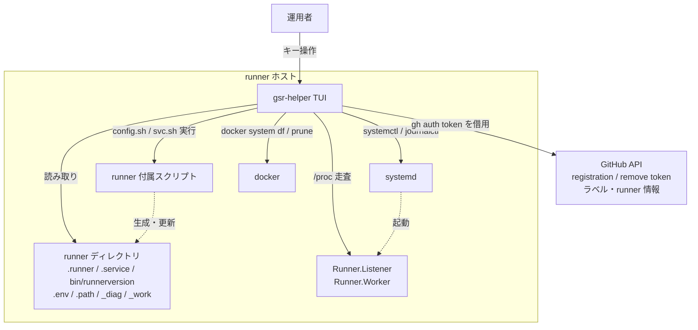

# プロジェクト概要

## 目的

GitHub Actions の self-hosted runner を動かすホスト上で、**runner インスタンスの増減・稼働確認・障害切り分け・ディスク掃除を 1 つの TUI から完結させる**。

現状これらは `config.sh` / `svc.sh` / `systemctl` / `journalctl` / `du` / `docker prune` といった別々のコマンドを、runner ディレクトリを移動しながら手で叩く作業になっている。gsr-helper はこれを 1 画面に集約し、runner ホストの運用にかかる手間と事故を減らす。

## 背景

- **状態が 3 か所に分散している。** runner の状態を知るには runner ディレクトリ内のファイル（`.runner` / `.service` / `bin/runnerversion`）、systemd（`systemctl`）、稼働プロセス（`Runner.Listener` / `Runner.Worker`）を突き合わせる必要がある。1 コマンドで全体像が出ない。
- **増減が手順作業になっている。** runner を 1 台増やすたびに「ディレクトリ作成 → tarball 展開 → registration token 取得 → `config.sh` → `svc.sh install` → `svc.sh start`」を踏む。台数に比例して手作業と設定ミスの機会が増える。
- **停止要因は定型なのに切り分けが経験依存。** 実際に多いのはディスク満杯、時刻ずれによるトークン認証失敗、OOM Killer、`_work` の残骸による inode 枯渇といった定型的な原因だが、これらを順に確認する手順が属人化している。
- **機械的に読める材料は揃っている。** ホスト上には判定に必要な情報が構造化された形で存在する（`.runner` は JSON、`.service` にユニット名、`bin/runnerversion` にバージョン、`/proc` にプロセス、`systemctl show` に `WorkingDirectory`）。ツール化の障壁は低い。

## スコープ

### 含むもの

- **runner の検出と一覧表示** — systemd 管理（`svc.sh install` 済み）と `run.sh` 直起動の両方を検出する
- **runner の追加** — 台数を指定した一括追加、および 1 台ずつウィザードで個別設定する追加
- **runner の削除** — GitHub からの登録解除と systemd サービスの削除まで（runner ディレクトリは残す）
- **runner バージョンの一括更新** — ホスト内の全 runner を指定バージョンへ差し替える（設定ファイルは保持）
- **サービス制御** — start / stop / restart / enable / disable、およびジョブ完了を待つドレイン停止
- **ログ閲覧** — `_diag/Runner_*.log` / `Worker_*.log` のライブテール、`journalctl` の参照
- **ディスク使用量の内訳表示とクリーンアップ** — `_work` / `_tool` / `_temp` / `_diag` / docker の分解表示と段階的な削除
- **環境診断（doctor）** — 到達性、時刻ずれ、OOM 履歴、パーミッション、依存コマンドの定型チェック
- **対話型の設定編集** — `.env` / `.path` / systemd drop-in / ラベル / job hooks の編集

### 含まないもの

意図的にスコープ外とする。将来の拡張候補は末尾に記す。

- **ARC（Actions Runner Controller / Kubernetes 上の runner）の管理** — ホストにファイルも systemd ユニットも存在せず、運用モデルが根本的に異なる
- **GitHub 側のキュー診断（queued ジョブと runner ラベルのマッチング）** — 価値は高いが「ホスト側ツール」という軸から外れる。**将来の拡張候補として記録する**
- **複数ホストの SSH 経由管理** — 認証・接続管理の設計が必要になり、スコープが大きく広がる
- **Linux / systemd 以外のプラットフォーム** — macOS（launchd）、Windows（サービス管理・パス・権限モデルが別）は対象外
- **runner の自動スケール** — 常駐デーモンが必要になり、TUI とは別の設計軸になる

## ステークホルダー / 想定ユーザー

| 区分 | 役割 | 備考 |
|------|------|------|
| runner ホスト運用者 | runner の増減、稼働監視、障害対応、ディスク管理 | 主たる利用者。1 ホストに複数 runner を並べる構成を想定 |
| CI 利用開発者 | ジョブが動かないときの状態確認 | 間接的な利用者。runner が拾えているかを見る |

## システム全体像

runner の同一性は **runner ディレクトリの実パス**で判定する。ファイル・systemd・プロセスの 3 経路から集めた情報をこのキーで突き合わせるため、走査ルート外に置かれた runner でも稼働していれば検出できる。

## ドキュメントマップ

このプロジェクトの仕様は以下のドキュメントで構成される。実装時はそれぞれ参照すること。

| ドキュメント | パス | 概要 |
|------------|------|------|
| 機能要件 | `docs/requirements/functional.md` | ユースケース、機能一覧、操作フロー |
| 非機能要件 | `docs/requirements/non-functional.md` | 応答性、信頼性、可搬性、テスト方針 |
| アーキテクチャ設計 | `docs/architecture/overview.md` | 全体構成、技術選定、レイヤー構造 |
| データモデル | `docs/architecture/data-model.md` | 内部モデル、読み書きするファイルのスキーマ |
| セキュリティ設計 | `docs/architecture/security.md` | sudo 前提のガード、トークンの扱い、監査ログ |
| 外部インターフェース | `docs/api/external-interfaces.md` | 使用する GitHub API と実行する外部コマンド |
| コンポーネント設計 | `docs/components/overview.md` | パッケージ分割、責務、依存関係 |
| 画面・キーバインド仕様 | `docs/ui/screens.md` | 各タブのレイアウト、キーマップ、確認ダイアログ |
| TUI コンポーネント設計 | `docs/ui/atomic-design.md` | Atomic Design による UI 層の階層分割、部品一覧、デザイントークン |
| ランナーホストのセットアップ | `docs/operations/runner-host-setup.md` | ホスト側に必要な前提（sudo / docker / buildx / グループ / ラベル）と doctor との対応 |
| 環境構築 | `docs/environment/setup.md` | 開発環境、タスクランナー、CI、lint / format、行数管理、Git Hooks |

## マイルストーン / リリース計画

未定。

## 用語集

| 用語 | 定義 |
|------|------|
| runner | GitHub Actions のジョブを実行するエージェント。ここでは self-hosted runner を指す |
| runner ディレクトリ | `actions-runner` を展開したディレクトリ。`.runner` を持つことで識別する |
| Runner.Listener | ジョブを待ち受ける常駐プロセス。1 runner に 1 つ |
| Runner.Worker | ジョブ 1 件ごとに起動されるプロセス。存在＝ジョブ実行中 |
| `.runner` | runner の登録情報を持つ JSON ファイル。runner 名・スコープ・work フォルダを含む |
| `.service` | `svc.sh install` が systemd ユニット名を書き出すファイル。ディレクトリとユニットの紐付けに使う |
| `_work` | ジョブの作業ディレクトリ。リポジトリのチェックアウト先。肥大化しやすい |
| `_tool` | `_work/_tool`。setup-* アクションが入れるツールキャッシュ |
| `_diag` | runner 自身の診断ログ（`Runner_*.log` / `Worker_*.log`）の出力先 |
| `config.sh` | runner の登録・登録解除を行う付属スクリプト |
| `svc.sh` | runner を systemd サービスとして登録・操作する付属スクリプト |
| ドレイン停止 | 実行中ジョブの完了を待ってから runner を停止すること。ジョブを中断しない |
| ephemeral runner | ジョブ 1 件を実行したら自動で登録解除される runner |
| registration token | runner を登録するための短命トークン。GitHub API で取得する |
| remove token | runner の登録を解除するための短命トークン |
| job hooks | `ACTIONS_RUNNER_HOOK_JOB_STARTED` / `_COMPLETED`。ジョブ前後に任意のスクリプトを実行する仕組み |
| runner group | org / enterprise レベルで runner をグループ化する単位 |
| スコープ | runner の登録先。repo / org / enterprise のいずれか |
| ARC | Actions Runner Controller。Kubernetes 上で runner を動かす仕組み。本ツールの対象外 |

## 将来の拡張候補

スコープ外としたが、価値が確認されているため記録する。

- **キュー診断** — `queued` ジョブの `runs-on` ラベルと登録済み runner のラベルを突き合わせ、「このジョブを拾える runner が 0 台」「全台 busy」といった停滞原因を特定する。ホスト側だけでは判断できないため GitHub API 側の機能として別軸で検討する
- **複数ホスト管理** — SSH 経由で他ホストの runner を同じ UI から操作する

## 改訂履歴

| 版 | 日付 | 変更内容 | 変更理由 |
|----|------|---------|---------|
| 1.0 | 2026-08-21 | 新規作成 | 初版 |
| 1.1 | 2026-08-21 | ドキュメントマップに TUI コンポーネント設計を追加 | UI 層の部品分割を独立した仕様書に切り出したため |
| 1.2 | 2026-08-21 | ドキュメントマップにランナーホストのセットアップを追加 | doctor の前提チェック（FR-43）の根拠となる実運用の手順を記録したため |
| 1.3 | 2026-08-21 | ドキュメントマップに環境構築を追加 | CI・lint・format・行数管理・Git Hooks の構成を独立した仕様書として定めたため |
