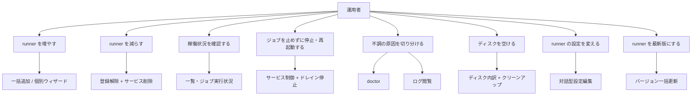
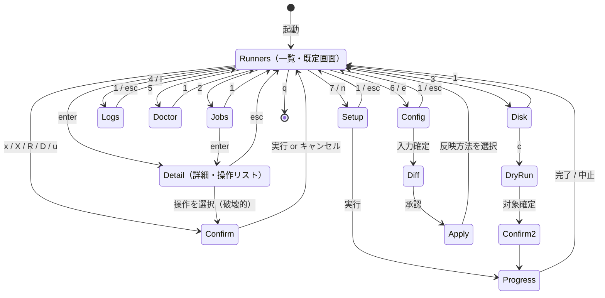
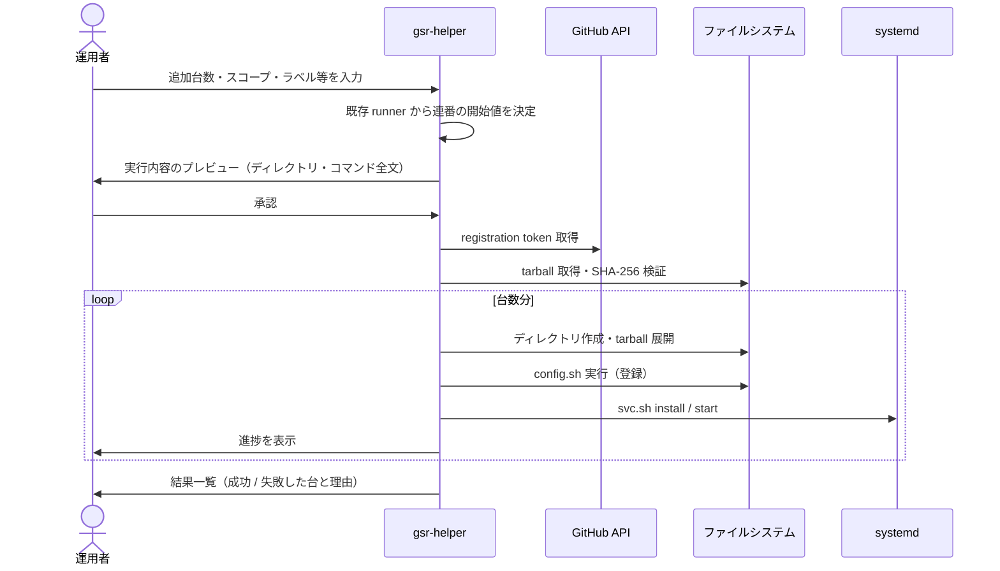
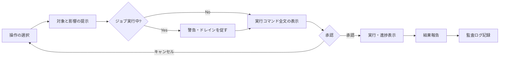

# 機能要件

対象は Linux + systemd 上の self-hosted runner ホスト。全体像とスコープは [プロジェクト概要](../overview.md) を参照。

## ユースケース



## 画面遷移



数字キーはタブ直接指定、英字キーは一覧で選択中の runner に対する操作。詳細は [画面・キーバインド仕様](../ui/screens.md)。

## 機能一覧

### 検出・一覧（FR-01〜FR-05）

| ID | 機能 | 内容 |
|----|------|------|
| FR-01 | runner の自動検出 | 既定の設置場所（下記「既定の走査ルート」）を走査し `.runner` を持つディレクトリを runner として検出する。runner ディレクトリ配下は掘らない（`_work` が巨大になるため） |
| FR-02 | 走査経路の補完 | ディスク走査に加え、稼働プロセスの実行ファイルパスと systemd ユニットの `WorkingDirectory` からも runner ディレクトリを回収する。走査ルート外の runner でも稼働・登録されていれば検出できる |
| FR-03 | 起動方式の判定 | systemd ユニットが対応すれば `systemd`、ユニットが無く `Runner.Listener` が動いていれば `run.sh`（直起動）、どちらも無ければ未稼働と判定する。**ユニットの有無そのものが判定できない場合は判定不能とする**（下記「起動方式の 4 状態」） |
| FR-04 | ジョブ実行状況の表示 | `Runner.Worker` の存在をジョブ実行中と判定し、プロセス起動時刻から経過時間を表示する |
| FR-05 | 孤児ユニットの検出 | `actions.runner.*` ユニットのうち対応する runner ディレクトリが見つからないものを異常として一覧に表示する（ディレクトリだけ削除した場合に発生する）。下記 2 種のユニットは孤児に**含めない** |

一覧に表示する項目: runner 名 / スコープ / 起動方式 / サービス状態 / ジョブ実行状況と経過時間 / runner バージョン / `_work` 使用量 / ディレクトリパス。

#### 起動方式の 4 状態（FR-03）

起動方式は 4 値である。`systemd` と `run.sh` は「そう判定できた」状態、残る 2 つは「判定できなかった」状態を書き分けたものである。**ユニットの一覧そのものが取れない場合に「ユニットが無い」と読み替えてはならない。** 読み替えると、稼働中の systemd 管理 runner が `run.sh` 直起動として表示され、サービス制御ができないものとして扱われてしまう（FR-09 の保護が誤って掛かる）。

| 値 | 表示 | 条件 |
|----|------|------|
| `ManagedSystemd` | `systemd` | 対応する systemd ユニットが紐付いた |
| `ManagedStandalone` | `run.sh` | ユニットが無く（一覧は取得できている）、`Runner.Listener` が稼働している |
| `ManagedUnknown` | `-` | ユニットが無く（一覧は取得できている）、`Runner.Listener` も無い（未稼働） |
| `ManagedUnavailable` | `?` | **ユニットの一覧を取得できなかった。** `systemctl` が無い環境（`Executor` を渡さない縮退）か、`systemctl list-units` 自体が失敗した場合 |

1 ユニットの `systemctl show` 失敗は一覧そのものは取れているため `ManagedUnavailable` にはならない。判定不能な runner の画面上の扱い（MANAGED 列・`⚠`・詳細画面・操作の可否）は [画面仕様](../ui/screens.md#runners-タブ) に定める。

#### 孤児ユニットに含めないもの（FR-05）

孤児は「対応する runner ディレクトリが見つからないユニット」に限る。次の 2 種は**ディレクトリが消えたわけではない**ため孤児に分類せず、`Result.Warnings`（状態行の警告件数）として扱う。

| 除外するユニット | 理由 |
|----------------|------|
| `systemctl show` に失敗したユニット（状態不明） | `WorkingDirectory` が取れないだけで、ディレクトリが無いとは限らない。孤児にすると `.service` を持たない runner のユニットが「対応ディレクトリなし」と誤表示される |
| `LoadState=not-found` のユニット | `svc.sh uninstall` 後に参照だけが残っている状態。systemd 側に実体が無いだけで、runner ディレクトリは存在する。runner への紐付けも行わない（存在しないユニットにサービス制御を提示しないため） |

`LoadState=not-found` のユニットと、既に別のユニットが紐付いている runner ディレクトリを指す 2 本目のユニットは、黙って落とさず警告として出す。文言は [データモデルの警告一覧](../architecture/data-model.md#result-の警告) を参照。

#### 既定の走査ルート（FR-01）

`--root` と設定の `scan_roots` に加えて、次の 10 個のパターンを glob 展開したディレクトリを走査ルートとする。自分の runner が自動検出されるかを利用者が判断できるようにするため全量を示す。

```
/home/*/actions-runner*   /home/*/runners        /root/actions-runner*
/opt/actions-runner*      /opt/runner*           /opt/*/actions-runner*
/srv/actions-runner*      /srv/*/actions-runner*
/var/lib/actions-runner*  /usr/local/actions-runner*
```

走査の掘り方には次の規則がある。

- ルート配下を掘る深さは `scan_depth`（既定 2）。
- `.runner` を持つディレクトリに当たった時点でそこを runner とし、**その配下は掘らない**。
- 降りる途中で名前が `_work` または `_diag` のディレクトリは辿らない（巨大かつ runner を含まない）。
- ここに載らない場所の runner でも、稼働プロセスまたは systemd ユニットから回収できる（FR-02）。

### サービス制御（FR-06〜FR-09）

| ID | 機能 | 内容 |
|----|------|------|
| FR-06 | 基本操作 | 選択した runner の start / stop / **強制停止** / restart / enable / disable を行う |
| FR-07 | ドレイン停止 | `Runner.Worker` が消滅するのを待ってから停止する。**待ち時間は無制限**で、任意のタイミングでキャンセルできる。待機中は経過時間と対象ジョブを表示する |
| FR-08 | 一括操作 | 複数の runner を選択して同一操作を適用する（メンテナンス前の全停止など） |
| FR-09 | 直起動 runner の保護 | `run.sh` 直起動の runner は systemd 操作の対象外とし、該当キーを無効化して理由を表示する（対象の範囲は下記「直起動 runner の保護の範囲」） |

**強制停止（FR-06 に含む）**

強制停止は**ドレイン停止（FR-07）と対になる「待たずに落とす」操作**である。ジョブの完了を待てない場面（ホストを今すぐ落とす、ジョブが固まって進まない）のために置く。新しい FR 番号を与えず FR-06 に含めるのは、`stop` と同じく「選択した runner のサービスを止める」操作であり、違いは止め方の強さだけだからである。

手順は 2 段で、次の順に発行する。

1. `Runner.Listener` と `Runner.Worker` の PID をまとめて `kill -KILL` へ 1 回で渡す。受け口である Listener を先に置き、新しいジョブが割り当てられる余地を縮める。
2. systemd ユニット名が分かる場合は、続けて `systemctl stop <unit>` を発行する。**シグナルだけでは systemd が「停止した」と記録せず、`Restart=` の付いたユニットはすぐに戻ってくる**ためである。

1 が失敗しても 2 は試み、両方の結果をまとめて報告する。プロセスを落とし損ねたこととユニットを止め損ねたことは別の失敗であり、片方で打ち切ると残った方が黙って生き残る。

- **root を要する。** 他ユーザーのプロセスへシグナルを送り、`systemctl` でユニットを止めるためである。
- **確認ダイアログを経る**（`x`（停止）/ `R`（再起動）と同じ。[画面仕様の確認ダイアログ](../ui/screens.md#確認ダイアログ)）。影響は `⚠ 実行中のジョブは中断されます` で、実行中のジョブは失敗として記録される。
- **PID もユニット名も 1 つも無い場合は、1 本もコマンドを発行せずエラーを返す。** 未稼働かつサービス未インストールの runner がこれに当たる。0 本の実行を「成功」として報告すると、止まっていない runner を止まったものとして扱わせてしまう。この場合は確認ダイアログを開く前に対象から外し、状態行に理由を出す。
- **systemd 管理でなくても動く。** worker のプロセスへ直接シグナルを送る操作であり、ユニットの有無に依らない（FR-09 の保護の対象外）。

**ドレイン停止の制約（重要）**

GitHub には「この runner に新規ジョブを割り当てない」API が存在しない。したがって `Runner.Worker` の消滅を待つ方式では、待機中に `Runner.Listener` が次のジョブを拾う可能性が残る。本ツールは Worker の消滅を検知した時点で即座に停止処理へ移るが、**新規ジョブを受け付けないことは保証しない**。この制約は UI 上にも明示する。

将来的な回避策として、GitHub API でラベルを一時退避して実質的な受付停止（cordon）を行う案があるが、キュー中のジョブが待ち続ける副作用があるため初版では採用しない。

**直起動 runner の保護の範囲（FR-09）**

FR-09 が対象外とする「systemd 操作」とは、`systemctl` でユニットに作用する操作、すなわち **`s`（開始）/ `x`（停止）/ `d`（ドレイン停止）/ `R`（再起動）/ `E`（enable / disable の切替）の 5 つ**である。`d` を含めるのは、待機そのものは `/proc` の走査だけでも、`Runner.Worker` が消えたあとに発行するのは `x` とまったく同じ `systemctl stop` だからである。`E` を含めるのは、`systemctl enable` / `disable` がユニットの状態を書き換える systemd 操作そのものだからである。

**`X`（強制停止）は対象外である。** worker のプロセスへ直接シグナルを送る操作で、ユニットの有無に依らずに効く（上記「強制停止」）。ここまで塞ぐと `run.sh` 直起動の runner を止める手段が 1 つも無くなる。

**起動方式が判定できない場合も同じ 5 つを塞ぐ。** 起動方式の 4 状態（[FR-03](#起動方式の-4-状態fr-03)）のうち判定不能（`?`）は、ユニット一覧そのものを取得できなかった状態であり、`systemctl` を安全に駆動できない点で `run.sh` 直起動と変わらない。塞ぐ範囲は同じにし、理由の文言だけを書き分ける（[画面仕様の無効な操作の表示](../ui/screens.md#無効な操作の表示)）。

### runner の追加（FR-10〜FR-16）

| ID | 機能 | 内容 |
|----|------|------|
| FR-10 | 台数指定の一括追加 | 台数を指定して複数の runner をまとめて登録する |
| FR-11 | 命名規則 | `<ホスト名>-<連番>` とし、連番はホスト内の既存 runner の最大値の次から振る。既定のホスト名部分はフォームで上書きできる |
| FR-12 | 個別ウィザード追加 | 1 台ずつ名前・ラベル・work dir・ephemeral・runner group を個別指定して追加する |
| FR-13 | tarball の取得と検証 | runner の tarball を取得し SHA-256 を検証する。一括追加では 1 回の取得を各ディレクトリへ展開して使い回す |
| FR-14 | 登録トークンの取得 | GitHub API で registration token を取得する。一括追加では有効期限内であれば 1 つのトークンを台数分の登録に使い回す |
| FR-15 | 失敗時の挙動 | 途中で失敗した場合、**その台で中止し、成功済みの runner は残す**。何台目までが成功し、どこで何が失敗したかを実行ログとして提示する |
| FR-16 | 実行前プレビュー | 作成するディレクトリ、実行する `config.sh` / `svc.sh` のコマンド全文を表示し、承認を得てから実行する |

一括追加の流れ:



### runner の削除（FR-17〜FR-19）

| ID | 機能 | 内容 |
|----|------|------|
| FR-17 | 登録解除とサービス削除 | remove token を取得し、`svc.sh stop` → `svc.sh uninstall` → `config.sh remove` を実行する |
| FR-18 | ディレクトリの保持 | **runner ディレクトリは削除しない。** 削除後、残ったディレクトリのパスを表示して手動削除の判断を委ねる |
| FR-19 | 実行中ジョブの保護 | ジョブ実行中の runner を削除対象に含めた場合は警告し、ドレイン停止を先に行うよう促す |

### バージョン更新（FR-20〜FR-22）

| ID | 機能 | 内容 |
|----|------|------|
| FR-20 | 一括更新 | ホスト内の runner を指定バージョンへまとめて差し替える。対象は全台または選択した台 |
| FR-21 | 設定の保持 | `.runner` / `.credentials` / `.env` / `.path` / `_work` / `_diag` は上書きしない。展開対象は runner 本体のファイルのみ |
| FR-22 | 停止・再開の扱い | 更新前にドレイン停止し、更新後に元の状態（起動していたものだけ）へ戻す |

runner は既定で GitHub による自動更新が有効なため、本機能が主に必要になるのは `disableUpdate` を有効にしている場合である。一覧には現行バージョンと最新バージョンの差を表示する。

### ログ閲覧（FR-23〜FR-26）

| ID | 機能 | 内容 |
|----|------|------|
| FR-23 | ログファイル一覧 | `_diag/Runner_*.log` / `Worker_*.log` を更新時刻順に一覧表示する（サイズ付き） |
| FR-24 | ライブテール | 選択したログを追従表示する。ファイル追加・追記を検知して更新する |
| FR-25 | フィルタとハイライト | 正規表現によるフィルタ、`ERROR` / `WARN` の強調表示 |
| FR-26 | journalctl 参照 | 選択した runner の systemd ユニットのログを同じビューで追従表示する |

「選択中 runner の直近ジョブの Worker ログを開く」ショートカットを用意する。

### ディスク（FR-27〜FR-31）

| ID | 機能 | 内容 |
|----|------|------|
| FR-27 | 使用量の内訳表示 | `_work/<リポジトリ>` 単位、`_work/_tool`、`_work/_temp`、`_diag`、docker（イメージ / コンテナ / ボリューム / ビルドキャッシュ）に分解して表示する |
| FR-28 | 非同期集計 | 集計は UI をブロックせずに進行し、判明した分から順に反映する |
| FR-29 | inode 使用率 | 容量とあわせて inode 使用率を表示する（小さいファイルの大量生成で先に枯渇するため） |
| FR-30 | 段階的クリーンアップ | 削除対象を選択 → ドライラン（対象パスと解放見込み容量）→ 確認 → 実行 の順に進める。確認を経ない削除経路は設けない |
| FR-31 | 実行中ジョブの保護 | ジョブ実行中の runner の `_work` 配下は削除対象から除外する |

クリーンアップの候補: 古い `_work/<リポジトリ>`、`_work/_temp`、古い `_diag` ログ、`docker system prune`、`_work/_tool` の旧バージョン。

### doctor（FR-32〜FR-34 / FR-43〜FR-44）

| ID | 機能 | 内容 |
|----|------|------|
| FR-32 | 定型チェックの実行 | 各チェックを並列に実行し、OK / WARN / FAIL で結果を一覧表示する |
| FR-33 | 対処の提示 | FAIL / WARN の項目には原因の説明と推奨する対処を表示する |
| FR-34 | 再実行 | 対処後に個別または全体を再実行できる |
| FR-43 | ジョブ実行の前提チェック | **gsr-helper 自身の動作には不要だが、欠けるとワークフローが失敗するホスト側の前提**を確認する。パスワード不要 sudo、`docker`、`docker buildx`、runner 実行ユーザーの docker グループ所属の 4 点。前提の内容と対処手順は [ランナーホストのセットアップ](../operations/runner-host-setup.md) |
| FR-44 | 起動時の自動判定 | FR-43 のチェックを起動時に自動実行する。ホスト内の読み取りと軽量なコマンドのみで完結する。不備があればヘッダと状態行に警告を出し、Doctor タブへ誘導する |

**FR-43 の判定対象ユーザーは `Runner.RunAsUser` である。この値はユーザー名に限らない。** 名前が解決できない環境（静的リンクで NSS が使えない、LDAP 上のユーザー）では UID の 10 進表記（`"1001"` など）になる（[データモデル](../architecture/data-model.md#runner)）。`sudo -l -U <user>` はユーザー名しか受け付けず、**UID を渡す場合は `#1001` の形式が必要**なため、実装側で数値かどうかを見て `#` を付ける。付けずに渡すと「そんなユーザーは居ない」という失敗になり、`NOPASSWD` が無いのと区別できない。

チェック項目:

| 分類 | 項目 |
|------|------|
| 認証・権限 | `.credentials` / `.runner` のパーミッションと所有者 |
| 認証・権限 | `/proc` の `hidepid` 設定。未設定の場合、runner 登録時にプロセス引数として渡るトークンを他ユーザーから読み取れる（[セキュリティ設計](../architecture/security.md#プロセス引数からのトークン読み取り既知の制約)） |
| 認証・権限 | GitHub トークンの保有スコープ。org レベルの runner 管理には `admin:org` が必要で、`gh auth login` の既定では付与されない（[外部インターフェース](../api/external-interfaces.md#必要なトークンスコープ)） |
| ネットワーク | `github.com:443`、`api.github.com`、`*.actions.githubusercontent.com`、`pkg-containers`、results-receiver への到達性、プロキシ環境変数の整合 |
| 時刻 | NTP 同期状態と時刻ずれ（トークン認証の失敗要因） |
| リソース | ディスク残量、inode 残量、`/tmp` 容量、メモリ、swap |
| 障害履歴 | カーネルログ上の OOM Killer による runner プロセスの停止履歴 |
| docker | daemon の稼働 |
| ジョブ実行の前提 | runner 実行ユーザーのパスワード不要 sudo。`setup-*` 系アクションが `sudo install` で `/usr/local/bin` へバイナリを置くため必要。欠けると `sudo: パスワードが必要です` でジョブが失敗する。**ただし付与は runner ユーザーに実質 root を与えることを意味するため、判定は WARN とし可否は運用者に委ねる**（[セキュリティ設計](../architecture/security.md#パスワード不要-sudo-の要求への対応)） |
| ジョブ実行の前提 | `docker` の存在。欠けると `docker: command not found` |
| ジョブ実行の前提 | `docker buildx` の存在。`docker.io` 単体では入らず、`COPY --chmod` を含む Dockerfile が BuildKit 不在で失敗する |
| ジョブ実行の前提 | runner 実行ユーザーの docker グループ所属。欠けると docker socket が `permission denied` になる。**グループ追加は既存プロセスに反映されないため、稼働中の `Runner.Listener` の補助グループも確認し、`usermod` 後に再起動していない状態を区別して検出する** |
| 依存コマンド | `git` / `docker` / `node` などの存在とバージョン |
| systemd | ユニットの `Restart` 設定、環境変数、`WorkingDirectory` の整合 |
| 構成整合 | 孤児ユニット（FR-05）、`.runner` と systemd ユニット名の不一致 |

### 対話型設定編集（FR-35〜FR-40）

| ID | 機能 | 内容 |
|----|------|------|
| FR-35 | 設定項目の編集 | `.env` / `.path` / systemd drop-in / ラベル / runner group / job hooks をフォームで編集する |
| FR-36 | 入力検証 | ラベルの文字種・重複・予約ラベル（`self-hosted` / `linux` / `x64`）、work dir の書き込み可否と残容量、runner 名のホスト内重複を検証する |
| FR-37 | 差分プレビュー | 書き込み前に変更内容の差分を表示し、承認を得る |
| FR-38 | バックアップ | 書き込み前に対象ファイルのバックアップを作成する |
| FR-39 | 反映方法の選択 | 「ドレイン再起動」を**既定の提案**とし、「強制再起動（ジョブ中断の警告付き）」「反映しない（次回起動時に有効）」を選べる |
| FR-40 | 設定の複製 | ある runner の `.env` を他の runner へ適用する（対象を複数選択） |

反映コストは項目ごとに異なるため、フォーム上に明示する。

| 設定対象 | 反映方法 | 備考 |
|---------|---------|------|
| `.env` / `.path` | runner 再起動 | — |
| systemd drop-in | `daemon-reload` + 再起動 | — |
| ラベル / runner group | GitHub API で即時反映 | 再起動不要 |
| runner 名 / work dir / ephemeral | **再登録が必要**（`config.sh remove` → 再実行） | 影響が大きいため独立した確認を挟む |

### 自身の設定（FR-41〜FR-42）

| ID | 機能 | 内容 |
|----|------|------|
| FR-41 | 初回設定ウィザード | 設定ファイルが無い場合、初回起動時に走査ルート・ディスク閾値・ポーリング間隔・監査ログ出力先を対話で設定する |
| FR-42 | 設定の再編集 | 上記をいつでも再編集できる |

### 操作の起点（FR-45〜FR-47）

同じ操作を複数の経路から起動できるようにする。キーを覚えている利用者は最短で、覚えていない利用者は一覧から辿って操作できる状態を目標とする。

| ID | 機能 | 内容 |
|----|------|------|
| FR-45 | 一覧からの直接キー | Runners 一覧で選択中の runner に対し、`s` / `x` / `X` / `d` / `R` / `E` / `u` / `e` / `l` / `D` を直接打って操作する（既定の経路） |
| FR-46 | 詳細画面の操作リスト | `enter` で開く詳細画面に操作の一覧を置き、カーソル選択と `enter` で実行する。**安全な操作を上、破壊的な操作を区切り線の下に置き、初期カーソルは常に安全側の先頭に置く**（開き直すたびにリセットし、前回の選択を覚えない） |
| FR-47 | Jobs タブからの操作 | 実行中ジョブの一覧から、そのジョブを実行している runner を操作する。`enter` で当該 runner の詳細画面を開き、`d` / `X` / `R` / `l` は直接打てる |

**起点によって確認の強さを変えない。** どの経路から起動しても、破壊的操作は同一の確認フロー（対象・影響・実行コマンド全文の提示と `y/N`、既定 N）を経る。確認を省略する近道は作らない。

**Jobs タブの操作対象はジョブではなく runner である。** 画面上でもそう表示する。ジョブ単体を中止する機能は持たない（ホスト側からは `Runner.Worker` を強制終了するしかなく、ジョブは失敗として記録されるため。中止は GitHub 側の操作に委ねる）。

## 操作フロー（主要な確認フロー）

破壊的操作は共通して次の順序を踏む。確認を省略する経路は設けない。



## 改訂履歴

| 版 | 日付 | 変更内容 | 変更理由 |
|----|------|---------|---------|
| 1.0 | 2026-08-21 | 新規作成 | 初版 |
| 1.1 | 2026-08-21 | doctor に `/proc` の `hidepid` チェックを追加 | セキュリティ設計で、runner 登録時にトークンがプロセス引数として他ユーザーから読める制約が判明したため |
| 1.2 | 2026-08-21 | doctor にトークンスコープのチェックを追加 | org レベルの runner 管理に `admin:org` が必要で、`gh` の既定スコープでは不足することが判明したため |
| 1.3 | 2026-08-21 | 画面遷移図のキー表記を画面仕様と統一 | 追加が `a`→`n`、確認を経る操作が `x/X/R/D/u` に確定したため |
| 1.4 | 2026-08-21 | doctor に FR-43（ジョブ実行の前提チェック）と FR-44（起動時の自動判定）を追加。docker グループ所属のチェックを新カテゴリへ移動 | 実運用で、ホスト側の前提（パスワード不要 sudo / docker / buildx / docker グループ）の欠落がジョブ失敗の主要因になることが判明したため。特にグループ追加は runner 再起動まで反映されず気付きにくい |
| 1.5 | 2026-08-21 | 操作の起点（FR-45〜FR-47）を追加。詳細画面の操作リストと Jobs タブからの操作を定義 | キーを覚えていなくても操作できる経路が必要になったため。起点を増やしても確認フローは共通に保つ |
| 1.6 | 2026-08-22 | FR-03 の起動方式に判定不能（`ManagedUnavailable`）を追加して 4 状態を定義。FR-05 の孤児ユニットから `LoadState=not-found` を除外することを明記。FR-01 の既定の走査ルートと掘り方の規則を全量記載。FR-43 の判定対象ユーザーが UID になり得ることを追記 | ユニット一覧が取れないときに「ユニットが無い」と読み替えると、稼働中の systemd 管理 runner が `run.sh` 直起動と誤表示され FR-09 の保護が誤って掛かる。`svc.sh uninstall` 後の残骸ユニットを孤児として提示していた。既定の走査ルートが仕様に無く、利用者が自分の runner が検出されるか判断できなかった |
| 1.7 | 2026-08-23 | FR-06 の内容に**強制停止**を明記し、サービス制御の表の下に強制停止の挙動（`kill -KILL` と `systemctl stop` の 2 段・root 必須・確認ダイアログ・対象が 1 つも無ければ発行せずエラー・systemd 管理でなくても動く）を説明する段落を追加 | 強制停止は実装済みかつ破壊的で root を要する操作なのに、機能要件が 1 つも無かった。[外部インターフェース](../api/external-interfaces.md)の `kill -KILL <pid>...` は対応機能を FR-06 としていたが、当の FR-06 は start / stop / restart / enable / disable しか挙げておらず参照が空を指していた。[画面仕様](../ui/screens.md)と [TUI コンポーネント設計](../ui/atomic-design.md)は強制停止を実装済みサービス制御 6 操作の 1 つとして数えており、要件だけが 5 操作のままだった。新しい番号を採らず FR-06 を広げたのは、FR 番号がリポジトリ全体から相互参照されており、以降をずらすと参照が総崩れになるためである（PR #70 のレビュー指摘） |
| 1.8 | 2026-08-23 | FR-09 の行に参照を付け、サービス制御の節に「直起動 runner の保護の範囲」の段落を追加。対象外とする systemd 操作が `s`/`x`/`d`/`R`/`E` の 5 つであること、`X`（強制停止）は対象外であること、起動方式が判定不能な場合も同じ 5 つを塞ぎ理由の文言だけを書き分けることを明記 | FR-09 は「systemd 操作の対象外とする」とだけ書いており、どのキーが範囲に入るかが読み取れなかった。そのため `run.sh` 直起動の runner に `systemctl enable` が発行される実装が要件違反だと判定できず、判定不能（FR-03 の 4 状態）に同じ保護が及ぶことも要件からは辿れなかった（PR #70 のレビュー指摘） |
