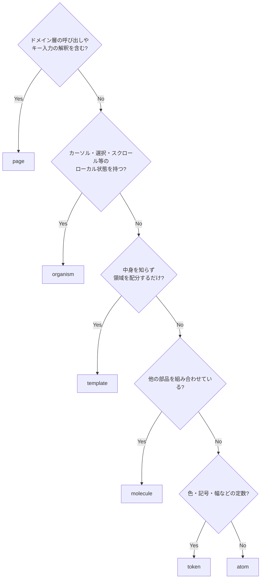
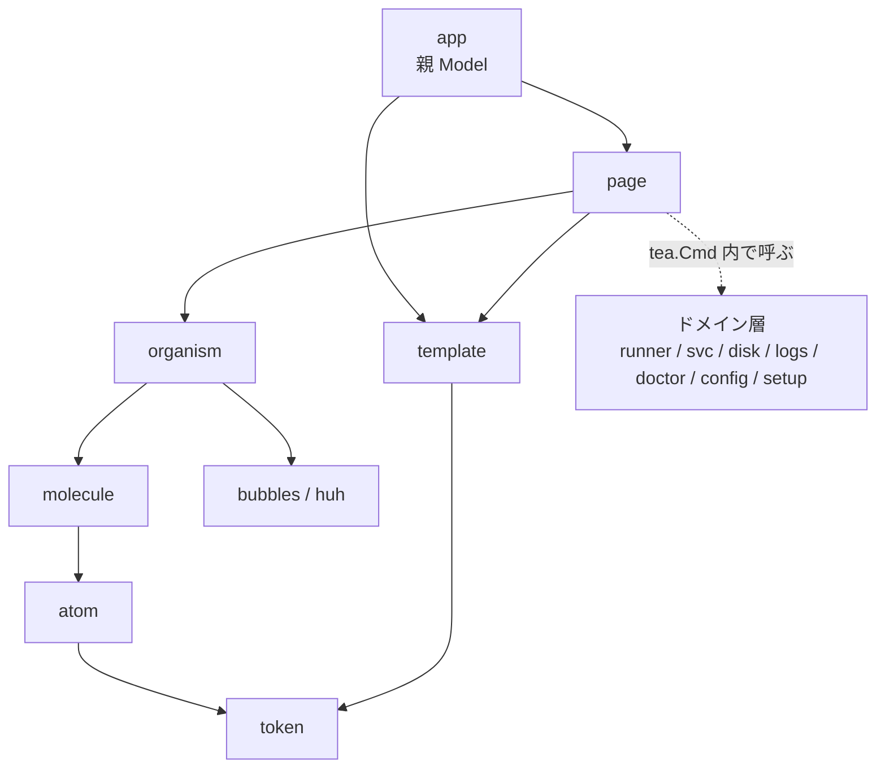

# TUI コンポーネント設計（Atomic Design）

画面の見た目とキーバインドは [画面・キーバインド仕様](screens.md)、パッケージ全体の分割は [コンポーネント設計](../components/overview.md)、UI 層の位置づけは [アーキテクチャ設計](../architecture/overview.md) を参照。

## この文書の目的

`screens.md` は「何が表示され、どのキーで何が起きるか」を定める。本書は **その表示を構成する部品をどう分割し、どこに置き、どう組み立てるか** を定める。

狙いは 2 つある。

1. **同じ表示を画面ごとに再実装しない。** サービス状態の記号、確認ダイアログ、一覧のカーソル移動は複数のタブに現れる。実装が分かれると挙動が食い違う。
2. **設計原則を構造で守る。** 「色に依存しない」「確認を経ない破壊的操作の経路を作らない」「無効な操作は理由を示す」といった原則を、規約ではなく部品の配置で担保する。

## 適用方針

Atomic Design は Web UI 向けの分類だが、本 TUI では次のように読み替える。判断基準は **状態を持つか** と **中身を知るか** の 2 点である。

| 階層 | TUI での定義 | 状態 | 型 |
|------|------------|------|-----|
| token | 色・記号・幅・余白の定数。atom の土台 | なし | 定数 / `lipgloss.Style` |
| atom | それ以上分解すると意味を失う最小の表示単位 | なし | `func(...) string` |
| molecule | atom を並べた「意味のある 1 行 / 1 区画」 | なし | `func(...) string` |
| organism | カーソル・選択・スクロール・入力などのローカル状態を持つ部品 | ローカル状態 | `tea.Model` |
| template | 画面共通の枠。中身を知らず領域の配分だけを行う | サイズのみ | `func(...) string` |
| page | タブ 1 枚。ドメイン層の呼び出しとキー入力の解釈を担う | 画面状態 | `tea.Model` |

token は Atomic Design 本来の 5 階層には含まれないが、`screens.md` の設計原則 4（色に依存しない）と列の省略順を 1 箇所に集約するために独立させる。

親 Model（`ui.App`）は階層の外に置く。検出結果・`Caps`・現在のタブ・モーダルの重なりを保持し、page を切り替える唯一の主体である。

### 階層の決め方

新しい部品はこの順で判定する。



## ディレクトリ構成

```
internal/ui/
  app.go        親 Model（ページ切替・検出結果・Caps・Tick）
  token/        色・記号・幅・余白の定数
  atom/         最小の表示単位（純粋関数）
  molecule/     atom を並べた 1 行 / 1 区画（純粋関数）
  organism/     ローカル状態を持つ部品（tea.Model）
  template/     画面共通の枠
  page/         タブ 1 枚（tea.Model）
```

階層をパッケージで分けることで、**依存の方向を Go の import で機械的に強制する**。ドメイン層に対する「ドメインは `ui` に依存しない」という規則（[コンポーネント設計](../components/overview.md#依存の規則)）と同じ考え方を UI の内部にも適用する。

パッケージ名は単数形にする。呼び出し側で `atom.StatusIcon` のように階層が読めるため、識別子に階層名を重ねない（`atom.AtomStatusIcon` は禁止）。

## 依存の方向



### 依存の規則

| 規則 | 理由 |
|------|------|
| `token` は何も import しない（`lipgloss` を除く） | 最下層。全体から参照されるため |
| `atom` は `token` のみに依存する | 表示単位を単体でテストできる状態に保つ |
| `molecule` は `atom` / `token` のみ。**molecule 同士は参照しない** | 同階層参照を許すと階層が意味を失う。共通化したい場合は atom に降ろすか organism に上げる |
| `organism` は `molecule` / `atom` / `token` と `bubbles` / `huh` を使う | スクロール・テキスト入力・フォームの実装は既存ライブラリに委ねる |
| `template` は `token` のみ。`organism` / `page` を import しない | 枠が中身を知ると、画面ごとに枠が分岐する |
| `atom` / `molecule` / `template` は **bubbletea を import しない** | 純粋関数に保ち、期待文字列との比較でテストできるようにする |
| ドメインの型（`runner.Runner` など）は `organism` 以上でのみ扱う | 表示部品がドメインモデルの変更に引きずられない。molecule 以下は表示用の構造体とプリミティブのみを受け取る |
| ドメイン層を `tea.Cmd` で呼ぶのは `page` のみ | 副作用の発生点を 1 階層に閉じる |
| 上位から下位への飛び越し参照（`page` → `atom` など）は許容する | 中間層に意味のない中継を作らない |
| 下位から上位への参照・循環は禁止 | — |

## token

### 色

| トークン | 用途 |
|---------|------|
| `ColorOK` | 正常・成功 |
| `ColorWarn` | 警告・閾値超過 |
| `ColorFail` | 異常・失敗 |
| `ColorSkip` | 実行不可・スキップ |
| `ColorMuted` | 補足情報・グレーアウト |
| `ColorAccent` | カーソル位置・選択行 |
| `ColorDanger` | 破壊的操作の警告文 |

### 記号

| トークン | 記号 | 意味 |
|---------|------|------|
| `IconActive` | `●` | サービス稼働中 |
| `IconInactive` | `○` | サービス停止中 |
| `IconFailed` | `✗` | 異常終了・FAIL |
| `IconNoUnit` | `-` | systemd ユニットなし |
| `IconJob` | `▶` | ジョブ実行中 |
| `IconWarn` | `⚠` | 注意事項あり・WARN |
| `IconOK` | `✓` | OK・完了 |
| `IconSkip` | `⊘` | SKIP |
| `IconCursor` | `▸` | カーソル位置 |
| `IconChecked` / `IconUnchecked` | `[x]` / `[ ]` | 複数選択の状態 |
| `IconDivider` | `─` | 区画の区切り |

記号は `screens.md` の記号表と一対一で対応する。表示に使う記号をここ以外に書かない。

### 色と記号の対

**状態を表すトークンは、必ず色と記号の対で定義する。** 色だけで区別する状態を作らない（`screens.md` の設計原則 4）。

`NO_COLOR` / `--no-color` / 非 TTY のときは、token 層でスタイルを素通しの実装に差し替える。atom 以上はこの分岐を持たない。

### 幅

| トークン | 値 | 由来 |
|---------|-----|------|
| `WidthTarget` | 80 | 保証する最小端末幅（[非機能要件](../requirements/non-functional.md#ユーザビリティ)） |
| `WidthMin` | 60 | これを下回ると表示不能とする（[画面仕様](screens.md#端末幅による列の省略)） |
| `ColumnsAlways` | `NAME` / `SVC` / `JOB` | 常に表示する列 |
| `ColumnDropOrder` | `_WORK` → `VERSION` → `MANAGED` → `SCOPE` | 幅が足りない場合に落とす順 |

列の省略は `molecule.ColumnHeader` と `molecule.RunnerRow` が同じトークンを参照して判断する。ヘッダと行の桁がずれることを防ぐ。

## atom 一覧

| atom | 引数 | 出力例 | 使用箇所 |
|------|------|-------|---------|
| `StatusIcon` | サービス状態 | `● active` / `○ inactive` / `✗ failed` / `-` | Runners |
| `JobBadge` | 実行中か・経過時間 | `▶ 4m12s` / `idle` | Runners / Jobs |
| `DoctorStatus` | OK / WARN / FAIL / SKIP | `✓ OK` / `⊘ SKIP` | Doctor |
| `Cursor` | カーソル行か | `▸` / 空白 | 全一覧 |
| `Checkbox` | 非表示 / 未選択 / 選択 | `[x]` / `[ ]` | Runners / Disk |
| `WarnMark` | 注意の有無 | `⚠` | Runners / Disk / Config |
| `Bytes` | バイト数 | `31.2G` | Runners / Disk |
| `Files` | ファイル数 | `412,003` | Disk |
| `Duration` | 経過時間 | `4m12s` | Runners / Jobs / ドレイン待機 |
| `Ratio` | 使用率・警告閾値 | `82% ⚠` | ヘッダ / Disk |
| `Version` | 現行・最新 | `2.309.0 ⚠` | Runners |
| `KeyHint` | キー・説明・可否・不可の理由 | `x:停止` / グレーアウト＋理由 | フッタ / ヘルプ |
| `Path` | パス・最大幅 | 中略付き `/opt/…/_work/bar` | 全画面 |
| `Cell` | 文字列・幅・寄せ | 幅を揃えた 1 セル | 全一覧 |
| `Divider` | 幅・見出し | `─ 孤児ユニット ─────` | Runners / Config |

`Cell` は日本語を含む表の桁ずれを防ぐための atom。**文字列の表示幅の計算（`go-runewidth`）はここに閉じる。** 上位の階層は「どの列を何文字幅で置くか」を決めるだけで、幅そのものを数えない。

`KeyHint` は可否と理由を受け取って描くだけで、**可否の判断はしない**（後述の「操作可否の判定」）。

## molecule 一覧

| molecule | 内容 | 対応する画面 |
|----------|------|------------|
| `ColumnHeader` | 一覧の列見出し。幅トークンに従って列を落とす | 全一覧 |
| `RunnerRow` | runner 1 行（名前 / スコープ / 起動方式 / サービス / ジョブ / バージョン / `_work`） | Runners |
| `OrphanRow` | 孤児ユニット 1 行（[FR-05](../requirements/functional.md)） | Runners |
| `JobRow` | 実行中ジョブ 1 行 | Jobs |
| `DiskTargetRow` | 削除候補 1 行（選択状態・サイズ・ファイル数・パス・選択不可の理由） | Disk |
| `FSSummaryLine` | ファイルシステム要約（使用率・inode・閾値超過） | Disk / ヘッダ |
| `DoctorRow` | 診断結果 1 行 | Doctor |
| `LogLine` | ログ 1 行（`ERROR` / `WARN` の強調、フィルタ一致のハイライト） | Logs |
| `SettingRow` | 設定項目 1 行（項目名・現在値・注意書き） | Config |
| `DiffLine` | 差分 1 行（`-` / `+` / 変更なし） | Config |
| `ProgressRow` | 進捗 1 行（`✓ 完了` / `▶ 実行中…` / `待機`） | Setup / Disk |
| `CommandBlock` | 実行するコマンド全文の整形（折り返し・継続行） | 確認ダイアログ全般 |
| `KeyBar` | `KeyHint` の並び。収まらない分は `?:ヘルプ` に集約する | フッタ |
| `TabBar` | `[1]Runners [2]Jobs …`。無効なタブはグレーアウト | 共通レイアウト |
| `CapsBar` | `host: build01  root  disk: 82% ⚠  gh: ousiass` | ヘッダ |
| `SummaryCounts` | `OK 14  WARN 2  FAIL 1  SKIP 1` | Doctor / 状態行 |

`CommandBlock` は **マスク済みの文字列を受け取るだけ**とし、UI 側でマスク処理を実装しない。トークンのマスクは `exec` 層の責務である（[セキュリティ設計](../architecture/security.md)）。二重に実装すると、どちらかが漏れたときに気付けない。

## organism 一覧

| organism | ローカル状態 | 責務 |
|----------|------------|------|
| `Table` | カーソル位置・選択集合・スクロール・絞り込み文字列 | 一覧の共通実装。区画（セクション）に対応する |
| `LogPane` | ペインの選択・viewport 位置・追従の ON/OFF・フィルタ | Logs の 2 ペイン。追従・手動スクロールでの解除・`G` での再開 |
| `Confirm` | なし（既定はキャンセル） | 破壊的操作の共通ダイアログ |
| `Detail` | スクロール位置 | Doctor の詳細、行の `⚠` の詳細 |
| `ProgressList` | 進捗の受信状態 | 一括処理の逐次表示と結果報告（[FR-15](../requirements/functional.md)） |
| `DrainWaiter` | 経過時間・対象ジョブ | ドレイン待機。制約の注記と `esc` でのキャンセル |
| `DiffApproval` | なし（既定はキャンセル） | 差分＋バックアップパスの提示と承認 |
| `ChoiceList` | カーソル位置 | Setup のメニュー、反映方法の選択 |
| `Form` | `huh.Form` | フォームのラッパー。検証エラーの表示位置を統一する |
| `Help` | スクロール位置 | `?` の全キー一覧 |
| `ErrorBanner` | なし | 失敗の表示 |

### `Table` を 1 つに統一する

Runners / Jobs / Disk / Doctor の 4 タブは、いずれもカーソル移動・複数選択・ページ送り・絞り込みという同じ操作を持つ（[画面仕様のキーマップ](screens.md#一覧runners--jobs--disk--doctor)）。`Table` は行の描画を外から受け取る形にし、キー処理を 1 箇所に集約する。

```go
// Table は一覧の共通実装。行の描画は呼び出し側の molecule に委ねる。
type Table[T any] struct { /* カーソル・選択・スクロール・絞り込み */ }

// RenderRow は 1 行を描く。molecule の関数をそのまま渡す。
type RenderRow[T any] func(item T, width int, cursor bool, checked bool) string
```

区画（セクション）に対応させ、Runners タブの孤児ユニットを下部の別区画として扱う。区画ごとに操作可否を設定できるようにし、Disk タブでジョブ実行中の `_work` を選択不可にする（[FR-31](../requirements/functional.md)）。

### `Confirm` を 1 つに統一する

`screens.md` に現れる確認（停止 / 強制停止 / 削除 / バージョン更新 / クリーンアップ / 追加のプレビュー / 設定の書き込み）は、すべて **対象・影響・実行するコマンド・`y/N`** という同じ構造を持つ。

```go
type ConfirmInput struct {
    Title   string   // 「クリーンアップの確認」
    Targets []string // 対象の一覧
    Impact  []string // 影響・警告（ColorDanger で描く）
    Command []string // 実行するコマンド全文（マスク済み）
    Note    []string // 補足（「復元できません」など）
}
```

破壊的操作の確認を組み立てる経路をこの 1 つに限定することで、「確認を経ない削除経路は設けない」（[FR-30](../requirements/functional.md)）を構造として守る。`enter` はキャンセル側に割り当てる（`screens.md` のキーマップ）。個別のダイアログ organism を追加しない。

## template 一覧

| template | 領域 | 使用箇所 |
|----------|------|---------|
| `Frame` | ヘッダ / タブ行 / 本体 / 状態行 / フッタ | 全画面 |
| `Modal` | 中央寄せのオーバーレイ枠 | `Confirm` / `Detail` / `Help` / `DrainWaiter` / `DiffApproval` |
| `Split` | 左右 2 ペイン | Logs（ファイル一覧と本文）、Config（項目と現在値） |

`Frame` は `screens.md` の「共通レイアウト」に対応する。

```go
type FrameInput struct {
    Header string // molecule.CapsBar の結果
    Tabs   string // molecule.TabBar の結果
    Body   string // page の描画結果
    Status string // 警告件数・選択件数
    Footer string // molecule.KeyBar の結果
    Width  int
    Height int
}

func Frame(in FrameInput) string

// BodySize は Body に割り当てられる領域を返す。page が organism に渡す。
func BodySize(width, height int) (w, h int)
```

`Frame` は `Body` の中身を解釈しない。幅が `token.WidthMin` を下回る場合は本体を描かず、表示不能である旨のみを出す。

## page 一覧

| page | タブ | 主に使う organism | 呼ぶドメイン |
|------|------|-----------------|------------|
| `RunnersPage` | 1 | `Table` / `Confirm` / `DrainWaiter` / `Detail` | `svc` / `setup` |
| `JobsPage` | 2 | `Table` | （親の検出結果のみ） |
| `DiskPage` | 3 | `Table` / `Confirm` / `ProgressList` | `disk` |
| `LogsPage` | 4 | `LogPane` | `logs` |
| `DoctorPage` | 5 | `Table` / `Detail` | `doctor` |
| `ConfigPage` | 6 | `ChoiceList` / `Form` / `DiffApproval` | `config` / `gh` |
| `SetupPage` | 7 | `ChoiceList` / `Form` / `Confirm` / `ProgressList` | `setup` / `gh` |

### page の責務

1. 親 Model から検出結果と `Caps` を **受け取る**（自分で検出しない）
2. organism を構成し、`template` に渡す本体を組み立てる
3. キー入力を解釈し、ドメイン層の呼び出しを `tea.Cmd` にして返す
4. ドメインからの `tea.Msg` を organism のローカル状態へ反映する

page は検出結果を保持しない。タブ間で共有する状態は親のみが持つ（[コンポーネント設計](../components/overview.md#internalui)）。

### 状態の所有

| 状態 | 所有者 |
|------|-------|
| 検出結果 / `Caps` / 現在のタブ / モーダルの重なり | 親 Model（`app`） |
| カーソル位置 / 選択 / スクロール / フィルタ | organism |
| 入力途中のフォーム値 | `organism.Form` |
| ドメイン処理の進行中フラグ・直近のエラー | page |

**下位が上位の状態を書き換えない。** organism は `tea.Msg` を返して page に通知し、page は必要に応じて親へ伝播させる。

### 操作可否の判定

無効なキーのグレーアウトは `atom.KeyHint` が描くが、**可否の判断は page がドメイン層に問い合わせる**（`svc.CanControl` など）。atom / molecule は渡された可否と理由をそのまま描くだけで、判断を持たない。

これは `CanControl` を 1 箇所に集約し「UI 側で操作可否の判断を再実装しない」という方針（[コンポーネント設計](../components/overview.md#internalsvc)）を UI 内部でも維持するためである。理由の文言は [画面仕様の無効な操作の表示](screens.md#無効な操作の表示)に従う。

## 画面と部品の対応

`screens.md` の各画面がどの部品で構成されるかを示す。画面を変更したときに更新すべき部品の範囲がここで分かる。

| 画面（screens.md） | template | organism | 固有の molecule |
|------------------|----------|----------|----------------|
| 共通レイアウト | `Frame` | — | `CapsBar` / `TabBar` / `KeyBar` |
| Runners タブ | `Frame` | `Table` | `ColumnHeader` / `RunnerRow` / `OrphanRow` |
| Jobs タブ | `Frame` | `Table` | `ColumnHeader` / `JobRow` |
| Disk タブ | `Frame` | `Table` | `FSSummaryLine` / `DiskTargetRow` |
| クリーンアップの確認 | `Modal` | `Confirm` | `CommandBlock` |
| Logs タブ | `Frame` + `Split` | `LogPane` | `LogLine` |
| Doctor タブ | `Frame` | `Table` | `SummaryCounts` / `DoctorRow` |
| Doctor の詳細 | `Modal` | `Detail` | `CommandBlock`（対処コマンドの表示） |
| Config タブ | `Frame` + `Split` | `ChoiceList` / `Form` | `SettingRow` |
| 変更内容の確認 | `Modal` | `DiffApproval` | `DiffLine` |
| 反映方法の選択 | `Modal` | `ChoiceList` | — |
| Setup タブ（メニュー） | `Frame` | `ChoiceList` | — |
| 実行前の確認 | `Modal` | `Confirm` | `CommandBlock` |
| 追加中の進捗 | `Frame` | `ProgressList` | `ProgressRow` |
| 削除の確認 | `Modal` | `Confirm` | — |
| ドレイン待機 | `Modal` | `DrainWaiter` | — |
| ヘルプ | `Modal` | `Help` | `KeyBar` |

## テストの配置

階層ごとにテストの方法が決まる。`atom` / `molecule` / `template` が bubbletea を import しないのは、この表の左半分を単純な関数呼び出しで書けるようにするためである。

| 階層 | テスト方法 |
|------|-----------|
| `token` | 状態を表すトークンが色と記号の対で揃っていること。`NO_COLOR` でスタイルが素通しになること |
| `atom` | 期待文字列との比較。幅・全角・境界値（0 バイト、極端な経過時間、空パス） |
| `molecule` | 期待文字列との比較。幅を変えたときの列の省略順、`ColumnHeader` と各行の桁が揃うこと |
| `organism` | キー入力列を与えて状態遷移と発行される `tea.Msg` を検証する。描画結果は検証しない |
| `template` | 幅・高さから算出される領域。`WidthMin` 未満の縮退 |
| `page` | キー入力に対して期待するドメイン呼び出し（`tea.Cmd`）が発行されるかを検証する。ドメインは `Executor` のテスト実装で差し替える |

画面全体を描画したスナップショットテストは行わない（[非機能要件](../requirements/non-functional.md#テスト方針)）。部品単位の期待値テストはこれに含めない。

## 部品を追加するときの手順

1. 決定フローで階層を決める
2. 同階層に同義の部品がないか確認する。特に `Table` と `Confirm` は増やさない
3. token を追加する場合は色と記号を対で追加する
4. `screens.md` の該当画面の表記を更新し、本書の「画面と部品の対応」に行を追加する

## 改訂履歴

| 版 | 日付 | 変更内容 | 変更理由 |
|----|------|---------|---------|
| 1.0 | 2026-08-21 | 新規作成 | 初版 |
