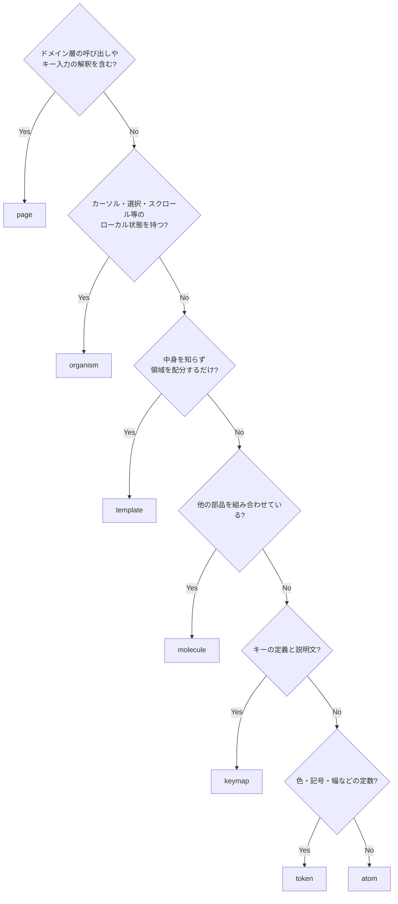
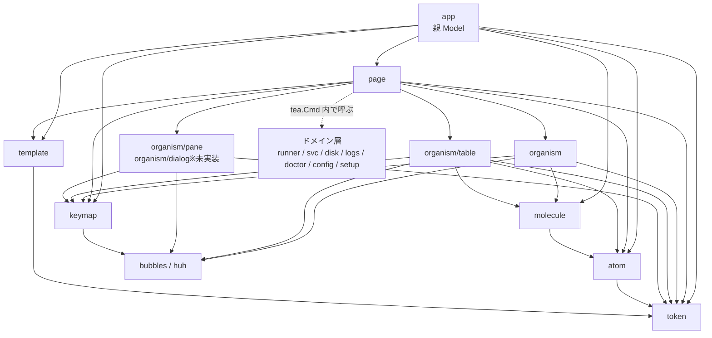

# TUI コンポーネント設計（Atomic Design）

画面の見た目とキーバインドは [画面・キーバインド仕様](screens.md)、パッケージ全体の分割は [コンポーネント設計](../components/overview.md)、UI 層の位置づけは [アーキテクチャ設計](../architecture/overview.md) を参照。

## この文書の目的

`screens.md` は「何が表示され、どのキーで何が起きるか」を定める。本書は **その表示を構成する部品をどう分割し、どこに置き、どう組み立てるか** を定める。

狙いは 2 つある。

1. **同じ表示を画面ごとに再実装しない。** サービス状態の記号、確認ダイアログ、一覧のカーソル移動は複数のタブに現れる。実装が分かれると挙動が食い違う。
2. **設計原則を構造で守る。** 「色に依存しない」「確認を経ない破壊的操作の経路を作らない」「無効な操作は理由を示す」といった原則を、規約ではなく部品の配置で担保する。

## 適用方針

Atomic Design は Web UI 向けの分類だが、本 TUI では次のように読み替える。判断基準は **状態を持つか** と **中身を知るか** の 2 点である。

| 階層 | TUI での定義 | 状態 | 型 |
|------|------------|------|-----|
| token | 色・記号・幅・余白。色は背景の明暗と色の可否を引数に取って解決する | なし | 定数 / `token.NewStyles(dark, color bool) Styles` |
| keymap | キーとヘルプ文言の定義。`bubbles/key.Binding` の集約 | なし | `key.Binding` / `key.Map` |
| atom | それ以上分解すると意味を失う最小の表示単位 | なし | `func(...) string` |
| molecule | atom を並べた「意味のある 1 行 / 1 区画」 | なし | `func(...) string` |
| organism | カーソル・選択・スクロール・入力などのローカル状態を持つ部品 | ローカル状態 | `bubbles` 流（具体型を返す `Update` と `View() string`）※ |
| template | 画面共通の枠。中身を知らず領域の配分だけを行う | サイズのみ | `func(...) string` |
| page | タブ 1 枚。ドメイン層の呼び出しとキー入力の解釈を担う | 画面状態 | `tea.Model` |

token と keymap は Atomic Design 本来の 5 階層には含まれない。token は `screens.md` の設計原則 4（色に依存しない）と列の省略順を、keymap は「キーとその説明文」を 1 箇所に集約するために独立させる。キー定義が page ごとに散ると、フッタ・ヘルプ・詳細画面の操作リストで説明文が食い違う。

※ organism は `tea.Model` を実装せず、`bubbles` の各部品と同じ「具体型を返す `Update` と `View() string`」に揃える。一覧（`organism/table.Model[T]`）はジェネリック型であり、`Update` の戻りを `tea.Model` に潰すと呼び出し側で毎回型アサーションが必要になって panic 経路が増えるためである。また `View()` が `tea.View` を返すと、organism を縦に並べて合成するたびに文字列へ戻す処理が入る。「interface は `Executor` / `doctor.Check` / `tea.Model` の 3 つに限る」という規則（[コンポーネント設計](../components/overview.md#主要な-interface-一覧)）は、`tea.Model` を page と親 Model に限定しても満たされる。

親 Model（`ui.App`）は階層の外に置く。検出結果・`Caps`・端末サイズ・背景の明暗・現在のタブを保持し、page を切り替える唯一の主体である。**モーダルの重なりは持たない**（page が持つ。後述の「状態の所有」）。親が知るのは「1 枚以上開いているか」だけである。

### 階層の決め方

新しい部品はこの順で判定する。



## ディレクトリ構成

```
internal/ui/
  app.go            親 Model（ページ切替・検出結果・Caps・端末サイズ・背景の明暗・Tick）
  keys.go           キーの配送（ctrl+c と、page が差し戻したグローバルキーの解釈）
  chrome.go         ヘッダ・タブ行・状態行・フッタの中身の組み立て
  discover.go       自動更新（Tick）と検出の Cmd
  tabs.go           タブのメタ情報のスライス
  token/            色・記号・幅・余白の定数
  keymap/           キー定義とヘルプ文言（key.Binding）
  atom/             最小の表示単位（純粋関数）
  molecule/         atom を並べた 1 行 / 1 区画（純粋関数）
  organism/         カーソルと選択を持つ対話的な部品（ChoiceList）
  organism/table/   区画に分かれた一覧の共通実装（Model[T]）
  organism/pane/    スクロールする表示専用の領域（Detail / Help）
  organism/dialog/  承認・待機・入力（未実装。後述の「実装状況」）
  template/         画面共通の枠
  page/             タブ共通の Msg と、タブ間で共有する部品（モーダルの重なり・page の寿命）
  page/action/      runner に対する操作の識別・可否の判定・一覧の組み立て
  page/<tab>/       タブ 1 枚（tea.Model）。runners / jobs / disk / logs / doctor / config / setup
  page/runnerdetail/ runner の詳細画面（Runners / Jobs が共用するモーダル）
  page/pagetest/    page/<tab> のテスト用フィクスチャ（共有状態と Msg の記録）
```

`page/pagetest` は `page` 自身の内部テストからは使えない（import が循環する）。`page` のテストは自前のスタブを持つ。

階層をパッケージで分けることで、**依存の方向を Go の import で機械的に強制する**。

**タブをサブパッケージに分けるのは行数上限のためである。** 行数チェック（`linterly`）の上限は 1 ディレクトリ 2000 行（テストを含む）で、集計は直下のファイルのみを対象とする。7 タブを `page/` に平置きすると 4 タブ目で上限に達するため、タブごとにパッケージを掘って独立した枠を持たせる。副作用として `page/<tab>` → `page` の一方向依存が Go の import で強制され、タブ同士が参照し合えなくなる（タブ間で共有する状態は親のみが持つという規則と揃う）。ドメイン層に対する「ドメインは `ui` に依存しない」という規則（[コンポーネント設計](../components/overview.md#依存の規則)）と同じ考え方を UI の内部にも適用する。

パッケージ名は単数形にする。呼び出し側で `atom.StatusText` のように階層が読めるため、識別子に階層名を重ねない（`atom.AtomStatusText` は禁止）。

## 依存の方向



親 Model（`ui`）が `keymap` / `molecule` / `atom` / `token` を直に import するのは、本体以外の領域（ヘッダ・タブ行・状態行・フッタ）を組み立てるのが親だからである（`chrome.go`）。上位から下位への飛び越し参照は許容する規則に収まる。

### 依存の規則

| 規則 | 理由 |
|------|------|
| `token` は `lipgloss` のみ import する | 最下層。色の定義を token の外に作らない。`huh.Theme` の組み立てを足すときも token 内に置く（後述の「`Form` と huh」。`huh` は未導入） |
| `keymap` は `bubbles/key` のみ import する | token と並ぶ最下層。キー定義が他の階層に依存すると参照方向が壊れる |
| `atom` は `token` と `lipgloss` のみに依存する | 表示単位を単体でテストできる状態に保つ。`lipgloss` を許すのは表示幅の計算（`lipgloss.Width`）と ANSI 安全な切り詰めのためで、**幅を数える実装をここ 1 箇所に閉じる**という規則の裏返しである |
| `molecule` は `atom` / `token` と `lipgloss` のみ。**molecule 同士は参照しない** | 同階層参照を許すと階層が意味を失う。共通化したい場合は atom に降ろすか organism に上げる |
| `organism` は `molecule` / `atom` / `token` / `keymap` と `bubbles` / `bubbletea` / `lipgloss` を使う | 一覧・スクロール・テキスト入力・フォームの実装は既存ライブラリに委ねる。`bubbletea` を許すのは `Update(tea.Msg)` と `tea.Cmd` のためで、`tea.Model` は実装しない（※） |
| `organism` と `organism/table` / `organism/pane` / `organism/dialog` は**どの向きにも import しない** | 分割の目的は行数上限の分散であり、部品同士の依存を増やすことではない。組み合わせるのは `page` |
| `template` は `token` と `lipgloss` のみ。`organism` / `page` を import しない | 枠が中身を知ると、画面ごとに枠が分岐する。`lipgloss` は行の切り詰め（装飾済み文字列の ANSI 列を壊さないため）に使う |
| `atom` / `molecule` / `template` は **bubbletea / bubbles を import しない** | 純粋関数に保ち、期待文字列との比較でテストできるようにする |
| `keymap` を読むのは `page` / 親 Model / `organism`（`organism/table` / `organism/pane` を含む）。`atom` / `molecule` にはキー文字列・説明・可否・理由をプリミティブに落として渡す | organism は `bubbles` の既定キーマップを差し替えるために `key.Binding` を必要とする（後述の「`Table` を 1 つに統一する」）。境界は **molecule 以下** に引く。`atom.KeyHint` の入力を単純な文字列に保ち、`key.Binding` の組み立てなしにテストできる |
| ドメインの型（`runner.Runner` など）は `organism` 以上でのみ扱う | 表示部品がドメインモデルの変更に引きずられない。molecule 以下は表示用の構造体とプリミティブのみを受け取る |
| ドメイン層を `tea.Cmd` で呼ぶのは `page` 階層と親 Model のみ | 副作用の発生点を限る。**タブ内の操作は必ず `page`**（`page.Do` を通す。後述の「ドメイン呼び出しの差し戻し」）。runner の検出だけは全タブで共有する状態なので親 Model が駆動する（[コンポーネント設計](../components/overview.md#internalui)） |
| 上位から下位への飛び越し参照（`page` → `atom` など）は許容する | 中間層に意味のない中継を作らない |
| 下位から上位への参照・循環は禁止 | — |

## token

### 色

トークンは 2 種類に分ける。**「状態」と「表示上の役割」を同じ型にすると、色と記号を対で持つ規則（後述）の適用範囲が曖昧になる**ためである。役割トークンに記号を要求しても意味がなく、`Icon(Muted)` が「systemd ユニットなし」の `-` を返すような誤用を招く。

| `StateToken`（状態。色と記号を**必ず対**で持つ） | 用途 |
|---------|------|
| `StateOK` | 正常・成功 |
| `StateWarn` | 警告・閾値超過 |
| `StateFail` | 異常・失敗 |
| `StateSkip` | 実行不可・スキップ |

| `RoleToken`（表示上の役割。色のみ） | 用途 |
|---------|------|
| `RolePlain` | 装飾なし |
| `RoleOK` / `RoleWarn` / `RoleFail` / `RoleSkip` | 状態トークンに対応する色 |
| `RoleMuted` | 補足情報・グレーアウト |
| `RoleAccent` | カーソル位置・選択行 |
| `RoleDanger` | 破壊的操作の警告文 |

状態トークンから役割トークンへは一方向に変換できる（`StateToken.Role()`）。記号を引けるのは状態トークンのみで、役割トークンを渡すとコンパイルエラーになる。

**各色は明背景用と暗背景用の 2 値を持つ。** token は定数の集合ではなく `token.NewStyles(dark, color bool) Styles` として解決する。白背景の端末で補足情報が読めなくなることを防ぐためである。第 2 引数で色そのものを無効化できるのは、`NO_COLOR` / `--no-color` / 非 TTY の判定を `cmd` が 1 つの値に決めて渡す設計に合わせるためである（後述の「背景の明暗と NO_COLOR」）。

### 記号

| トークン | 記号 | 意味 |
|---------|------|------|
| `IconActive` | `●` | サービス稼働中 |
| `IconInactive` | `○` | サービス停止中 |
| `IconFailed` | `✗` | 異常終了・FAIL |
| `IconNoUnit` | `-` | systemd ユニットなし |
| `IconUnknown` | `?` | 状態を取得できなかった・判定不能 |
| `IconJob` | `▶` | ジョブ実行中 |
| `IconWarn` | `⚠` | 注意事項あり・WARN |
| `IconOK` | `✓` | OK・完了 |
| `IconSkip` | `⊘` | SKIP |
| `IconCursor` | `▸` | カーソル位置 |
| `IconChecked` / `IconUnchecked` | `[x]` / `[ ]` | 複数選択の状態 |
| `IconDivider` | `─` | 区画の区切り |
| `IconEllipsis` | `…` | 幅に収まらない文字列の中略 |

記号は `screens.md` の記号表と一対一で対応する。表示に使う記号をここ以外に書かない。

### 色と記号の対

**状態を表すトークンは、必ず色と記号の対で定義する。** 色だけで区別する状態を作らない（`screens.md` の設計原則 4）。

### 背景の明暗と NO_COLOR

色の解決に必要な入力は 2 つある。どちらも **親 Model が保持し、下位へ渡す**。token 側に環境を読む処理を置かない。

| 入力 | 取得元 | 扱い |
|------|-------|------|
| 背景の明暗 | 起動時に端末の背景色を問い合わせる。**応答は起動後に届き**（`tea.BackgroundColorMsg`）、利用者が端末の配色を変えるなどで**切り替わることもある**ため、届くたびに判定し直す | 親 Model が保持し、`token.NewStyles` の第 1 引数にする。届くたびに `token.Styles` を解決し直し、page → organism → molecule / atom へ**配り直す**。応答が得られない端末では暗背景として扱う |
| 色を使うか | `NO_COLOR` / `--no-color` / 非 TTY | `cmd/gsr-helper` が判定して親 Model に渡す。`token.NewStyles` の第 2 引数にし、無効時は素通しのスタイルを解決する |

**配色の解決は起動時の 1 回では終わらない。** 最初のフレームは背景色が未確定のまま描かれるため、暗背景として解決した配色で一度描いた後に応答が届く。届いた時点で解決し直して配り直さないと、白背景の端末に濃色向けの薄い色が残って読めなくなる。配り直しを受け取る側の義務は後述の「page と organism の受け渡し」に置く。

`NO_COLOR` の判定を `cmd` に置くのは、`--no-color` フラグとの合流点を 1 箇所にするためである。`lipgloss` 自身もカラープロファイルを判定するが、**本ツールの表示可否はこの 1 つの値で決める**。判定箇所が 2 つあると、片方だけ効いた状態を追えなくなる。

素通しのスタイルでも記号は残る。色と記号を対で定義しているため、`NO_COLOR` でも状態は判別できる。スピナーのアニメーションは静止した記号に差し替える。

### 幅

| トークン | 値 | 由来 |
|---------|-----|------|
| `WidthTarget` | 80 | 保証する最小端末幅（[非機能要件](../requirements/non-functional.md#ユーザビリティ)） |
| `WidthMin` | 60 | これを下回ると表示不能とする（[画面仕様](screens.md#端末幅による列の省略)） |
| `Column` | 識別子・見出し・幅・寄せの組 | 列の定義。`organism/table` が `table.Column` に変換する |
| `ColumnRules` | `Drop []string` / `Keep []string` | 幅が足りないときの落とし方。**一覧の区画ごとに持つ** |
| `RunnerColumnRules()` | Drop: `_WORK` → `VERSION` → `MANAGED` → `SCOPE` / Keep: `NAME` / `SVC` / `JOB` | runner を並べる一覧（Runners / 孤児ユニット / Jobs）の落とし方（[画面仕様](screens.md#端末幅による列の省略)） |

**落とす順は共有の 1 本ではなく区画の定義が宣言する。** 共有にすると、別の列を持つタブ（Disk / Logs / Doctor）を足すたびにその並びを直すことになる。`ColumnRules` のゼロ値は「順の指定なし・落とさない列なし」を意味し、末尾から落ちる。

列の**集合**（`RunnerColumns()` / `OrphanColumns()` / `JobColumns()`）は `token` に残す。区画の定義が持つのは落とす**順**だけである。集合をタブのパッケージへ移すと、幅に対する不変条件のテスト（`organism/table`）がタブを参照できず（organism は page を import しない）検証できなくなる。

各列の幅は `token.WidthTarget`（80）に全列が収まるように定めてある。行頭に 6 セル（カーソル 1 + 間隔 1 + チェックボックス 3 + 間隔 1）を見積もるため、列を足すときはこの余裕を確認すること。

列の省略は `molecule.Columns` が決め、行を返す molecule（`RunnerRow` など）と `organism/table` はその結果をそのまま使う。**見出しは `bubbles/table` が描く**ため molecule 側に見出し用の部品は置かない。列幅の調整箇所を 1 つに保つことで、ヘッダと行の桁がずれる経路を作らない。

### `molecule.Columns` の契約

```go
func Columns(all []token.Column, width int, rules token.ColumnRules) []token.Column
```

落とし方は 2 段で、**収まった時点で止まる**。

1. `rules.Drop` の順に落とす
2. それでも収まらなければ、残った列の**末尾から**落とす（右側の列ほど補足的な情報である）

どちらの段でも `rules.Keep` の列は落とさない。宣言された順だけに頼らないのは、孤児ユニットの `NOTE` や Jobs の `WORKER PID` のように「落とせる列が 1 つも無い」区画ができてしまうためである。

契約は 2 つある。

| 契約 | 内容 |
|------|------|
| 空を返さない | `all` が空でなければ結果も空にならない。**最後の 1 列は幅が足りなくても残す** |
| 幅は超え得る | 上の帰結として、結果の合計幅が `width` を超えることがある |

**「返した列は必ず幅に収まる」という契約は置かない。** 列が 0 個になると見出しも行も描けず、常時表示の列を持たない区画（Jobs タブ）が空の表になる。桁が溢れるより、1 列でも情報が出ている方がよい。

幅が本当に足りない場合に**表示不能と判断するのは `template.Frame` の責務**である。`token.WidthMin`（60）を下回る幅では本体を描かず、必要な幅と現在の幅を示す縮退表示に置き換える。したがって「列がはみ出す」のは 60 以上の幅で最小の列すら収まらない場合に限られる。

## atom 一覧

| atom | 引数 | 出力例 | 使用箇所 |
|------|------|-------|---------|
| `StatusText` | サービス状態 | `● active` / `○ inactive` / `✗ failed` / `-` と役割トークン | Runners |
| `JobText` | 実行中か・経過時間 | `▶ 4m12s` / `idle` と役割トークン | Runners / Jobs |
| `DoctorStatus` | OK / WARN / FAIL / SKIP | `✓ OK` / `⊘ SKIP` | Doctor |
| `Cursor` | カーソル行か | `▸` / 空白 | 全一覧 |
| `Checkbox` | 非表示 / 未選択 / 選択 | `[x]` / `[ ]` | Runners / Disk |
| `WarnMark` | 注意の有無 | `⚠` | Runners / Disk / Config |
| `Bytes` | バイト数 | `31.2G` | Runners / Disk |
| `Files` | ファイル数 | `412,003` | Disk |
| `Duration` | 経過時間 | `4m12s` | Runners / Jobs / ドレイン待機 |
| `Ratio` | 使用率・警告閾値 | `82% ⚠` | ヘッダ / Disk |
| `VersionText` | 現行・最新 | `2.309.0 ⚠` と役割トークン | Runners |
| `KeyHint` | キー・説明・可否・不可の理由 | `x:停止` / グレーアウト＋理由 | フッタ / ヘルプ |
| `Path` | パス・最大幅 | 中略付き `/opt/…/_work/bar` | 全画面 |
| `Cell` | 文字列・幅・寄せ | 幅を揃えた 1 セル | 全一覧 |
| `Divider` | 幅・見出し | `─ 孤児ユニット ─────` | Runners / Config |
| `Truncate` / `Pad` / `Justify` | 文字列・幅 | 幅に収めた文字列 | 全画面 |
| `Hint` | — | `KeyHint` の入力（キー・説明・可否・理由） | フッタ / 詳細画面 |

タブ 3〜7 でのみ使う atom（`DoctorStatus` / `Bytes` / `Files` / `Ratio`）は未実装である（後述の「実装状況」）。

`Cell` は日本語を含む表の桁ずれを防ぐための atom。**文字列の表示幅の計算は `lipgloss.Width` に一本化し、この atom に閉じる。** 上位の階層は「どの列を何文字幅で置くか」を決めるだけで、幅そのものを数えない。

幅を測る実装を 2 つ持たないこと。`bubbles/table` も列幅の調整に `lipgloss` の幅計算を使うため、別のライブラリで数えた幅を混ぜると絵文字や結合文字を含む行で桁が 1 つずれる。この理由から `go-runewidth` は依存に加えない（[非機能要件の依存ライブラリ](../requirements/non-functional.md#依存ライブラリ)）。

`KeyHint` は可否と理由を受け取って描くだけで、**可否の判断はしない**（後述の「操作可否の判定」）。

## molecule 一覧

| molecule | 内容 | 対応する画面 |
|----------|------|------------|
| `Columns` | 一覧の列定義（見出しと幅）。幅トークンに従って列を落とす | 全一覧 |
| `RunnerRow` | runner 1 行のセル列（名前 / スコープ / 起動方式 / サービス / ジョブ / バージョン / `_work`） | Runners |
| `OrphanRow` | 孤児ユニット 1 行のセル列（[FR-05](../requirements/functional.md)） | Runners |
| `JobRow` | 実行中ジョブ 1 行のセル列 | Jobs |
| `DiskTargetRow` | 削除候補 1 行のセル列（選択状態・サイズ・ファイル数・パス・選択不可の理由） | Disk |
| `FSSummaryLine` | ファイルシステム要約（使用率・inode・閾値超過） | Disk / ヘッダ |
| `DoctorRow` | 診断結果 1 行のセル列 | Doctor |
| `LogLine` | ログ 1 行（`ERROR` / `WARN` の強調、フィルタ一致のハイライト） | Logs |
| `SettingRow` | 設定項目 1 行（項目名・現在値・注意書き） | Config |
| `DiffLine` | 差分 1 行（`-` / `+` / 変更なし） | Config |
| `ProgressRow` | 進捗 1 行（`✓ 完了` / `▶ 実行中…` / `待機`） | Setup / Disk |
| `ActionRow` | 操作 1 行（キー・説明・影響・不可の理由）。`atom.KeyHint` を用いる | 詳細画面の操作リスト |
| `CommandBlock` | 実行するコマンド全文の整形（折り返し・継続行） | 確認ダイアログ全般 |
| `KeyBar` | `KeyHint` の並び。収まらない分は `?:ヘルプ` に集約する | フッタ |
| `TabBar` | `[1]Runners [2]Jobs …`。無効なタブはグレーアウト | 共通レイアウト |
| `CapsBar` | `host: build01  root  gh: 認証済み`（root が無ければ `read-only`、systemctl が無ければ `systemd なし` を挟む） | ヘッダ |
| `SummaryCounts` | `OK 14  WARN 2  FAIL 1  SKIP 1` | Doctor / 状態行 |

このうち実装済みは `Columns` / `RunnerRow` / `OrphanRow` / `JobRow` / `ActionRow` / `KeyBar` / `TabBar` / `CapsBar` である。残りはタブ 3〜7 とダイアログのものなので未実装である（後述の「実装状況」）。

行を返す molecule（`RunnerRow` など）は **`cols` と同じ順・同じ数のセルを返す**。`bubbles/table` は行のセルを走査しながら同じ添字の列定義を引くため、数が合わないと桁がずれるか添字範囲外で panic する。知らない列 ID を渡された場合も空のセルを返して数を欠かさない。

`CommandBlock` は **マスク済みの文字列を受け取るだけ**とし、UI 側でマスク処理を実装しない。トークンのマスクは `exec` 層の責務である（[セキュリティ設計](../architecture/security.md)）。二重に実装すると、どちらかが漏れたときに気付けない。

## organism 一覧

パッケージは後述の「organism の分割方針」に従う。

| organism | パッケージ | ローカル状態 | 使う既存部品 | 責務 | 状況 |
|----------|-----------|------------|------------|------|------|
| `Model[T]` | `organism/table` | カーソル位置・選択集合・絞り込み文字列 | `bubbles/table`（区画ごとに 1 つ）/ `textinput` | 一覧の共通実装。区画（セクション）に対応する | 実装済み |
| `ChoiceList` | `organism` | カーソル位置 | — | Setup のメニュー、反映方法の選択、**詳細画面の操作リスト** | 実装済み |
| `Detail` | `organism/pane` | スクロール位置 | `bubbles/viewport` | Doctor の詳細、runner の詳細（情報部分） | 実装済み |
| `Help` | `organism/pane` | スクロール位置 | `bubbles/help`（`FullHelpView`） | `?` の全キー一覧 | 実装済み |
| `LogPane` | `organism/pane` | ペインの選択・追従の ON/OFF・フィルタ | `bubbles/viewport` / `textinput` | Logs の 2 ペイン。追従・手動スクロールでの解除・`G` での再開 | 未実装（Logs タブ） |
| `ProgressList` | `organism/pane` | 進捗の受信状態 | `bubbles/spinner` / `progress` | 一括処理の逐次表示と結果報告（[FR-15](../requirements/functional.md)） | 未実装（Setup / Disk タブ） |
| `Confirm` | `organism/dialog` | なし（既定はキャンセル） | — | 破壊的操作の共通ダイアログ | 未実装 |
| `DiffApproval` | `organism/dialog` | なし（既定はキャンセル） | — | 差分＋バックアップパスの提示と承認 | 未実装（Config タブ） |
| `DrainWaiter` | `organism/dialog` | 対象ジョブ | `bubbles/stopwatch` / `spinner` | ドレイン待機。経過時間の計時、制約の注記と `esc` でのキャンセル | 未実装 |
| `Form` | `organism/dialog` | `huh.Form` | `huh` | フォームのラッパー。テーマの適用と検証エラーの表示位置を統一する | 未実装（`huh` も未導入） |
| `ErrorBanner` | `organism` | なし | — | 失敗の表示 | 未実装 |

一覧の共通実装は `organism/table.Model[T]`（生成は `table.New`）である。パッケージ名が型名を兼ねるため、本書で `Table` と書くのはこの型を指す。`bubbles/table` はこのパッケージ内で `btable` として import する（名前の衝突を避けるため）。

`organism/dialog` は**このパッケージ自体がまだ存在しない**。置く部品が確定しているので分割方針としては定義を残すが、実装は各ダイアログを持ち込む Issue が作る（後述の「実装状況」）。

スクロール・計時・アニメーションを自前で実装しない。上の表で「—」の部品は、いずれも既存部品に対応するものがないか、対応させると要件を満たせないものである（`ChoiceList` は区切り線と無効項目の理由表示を持つため）。

### `bubbles/progress` を使う範囲

進捗バーは **全体件数が事前に確定する処理に限る**。一括追加（`n` 台中 `m` 台完了）と、選択済み対象のクリーンアップがこれに当たる。

ディスク集計とドレイン待機ではバーを使わず、`spinner` と `stopwatch` で「動いていること」と経過時間のみを示す。ドレイン待機は待ち時間が無制限（[FR-07](../requirements/functional.md)）で、集計は対象ごとに判明順で埋まるため、分母を示すと完了時期を約束する表示になってしまう。

### `Table` を 1 つに統一する

Runners / Jobs / Disk / Doctor の 4 タブは、いずれもカーソル移動・複数選択・ページ送り・絞り込みという同じ操作を持つ（[画面仕様のキーマップ](screens.md#一覧runners--jobs--disk--doctor)）。`Table` は **`bubbles/table` のラッパー**とし、キー処理を 1 箇所に集約する。

```go
// Model は一覧の共通実装。bubbles/table のラッパーであり、
// 区画（セクション）ごとに btable.Model を 1 つ持つ。
type Model[T any] struct {
    sections  []section[T]    // 区画ごとの btable.Model と行データ
    focus     int             // キー入力を受け取る区画
    checked   map[string]bool // 選択集合。キーは行の識別子
    filter    textinput.Model // 絞り込み
    filtering bool            // 入力モードか
}

// SectionInput は 1 区画の定義。page が区画ごとに 1 つ渡す。
type SectionInput[T any] struct {
    Title      string                      // 区切り線の見出し。空なら区切り線を出さない
    Columns    []token.Column              // 幅が足りる場合に表示する全列
    Rules      token.ColumnRules           // 幅が足りないときの落とし方
    Render     RenderRow[T]                // 1 行をセルの列に変換する関数
    ID         RowID[T]                    // 行の識別子（選択集合のキー）
    Match      func(item T, q string) bool // 絞り込みの一致判定。nil なら絞り込まない
    Disabled   RowDisabled[T]              // 行ごとの選択可否。nil なら全行を選択できる
    Selectable bool                        // 区画ごとの選択可否
}

// RenderRow は 1 行をセルの列に変換する。
type RenderRow[T any] func(in RowInput[T]) []string

// RowInput は 1 行を描くのに必要な値。
type RowInput[T any] struct {
    Item     T
    Cols     []token.Column // この幅で実際に表示する列。セルはこの数だけ返すこと
    Styles   token.Styles
    Reason   string // 行を選択できない理由。Disabled が真のときだけ入る
    Disabled bool   // 行を選択できないか
}

// RowID は行の識別子を返す。選択集合のキーに使う。
type RowID[T any] func(item T) string

// RowDisabled は行を選択できないかと、その理由を返す。
type RowDisabled[T any] func(item T) (reason string, disabled bool)
```

**引数を構造体（`RowInput`）にするのは、行の描画に渡す値が増えても `Render` の署名を変えないためである。** `Render` はタブごとに差し替えて使い回すので、署名を変えると全タブと `organism/table` のテストに波及する。

`Render` と `Table` の分担は次のとおり。

| 描くもの | 担当 |
|---------|------|
| カーソルのガター列（1 セル。先頭） | `Table` |
| チェックボックスのガター列（3 セル。カーソルの次） | `Table`。`Selectable` な区画のみ |
| `Cols` に対応するセル（`len(Cols)` 個） | `Render` |
| 選択できない理由をどのセルに載せるか | **`Render` が決める** |

理由を載せる列を `Render` が決めるのは、理由を置ける列を持っているかがタブごとに違う（列の集合を決めるのはタブ）ためである。`Reason` は `Disabled` が真のときだけ入る（`Table` が偽のときは空にする）。判定関数は「選べない理由」を常に返す実装になりがちで、そのまま渡すと全行に理由が出るためである。

**カーソルのセルがチェックボックスより先である。** カーソルのガター列は行頭に固定で、選択モードの有無で位置が動いてはならない。

ジェネリクスは維持する。page はドメインの型のまま行を渡し、セル列への変換は molecule が担う。molecule が返すのは `[]string` であり、`table.Row` への変換は `Table` の側で行う（molecule は `bubbles` を import しないという規則を保つため）。列定義も同様に、`token` が `token.Column` を定め、`Table` が `table.Column` に変換する。

`Render` に渡す関数は **page 側に置いた薄いラッパー**にする。`molecule.RunnerRow(v, cols, styles)` は表示用の構造体（`molecule.RunnerView`）を受け取る純粋関数なので、`RowInput` からドメインの型を表示用の値へ落とす変換は page が行う（molecule はドメインの型を受け取らないという規則）。

`bubbles/table` は行を `table.Row` として持ち、カーソル移動・スクロール・列幅の調整を担う。本ツールが必要とする残りは `Table` が受け持つ。

**`bubbles` の既定キーマップは必ず差し替える。** `table.DefaultKeyMap()` は `u` / `d` をハーフページ送り、`f` / `space` を次ページ、`b` を前ページに割り当てており、本ツールの `u`（バージョン更新）/ `d`（ドレイン停止）/ `space`（選択のトグル）を奪う。`viewport` の既定も `u` / `d` / `f` / `b` に加えて `h` / `l` を使い、`l`（ログを開く）と衝突する。`Table` と `Detail` は `keymap` の定義から組み立てた `KeyMap` を渡し、ページ送りは `ctrl+f` / `ctrl+b` のみに割り当てる。既定キーでスクロールしないことを回帰テストで固定する。

**行のセル数は列数に揃える。** `bubbles/table` の行の描画は行のセルを走査しながら同じ添字で列を引くため、セル数が列数を超えると添字が範囲外になって panic する。`molecule` が返す `[]string` を `table.Row` に変換する時点で `Table` が列数に合わせて詰める。

| 機能 | 担当 |
|------|------|
| カーソル移動 / スクロール / 列幅の調整 | `bubbles/table` |
| 幅に収まる列の解決 | `molecule.Columns`。**横スクロールは持たない**（`bubbles/table` v2 に横スクロールのキーが無く、狭い端末では列を落とす方式にする） |
| 区画（複数の `btable.Model` を縦に並べる） | `Table` |
| 区画をまたぐカーソル移動（末尾で `j` を押すと次の区画の先頭へ） | `Table`。キーはフォーカス中の区画にのみ流す |
| 複数選択 | `Table`。選択状態は `checked` が持ち、`atom.Checkbox` の結果を**カーソルの次のセル**として `table.Row` に載せる |
| 行ごとの選択不可 | `Table`。`RowDisabled` の判定で選択キーを無視し、チェックボックスを描かない |
| 選択不可の理由の表示 | `Render`。`RowInput.Reason` を受け取り、どのセルに載せるかを決める |
| 絞り込み | `Table`。`textinput` の内容で行データを絞る |
| 絞り込みの行（`絞り込み: …`） | `Table`。**本体の 1 行目に置き、本体の高さを 1 行消費する**（下記） |

**絞り込みの行は入力中と確定後の両方で出る。** 入力を受け付けている間、または絞り込み文字列が設定されている間、本体領域の先頭に `絞り込み: <文字列>` を 1 行描き、区画へ配る行数はその分だけ減る。状態行の `入力中: 絞り込み` は「グローバルキーが効かない」ことを示す表示であり、確定後は消えるため、何で絞っているかを画面に残すにはこの行が必要である。

区画は Runners タブの孤児ユニットを下部の別区画として扱うために使う。区画ごとに操作可否を設定できるようにし、Disk タブでジョブ実行中の `_work` を選択不可にする（[FR-31](../requirements/functional.md)）。

### 詳細画面の操作リストは `ChoiceList` を使う

詳細画面（[画面仕様](screens.md#詳細画面enter)）は `organism/pane.Detail`（情報部分）と `organism.ChoiceList`（操作リスト）の組み合わせで構成し、専用の organism を作らない。`ChoiceList` は次に対応する。

| 要件 | 扱い |
|------|------|
| 区切り線 | 項目の間に区切りを置ける。破壊的な操作を線の下にまとめるために使う |
| 無効な項目 | 選択のみ可・実行不可としてグレーアウトし、理由を右に出す。可否と理由は page から渡す（`ChoiceList` は判断しない） |
| 初期カーソル | 開くたびに先頭（安全側）へリセットする。前回の選択を保持しない（[FR-46](../requirements/functional.md)） |

反映方法の選択（Config）と Setup のメニューも同じ `ChoiceList` である。**選択肢を並べて 1 つ選ぶ UI をこれ以外に作らない。**

### `Confirm` を 1 つに統一する

> **実装状況: 未実装。** `organism/dialog` と `Confirm` はまだ存在しない。この節は、確認を伴う操作を持ち込む Issue が守る規約である。

`screens.md` に現れる確認（停止 / 強制停止 / 削除 / バージョン更新 / クリーンアップ / 追加のプレビュー / 設定の書き込み）は、すべて **対象・影響・実行するコマンド・`y/N`** という同じ構造を持つ。

```go
type ConfirmInput struct {
    Title   string   // 「クリーンアップの確認」
    Targets []string // 対象の一覧
    Impact  []string // 影響・警告（ColorDanger で描く）
    Command []string // 実行するコマンド全文（マスク済み）
    Note    []string // 補足（「復元できません」など）
}
```

破壊的操作の確認を組み立てる経路をこの 1 つに限定することで、「確認を経ない削除経路は設けない」（[FR-30](../requirements/functional.md)）を構造として守る。`enter` はキャンセル側に割り当てる（`screens.md` のキーマップ）。個別のダイアログ organism を追加しない。

### `Form` と huh

> **実装状況: 未実装。`huh` は依存にも入っていない。** Config / Setup タブのフォームを持ち込む Issue が `huh` の追加と併せて実装する（[非機能要件の依存ライブラリ](../requirements/non-functional.md#依存ライブラリ)）。

`Form` は `huh.Form` のラッパーである。`huh` はキー処理・検証・レイアウトを自分で持つため、ラッパーの責務は次の 3 点に限る。

| 責務 | 扱い |
|------|------|
| テーマの適用 | `token` が組み立てた `huh.Theme` を渡す。フォームだけ配色が浮くことを防ぐ。`NO_COLOR` の縮退も同じ経路で伝わる |
| 完了・中断の通知 | フォームの状態が完了に変わった時点で、入力値を載せた `tea.Msg` を page へ返す。page はそれを受けてドメイン層の `tea.Cmd` を発行する。`Form` 自身はドメインを呼ばない |
| 中断の確認 | `esc` を受けたとき、入力済みの項目が 1 つ以上あれば `Confirm` を重ねて破棄の可否を問う。入力が空なら即座に前の画面へ戻る |

`esc` で即座に破棄しないのは、`n`（追加）の一括ウィザードのように入力項目が多い画面で、打ち間違いによる `esc` が入力全体を失わせるためである。破棄の確認にも `Confirm` を使い、確認ダイアログの実装を増やさない。

### `Help` と `bubbles/help`

`?` の全キー一覧は `bubbles/help` の `FullHelpView` に描かせる。列組みと折り返しを自前で持たないためである。

**出すキーの範囲は画面ごとに違う。** `keymap.Set.Help(groups ...[]key.Binding)` にその画面が使うグループを渡して組み立てる。`Global` は常に先頭に付き、空のグループは飛ばす。全画面で同じ一覧を返すと Disk / Logs / Config のキーが Runners のヘルプにも並び、逆に画面ごとの一覧を `keymap` に列挙するとタブを足すたびに共有のメソッドを直すことになる。

| 範囲 | 中身 |
|------|------|
| `Set.RunnerListHelp()` | `Global` + 一覧のキー + 絞り込み中のキー + runner の操作キー。runner を並べるタブ（Runners / Jobs）用で、モーダルの重なり（`Overlay`）の既定 |
| `Set.Help(...)` | それ以外のタブが自分のグループを渡して組む |

**一覧のキーと絞り込み中のキーはグループを分ける。** `List.Bindings()` は通常時のキー（`enter` = 詳細を開く、`esc` はグローバルの戻る）、`List.FilterBindings()` は入力中のみ有効な `enter`（絞り込みを確定）と `esc`（絞り込みを取消）である。混ぜると `enter` が「確定」と「詳細を開く」の 2 行で並び、どちらが効くのか読み取れない。

`Help` はスクロールする。キー数が高さを超える端末で続きへ辿れないためである。`j` / `k` / `ctrl+f` / `ctrl+b` / `g` / `G` で動き、リサイズ時は位置を範囲内に丸める（幅が変わると `bubbles/help` の列組みが変わって行数も変わる）。フッタには `j/k:スクロール` を**スクロールが必要なときだけ**出し、`esc:閉じる` は常に出す。

**フッタ（`molecule.KeyBar`）には使わない。** `bubbles/help` は無効な `key.Binding` をキーごと非表示にする設計であり、「キーを消さずグレーアウトして理由を示す」（[画面仕様の無効な操作の表示](screens.md#無効な操作の表示)）と両立しない。フッタは `keymap` の定義から `atom.KeyHint` で描く。

つまり `keymap` の定義は 2 つの経路で使われる。`?` のヘルプは `bubbles/help` が、フッタと詳細画面の操作リストは `atom.KeyHint` / `molecule.ActionRow` が読む。キーと説明文の出どころが 1 つである限り、両者は食い違わない。

## template 一覧

| template | 領域 | 使用箇所 | 状況 |
|----------|------|---------|------|
| `Frame` | ヘッダ / タブ行 / 本体 / 状態行 / フッタ | 全画面 | 実装済み |
| `Modal` | 中央寄せのオーバーレイ枠 | runner の詳細 / ヘルプ（今後 `Confirm` / `DrainWaiter` / `DiffApproval` も） | 実装済み |
| `Split` | 左右 2 ペイン | Logs（ファイル一覧と本文）、Config（項目と現在値） | 未実装（Logs / Config タブ） |

`Frame` は `screens.md` の「共通レイアウト」に対応する。

```go
type FrameInput struct {
    Header string // molecule.CapsBar の結果
    Tabs   string // molecule.TabBar の結果
    Body   string // page の描画結果
    Status string // 警告件数・選択件数
    Footer string // molecule.KeyBar の結果
    Width  int
    Height int
}

func Frame(in FrameInput) string

// BodySize は Body に割り当てられる領域を返す。親 Model が算出して page に渡す。
func BodySize(width, height int) (w, h int)

// ChromeHeight は本体以外が使う行数。7 に固定する。
const ChromeHeight = 7

// ModalPadding は Modal の枠と見出しが使う幅と行数を返す。
// モーダルの中身へ配る領域の算出に使う。
func ModalPadding() (w, h int)
```

`Frame` は `Body` の中身を解釈しない。幅が `token.WidthMin` を下回る場合は本体を描かず、表示不能である旨と必要な幅・現在の幅のみを出す。縮退表示も端末の高さに収める（案内は折り返すため、幅が数セルしかない端末では枠を組むより行数が増える）。

`ModalPadding` を公開するのは、モーダルの中身が使える領域を算出する側（`page.Overlay`）に非公開定数の写しを持たせないためである（`BodySize` と同じ形）。**モーダルの中身は与えられた幅で切り詰めること。** 超えると枠が広がり、下辺の枠線が領域外に出て消える。

## page 一覧

型名はパッケージ名で階層が読めるため `Model` に揃える（`runners.Model` / `jobs.Model`）。`RunnersPage` のように識別子へ階層名を重ねない。

| page | タブ | 主に使う organism | 呼ぶドメイン | 状況 |
|------|------|-----------------|------------|------|
| `runners.Model` | 1 | `organism/table` | 検出結果は親から受け取る。操作（`svc` / `setup`）は後続 Issue | 実装済み（一覧・詳細・可否の表示まで） |
| `jobs.Model` | 2 | `organism/table` | 同上（対象は runner） | 実装済み（同上） |
| `disk.Model` | 3 | `Table` / `Confirm` / `ProgressList` | `disk` | 未実装 |
| `logs.Model` | 4 | `LogPane` | `logs` | 未実装 |
| `doctor.Model` | 5 | `Table` / `Detail` | `doctor` | 未実装 |
| `config.Model` | 6 | `ChoiceList` / `Form` / `DiffApproval` | `config` / `gh` | 未実装 |
| `setup.Model` | 7 | `ChoiceList` / `Form` / `Confirm` / `ProgressList` | `setup` / `gh` | 未実装 |

runner の詳細画面は Runners / Jobs が共用するモーダルなので、どちらのタブにも属さない `page/runnerdetail` に置く（`runnerdetail.Model`。`Detail` + `ChoiceList` の組み合わせ）。

未実装のタブもタブ行には出す。**押しても何も起きないキーを作らない**ため、無効なタブとしてグレーアウトし、番号キーを押したら理由（`この版では未対応です`）を状態行に出す（[画面仕様](screens.md#共通レイアウト)）。

### タブを 1 つ追加するときに触る箇所

タブの追加が既存コードの変更をほとんど伴わないことを、この構造で担保する。**親 Model（`app.go`）は触らない。**

| 対象 | 変更内容 |
|------|---------|
| `internal/ui/page/<tab>/` | 新規パッケージ。`tea.Model` を実装し、`page.StateMsg` を受けて `page.ChromeMsg` を返す |
| `internal/ui/tabs.go` | import 1 行と、タブのメタ情報のスライスの該当行を実装済みに差し替える（`Model` を渡し `Enabled` を真にする） |
| `internal/ui/keymap/` | そのタブ固有のキーがある場合のみ、定義と `Set` への 1 フィールド |

親 Model は `[]tab` を走査するだけで個別のタブを知らない。共有状態は 1 本の `Msg` で全 page に配られるので、新しいタブは受け取り側を書くだけで済む。モーダルと入力中の有無も page が `Msg` で報告するため、親はタブの内部状態を知らない。

新しいタブが守る約束は次の 6 つである。**これを満たせば親 Model を読まずにタブを足せる。**

#### 1. 共有状態は `page.StateMsg` で受け取る

```go
type StateMsg struct {
    Result runner.Result   // 検出結果
    Caps   appconfig.Caps  // 能力判定
    Styles token.Styles    // 解決済みの配色
    Keys   keymap.Set      // キー定義
    Exec   exec.Executor   // 外部プロセス実行の唯一の経路
    Dark   bool
    BodyW  int // template.BodySize で本体領域に換算済み
    BodyH  int
    Err    error // 直近の検出エラー
}
```

親 Model は**有効で `Model` を持つ全タブへ**これを配る（選択中のタブに限らない）。裏のタブが古い配色や古い検出結果を持ったまま前面に出ることを防ぐためである。したがって page は「配られた最新のスナップショットを保持して描画に使う」形になる。

`Exec` は **`systemctl` が無い環境でも `nil` にしない。** 検出（`discover.go`）が `Executor` を `nil` にして systemd の参照を落とす縮退は `runner.ScanUnits` の契約であってこの層の約束ではない。page は systemctl を使えるかを `Caps.Systemd` で判断し、`nil` 判定を各タブに書かせない。

監査記録の失敗を受け取る口は page に配らない。`Executor` 自身が `cmd/gsr-helper` 側の通知先へ渡す。**UI から標準エラー出力へ書いてはならない**（描画が壊れる）。

#### 2. ドメイン呼び出しは `page.Do` を通して差し戻す

```go
func Do(tab int, fn func() tea.Msg) tea.Cmd  // 結果を TabMsg{Tab, Msg} に包む
```

`tab` には page 自身のタブ番号を渡す。番号は `tabs.go` のスライス上の添字（0 起点。画面に出る `[1]`〜`[7]` とは 1 ずれる）で、page の生成時に親から渡される。親は `TabMsg` を**選択中でないタブにも**発行元へ届け、`Model` を持たないタブ宛なら捨てる。包まずに `tea.Cmd` を返すと、結果が届くまでの間に利用者がタブを切り替えたときに別のタブへ渡って静かに失われる。

**bubbletea / bubbles が解釈する `Msg`（終了・順次実行など）を包んではならない。** ランタイムへ届かなくなる。包むのは自分で発行したドメイン呼び出しの結果だけである。タグの付かない非キー `Msg` は従来どおり選択中のタブへ配られる。

#### 3. モーダルは `page.Overlay` に種類を登録する

```go
type ModalKind string // 種類。page/<tab> が自分の定数を宣言する

type Modal struct {
    Model tea.Model                     // 中身。キー・SizeMsg・StateMsg・AttachMsg はここへ渡る
    Title func(m tea.Model) string      // 見出し
    Hints func(m tea.Model) []atom.Hint // フッタに出すキーヒント
    HandlesBack func(m tea.Model) bool  // esc を自分で解釈するか。nil なら常に 1 枚閉じる
}

func NewOverlay(tab int, keys keymap.Set, s token.Styles, dark bool) Overlay
func (o Overlay) Register(kind ModalKind, m Modal) tea.Cmd
func (o Overlay) Open(kind ModalKind, msg tea.Msg) tea.Cmd
func (o Overlay) OpenHelp() tea.Cmd
func (o Overlay) Close()                       // 最上位を 1 枚だけ閉じる
func (o Overlay) Active() bool                 // 1 枚以上開いているか
func (o Overlay) Handles(msg tea.Msg) bool     // page がこの Msg を Overlay へ渡すか
func (o Overlay) Modal(kind ModalKind) (Modal, bool)
func (o Overlay) SetState(st StateMsg) tea.Cmd
func (o Overlay) SetHelpScope(scope HelpScope) tea.Cmd // ? に出すキーの範囲を差し替える
```

**`Register` / `Open` / `OpenHelp` / `SetHelpScope` が返す `tea.Cmd` は呼び出し側まで返すこと。** 登録した時点・開いた時点で処理を始めるモーダル（ログの購読、差分の計算）は、この `Cmd` が捨てられるとその処理を動かせない。

**種類の取り違えは `panic` で表面化する。** 同じ `ModalKind` の二重登録と、未登録の種類の `Open` はいずれも実装の誤りである（種類は定数で、登録するのも開くのも同じ page）。黙って上書き・黙って何もしないと、症状は「`enter` を押しても何も起きない」になり、コンパイルエラーも実行時エラーもログも残らない。登録は page の組み立て時に決まるので、誤りは最初の起動で必ず表面化する。

**`SetState` は開いているモーダルにだけ配る。** 閉じているものへ毎周期配ると、誰も見ていないヘルプを 3 秒ごとに全行組み直すような無駄が積み上がる。閉じているモーダルが古い状態で描かれることは、`Register` と `Open` が最新の `StateMsg` と `SizeMsg` をリプレイすることで防ぐ（起動後に遅延登録したモーダルも、登録した時点で `Result` / `Caps` / `Exec` を持てる）。`SizeMsg` は領域が変わったときだけ配る。

`Overlay` は領域だけを設定する口を持たない。持たせても次の `StateMsg`（`BodyW` / `BodyH`）で黙って巻き戻るためである。

**page はキー以外の `Msg` の配送先を `Overlay.Handles` で決める。** 開閉だけで判断すると、宛先を明示した `page.ModalMsg` が閉じている間に捨てられ、page 宛の決定（`page.ResultMsg`）はモーダル自身へ戻って消える。

**種類を中央の `iota` に集めない。** 集めるとタブを 1 つ足すたびに共有ファイルへ定数を足すことになる。`NewOverlay` が登録するのは `page.ModalHelp` だけで、それ以外は画面が `Register` で足す（runner の詳細は `runnerdetail.Kind`、確認や差分承認は各 Issue が持ち込む）。

モーダルの中身が受け取る `Msg` は次の 6 種である。

| `Msg` | 内容 |
|-------|------|
| `page.StateMsg` | 共有状態。**開いていないモーダルにも配る**（開いた瞬間に古い配色・古い検出結果で描かれることを防ぐ） |
| `page.SizeMsg{W, H}` | 中身が使える領域（本体領域から `template.ModalPadding` を引いた値） |
| `page.AttachMsg{Tab}` | 自分が乗っているタブ番号。`Register` で届く。**モーダルが発行する `Cmd` と page へ返す決定はこの番号で `page.Do` に包む** |
| 開くときに渡した `Msg` | 「何を開くか」（対象の runner、確認の文面）。`Overlay` は種類ごとの引数を知らない |
| `page.ModalMsg{Kind, Msg}` の中身 | 宛先を明示した `Msg`。**開いていなくても、最上位でなくても**その種類へ届く（背後で始めた処理の結果を回収する経路） |
| キー | **最上位の 1 枚にいる間だけ。** `esc` は `Modal.HandlesBack` が真のときだけ中身へ届き、偽なら `Overlay` が 1 枚閉じる |

##### モーダルから page への戻り道

モーダルは自分で決めたことを実行できない（ドメイン層を呼べるのは page 階層だけ）。決定は `page.ResultMsg{Kind, Msg}` に包み、`page.AttachMsg` で受け取ったタブ番号で `page.Do` に包んで返す。

```go
res := page.ResultMsg{Kind: Kind, Msg: chosen}
return m, page.Do(m.tab, func() tea.Msg { return res })
```

- `page.Do` で包むので、**タブを切り替えても決定は発行元のタブへ戻る**
- `page.ResultMsg` で包むので、**page の `Update` が自分の `case` で受けられる**（`Overlay.Handles` は `ResultMsg` に偽を返すため、転送してモーダル自身へ帰ることがない）
- モーダルを閉じた後に届いても page が受けるので、**決定が宛先を失って静かに捨てられない**

page 側は `default`（`Overlay` への転送）より**前**に `case page.ResultMsg:` を置くこと。

#### 4. page の寿命は 3 つの `Msg` で知らせる

長寿命の処理（`journalctl -f` のようなストリーム、監視の goroutine、開いたままのファイル）を持つ page は、いつ畳めばよいかを親から知らされる。

| `Msg` | 配る先 | page がすること |
|-------|--------|-----------------|
| `page.ActivateMsg` | タブ切替の**移動先** | 畳んでいた処理を張り直す |
| `page.DeactivateMsg` | タブ切替の**離れる側** | 長寿命の処理を止め、後始末を `tea.Cmd` で返す。**状態そのものは捨てない**（スクロール位置や選択が失われると裏に回ったことが見えてしまう） |
| `page.ShutdownMsg` | **有効な全タブ** | 残っている処理をすべて閉じ、後始末を `tea.Cmd` で返す |

親は終了時、各 page が返した後始末を `tea.Sequence` で `tea.Quit` より**前**に流す。`tea.Batch` では終了と後始末が並走し、後始末が実行される前にランタイムが止まりうる。

**起動時に選択されているタブは `ActivateMsg` を受け取らない**（親は切り替えのときにだけ配る）。長寿命の処理を持つタブ（Logs / Doctor / Setup）はいずれも既定タブではないため釣り合うが、既定タブが持つようになったら親の初期化からも配る必要がある（Issue #63）。

#### 5. 操作の可否は `action.ID` で引く

操作の識別子は `action.ID`（`Start` / `Stop` / `Kill` / `Drain` / `Restart` / `Enable` / `Add` / `Delete` / `Update` / `Edit` / `Logs`）である。キーストロークから識別子を引く表は `keymap.RunnerKeys` の各フィールドから組む（`page.BindingKey`）。

**判定はキーではなく操作で行う。** キーのリテラルで表を引くと、`keymap` でキーを差し替えたときに判定がコンパイルエラーも無く別の操作へ移る（または消える）。可否と理由を返すのは `action.Allow`（操作を渡す）と `action.Set.Allowed`（キーを渡し、組み済みの対応表を内部で通す）である。

**表示層との境界でもキー文字列に戻さない。** `action.Set.Choices` は `organism.Choice.ID` に `action.ID` の不透明な識別子を載せ、決定（`organism.ChosenMsg.ID`）はそれを持って戻る。受け取った側は `action.Of` で `action.ID` に解く。キーで往復させると「識別子 → キー → 再マップ」になり、キーを差し替えたときに決定が黙って別の操作へ移りうる。

**表は `keymap` から 1 度だけ組む。** `action.NewSet` を共有状態（`StateMsg`）を受けた時点で呼び、以後の描画は組み済みの `action.Set` を使う。判定 1 件ごとに組み直すと、フッタ 1 行の描画で 11 要素の `map` を 9 回確保することになる。**2 つの操作が同じ先頭キーを持つと `NewSet` が `panic` する**（黙って上書きすると片方の操作が判定表のどの行にも当たらなくなり、理由が `page.ReasonUnsupported` にすり替わる）。

#### 6. `?` の範囲は自分で宣言する

`Overlay` の既定は `keymap.Set.RunnerListHelp`（runner を並べる一覧向け）である。別の集合を持つタブは `SetHelpScope` に自分のグループを組む関数を渡す。範囲を「関数」で渡すのは、配色やキー定義が差し替わったときに `Overlay` が自分で組み直せるようにするためである。

### page の責務

1. 親 Model から検出結果と `Caps` を **受け取る**（自分で検出しない）
2. organism を構成し、`template` に渡す本体を組み立てる
3. キー入力を解釈し、ドメイン層の呼び出しを `tea.Cmd` にして返す
4. ドメインからの `tea.Msg` を organism のローカル状態へ反映する

**page は検出を行わない。** タブ間で共有する状態の真実は親のみが持ち、`runner.Discover` を呼ぶのは親 Model だけである（[コンポーネント設計](../components/overview.md#internalui)）。

page は親から配られた `page.StateMsg` を**描画用のスナップショットとして保持する**。bubbletea の `View()` は引数を取れないため、描画時に共有状態を参照するには保持が要る。「page は検出結果を保持しない」という規則はこの意味で読み替える。**同じ検出が重複実行されず、タブ間でデータが食い違わない**という本質は、`Discover` を呼ばないことで保たれる。

### 状態の所有

| 状態 | 所有者 |
|------|-------|
| 検出結果 / `Caps` / 現在のタブ / 自動更新の周期 | 親 Model（`app`） |
| 端末サイズ / 背景の明暗 / 色を使うか | 親 Model（`app`） |
| **モーダルの重なり** | page（`page.Overlay`）。下記 |
| 共有状態のスナップショット（描画用） | page |
| カーソル位置 / 選択 / スクロール / フィルタ | organism |
| フォーカス（入力中か、どの区画・ペインか） | organism |
| 入力途中のフォーム値 | `organism/dialog.Form` |
| ドメイン処理の進行中フラグ・直近のエラー | page |

**モーダルの重なりは page が持つ。** 親が持つ形にすると、キーを閉じ込める判断が親に移り、`ChromeMsg` で受け取る 1 打鍵ぶん古い状態に依存することになる（下記「キー入力の配送」）。親が知る必要があるのは「1 枚以上開いているか」だけで、それは `ChromeMsg.Modal` で報告する。Runners / Jobs のように同じモーダル（runner の詳細）を使うタブがあるため、重なりの実装（`page.Overlay`）と中身（`page/runnerdetail`）は `page` 階層の共有部品として置く。

`Overlay` と `organism/table.Model` は **写しても内側の実体を共有する**（値としての独立性はない）。`bubbles` 流の署名に揃えた結果であり、**page は直前の `Update` が返した 1 つの値だけを持つこと。**

**共有は中途半端であってはならない。** `Overlay` は変わりうる状態（重なり・登録・領域・最後の共有状態）を 1 つの内部構造体にまとめ、その参照だけを持つ。以前は重なりのスタックだけがスライスの付け替えで写しごとに分かれ、`map` だけが共有されていたため、**捨てた写しがモーダルの中身の変更だけを残して開閉の変更を失う**という追いにくい壊れ方をした。組み立ては `NewOverlay` を通すこと（ゼロ値は使えない）。

**下位が上位の状態を書き換えない。** organism は `tea.Msg` を返して page に通知し、page は必要に応じて親へ伝播させる。

### 端末サイズの配り方

サイズの真実を 1 箇所に集める。`bubbles` の部品（`table` / `viewport`）は自分の幅と高さを持つため、渡し忘れると描画が崩れたまま気付きにくい。

1. 親 Model がリサイズの `tea.Msg` を受け、幅と高さを保持する
2. 親が `template.BodySize` で本体領域を算出し、`page.StateMsg` に載せて**有効な全 page へ配る**（現在の page だけに配ると、裏のタブが古いサイズのまま前面に出る）
3. page が organism に領域を渡す。`bubbles` の部品を持つ organism は、そこで自分の部品のサイズを更新する
4. モーダルの中身へは `page.Overlay` が `template.ModalPadding` を引いた `page.SizeMsg` を配る（本体領域とモーダルの中身の領域は別の値である）
5. organism / molecule / atom は端末サイズを自分で問い合わせない

幅が `token.WidthMin` を下回る場合の縮退は `template.Frame` が行い、page より下は関与しない。

### page と organism の受け渡し

organism は自分の内側だけを見て動くが、page との境界には次の約束を置く。守る側を 1 つに決めておかないと、page ごとに防御が散る。

| 約束 | 守る側 | 理由 |
|------|-------|------|
| 受け取った / 返すスライスは写しを取る（`Table.SetItems` / `Table.Shown` / `Detail.SetContent`） | organism | page が渡した後や受け取った後にスライスを書き換えても、organism の状態が壊れない。逆に organism が呼び出し側のスライスを書き換えないことも含む（`bubbles/viewport` の `SetContentLines` は渡された中身を書き戻す）。行数は高々数十なので確保のコストは事故の重さに見合う |
| 描画は与えられた幅と高さを超えない | organism | 超えると端末が折り返し、本体以外の行数を固定した意味が失われる。`template.Frame` の切り詰めは最後の防波堤として残す |
| 表示幅を数えるのは `atom` のみ | atom | 数える実装を 2 つ持たない。`atom.Justify` のように「理由の文字列を消さないことを優先して幅を超え得る」関数は、その旨を doc に書く |
| 組み立て時に取り込んだ配色を、後から配り直せる形にする | organism | 背景の明暗は起動後に届き、切り替わることもある（前述「背景の明暗と NO_COLOR」）。organism が自分の内側へ取り込んだ配色——`bubbles/table` へ `SetStyles` で渡した見出し、行の組み立て時にセル・カーソル記号・チェックボックスへ焼き込んだ色、`bubbles/textinput` が自分の既定として持つ絞り込みの入力欄——は、外側の枠を描き直しても追随せず、**枠だけが新しい明暗になる**。逆に区切り線と確定後の絞り込みの行は organism 自身が `View` のたびに `token.Styles` から描くので、フィールドの差し替えだけで追随する。配り直す手段は後述「配色とキー定義の配り直し」の 2 通りから選ぶ |
| 配色とキー定義は `StateMsg` を受けるたびに organism へ渡し直す | page | 解決済みの `token.Styles` は共有状態に載って届く（3 秒ごとの再検出でも届く）。page が渡し直さなければ organism は最初に取り込んだ配色のまま描き続ける。未実装の Disk / Logs / Doctor タブも同じ義務を負う |
| 可否と理由の判断は page が行う | page | organism は受け取った値を描くだけにする（後述の「操作可否の判定」） |

#### 配色とキー定義の配り直し

配り直しの方式は 2 通りある。**その organism が抱えている「失うと操作が壊れる状態」を列挙できるかどうか**で選ぶ。

| 方式 | 選ぶ条件 | 実装 |
|------|---------|------|
| `Restyle(keys, styles)` を生やし、page は組み立て済みの organism を持ち続けて配色だけを差し替える | 抱えている状態が多く、作り直すと引き継ぎ漏れが出る部品 | `table.Model.Restyle`（カーソル位置・複数選択・絞り込み文字列・フォーカス中の区画を抱える。**フィールドの差し替えに加えて、行を組み立て直し、絞り込みの入力欄のスタイルも渡し直す**——セルへ色を焼き込んでおり、入力欄は `bubbles/textinput` が自分の既定を持つため、差し替えだけでは古い色が残る）／ `organism.ChoiceList.Restyle`（**フィールドの差し替えだけで足りる**——行を保持せず `View` が毎回描くため） |
| `Restyle` を持たず、page が作り直して引き継ぐべき状態だけを手で移す | 引き継ぐ状態が 1〜2 個に収まり、その場で列挙できる部品 | `pane.Help` は `Restyle` を持たず、`page/helpmodal.go` が `StateMsg` のたびに `pane.NewHelp` で作り直す（キーの一覧は毎回 `HelpScope` から組み直せるので、**明示的に戻すべき状態はスクロール位置だけ**である）。作り直す側は、保つべき状態を作り直した**後に**自分で戻さなければならない。**しかもその戻しは大きさが決まった後でなければならない**——`SetOffset` は高さで丸めるため、高さが未確定（`NewHelp` 直後は 0）のうちに呼ぶと位置は 0 に潰れ、後から `SizeMsg` で高さが入っても戻らない。`Overlay.SetState` は各モーダルへ `StateMsg` を送った後に `SizeMsg` を送るため、**作り直す側が最後に受け取った大きさを自分で覚えておき、作り直した直後に配り直してから位置を戻す**必要がある（`helpmodal.go` は `SizeMsg` を保持してこの順序を守る） |

**「行へ焼き込むか」ではなく「引き継ぐべき状態を漏れなく列挙できるか」が分かれ目である。** `ChoiceList` は行を焼き込まないが、共有状態が 3 秒ごとに配られる以上カーソル位置を毎回失うわけにはいかないので `Restyle` を持つ。逆に `pane.Help` も配色を `bubbles/help` の `Styles` へ取り込むが、失うものはスクロール位置だけなので列挙はできる。ただし列挙できることと戻せることは別で、上記のとおり戻す順序を誤ると位置は静かに 0 へ潰れる。**保持する状態がある部品では、順序の落とし穴が無い `Restyle` の方が安全である。**

Disk / Logs / Doctor タブの部品を足すときは、まずその部品が抱える状態を数えること。**数え漏らしそうだと感じたら `Restyle` を選ぶ。** 作り直しは、後から状態が 1 つ増えたときに引き継ぎを書き足し忘れても静かに壊れる（カーソルが先頭へ戻るだけで、エラーにはならない）。戻す順序を誤ったときも同じく静かに壊れる。

なお `bubbles/table` の `Selected` には**空のスタイルを渡し、選択行にはあえて装飾を付けない**。セルは `molecule` の段階で装飾済みであり、行全体へ前景色を重ねると ANSI 列が入れ子になって崩れるためである。カーソル位置はガター列の記号（`token.IconCursor`）で示すので、配り直しの対象は見出し・セル・カーソル記号・チェックボックス・絞り込みの入力欄であって選択行の装飾ではない（区切り線は organism 自身が毎回描くため、上記のとおり差し替えだけで追随する）。

### キー入力の配送

キーを二重に解釈しないための規則を定める。`bubbles/textinput` や `huh` は与えられたキーをそのまま文字として扱うため、配送の規則がないと **絞り込みを打っている最中に `q` で終了する** ような事故が起きる。

| 順序 | 配送先 | 規則 |
|------|-------|------|
| 1 | 親 Model | `ctrl+c` はどの状態でも親が処理して終了する。以降の階層には渡さない |
| 2 | 現在のタブの page | `ctrl+c` 以外の**すべてのキー**は、まず有効タブの page へ渡す |
| 3 | 最上位のモーダル | page はモーダルが 1 枚以上あるとき、キーを**最上位の 1 枚にのみ**渡す。背後の organism には届かない |
| 4 | 入力中の部品 | 入力モードのときは `ctrl+c` を除く**すべてのキー**をその部品へ渡す |
| 5 | 親 Model（差し戻し） | page が自分では使わないと判断したキーを `page.BubbleKey(press)` で親へ差し戻す。親はこの `page.GlobalKeyMsg` からのみ `q` / `r` / `1`〜`7` / `tab` / `shift+tab` を解釈する |

**page がグローバルキーを差し戻さないことが、キーを閉じ込める仕組みそのものである。** モーダル表示中と入力中は差し戻さない。それ以外は自分のキーを処理した残りを差し戻す。

親が先に解釈しない理由: 以前は `ChromeMsg` で受け取ったモーダル・入力の状態を親が見て配送を止めていたが、`ChromeMsg` は次のフレームで届くため親の値は 1 打鍵ぶん古い。素早い連続打鍵（押しっぱなし・貼り付け）では確認中に打った `q` でアプリが終わり、`1` でタブが変わりえた。**キーを閉じ込められるのは、モーダルを持っている page だけである。**

`?` と `esc` も page が処理する。`?` の中身は画面ごとのキー集合に依存し、`esc` は「選択のクリア」か「モーダルを 1 枚閉じる」かを page しか判断できないためである。

差し戻しにタブ番号は載せない。タブを切り替えた直後に前のタブから差し戻されたキーも解釈する必要があるためである（突き合わせると切替直後の `q` が捨てられる）。有効タブが `Model` を持たない場合は差し戻してくれる page が居ないので、親が直接解釈する。

キーが page と親で二重に解釈されないことは、**同時に有効なキーが重複しない**という規則が担保する（`keymap` の重複禁止テスト）。数字キーは page を通るが、一覧は数字を割り当てないため差し戻されるまでに反応しない。

**入力モード**とは、`organism/table` の絞り込み・`organism/pane.LogPane` のフィルタ・`organism/dialog.Form` のいずれかが入力を受け付けている状態を指す。

| 項目 | 定め |
|------|------|
| 開始 | `/`（絞り込み・フィルタ）、フォームを開いたとき |
| 確定 | `enter` |
| 取消 | `esc`。`Form` では入力済みなら破棄の確認を挟む（前述の「`Form` と huh」） |
| 表示 | 入力中であることを状態行に出す。グローバルキーが効かない状態を画面に示さないと、無反応に見える |

モーダルを背後に流さないのは、確認ダイアログを開いたまま別のタブへ移動したり、確認中に打った `x` が背後の一覧で別の停止操作として解釈されることを防ぐためである。状態の組み合わせを増やさないことで、テストで網羅できる範囲に保つ。

### 操作可否の判定

無効なキーのグレーアウトは `atom.KeyHint` が描くが、**可否の判断は page が行う**。atom / molecule / organism は渡された可否と理由をそのまま描くだけで、判断を持たない。判断を表示部品に持たせると、同じ判定がフッタ・詳細画面の操作リスト・確認ダイアログの 3 箇所に分かれて食い違う。

判定は `action.Allow` / `action.Set.Allowed` に集約する。**本来この判定は `svc.CanControl` に集約する規約**（[コンポーネント設計](../components/overview.md#internalsvc)）だが、`svc` パッケージはサービス制御の Issue で作る。その時点で `action.Allow` の中身を `svc.CanControl` の呼び出しに差し替える（署名は変えない）。理由の文言は [画面仕様の無効な操作の表示](screens.md#無効な操作の表示)に従う。

## 画面と部品の対応

`screens.md` の各画面がどの部品で構成されるかを示す。画面を変更したときに更新すべき部品の範囲がここで分かる。

| 画面（screens.md） | template | organism | 固有の molecule | 状況 |
|------------------|----------|----------|----------------|------|
| 共通レイアウト | `Frame` | — | `CapsBar` / `TabBar` / `KeyBar` | 実装済み |
| Runners タブ | `Frame` | `Table` | `Columns` / `RunnerRow` / `OrphanRow` | 実装済み |
| Jobs タブ | `Frame` | `Table` | `Columns` / `JobRow` | 実装済み |
| runner の詳細画面 | `Modal` | `Detail` + `ChoiceList` | `ActionRow` | 実装済み |
| ヘルプ | `Modal` | `Help` | —（`bubbles/help` が描く） | 実装済み |
| Disk タブ | `Frame` | `Table` | `FSSummaryLine` / `DiskTargetRow` | 未実装 |
| クリーンアップの確認 | `Modal` | `Confirm` | `CommandBlock` | 未実装 |
| Logs タブ | `Frame` + `Split` | `LogPane` | `LogLine` | 未実装 |
| Doctor タブ | `Frame` | `Table` | `SummaryCounts` / `DoctorRow` | 未実装 |
| Doctor の詳細 | `Modal` | `Detail` | `CommandBlock`（対処コマンドの表示） | 未実装 |
| Config タブ | `Frame` + `Split` | `ChoiceList` / `Form` | `SettingRow` | 未実装 |
| 変更内容の確認 | `Modal` | `DiffApproval` | `DiffLine` | 未実装 |
| 反映方法の選択 | `Modal` | `ChoiceList` | — | 未実装 |
| Setup タブ（メニュー） | `Frame` | `ChoiceList` | — | 未実装 |
| 実行前の確認 | `Modal` | `Confirm` | `CommandBlock` | 未実装 |
| 追加中の進捗 | `Frame` | `ProgressList` | `ProgressRow` | 未実装 |
| 削除の確認 | `Modal` | `Confirm` | — | 未実装 |
| ドレイン待機 | `Modal` | `DrainWaiter` | — | 未実装 |

**runner の詳細画面の情報部に専用の molecule は置かない。** ラベルと値を 1 行に組む処理は `page/runnerdetail` が `atom.Cell` / `atom.Truncate` から組み立てる。行の形が画面固有で使い回さないうえ、詳細用の言い換え（`-` → `未稼働（サービス登録なし・プロセスなし）`）を持つのが page の関心事だからである。

## テストの配置

階層ごとにテストの方法が決まる。`atom` / `molecule` / `template` が bubbletea / bubbles を import しないのは、この表の左半分を単純な関数呼び出しで書けるようにするためである。

| 階層 | テスト方法 |
|------|-----------|
| `token` | 状態を表すトークンが色と記号の対で揃っていること。明背景・暗背景の両方に値があること。色が無効なときスタイルが素通しになること |
| `keymap` | すべてのキーに説明文があること。同一画面のキーが重複していないこと |
| `atom` | 期待文字列との比較。幅・全角・境界値（0 バイト、極端な経過時間、空パス） |
| `molecule` | 期待文字列・期待セル列との比較。幅を変えたときの列の省略順、列定義と各行のセル数が一致すること |
| `organism` | キー入力列を与えて状態遷移と発行される `tea.Msg` を検証する。**入力モード中にグローバルキーを解釈しないこと**を含める。描画結果は検証しない |
| `template` | 幅・高さから算出される領域。`WidthMin` 未満の縮退 |
| `page` | キー入力に対して期待するドメイン呼び出し（`tea.Cmd`）が発行されるかを検証する。**モーダル表示中に背後へキーが流れないこと**を含める。ドメインは `Executor` のテスト実装で差し替える |

画面全体を描画したスナップショットテストは行わない（[非機能要件](../requirements/non-functional.md#テスト方針)）。部品単位の期待値テストはこれに含めない。

## organism の分割方針

`organism` は部品が最も多くなる階層で、1 ディレクトリ 2000 行（テストを含む）の上限に最初に達する。**この文書が定める部品を全部そろえた時点で上限を超える**ため、置き場所を先に決める。

| パッケージ | 置く部品 | 性質 |
|-----------|---------|------|
| `organism` | `ChoiceList` | カーソルを持つ**選択の一覧** |
| `organism/table` | `Model[T]`（区画に分かれた一覧） | 区画・複数選択・絞り込みを持つ**一覧の共通実装**。1 部品で 1700 行規模になるため独立させる |
| `organism/pane` | `Detail` / `Help` / `LogPane` / `ProgressList` | スクロールする**表示専用の領域** |
| `organism/dialog` | `Confirm` / `DiffApproval` / `DrainWaiter` / `Form` | **承認・待機・入力** |

`page` は 4 つとも import してよい。**パッケージ同士の参照は作らない**（`organism/pane` → `organism` も、その逆も）。分割の目的は行数上限の分散であり、部品同士の依存を増やすことではない。`Table` と `Confirm` をそれぞれ 1 実装に統一する規則（前述）は置き場所が変わっても維持する。

`page` 階層も同じ理由で分ける。`page`（共通の `Msg`・`Overlay`・page の寿命）・`page/action`（操作の識別と可否の判定）・`page/<tab>`（タブ 1 枚）・`page/runnerdetail`（複数タブが共用するモーダル）・`page/pagetest`（テスト用フィクスチャ）である。依存は `page/action` → `page` の一方向で、`page` は `page/action` を import しない（`page` が持つのは未対応の理由の文言と `BindingKey` だけである）。`page/pagetest` を独立させるのは、`page/<tab>` のテストが共有状態と `Msg` の記録を使い回せるようにするためで、`page` 自身の内部テストからは import が循環するため使えない。

`molecule` も同じ理由で上限に近づくが、**こちらは分割しない。** 「molecule 同士は参照しない」という同階層参照の禁止は Go の import では強制できず（`molecule/row` から `molecule/bar` を import できてしまう）、規則を構造で守るという本書の方針と衝突するためである。代わりに行系 molecule のテストを共通ヘルパへ寄せて 1 部品あたりの行数を抑える。

## 実装状況

**本書は仕様（あるべき分割）を定める文書であり、記述の一部はまだ実装が無い。** どこまでが実装済みかを読み分けられるようにするため、現時点の状況をここにまとめる。各表の「状況」列も同じ区分である。

| 区分 | 対象 |
|------|------|
| 実装済み | `token` / `keymap` / `atom` / `molecule`（一覧の行・フッタ・タブ行・ヘッダ）/ `organism`（`ChoiceList`）/ `organism/table` / `organism/pane`（`Detail` / `Help`）/ `template`（`Frame` / `Modal`）/ `page` / `page/runners` / `page/jobs` / `page/runnerdetail` |
| 未実装（タブ 3〜7 の Issue が持ち込む） | `page/disk` / `page/logs` / `page/doctor` / `page/config` / `page/setup`、`organism/pane` の `LogPane` / `ProgressList`、`template.Split`、atom の `DoctorStatus` / `Bytes` / `Files` / `Ratio`、molecule の `FSSummaryLine` / `DiskTargetRow` / `DoctorRow` / `LogLine` / `SettingRow` / `DiffLine` / `ProgressRow` / `CommandBlock` / `SummaryCounts` |
| 未実装（パッケージ自体が無い） | `organism/dialog`（`Confirm` / `DiffApproval` / `DrainWaiter` / `Form`）、`organism.ErrorBanner` |
| 未導入の依存 | `huh`（`Form` と `huh.Theme` に必要） |

実装済みのタブでも、runner に対する**操作そのもの（開始・停止・削除・更新・ログ・設定編集）は未実装**である。キーとフッタと詳細画面の操作リストは出るが、可否の判定が `この版では未対応です` で塞ぐ（[画面仕様](screens.md#無効な操作の表示)）。押しても何も起きない経路を作らないためである。

**未実装の節を削らない。** 削ると、タブを足す Issue が同じ設計判断（`Confirm` を 1 実装に統一する、進捗バーを出す範囲、`Table` を増やさない）をやり直すことになる。実装が追いついた時点でこの表から行を外す。

### ディレクトリの行数

行数チェック（`linterly`）の上限は 1 ディレクトリ 2000 行（テストを含む）で、集計は直下のファイルのみを対象とする。現在の使用量は次のとおりである。**上限に近いディレクトリへ部品を足すときは、先に分割の是非を検討すること。**

| ディレクトリ | 行数 |
|------------|------|
| `ui` | 2147 |
| `ui/organism/table` | 2061 |
| `ui/molecule` | 1764 |
| `ui/page` | 1431 |
| `ui/page/runnerdetail` | 1107 |
| `ui/page/runners` | 978 |
| `ui/atom` | 911 |
| `ui/keymap` | 830 |
| `ui/page/action` | 750 |
| `ui/page/jobs` | 716 |
| `ui/organism/pane` | 682 |
| `ui/template` | 657 |
| `ui/token` | 655 |
| `ui/organism` | 472 |
| `ui/page/pagetest` | 193 |

## 部品を追加するときの手順

1. 決定フローで階層を決める
2. 同階層に同義の部品がないか確認する。特に `Table` と `Confirm` は増やさない
3. `bubbles` / `huh` に対応する部品がないか確認する。スクロール・計時・アニメーション・テキスト入力は自前で書かない
4. token を追加する場合は色と記号を対で、色は明背景・暗背景の対で追加する
5. キーを追加する場合は `keymap` に定義を置き、説明文を同時に書く
6. `screens.md` の該当画面の表記を更新し、本書の「画面と部品の対応」に行を追加する

## 改訂履歴

| 版 | 日付 | 変更内容 | 変更理由 |
|----|------|---------|---------|
| 1.0 | 2026-08-21 | 新規作成 | 初版 |
| 1.1 | 2026-08-21 | `molecule.ActionRow` を追加。詳細画面の操作リストを `organism.ChoiceList` の再利用として定義 | 操作の起点を増やす FR-45〜FR-47 に対応するため。専用の organism を作らず既存部品で構成する |
| 1.2 | 2026-08-21 | `keymap` 階層を追加。`organism` と `bubbles` / `huh` の対応を明示（`Table` は `bubbles/table` のラッパー、`?` のヘルプは `bubbles/help`）。キー入力の配送・入力モード・端末サイズの配り方・背景の明暗による色の解決・`huh.Theme` の適用を定義。幅計算を `lipgloss.Width` に一本化 | Charm 各ライブラリの使い方が仕様として未定義で、キーの二重解釈・サイズの渡し忘れ・配色とキー定義の二重管理が実装時に事故として現れる箇所だったため |
| 1.3 | 2026-08-22 | `page` をタブごとのサブパッケージ構成に変更し、タブ追加時に触る箇所を明記。organism が `tea.Model` を実装せず `bubbles` 流の署名に揃えることを注記。`bubbles/table` と `bubbles/viewport` の既定キーマップを差し替える必要と、行のセル数を列数に揃える必要を追記。`organism` の分割方針（`pane` / `dialog`）と `molecule` を分割しない理由を追加 | 7 タブを平置きすると行数上限（1 ディレクトリ 2000 行）に達する。`bubbles` の既定キーマップは `u` / `d` / `space` / `f` / `b` / `h` / `l` を奪い、本ツールの操作キー（バージョン更新・ドレイン停止・選択・ログ）と衝突することが実装時に判明した |
| 1.4 | 2026-08-22 | 色トークンを `StateToken`（状態。色と記号を対で持つ）と `RoleToken`（表示上の役割。色のみ）に分離。`atom` の `StatusIcon` / `JobBadge` / `Version` を素の値と役割トークンを返す `StatusText` / `JobText` / `VersionText` に変更。`molecule.ColumnHeader` を削除し `Columns` の契約を明記 | 役割トークンに記号を要求するのは意味がなく、`Icon(Muted)` が「systemd ユニットなし」の記号を返す誤用を招いていた。装飾済みの文字列を返す atom は列幅に合わせて切り詰められず、`deactivating` のような遷移中の状態でセルが列幅を超えていた。見出しは `bubbles/table` が描くため molecule 側の見出し部品は使われていなかった |
| 1.5 | 2026-08-22 | `RenderRow` を `RowInput` 1 引数に変更し、カーソル・チェックボックスのガター列と選択不可の理由の分担を明記。`molecule.Columns` の契約を「空を返さない・幅は超え得る」に改め、落とす順を区画ごとの `token.ColumnRules` に置き換え。ディレクトリ構成・依存グラフ・`keymap` の読み手・`lipgloss` への依存を実装に合わせて修正。キーの配送を「page が先に判定し、使わないキーを親へ差し戻す」形に反転。`page.Do` / `TabMsg`・`Overlay.Register`・`StateMsg.Exec`・`Set.Help`・`ActionID` をタブ追加時の約束として定義。モーダルの重なりの所有者を page と明記。`Help` のスクロールと絞り込みの行を追記。実装状況の節を追加 | 文書が宣言していた `RenderRow` の署名はコードに存在せず、これに従うとコンパイルできなかった。`Columns` の「必ず幅に収まる」契約は列 0 個を招くため実装が満たしておらず、契約の側を実態に合わせた。キーの配送は親が 1 打鍵ぶん古い状態で判断しており、連続打鍵で確認中の `q` が終了に届いていた。タブを足す 5 つの後続 Issue が親 Model を読まずに済むよう、非同期結果の差し戻しとモーダル登録の契約を明文化する必要があった。未実装の部品に印が無く、仕様と実装済みを読み分けられなかった |
| 1.6 | 2026-08-22 | `Detail.SetContent` を「受け取ったスライスは写しを取る」約束の対象に追加。背景の明暗を「起動後に届き、切り替わることもあるため届くたびに解決し直す」入力として定義。page と organism の約束に配色の配り直しを organism 側（取り込んだ配色を後から配り直せる形にする）と page 側（`StateMsg` ごとに渡し直す）の 2 行として追加し、配り直しの 2 方式（`Restyle` を生やす / 作り直して必要な状態だけ引き継ぐ）と選び分けの基準を「配色とキー定義の配り直し」に定義。配り直しが要る部位を「`SetStyles` で `bubbles/table` へ渡す見出し／行へ焼き込むセル・カーソル記号・チェックボックス／`bubbles/textinput` が既定を持つ絞り込みの入力欄」と書き分け、区切り線と確定後の絞り込みの行は organism が毎回描くため差し替えだけで追随する側だと明記。作り直し方式には「保つべき状態を作り直した後に、大きさが決まってから戻す」義務があること、`pane.Help` / `helpmodal.go` は現状その順序を満たせずスクロール位置を引き継げていないことを追記。配り直しの義務を負うタブの列挙を Disk / Logs / Doctor に揃えた | `bubbles/viewport` の `SetContentLines` は渡されたスライスを書き戻すため、写しを取らないと page 側の行が organism に書き換えられていた。文書は背景の明暗を起動時に 1 度解決するものとして書いていたが、応答は起動後に届き切り替わりもするため、解決済みの `token.Styles` を配り渡す記述だけでは配り直しの義務が読み取れなかった。一覧は配色を行へ焼き込む以上フィールドの差し替えでは追随せず、未実装の Disk / Logs / Doctor タブをこの文書から実装すると配り直しが漏れて同じ欠陥が再発する。配り直しの方式は実装 3 者で分かれており（`table.Model` は差し替え + 行の組み立て直し + 入力欄の渡し直し、`ChoiceList` は差し替えのみ、`pane.Help` は `helpmodal.go` が作り直す）、`Restyle` を一律の義務として書くと `pane.Help` が約束違反に読めた。配り直しが要る部位の列挙も実態とずれており、選択行には ANSI の入れ子を避けるためあえて装飾を付けないのに列挙に含み、区切り線は organism 自身が `token.Styles` から毎回描く（`bubbles/table` は区切り線に相当するスタイルを持たない）のに `bubbles/table` の描画物として挙げ、実際に配り直しが要る絞り込みの入力欄が漏れていた。**この列挙漏れは実装の欠陥をそのまま追認していた**——`table.Model.Restyle` は入力欄を配り直しておらず、背景色を切り替えても `bubbles/textinput` の既定色が残り、色を無効にした設定でも色が付いていた。`pane.Help` の引き継ぎも「位置以外に失うものが無い」と断言していたが、`Overlay.SetState` が `StateMsg` の後に `SizeMsg` を送るため `SetOffset` は高さ 0 で丸められ、実際には位置が 0 に落ちていた |
| 1.7 | 2026-08-22 | `Overlay` にタブ番号を持たせ、登録したモーダルへ `page.AttachMsg` で配る形を定義。モーダルから page への戻り道（`page.ResultMsg` を `page.Do` で包む）と、宛先を明示したモーダル宛の `Msg`（`page.ModalMsg`）を追加。`esc` の解釈順を「最上位のモーダルが `Modal.HandlesBack` で先に取り、取らなければ 1 枚閉じる」に変更。`Register` / `Open` / `OpenHelp` / `SetHelpScope` が返す `Cmd` を呼び出し側へ返す義務と、page が配送先を `Overlay.Handles` で決める規則を明記 | モーダルで決めた内容が page へ戻る道が無く、`ChoiceList` の決定は `forward` から最上位のモーダルへ配り直されて捨てられていた。モーダルが発行した `Cmd` にはタブ番号が載らないため、結果は「そのとき選択中のタブ」へ渡って静かに失われていた。背後のモーダル宛の結果は最上位に食われ、閉じた後に届いた結果は誰にも届かなかった。`esc` を `Overlay` が無条件に食うため、入力の取消を閉じる操作より先に解釈できなかった（Issue #26） |
| 1.8 | 2026-08-22 | page の寿命を知らせる 3 つの `Msg`（`page.ActivateMsg` / `DeactivateMsg` / `ShutdownMsg`）と、終了時に後始末を `tea.Sequence` で `tea.Quit` より前に流す規則を、タブが守る約束に追加 | 親はタブを切り替えるとき移動先へ共有状態を配るだけで、離れるタブには何も送っていなかった。`journalctl -f` 相当の長寿命の呼び出しを持つ page は畳む機会が無く、タブを行き来するたびに購読が積み上がる。終了も `tea.Quit` を直に返しており、page の後始末が実行される前にランタイムが止まっていた（Issue #41） |
| 1.9 | 2026-08-22 | 作り直して引き継ぐ方式の義務を「作り直す側が最後の大きさを覚え、配り直してから位置を戻す」と具体化し、`helpmodal.go` が満たしていないという記述を実装に合わせて修正 | `helpmodal.go` は `pane.NewHelp` の直後に `SetOffset` を呼んでおり、高さ 0 で丸められて位置が 0 に落ちていた。共有状態は 3 秒ごとに届くため、ヘルプを読んでいる間ずっと先頭へ戻され続けていた。別の runner の詳細を開いても情報部のスクロールが残る欠陥も同じ節が扱う範囲だった（Issue #30） |
| 1.10 | 2026-08-22 | `Overlay` の写しの意味を「変わりうる状態を 1 つの内部構造体にまとめ、写しは常にその参照を共有する」と定義し直し、中途半端な共有を禁じる記述を追加。`SetState` を開いているモーダルだけに配る形へ改め、`Register` / `Open` の時点で最新の `StateMsg` / `SizeMsg` をリプレイする契約と、`SizeMsg` は変化時のみという規則を明記。`ModalKind` の二重登録と未登録の `Open` を `panic` で表面化させる規則を追加。領域だけを設定する口（`SetSize`）を廃止 | 重なりのスタックだけが写しごとに分かれ `map` は共有されるという半端な状態で、文書はそれを「実体を共有する」と偽って記述していた。閉じているモーダルへ毎周期 `StateMsg` と `SizeMsg` を配るため、誰も見ていないヘルプを 3 秒ごとに全行組み直していた。同じ `ModalKind` を別々の Issue が選ぶと片方が到達不能になるが、上書きは黙って成功していた。`SetSize` は本番の呼び出し元が無く、`SetState` が毎周期上書きするため機能的に無効だった（Issue #32） |
| 1.11 | 2026-08-22 | 操作の識別と可否の判定を `page/action` へ分離し、`page.ActionID` を `action.ID` に改称。表示層との境界を不透明な識別子（`organism.Choice.ID` / `ChosenMsg.ID`）で渡す規則、`action.Set` をキー定義から 1 度だけ組む規則、同じ先頭キーの重複を `panic` で検出する規則を追加。ディレクトリの行数表を実測値に更新 | 決定が「`ActionID` → キー文字列 → 再マップ」で往復しており、キーリテラル依存を排したはずの箇所に決定点だけが残っていた。`keymap.RunnerKeys` の 2 フィールドが同じ先頭キーを持つと片方が map 上書きで黙って消え、理由が未対応にすり替わる。可否の判定は呼ばれるたびに 11 要素の map を作り直しており、フッタ 1 回の描画で 9 回確保していた。`page` 直下が行数上限を超えたため、本書の「上限に近いディレクトリへ部品を足すときは先に分割の是非を検討する」に従って分けた（Issue #34） |
