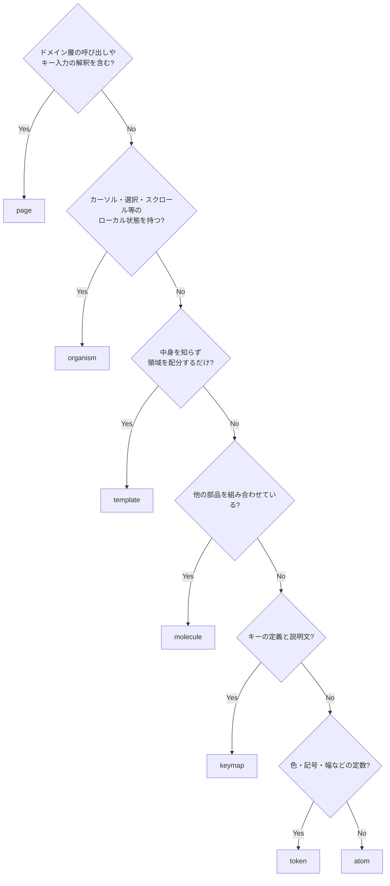
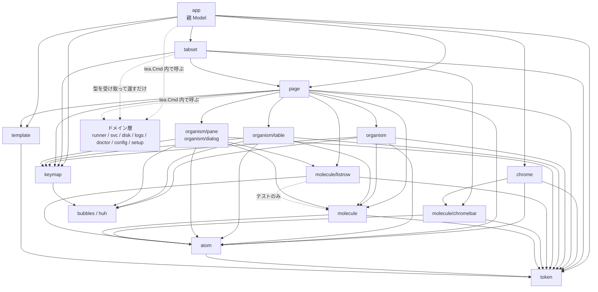

# TUI コンポーネント設計（Atomic Design）

画面の見た目とキーバインドは [画面・キーバインド仕様](screens.md)、パッケージ全体の分割は [コンポーネント設計](../components/overview.md)、UI 層の位置づけは [アーキテクチャ設計](../architecture/overview.md) を参照。

## この文書の目的

`screens.md` は「何が表示され、どのキーで何が起きるか」を定める。本書は **その表示を構成する部品をどう分割し、どこに置き、どう組み立てるか** を定める。

狙いは 2 つある。

1. **同じ表示を画面ごとに再実装しない。** サービス状態の記号、確認ダイアログ、一覧のカーソル移動は複数のタブに現れる。実装が分かれると挙動が食い違う。
2. **設計原則を構造で守る。** 「色に依存しない」「確認を経ない破壊的操作の経路を作らない」「無効な操作は理由を示す」といった原則を、規約ではなく部品の配置で担保する。

## 適用方針

Atomic Design は Web UI 向けの分類だが、本 TUI では次のように読み替える。判断基準は **状態を持つか** と **中身を知るか** の 2 点である。

| 階層 | TUI での定義 | 状態 | 型 |
|------|------------|------|-----|
| token | 色・記号・幅・余白。色は背景の明暗と色の可否を引数に取って解決する | なし | 定数 / `token.NewStyles(dark, color bool) Styles` |
| keymap | キーとヘルプ文言の定義。`bubbles/key.Binding` の集約 | なし | `key.Binding` / `key.Map` |
| atom | それ以上分解すると意味を失う最小の表示単位 | なし | `func(...) string` |
| molecule | atom を並べた「意味のある 1 行 / 1 区画」 | なし | `func(...) string` |
| organism | カーソル・選択・スクロール・入力などのローカル状態を持つ部品 | ローカル状態 | `bubbles` 流（具体型を返す `Update` と `View() string`）※ |
| template | 画面共通の枠。中身を知らず領域の配分だけを行う | サイズのみ | `func(...) string` |
| page | タブ 1 枚。ドメイン層の呼び出しとキー入力の解釈を担う | 画面状態 | `tea.Model` |

token と keymap は Atomic Design 本来の 5 階層には含まれない。token は `screens.md` の設計原則 4（色に依存しない）と列の省略順を、keymap は「キーとその説明文」を 1 箇所に集約するために独立させる。キー定義が page ごとに散ると、フッタ・ヘルプ・詳細画面の操作リストで説明文が食い違う。

※ organism は `tea.Model` を実装せず、`bubbles` の各部品と同じ「具体型を返す `Update` と `View() string`」に揃える。一覧（`organism/table.Model[T]`）はジェネリック型であり、`Update` の戻りを `tea.Model` に潰すと呼び出し側で毎回型アサーションが必要になって panic 経路が増えるためである。また `View()` が `tea.View` を返すと、organism を縦に並べて合成するたびに文字列へ戻す処理が入る。「interface は `Executor` / `doctor.Check` / `tea.Model` の 3 つに限る」という規則（[コンポーネント設計](../components/overview.md#主要な-interface-一覧)）は、`tea.Model` を page と親 Model に限定しても満たされる。

親 Model（`ui.App`）は階層の外に置く。検出結果・`Caps`・端末サイズ・背景の明暗・現在のタブを保持し、page を切り替える唯一の主体である。**モーダルの重なりは持たない**（page が持つ。後述の「状態の所有」）。親が知るのは「1 枚以上開いているか」だけである。

### 階層の決め方

新しい部品はこの順で判定する。



## ディレクトリ構成

```
internal/ui/
  app.go            親 Model（ページ切替・検出結果・Caps・端末サイズ・背景の明暗・Tick）
  keys.go           キーの配送（ctrl+c と、page が差し戻したグローバルキーの解釈）
  chrome.go         親 Model の値を chrome/ の入力へ写す 1 手
  discover.go       自動更新（Tick）と、discovery/ への薄い委譲
  background.go     起動後に 1 度だけ走る取得の駆動（前提チェック・_work 集計・保有スコープ）
  discovery/        検出の予算・結果 Msg・発行・間隔決定・周期の突き合わせ（UI ランタイムを知らない）
  hostreq/          起動時のジョブ実行の前提チェック（FR-44）の発行。1 度だけ走らせる仕組みを持つ
  workscan/         runner ごとの _work 使用量の集計と、その周期の管理。再検出サイクルには載せない
  ghscope/          トークンの保有スコープの取得。起動後に 1 度だけ引く
  token/            色・記号・幅・余白の定数
  keymap/           キー定義とヘルプ文言（key.Binding）
  atom/             最小の表示単位（純粋関数）
  molecule/         atom を並べた 1 行 / 1 区画（純粋関数）
  molecule/listrow/ 一覧の 1 行（RunnerRow / JobRow / OrphanRow / LogRow）。タブごとに増える
  molecule/chromebar/ 共通レイアウトの帯（CapsBar / TabBar / KeyBar）。1 画面に 1 本ずつで増えない
  chrome/           ヘッダ・タブ行・状態行・フッタの中身の組み立て（純粋関数）
  tabset/           タブのメタ情報と並び。page/<tab> を import する唯一の場所
  organism/         カーソルと選択を持つ対話的な部品（ChoiceList）
  organism/table/   区画に分かれた一覧の共通実装（Model[T]）
  organism/table/tabletest/ organism/table のテスト用フィクスチャ（tabletest → table の一方向。page/pagetest と同じ位置づけ）
  organism/pane/    スクロールする領域（Detail / Help / Log / ProgressList）。Log は入力欄を持ち表示専用ではない
  organism/dialog/  承認・待機・入力（Confirm / DiffApproval / DrainWaiter / Form）
  template/         画面共通の枠
  page/             タブ共通の Msg と、タブ間で共有する部品（モーダルの重なり・page の寿命）
  page/action/      runner に対する操作の識別・可否の判定・一覧の組み立て
  page/progressmodal/ ProgressList を page.Modal へ配線する汎用部分（Setup / Disk が共有）
  page/<tab>/       タブ 1 枚（tea.Model）。runners / jobs / disk / logs / doctor / config / setup
  page/runnerdetail/ runner の詳細画面（Runners / Jobs が共用するモーダル）
  page/runnerop/    runner のサービス制御（Runners / Jobs が共用する確認・実行・報告）
  page/runners/rowview/ Runners タブの一覧の行の組み立て（純粋関数）
  page/disk/cleanview/  クリーンアップの文面・進捗行・削除可否の判定（純粋関数）
  page/disk/confirmmodal/ クリーンアップの確認ダイアログの包み
  page/diskclean/   クリーンアップの実行（進捗の channel・行・到着順の突き合わせ・結果報告）
  page/configmodal/ Config タブのモーダル 3 種（フォーム / 差分の承認 / 反映方法の選択）と入力欄
  page/setupmodal/  Setup タブのモーダル 2 種（追加フォーム / 確認ダイアログ）
  page/pagetest/    page/<tab> と親 Model のテスト用フィクスチャ（共有状態と Msg の記録、親を Msg で駆動する道具）
```

**`organism/pane/` の分かれ目は「表示専用かどうか」ではない。** `pane.Log` は `bubbles/textinput` とフィルタの入力モードを持つので表示専用ではなく（後述の「organism 一覧」）、それでも `Detail` / `Help` と同じディレクトリに置いてある。分かれ目は **行を縦に流してスクロールする領域かどうか**であり、`bubbles/viewport` を使うかどうかは問わない。実際 `Detail` と `Log` は `viewport` を組み立てて既定のキーを本ツールのキーマップへ差し替える同じ関数（`viewportKeyMap`）を共有するが、`Help` は `viewport` を使わず、`bubbles/help` が組んだ全キー一覧を自前の `offset` で切り出してスクロールする。**実装の道具ではなく、持つ状態（先頭から何行隠しているか）と検証の観点（期待する行が見えているか）が同じであることで揃えている。** 対して `organism/` 直下に置くのは、項目の並びに対して**カーソルと選択**を持つ部品（`ChoiceList`）である。**入力欄の有無でも `viewport` の有無でも置き場所を決めない。** どちらで分けても、フィルタを足しただけの `Log` や自前でスクロールする `Help` が別の階層へ移り、スクロールの扱いが 2 箇所に分かれる。

**`page/` は「1 ディレクトリ 1 タブ」ではない。** タブが共用する部品（`page/action` / `page/runnerdetail` / `page/runnerop` / `page/progressmodal`）と、タブ 1 枚のために切り出した部品（`page/diskclean` / `page/configmodal` / `page/setupmodal`。下記の基準の例外）、テスト用フィクスチャ（`page/pagetest`）も同じ階層に並ぶ。どれがタブでどれが共有部品かは名前からは決まらないので、`page/pagetest/import_test.go` の `shared` に共有部品を列挙し、**そこに載っていない `page/<名前>` をタブとして扱う**。**正は `shared` の側であり、この段落の列挙はその写しである**（食い違いは `TestSharedPackagesMatchDoc` が止める）。新しいタブは自動で検査の対象になり、共有部品を足すときだけ明示的な追記が要る。

**タブ 1 枚のための切り出し先は `page/<tab>/` の下を既定とする。** 分かれ目は**利用者が何タブか**という、実装を見れば一意に決まる条件である。

- **`page/<tab>/<名前>`（ネスト）** — **利用者が 1 タブに閉じるものはこちら。** `page/disk/cleanview`（文面と判定の純粋関数）・`page/disk/confirmmodal`（確認ダイアログの包み）・`page/runners/rowview`（行の組み立て）が該当する。`import_test.go` の `tabName` はスラッシュを含むパスをタブとみなさないので、`shared` への追記は要らない。行数の面でも同じ効果がある——`linterly` のディレクトリ集計は直下のファイルだけを数えるため、ネストしても親ディレクトリからは外れる。
- **`page/<名前>`（直下）** — **利用者が 2 タブ以上のもの、または 2 タブ以上になることが決まっているものだけ**をここへ置く。`page/action`（Runners / Jobs / 詳細画面 / Setup / `page/runnerop`）・`page/runnerdetail`（Runners / Jobs / `page/runnerop`）・`page/runnerop`（Runners / Jobs）・`page/progressmodal`（Setup / Disk）が該当する。直下に置くと `TestOnlyTabsetImportsTabs` が既定でタブとして扱うため、`shared` への登録が「これはタブではない」という判断を明示的に残す役割を持つ。

**`page/diskclean` / `page/configmodal` / `page/setupmodal` の 3 つはこの基準の例外である。** どれも利用者は 1 タブ（順に Disk / Config / Setup）なので、上の既定に従えばネストすべきものだった。直下にあるのは、切り出しを指示した Issue #102 / #104 / #105 が**`shared` への登録そのものを受け入れ条件に含めていた**ためである（行数上限を空けるのが目的で、「タブではない」判断を検査に残す形を明示的に選んだ）。**次にタブ 1 枚ぶんを切り出す Issue は、この 3 つではなくネスト側の先例に倣うこと。**

**直下へ置いたものが `page/<tab>/` 配下を import してよい。** `page/diskclean` は `page/disk/cleanview` を使う（進捗行の組み立てと結果報告の文面）。向きは `diskclean` → `cleanview` の一方向で、`cleanview` は純粋関数だけの葉であり `diskclean` を知らない。**逆向き（`page/<tab>/` 配下から `page/` 直下の切り出し先へ）は作らない。**

`page/pagetest` は `page` 自身の内部テストからは使えない（import が循環する）。`page` のテストは自前のスタブを持つ。

**`page/pagetest` は本番の経路から import しない。** `_test.go` ではなく通常のパッケージなので Go は止められず、混入すれば `exec.NewFake()` と固定フィクスチャがそのまま製品に載る。規約ではなく `TestNoProductionCodeImportsTestFixtures` が各パッケージの本番ファイルの import を読んで止める（同じ検査が `organism/table/tabletest` も見る）。

階層をパッケージで分けることで、**依存の方向を Go の import で機械的に強制する**。

**タブをサブパッケージに分けるのは行数上限のためである。** 行数チェック（`linterly`）の上限は 1 ディレクトリ 2000 行（テストを含む）で、集計は直下のファイルのみを対象とする。7 タブを `page/` に平置きすると 4 タブ目で上限に達するため、タブごとにパッケージを掘って独立した枠を持たせる。副作用として `page` → `page/<tab>` の向きは Go が禁じる（循環になる）。**ただし「タブ同士が参照し合えない」ところまでは Go は強制しない。** 新しいタブが `page/runners` を直に import してもコンパイルは通る。タブ間で共有する状態は親のみが持つ、という規則を実際に守らせているのは `page/pagetest/import_test.go` の `TestOnlyTabsetImportsTabs` で、タブを import してよいのは `tabset` だけであることを本番ファイルの import から検査する（同じ検査が「親 Model は個別のタブを知らない」も守る）。ドメイン層に対する「ドメインは `ui` に依存しない」という規則（[コンポーネント設計](../components/overview.md#依存の規則)）と同じ考え方を UI の内部にも適用する。

パッケージ名は単数形にする。呼び出し側で `atom.StatusText` のように階層が読めるため、識別子に階層名を重ねない（`atom.AtomStatusText` は禁止）。

## 依存の方向



本体以外の領域（ヘッダ・タブ行・状態行・フッタ）を組み立てる `ui/chrome` が import するのは `molecule/chromebar` / `atom` / `token` **だけ**である（3 本の帯そのものは `chromebar` にある。Issue #106）。組み立ての持ち場がそこであり、上位から下位への飛び越し参照は許容する規則に収まる。逆に `chrome` は `tabset` も `page` もドメイン層も import しない。molecule 階層に属する以上ドメインの型を受け取れないので、`chrome.View` が持つのはヘッダのバッジ 3 つ（`Root` / `Systemd` / `HasToken`）と状態行の件数 3 つ（`OrphanUnits` / `Warnings` / `HostReq`）という表示用の値である。`appconfig.Caps` / `runner.Result` からその写しを作るのは上位である親 Model の `chromeView` で、`chromebar.TabView` への写し替え（選択中かどうかを添字と `active` の比較で解決する）は `tabset.Views` にある。**親 Model は `molecule` も `molecule/chromebar` も import しない**——タブの並びを知るのは `tabset` だけ、という分担がここでも効いている。

`ui/tabset` はドメイン層（`appconfig.Caps` / `exec.Executor` / `runner.Result{}`）を import するが、`page` や親 Model と違って**ドメインを呼ばない**。`New` が受け取った値をそのまま各タブの初期 `page.StateMsg` へ詰めて渡すだけであり、`runner.Discover` のような呼び出しは持たない（`tea.Cmd` でドメインを駆動するのは `page` 階層と親 Model のみという規則は保たれる）。図で `Tabs` から `Domain` への辺を点線かつ別のラベルにしてあるのはこの違いのためである。

`molecule/listrow` が `molecule` を参照するのはテストだけである（列の選択 `molecule.Columns` を期待値の組み立てに使う）。本番の経路では `organism/table` が `molecule.Columns` で列を決め、決まった列を行ビルダへ渡す。向きは常に `listrow` → `molecule` であり、逆は無い（後述の「`ui/molecule` を分割した判断」）。

### 依存の規則

| 規則 | 理由 |
|------|------|
| `token` は `lipgloss` と `huh` のみ import する | 最下層。色の定義を token の外に作らない。`huh.Theme` の組み立ても token 内に置く（後述の「`Form` と huh」。実装は `token/huhtheme.go` の 1 ファイルに閉じる） |
| `keymap` は `bubbles/key` のみ import する | token と並ぶ最下層。キー定義が他の階層に依存すると参照方向が壊れる |
| `atom` は `token` と `lipgloss` のみに依存する | 表示単位を単体でテストできる状態に保つ。`lipgloss` を許すのは表示幅の計算（`lipgloss.Width`）と ANSI 安全な切り詰めのためで、**幅を数える実装をここ 1 箇所に閉じる**という規則の裏返しである |
| `molecule` は `atom` / `token` と `lipgloss` のみ。**molecule 同士は参照しない**（唯一の例外は `molecule/listrow` → `molecule` の一方向。逆は作らない。`molecule/chromebar` はどちらの向きにも参照しない） | 同階層参照を双方向に許すと階層が意味を失う。共通化したい場合は atom に降ろすか organism に上げる。`listrow` を分けたのは増え方の違い（タブ数に比例する行ビルダ）であって別階層にしたわけではないので、列の選択だけは `molecule` を向いてよい。`chromebar` も増え方の違いで分けたが、こちらは列の選択を使わないので例外を増やさずに済んでいる |
| `organism` は `molecule` / `atom` / `token` / `keymap` と `bubbles` / `bubbletea` / `lipgloss` を使う | 一覧・スクロール・テキスト入力・フォームの実装は既存ライブラリに委ねる。`bubbletea` を許すのは `Update(tea.Msg)` と `tea.Cmd` のためで、`tea.Model` は実装しない（※） |
| `organism` と `organism/table` / `organism/pane` / `organism/dialog` は**どの向きにも import しない** | 分割の目的は行数上限の分散であり、部品同士の依存を増やすことではない。組み合わせるのは `page` |
| `template` は `token` と `lipgloss` のみ。`organism` / `page` を import しない | 枠が中身を知ると、画面ごとに枠が分岐する。`lipgloss` は行の切り詰め（装飾済み文字列の ANSI 列を壊さないため）に使う |
| `atom` / `molecule` / `template` は **bubbletea / bubbles を import しない** | 純粋関数に保ち、期待文字列との比較でテストできるようにする |
| `keymap` を読むのは `page` / 親 Model / `organism`（`organism/table` / `organism/pane` を含む）。`atom` / `molecule` にはキー文字列・説明・可否・理由をプリミティブに落として渡す | organism は `bubbles` の既定キーマップを差し替えるために `key.Binding` を必要とする（後述の「`Table` を 1 つに統一する」）。境界は **molecule 以下** に引く。`atom.KeyHint` の入力を単純な文字列に保ち、`key.Binding` の組み立てなしにテストできる |
| ドメインの型（`runner.Runner` など）は `organism` 以上でのみ扱う | 表示部品がドメインモデルの変更に引きずられない。molecule 以下は表示用の構造体とプリミティブのみを受け取る |
| ドメイン層を `tea.Cmd` で呼ぶのは `page` 階層と親 Model のみ | 副作用の発生点を限る。**タブ内の操作は必ず `page`**（`page.Do` を通す。後述の「ドメイン呼び出しの差し戻し」）。runner の検出だけは全タブで共有する状態なので親 Model が駆動する（[コンポーネント設計](../components/overview.md#internalui)） |
| 上位から下位への飛び越し参照（`page` → `atom` など）は許容する | 中間層に意味のない中継を作らない |
| 下位から上位への参照・循環は禁止 | — |

## token

### 色

トークンは 2 種類に分ける。**「状態」と「表示上の役割」を同じ型にすると、色と記号を対で持つ規則（後述）の適用範囲が曖昧になる**ためである。役割トークンに記号を要求しても意味がなく、`Icon(Muted)` が「systemd ユニットなし」の `-` を返すような誤用を招く。

| `StateToken`（状態。色と記号を**必ず対**で持つ） | 用途 |
|---------|------|
| `StateOK` | 正常・成功 |
| `StateWarn` | 警告・閾値超過 |
| `StateFail` | 異常・失敗 |
| `StateSkip` | 実行不可・スキップ |

| `RoleToken`（表示上の役割。色のみ） | 用途 |
|---------|------|
| `RolePlain` | 装飾なし |
| `RoleOK` / `RoleWarn` / `RoleFail` / `RoleSkip` | 状態トークンに対応する色 |
| `RoleMuted` | 補足情報・グレーアウト |
| `RoleAccent` | カーソル位置・選択行 |
| `RoleDanger` | 破壊的操作の警告文 |

状態トークンから役割トークンへは一方向に変換できる（`StateToken.Role()`）。記号を引けるのは状態トークンのみで、役割トークンを渡すとコンパイルエラーになる。

**各色は明背景用と暗背景用の 2 値を持つ。** token は定数の集合ではなく `token.NewStyles(dark, color bool) Styles` として解決する。白背景の端末で補足情報が読めなくなることを防ぐためである。第 2 引数で色そのものを無効化できるのは、`NO_COLOR` / `--no-color` / 非 TTY の判定を `cmd` が 1 つの値に決めて渡す設計に合わせるためである（後述の「背景の明暗と NO_COLOR」）。

### 記号

| トークン | 記号 | 意味 |
|---------|------|------|
| `IconActive` | `●` | サービス稼働中 |
| `IconInactive` | `○` | サービス停止中 |
| `IconFailed` | `✗` | 異常終了・FAIL |
| `IconNoUnit` | `-` | systemd ユニットなし |
| `IconUnknown` | `?` | 状態を取得できなかった・判定不能 |
| `IconJob` | `▶` | ジョブ実行中 |
| `IconWarn` | `⚠` | 注意事項あり・WARN |
| `IconOK` | `✓` | OK・完了 |
| `IconSkip` | `⊘` | SKIP |
| `IconCursor` | `▸` | カーソル位置 |
| `IconChecked` / `IconUnchecked` | `[x]` / `[ ]` | 複数選択の状態 |
| `IconDivider` | `─` | 区画の区切り |
| `IconEllipsis` | `…` | 幅に収まらない文字列の中略 |

記号は `screens.md` の記号表と一対一で対応する。表示に使う記号をここ以外に書かない。

### 色と記号の対

**状態を表すトークンは、必ず色と記号の対で定義する。** 色だけで区別する状態を作らない（`screens.md` の設計原則 4）。

### 背景の明暗と NO_COLOR

色の解決に必要な入力は 2 つある。どちらも **親 Model が保持し、下位へ渡す**。token 側に環境を読む処理を置かない。

| 入力 | 取得元 | 扱い |
|------|-------|------|
| 背景の明暗 | 起動時に端末の背景色を問い合わせる。**応答は起動後に届き**（`tea.BackgroundColorMsg`）、利用者が端末の配色を変えるなどで**切り替わることもある**ため、届くたびに判定し直す | 親 Model が保持し、`token.NewStyles` の第 1 引数にする。届くたびに `token.Styles` を解決し直し、page → organism → molecule / atom へ**配り直す**。応答が得られない端末では暗背景として扱う |
| 色を使うか | `NO_COLOR` / `--no-color` / 非 TTY | `cmd/gsr-helper` が判定して親 Model に渡す。`token.NewStyles` の第 2 引数にし、無効時は素通しのスタイルを解決する |

**配色の解決は起動時の 1 回では終わらない。** 最初のフレームは背景色が未確定のまま描かれるため、暗背景として解決した配色で一度描いた後に応答が届く。届いた時点で解決し直して配り直さないと、白背景の端末に濃色向けの薄い色が残って読めなくなる。配り直しを受け取る側の義務は後述の「page と organism の受け渡し」に置く。

`NO_COLOR` の判定を `cmd` に置くのは、`--no-color` フラグとの合流点を 1 箇所にするためである。`lipgloss` 自身もカラープロファイルを判定するが、**本ツールの表示可否はこの 1 つの値で決める**。判定箇所が 2 つあると、片方だけ効いた状態を追えなくなる。

素通しのスタイルでも記号は残る。色と記号を対で定義しているため、`NO_COLOR` でも状態は判別できる。スピナーのアニメーションは静止した記号に差し替える。

### 幅

| トークン | 値 | 由来 |
|---------|-----|------|
| `WidthTarget` | 80 | 保証する最小端末幅（[非機能要件](../requirements/non-functional.md#ユーザビリティ)） |
| `WidthMin` | 60 | これを下回ると表示不能とする（[画面仕様](screens.md#端末幅による列の省略)） |
| `Column` | 識別子・見出し・幅・寄せの組 | 列の定義。`organism/table` が `table.Column` に変換する |
| `ColumnRules` | `Drop []string` / `Keep []string` | 幅が足りないときの落とし方。**一覧の区画ごとに持つ** |
| `RunnerColumnRules()` | Drop: `_WORK` → `VERSION` → `MANAGED` → `SCOPE` / Keep: `NAME` / `SVC` / `JOB` | runner を並べる一覧（Runners / 孤児ユニット / Jobs）の落とし方（[画面仕様](screens.md#端末幅による列の省略)） |
| `LogColumnRules()` | Drop: `UPDATED` → `RUNNER` / Keep: `LOG` / `SIZE` | Logs タブのファイル一覧の落とし方 |
| `SizeColumnWidth` | 7 | サイズ列（`SIZE`）の幅。`atom.Bytes` の最長表記（`1023.9K` の 7 桁）に合わせる |

**落とす順は共有の 1 本ではなく区画の定義が宣言する。** 共有にすると、別の列を持つタブ（Disk / Logs / Doctor）を足すたびにその並びを直すことになる。`ColumnRules` のゼロ値は「順の指定なし・落とさない列なし」を意味し、末尾から落ちる。

**`LogColumnRules()` はこの宣言の最初の実例である。** Logs タブのファイル一覧は `RunnerColumnRules()` の Drop に挙がる列（`_WORK` / `VERSION` / `MANAGED` / `SCOPE`）を 1 つも持たないので、共有の順に乗れない。最初に落とすのは `UPDATED` である——並びが更新時刻の降順であること（[FR-23](../requirements/functional.md)）は列が無くても順序から読み取れる。次が `RUNNER` で、選択中のログがどの runner のものかは本文の見出しに出るため、狭い端末では一覧から省ける。`LOG`（ファイル名）と `SIZE` は `Keep` に置いて落とさない。FR-23 が求める「ログの一覧（サイズ付き）」そのものであり、落とすと一覧の目的を満たせないからである。

**`SizeColumnWidth` だけが定数として独立しているのは、列幅を表記の側から縛るためである。** 他の列幅は `LogColumns()` の中の数値でよいが、`SIZE` の中身を組み立てるのは `atom.Bytes` であり（最長は `1023.9K` の 7 桁）、幅と表記が別々の場所にあると、表記を変えたときの食い違いが表示の崩れとして初めて現れる。定数にすると `atom` 側のテスト（`TestBytesFitsColumnWidth`）が `Bytes` の出力長を `token.SizeColumnWidth` と突き合わせられる。**別の列で幅が表記に縛られるときも同じ形にすること。**

列の**集合**（`RunnerColumns()` / `OrphanColumns()` / `JobColumns()` / `LogColumns()`）は `token` に残す。区画の定義が持つのは落とす**順**だけである。集合をタブのパッケージへ移すと、幅に対する不変条件のテスト（`organism/table`）がタブを参照できず（organism は page を import しない）検証できなくなる。

各列の幅は `token.WidthTarget`（80）に全列が収まるように定めてある。**行頭に要るセル数は、その一覧が選択を持つかどうかで変わる。**

| 一覧 | 行頭 | 内訳 |
|------|------|------|
| 選択できる（`Selectable: true`。Runners / 孤児ユニット / Jobs） | 6 セル | カーソル 1 + 間隔 1 + チェックボックス 3 + 間隔 1 |
| 選択できない（`Selectable: false`。Logs のファイル一覧） | 2 セル | カーソル 1 + 間隔 1 |

行頭のガター列を足すのは `organism/table` で、チェックボックスのガターは `Selectable` が真のときだけ足す。したがって実測の余裕は一覧ごとに違い、`LogColumns()` は行頭 2 + 列幅合計 66 + 列間 3 = 71 セルで 9 セル余る。

**ただし列を落とすかどうかの判定は、選択の可否によらず常に 6 セルで見積もる**（`molecule.Columns` の `columnPrefix`）。選択できる一覧では選択モードに入った瞬間にチェックボックスが現れるため、見積もりを実測に合わせて 2 セルへ下げると、その瞬間に右端が溢れる。判定を区画ごとに分けないのは、判定の入力を 1 つ増やすより常に 4 セル取っておくほうが安全であり、選択できない一覧では余裕が実測より 4 セル狭く見えるだけで済むためである（`LogColumns()` は判定上も 6 + 66 + 3 = 75 セルで 80 に収まる）。**列を足すときに確認するのは判定側の見積もりのほうである。** 実測で収まっても、判定が 6 セルで数えて溢れると判断すれば列は落ちる。

列の省略は `molecule.Columns` が決め、行を返す molecule（`RunnerRow` など）と `organism/table` はその結果をそのまま使う。**見出しは `bubbles/table` が描く**ため molecule 側に見出し用の部品は置かない。列幅の調整箇所を 1 つに保つことで、ヘッダと行の桁がずれる経路を作らない。

### `molecule.Columns` の契約

```go
func Columns(all []token.Column, width int, rules token.ColumnRules) []token.Column
```

落とし方は 2 段で、**収まった時点で止まる**。

1. `rules.Drop` の順に落とす
2. それでも収まらなければ、残った列の**末尾から**落とす（右側の列ほど補足的な情報である）

どちらの段でも `rules.Keep` の列は落とさない。宣言された順だけに頼らないのは、孤児ユニットの `NOTE` や Jobs の `WORKER PID` のように「落とせる列が 1 つも無い」区画ができてしまうためである。

契約は 2 つある。

| 契約 | 内容 |
|------|------|
| 空を返さない | `all` が空でなければ結果も空にならない。**最後の 1 列は幅が足りなくても残す** |
| 幅は超え得る | 上の帰結として、結果の合計幅が `width` を超えることがある |

**「返した列は必ず幅に収まる」という契約は置かない。** 列が 0 個になると見出しも行も描けず、常時表示の列を持たない区画（Jobs タブ）が空の表になる。桁が溢れるより、1 列でも情報が出ている方がよい。

幅が本当に足りない場合に**表示不能と判断するのは `template.Frame` の責務**である。`token.WidthMin`（60）を下回る幅では本体を描かず、必要な幅と現在の幅を示す縮退表示に置き換える。したがって「列がはみ出す」のは 60 以上の幅で最小の列すら収まらない場合に限られる。

## atom 一覧

| atom | 引数 | 出力例 | 使用箇所 |
|------|------|-------|---------|
| `StatusText` | サービス状態 | `● active` / `○ inactive` / `✗ failed` / `-` と役割トークン | Runners |
| `JobText` | 実行中か・経過時間 | `▶ 4m12s` / `idle` と役割トークン | Runners / Jobs |
| `DoctorStatus` | OK / WARN / FAIL / SKIP | `✓ OK` / `⊘ SKIP` | Doctor |
| `Cursor` | カーソル行か | `▸` / 空白 | 全一覧 |
| `Checkbox` | 非表示 / 未選択 / 選択 | `[x]` / `[ ]` | Runners / Disk |
| `WarnMark` | 注意の有無 | `⚠` | Runners / Disk / Config |
| `Bytes` | バイト数 | `31.2G` | Runners / Disk |
| `Files` | ファイル数 | `412,003` | Disk |
| `Duration` | 経過時間 | `4m12s` | Runners / Jobs / ドレイン待機 |
| `Ratio` | 使用率・警告閾値 | `82% ⚠` | ヘッダ / Disk |
| `VersionText` | 現行・最新 | `2.309.0 ⚠` と役割トークン | Runners |
| `KeyHint` | キー・説明・可否・不可の理由 | `x:停止` / グレーアウト＋理由 | フッタ / ヘルプ |
| `Path` | パス・最大幅 | 中略付き `/opt/…/_work/bar` | 全画面 |
| `Cell` | 文字列・幅・寄せ | 幅を揃えた 1 セル | 全一覧 |
| `Divider` | 幅・見出し | `─ 孤児ユニット ─────` | Runners / Config |
| `Truncate` / `Pad` / `Justify` | 文字列・幅 | 幅に収めた文字列 | 全画面 |
| `Hint` | — | `KeyHint` の入力（キー・説明・可否・理由） | フッタ / 詳細画面 |

**atom はすべて実装済みである。** 最後まで残っていた `DoctorStatus` は Doctor タブ（Issue #11）が実装した。`Bytes` / `Files` / `Ratio` は Disk タブ（[FR-27](../requirements/functional.md)〜[FR-29](../requirements/functional.md)）で使うため実装済みである。`Bytes` は Logs タブのファイル一覧の `SIZE` 列でも使うため、最長の表記（`1023.9K` / `8192.0P` の 7 桁）が `token.SizeColumnWidth` に収まることをテストで固定してある。

`Cell` は日本語を含む表の桁ずれを防ぐための atom。**文字列の表示幅の計算は `lipgloss.Width` に一本化し、この atom に閉じる。** 上位の階層は「どの列を何文字幅で置くか」を決めるだけで、幅そのものを数えない。

幅を測る実装を 2 つ持たないこと。`bubbles/table` も列幅の調整に `lipgloss` の幅計算を使うため、別のライブラリで数えた幅を混ぜると絵文字や結合文字を含む行で桁が 1 つずれる。この理由から `go-runewidth` は依存に加えない（[非機能要件の依存ライブラリ](../requirements/non-functional.md#依存ライブラリ)）。

`KeyHint` は可否と理由を受け取って描くだけで、**可否の判断はしない**（後述の「操作可否の判定」）。

## molecule 一覧

| molecule | 内容 | 対応する画面 |
|----------|------|------------|
| `Columns` | 一覧の列定義（見出しと幅）。幅トークンに従って列を落とす | 全一覧 |
| `RunnerRow` | runner 1 行のセル列（名前 / スコープ / 起動方式 / サービス / ジョブ / バージョン / `_work`） | Runners |
| `OrphanRow` | 孤児ユニット 1 行のセル列（[FR-05](../requirements/functional.md)） | Runners |
| `JobRow` | 実行中ジョブ 1 行のセル列 | Jobs |
| `DiskTargetRow` | 削除候補 1 行のセル列（選択状態・サイズ・ファイル数・パス・選択不可の理由） | Disk |
| `FSSummaryLine` | ファイルシステム要約（使用率・inode・閾値超過） | Disk / ヘッダ |
| `DoctorRow` | 診断結果 1 行のセル列 | Doctor |
| `LogRow` | ログファイル 1 行のセル列（runner 名 / ログ名 / サイズ / 更新時刻）。更新時刻が取れていなければ「値なし」の記号にする | Logs |
| `LogLine` | ログ 1 行（`ERROR` / `WARN` の強調）。重大度ではなく表示上の役割を受け取る | Logs |
| `SettingRow` | 設定項目 1 行（項目名・現在値・注意書き） | Config |
| `DiffLine` | 差分 1 行（`-` / `+` / 変更なし） | Config |
| `ProgressRow` | 進捗 1 行（`✓ 完了` / `▶ 実行中…` / `待機`） | Setup / Disk |
| `ActionRow` | 操作 1 行（キー・説明・影響・不可の理由）。`atom.KeyHint` を用いる | 詳細画面の操作リスト |
| `CommandBlock` | 実行するコマンド全文の整形（折り返し・継続行） | 確認ダイアログ全般 |
| `KeyBar` | `KeyHint` の並び。収まらない分は `?:ヘルプ` に集約する（`molecule/chromebar`） | フッタ |
| `TabBar` | `[1]Runners [2]Jobs …`。無効なタブはグレーアウト（`molecule/chromebar`） | 共通レイアウト |
| `CapsBar` | `host: build01  root  gh: 認証済み`（root が無ければ `read-only`、systemctl が無ければ `systemd なし` を挟む）（`molecule/chromebar`） | ヘッダ |
| `SummaryCounts` | `OK 14  WARN 2  FAIL 1  SKIP 1` | Doctor / 状態行 |

`KeyBar` / `TabBar` / `CapsBar` の 3 つは `molecule` 直下ではなく **`molecule/chromebar`** にある（Issue #106。1 画面に 1 本ずつでタブが増えても本数が変わらないため分けた。`LogRow` が `molecule/listrow` にあるのと同じ扱い）。このうち実装済みは `Columns` / `RunnerRow` / `OrphanRow` / `JobRow` / `DiskTargetRow` / `FSSummaryLine` / `DoctorRow` / `SettingRow` / `DiffLine` / `LogRow` / `LogLine` / `CommandBlock` / `ActionRow` / `KeyBar` / `TabBar` / `CapsBar` / `SummaryCounts` / `ProgressRow` である。**molecule はすべて実装済みになった**（後述の「実装状況」）。

`SummaryCounts` は `molecule` 直下に置く（`molecule/listrow` ではない）。一覧タブの数に比例して増える行ビルダではなく、判定ごとの件数を要約する部品が 1 つしかないからである。**0 件の判定も出す**——「FAIL 0」が消えると、FAIL が無いのか数え忘れているのかを画面から区別できない。

`ProgressRow` は `molecule` 直下に置く（`molecule/listrow` ではない）。一覧タブの数に比例して増える行ビルダではなく、進捗表示に 1 つしかない部品だからである。対応する画面（Setup タブの一括処理と Disk タブのクリーンアップ）はどちらもこの行で描く。

`LogRow` は Logs タブのファイル一覧 1 行（runner 名 / ログ名 / サイズ / 更新時刻）で、`molecule/listrow` に置く（一覧タブの数に比例して増える行ビルダのため）。`LogLine` は本文 1 行なので `molecule` 直下である。**`LogLine` は一致部分のハイライトを持たない。** フィルタは一致しない行を落とすので本文に並ぶ行はすべて一致しており、行の中を塗り分けても `ERROR` / `WARN` の強調と重なって読みにくくなるだけである（[FR-25](../requirements/functional.md) が求めるのはフィルタと `ERROR` / `WARN` の強調の 2 つで、一致部分の強調は含まない）。

行を返す molecule（`RunnerRow` など）は **`cols` と同じ順・同じ数のセルを返す**。`bubbles/table` は行のセルを走査しながら同じ添字の列定義を引くため、数が合わないと桁がずれるか添字範囲外で panic する。知らない列 ID を渡された場合も空のセルを返して数を欠かさない。

`CommandBlock` は **マスク済みの文字列を受け取るだけ**とし、UI 側でマスク処理を実装しない。トークンのマスクは `exec` 層の責務である（[セキュリティ設計](../architecture/security.md)）。二重に実装すると、どちらかが漏れたときに気付けない。

## organism 一覧

パッケージは後述の「organism の分割方針」に従う。

| organism | パッケージ | ローカル状態 | 使う既存部品 | 責務 | 状況 |
|----------|-----------|------------|------------|------|------|
| `Model[T]` | `organism/table` | カーソル位置・選択集合・絞り込み文字列 | `bubbles/table`（区画ごとに 1 つ）/ `textinput` | 一覧の共通実装。区画（セクション）に対応する | 実装済み |
| `ChoiceList` | `organism` | カーソル位置 | — | Setup のメニュー、反映方法の選択、**詳細画面の操作リスト** | 実装済み |
| `Detail` | `organism/pane` | スクロール位置 | `bubbles/viewport` | Doctor の詳細、runner の詳細（情報部分） | 実装済み |
| `Help` | `organism/pane` | スクロール位置 | `bubbles/help`（`FullHelpView`） | `?` の全キー一覧 | 実装済み |
| `Log` | `organism/pane` | スクロール位置・追従の ON/OFF・フィルタの入力 | `bubbles/viewport` / `textinput` | Logs の本文。追従・手動スクロールでの解除・`G` での再開・フィルタの入力欄 | 実装済み |
| `ProgressList` | `organism/pane` | 進捗の受信状態 | `bubbles/spinner` / `progress` / `viewport` | 一括処理の逐次表示と結果報告（[FR-15](../requirements/functional.md)） | 実装済み（Setup タブ / Disk タブ）。モーダルへの配線は両タブが共有する `page/progressmodal` が持つ |
| `Confirm` | `organism/dialog` | なし（既定はキャンセル） | — | 破壊的操作の共通ダイアログ | 実装済み |
| `DiffApproval` | `organism/dialog` | なし（既定はキャンセル） | `listrow.DiffLine` | 差分＋バックアップパスの提示と承認 | 実装済み（Config タブ）。収まらない差分は末尾を落として中略記号で示す |
| `DrainWaiter` | `organism/dialog` | 対象ジョブ | `bubbles/stopwatch` / `spinner` | ドレイン待機。経過時間の計時、制約の注記と `esc` でのキャンセル | 実装済み |
| `Form` | `organism/dialog` | `huh.Form` / 入力済みの印 | `huh` | フォームのラッパー。テーマの適用と検証エラーの表示位置を統一する | 実装済み（Setup タブの追加フォーム）。破棄の確認は `page/setup` が `Confirm` を重ねて出す |
| `ErrorBanner` | `organism` | なし | — | 失敗の表示 | 未実装 |

**`pane.Log` が持つのは本文のペインだけである。** 2 ペインのうちファイル一覧は `organism/table.Model[T]` であり、どちらを操作しているか（フォーカス）を持つのは組み合わせる側の `page/logs` である。以前の版はこれを 1 つの `LogPane` としていたが、一覧は他のタブと同じ `Table` で足り、部品を増やさないという規則（`Table` を増やさない）に従うとフォーカスだけが宙に浮く。**`pane.Log` は一致の判定を持たない。** 受け取るのは装飾済みの行であり、装飾済みの文字列に正規表現を当てると ANSI 列が一致に混ざる。絞り込みは素の行を持つ `page/logs` が行う。

一覧の共通実装は `organism/table.Model[T]`（生成は `table.New`）である。パッケージ名が型名を兼ねるため、本書で `Table` と書くのはこの型を指す。`bubbles/table` はこのパッケージ内で `btable` として import する（名前の衝突を避けるため）。

`organism/dialog` には `Confirm` / `DiffApproval` / `DrainWaiter` / `Form` がある。

スクロール・計時・アニメーションを自前で実装しない。上の表で「—」の部品は、いずれも既存部品に対応するものがないか、対応させると要件を満たせないものである（`ChoiceList` は区切り線と無効項目の理由表示を持つため）。

### `bubbles/progress` を使う範囲

進捗バーは **全体件数が事前に確定する処理に限る**。一括追加（`n` 台中 `m` 台完了）がこれに当たる。

一括追加・一括削除・一括更新（Setup タブ）は `pane.ProgressList` がバーを描く。分母（台数）は計画（`setup.Plan.Units`）の時点で確定しており、`ProgressInput.Total` が 0 のときはバーを省いてスピナだけを出す。

**選択済み対象のクリーンアップ（Disk タブ）もバーを描く。** 分母は確認を通した計画（`disk.CleanPlan` の対象数）の時点で確定しているため、`ProgressInput.Total` に入れればバーが出る。**進捗を状態行にも重ねて出さない。** 同じ進捗が 2 か所に出ると、片方だけが古い値になったときにどちらが正しいのか読み手に判断できない（Issue #75）。

ディスク集計とドレイン待機ではバーを使わず、`spinner` と `stopwatch` で「動いていること」と経過時間のみを示す。ドレイン待機は待ち時間が無制限（[FR-07](../requirements/functional.md)）で、集計は対象ごとに判明順で埋まるため、分母を示すと完了時期を約束する表示になってしまう。

### `Table` を 1 つに統一する

Runners / Jobs / Disk / Doctor の 4 タブは、いずれもカーソル移動・複数選択・ページ送り・絞り込みという同じ操作を持つ（[画面仕様のキーマップ](screens.md#一覧runners--jobs--disk--doctor)）。`Table` は **`bubbles/table` のラッパー**とし、キー処理を 1 箇所に集約する。

```go
// Model は一覧の共通実装。bubbles/table のラッパーであり、
// 区画（セクション）ごとに btable.Model を 1 つ持つ。
type Model[T any] struct {
    sections  []section[T]    // 区画ごとの btable.Model と行データ
    focus     int             // キー入力を受け取る区画
    checked   map[string]bool // 選択集合。キーは行の識別子
    filter    textinput.Model // 絞り込み
    filtering bool            // 入力モードか
}

// SectionInput は 1 区画の定義。page が区画ごとに 1 つ渡す。
type SectionInput[T any] struct {
    Title      string                      // 区切り線の見出し。空なら区切り線を出さない
    Columns    []token.Column              // 幅が足りる場合に表示する全列
    Rules      token.ColumnRules           // 幅が足りないときの落とし方
    Render     RenderRow[T]                // 1 行をセルの列に変換する関数
    ID         RowID[T]                    // 行の識別子（選択集合のキー）
    Match      func(item T, q string) bool // 絞り込みの一致判定。nil なら絞り込まない
    Disabled   RowDisabled[T]              // 行ごとの選択可否。nil なら全行を選択できる
    Selectable bool                        // 区画ごとの選択可否
}

// RenderRow は 1 行をセルの列に変換する。
type RenderRow[T any] func(in RowInput[T]) []string

// RowInput は 1 行を描くのに必要な値。
type RowInput[T any] struct {
    Item     T
    Cols     []token.Column // この幅で実際に表示する列。セルはこの数だけ返すこと
    Styles   token.Styles
    Reason   string // 行を選択できない理由。Disabled が真のときだけ入る
    Disabled bool   // 行を選択できないか
}

// RowID は行の識別子を返す。選択集合のキーに使う。
type RowID[T any] func(item T) string

// RowDisabled は行を選択できないかと、その理由を返す。
type RowDisabled[T any] func(item T) (reason string, disabled bool)
```

**引数を構造体（`RowInput`）にするのは、行の描画に渡す値が増えても `Render` の署名を変えないためである。** `Render` はタブごとに差し替えて使い回すので、署名を変えると全タブと `organism/table` のテストに波及する。

`Render` と `Table` の分担は次のとおり。

| 描くもの | 担当 |
|---------|------|
| カーソルのガター列（1 セル。先頭） | `Table` |
| チェックボックスのガター列（3 セル。カーソルの次） | `Table`。`Selectable` な区画のみ |
| `Cols` に対応するセル（`len(Cols)` 個） | `Render` |
| 選択できない理由をどのセルに載せるか | **`Render` が決める** |

理由を載せる列を `Render` が決めるのは、理由を置ける列を持っているかがタブごとに違う（列の集合を決めるのはタブ）ためである。`Reason` は `Disabled` が真のときだけ入る（`Table` が偽のときは空にする）。判定関数は「選べない理由」を常に返す実装になりがちで、そのまま渡すと全行に理由が出るためである。

**カーソルのセルがチェックボックスより先である。** カーソルのガター列は行頭に固定で、選択モードの有無で位置が動いてはならない。

ジェネリクスは維持する。page はドメインの型のまま行を渡し、セル列への変換は molecule が担う。molecule が返すのは `[]string` であり、`table.Row` への変換は `Table` の側で行う（molecule は `bubbles` を import しないという規則を保つため）。列定義も同様に、`token` が `token.Column` を定め、`Table` が `table.Column` に変換する。

`Render` に渡す関数は **page 側に置いた薄いラッパー**にする。`listrow.RunnerRow(v, cols, styles)` は表示用の構造体（`listrow.RunnerView`）を受け取る純粋関数なので、`RowInput` からドメインの型を表示用の値へ落とす変換は page が行う（molecule はドメインの型を受け取らないという規則）。

`bubbles/table` は行を `table.Row` として持ち、カーソル移動・スクロール・列幅の調整を担う。本ツールが必要とする残りは `Table` が受け持つ。

**`bubbles` の既定キーマップは必ず差し替える。** `table.DefaultKeyMap()` は `u` / `d` をハーフページ送り、`f` / `space` を次ページ、`b` を前ページに割り当てており、本ツールの `u`（バージョン更新）/ `d`（ドレイン停止）/ `space`（選択のトグル）を奪う。`viewport` の既定も `u` / `d` / `f` / `b` に加えて `h` / `l` を使い、`l`（ログを開く）と衝突する。`Table` と `Detail` は `keymap` の定義から組み立てた `KeyMap` を渡し、ページ送りは `ctrl+f` / `ctrl+b` のみに割り当てる。既定キーでスクロールしないことを回帰テストで固定する。

**行のセル数は列数に揃える。** `bubbles/table` の行の描画は行のセルを走査しながら同じ添字で列を引くため、セル数が列数を超えると添字が範囲外になって panic する。`molecule` が返す `[]string` を `table.Row` に変換する時点で `Table` が列数に合わせて詰める。

| 機能 | 担当 |
|------|------|
| カーソル移動 / スクロール / 列幅の調整 | `bubbles/table` |
| 幅に収まる列の解決 | `molecule.Columns`。**横スクロールは持たない**（`bubbles/table` v2 に横スクロールのキーが無く、狭い端末では列を落とす方式にする） |
| 区画（複数の `btable.Model` を縦に並べる） | `Table` |
| 区画をまたぐカーソル移動（末尾で `j` を押すと次の区画の先頭へ） | `Table`。キーはフォーカス中の区画にのみ流す |
| 複数選択 | `Table`。選択状態は `checked` が持ち、`atom.Checkbox` の結果を**カーソルの次のセル**として `table.Row` に載せる |
| 行ごとの選択不可 | `Table`。`RowDisabled` の判定で選択キーを無視し、チェックボックスを描かない |
| 選択不可の理由の表示 | `Render`。`RowInput.Reason` を受け取り、どのセルに載せるかを決める |
| 絞り込み | `Table`。`textinput` の内容で行データを絞る |
| 絞り込みの行（`絞り込み: …`） | `Table`。**本体の 1 行目に置き、本体の高さを 1 行消費する**（下記） |

**絞り込みの行は入力中と確定後の両方で出る。** 入力を受け付けている間、または絞り込み文字列が設定されている間、本体領域の先頭に `絞り込み: <文字列>` を 1 行描き、区画へ配る行数はその分だけ減る。状態行の `入力中: 絞り込み` は「グローバルキーが効かない」ことを示す表示であり、確定後は消えるため、何で絞っているかを画面に残すにはこの行が必要である。

区画は Runners タブの孤児ユニットを下部の別区画として扱うために使う。区画ごとに操作可否を設定できるようにし、Disk タブでジョブ実行中の `_work` を選択不可にする（[FR-31](../requirements/functional.md)）。

### 詳細画面の操作リストは `ChoiceList` を使う

詳細画面（[画面仕様](screens.md#詳細画面enter)）は `organism/pane.Detail`（情報部分）と `organism.ChoiceList`（操作リスト）の組み合わせで構成し、専用の organism を作らない。`ChoiceList` は次に対応する。

| 要件 | 扱い |
|------|------|
| 区切り線 | 項目の間に区切りを置ける。破壊的な操作を線の下にまとめるために使う |
| 無効な項目 | 選択のみ可・実行不可としてグレーアウトし、理由を右に出す。可否と理由は page から渡す（`ChoiceList` は判断しない） |
| 初期カーソル | 開くたびに先頭（安全側）へリセットする。前回の選択を保持しない（[FR-46](../requirements/functional.md)） |
| 決定の識別 | `Choice.ID` に呼び出し側の不透明な識別子（`action.ID` の文字列）を載せ、`ChosenMsg.ID` でそのまま戻す。キー文字列で往復させない |

**カーソルの扱いは呼び出しごとに宣言する。** 項目の差し替えは `SetItems(items, policy)` の 1 本で、`organism.ResetCursor`（対象そのものを差し替える。FR-46）と `organism.KeepCursor`（同じ対象の内容だけが変わった）を選ぶ。メソッドを 2 本並べると名前だけが頼りになり、取り違えても気付けない。**ゼロ値は安全側**（`ResetCursor`）である。

**情報部のスクロール位置も同じ分担で扱う。** `pane.Detail` は位置の読み書きを 2 つの口で提供する。

```go
func (d *Detail) GotoTop()   // スクロール位置を先頭へ戻す
func (d Detail) Offset() int // 先頭から隠している行数
```

- **対象そのものを差し替える側（別の runner の詳細を開く）が `GotoTop` を呼ぶ義務を負う。** 80x24 では情報部に配れる行数が 1 行まで潰れるため、位置を持ち越すと別の runner の詳細が前に読んでいた場所から始まり、**前の runner の続きを今の runner の情報として読む**ことになる。
- **同じ対象の内容だけが変わったとき（3 秒ごとの再検出）は戻さない義務を負う。** 戻すと、詳細を読んでいる間ずっと先頭へ引き戻される。
- 位置の丸めは高さに依存する。作り直して位置を引き継ぐ側は、**大きさを配り直してから位置を戻すこと**（後述の「配色とキー定義の配り直し」）。

反映方法の選択（Config）と Setup のメニューも同じ `ChoiceList` である。**選択肢を並べて 1 つ選ぶ UI をこれ以外に作らない。**

### `Confirm` を 1 つに統一する

> **実装状況: 実装済み。** サービス制御の `x` / `X` / `R` がこの `Confirm` を経る。組み立ては `ui/page/runnerop` の 1 箇所に集約してあり、Runners タブ・Jobs タブ・詳細画面のどの起点からも同じ入力（`ConfirmInput`）を作る。残りの確認（削除 / バージョン更新 / クリーンアップ / 追加のプレビュー / 設定の書き込み）を持ち込む Issue も、この節の規約に従って**同じ `Confirm` を使う**こと。

`screens.md` に現れる確認（停止 / 強制停止 / 削除 / バージョン更新 / クリーンアップ / 追加のプレビュー / 設定の書き込み）は、すべて **対象・影響・実行するコマンド・`y/N`** という同じ構造を持つ。

```go
type ConfirmInput struct {
    Title   string   // 「クリーンアップの確認」
    Targets []string // 対象の一覧
    Impact  []string // 影響・警告（ColorDanger で描く）
    Command []string // 実行するコマンド全文（マスク済み）
    Note    []string // 補足（「復元できません」など）
}
```

破壊的操作の確認を組み立てる経路をこの 1 つに限定することで、「確認を経ない削除経路は設けない」（[FR-30](../requirements/functional.md)）を構造として守る。`enter` はキャンセル側に割り当てる（`screens.md` のキーマップ）。個別のダイアログ organism を追加しない。

### `Form` と huh

> **実装状況: 実装済み**（Issue #8 / #12）。`huh`（`charm.land/huh/v2`）も依存に入っている（[非機能要件の依存ライブラリ](../requirements/non-functional.md#依存ライブラリ)）。使っているのは Setup タブの追加フォームと、Config タブの設定編集・複製・初回設定ウィザードのフォームである。
>
> **3 番目の責務（中断の確認）は page と分担する。** `Form` は入力の有無を見て `FormDiscardMsg`（入力済み）か `FormAbortedMsg`（空）を出すところまでを行い、前者を受けた page が `Confirm` を重ねて破棄の可否を問う（`page/setup` の `onFormResult`）。**確認を `Form` 自身に持たせない**のは、モーダルを重ねられるのが `Overlay` を持つ page だけであり、ここで確認を実装すると `Confirm` がもう 1 つ増えるためである。破棄を選べば確認とフォームの 2 枚を閉じ、やめれば確認だけを閉じて入力途中のフォームへ戻す。
>
> **破棄の確認を出すのは `page/setup` だけである。** `page/config` は `FormDiscardMsg` を `FormAbortedMsg` と同じに扱って閉じる。Config タブのフォームは項目が少なく、閉じても一覧から同じ行を選び直せば同じ初期値で開き直せるため、確認を挟む価値が追加ウィザード（入力項目が多く、やり直しの代償が大きい）ほど無いからである。**この差は意図的なものであり、`Form` の契約が守られていないのではない**（`Form` は両方の Msg を出し分けるところまでを行い、確認を出すかは page が決める）。

`Form` は `huh.Form` のラッパーである。`huh` はキー処理・検証・レイアウトを自分で持つため、ラッパーの責務は次の 3 点に限る。

| 責務 | 扱い |
|------|------|
| テーマの適用 | `token` が組み立てた `huh.Theme` を渡す。フォームだけ配色が浮くことを防ぐ。`NO_COLOR` の縮退も同じ経路で伝わる |
| 完了・中断の通知 | フォームの状態が完了に変わった時点で、入力値を載せた `tea.Msg` を page へ返す。page はそれを受けてドメイン層の `tea.Cmd` を発行する。`Form` 自身はドメインを呼ばない |
| 中断の確認 | `esc` を受けたとき、入力済みの項目が 1 つ以上あれば `Confirm` を重ねて破棄の可否を問う。入力が空なら即座に前の画面へ戻る |

`esc` で即座に破棄しないのは、`n`（追加）の一括ウィザードのように入力項目が多い画面で、打ち間違いによる `esc` が入力全体を失わせるためである。破棄の確認にも `Confirm` を使い、確認ダイアログの実装を増やさない。

### `Help` と `bubbles/help`

`?` の全キー一覧は `bubbles/help` の `FullHelpView` に描かせる。列組みと折り返しを自前で持たないためである。

**出すキーの範囲は画面ごとに違う。** `keymap.Set.Help(groups ...[]key.Binding)` にその画面が使うグループを渡して組み立てる。`Global` は常に先頭に付き、空のグループは飛ばす。全画面で同じ一覧を返すと Disk / Logs / Config のキーが Runners のヘルプにも並び、逆に画面ごとの一覧を `keymap` に列挙するとタブを足すたびに共有のメソッドを直すことになる。

| 範囲 | 中身 |
|------|------|
| `Set.RunnerListHelp()` | `Global` + 一覧のキー + 絞り込み中のキー + runner の操作キー。runner を並べるタブ（Runners / Jobs）用で、モーダルの重なり（`Overlay`）の既定 |
| `Set.Help(...)` | それ以外のタブが自分のグループを渡して組む |

**一覧のキーと絞り込み中のキーはグループを分ける。** `List.Bindings()` は通常時のキー（`enter` = 詳細を開く、`esc` はグローバルの戻る）、`List.FilterBindings()` は入力中のみ有効な `enter`（絞り込みを確定）と `esc`（絞り込みを取消）である。混ぜると `enter` が「確定」と「詳細を開く」の 2 行で並び、どちらが効くのか読み取れない。

`Help` はスクロールする。キー数が高さを超える端末で続きへ辿れないためである。`j` / `k` / `ctrl+f` / `ctrl+b` / `g` / `G` で動き、リサイズ時は位置を範囲内に丸める（幅が変わると `bubbles/help` の列組みが変わって行数も変わる）。フッタには `j/k:スクロール` を**スクロールが必要なときだけ**出し、`esc:閉じる` は常に出す。

**フッタ（`chromebar.KeyBar`）には使わない。** `bubbles/help` は無効な `key.Binding` をキーごと非表示にする設計であり、「キーを消さずグレーアウトして理由を示す」（[画面仕様の無効な操作の表示](screens.md#無効な操作の表示)）と両立しない。フッタは `keymap` の定義から `atom.KeyHint` で描く。

つまり `keymap` の定義は 2 つの経路で使われる。`?` のヘルプは `bubbles/help` が、フッタと詳細画面の操作リストは `atom.KeyHint` / `molecule.ActionRow` が読む。キーと説明文の出どころが 1 つである限り、両者は食い違わない。

## template 一覧

| template | 領域 | 使用箇所 | 状況 |
|----------|------|---------|------|
| `Frame` | ヘッダ / タブ行 / 本体 / 状態行 / フッタ | 全画面 | 実装済み |
| `Modal` | 中央寄せのオーバーレイ枠 | runner の詳細 / ヘルプ / `Confirm` / `DrainWaiter`（今後 `DiffApproval` も） | 実装済み |
| `Split` | 左右 2 ペイン | — | **作らない**（下記） |

**`Split` は作らなかった。** Config タブの項目と現在値は、左右 2 ペインではなく 1 つの一覧の列（`organism/table` + `molecule/listrow.SettingRow`）で表す。[画面仕様の Config タブ](screens.md#config-タブ)のモックが項目名と現在値を**同じ行**に並べており、幅 80 では 2 ペインに割るより列で並べる方がモックに近い。呼び出し元の無い template を置かないという規則（[コンポーネント設計](../components/overview.md)の「呼び出し元の無い公開 API は置かない」）にも従う。2 ペインを要する画面が出てきた Issue が改めて作ればよい。

**Logs タブも `Split` を使わない。** 保証する端末幅は 80 であり（後述の「幅」）、左右に割ると本文がログ 1 行を出せる幅にならない。上に一覧・下に本文を置く縦の分割で、`page/logs` が本体領域を配る（1 行の見出しを挟むだけなので template を要しない）。

`Frame` は `screens.md` の「共通レイアウト」に対応する。

```go
type FrameInput struct {
    Header string // chromebar.CapsBar の結果
    Tabs   string // chromebar.TabBar の結果
    Body   string // page の描画結果
    Status string // 警告件数・選択件数
    Footer string // chromebar.KeyBar の結果
    Width  int
    Height int
}

func Frame(in FrameInput) string

// BodySize は Body に割り当てられる領域を返す。親 Model が算出して page に渡す。
func BodySize(width, height int) (w, h int)

// ChromeHeight は本体以外が使う行数。7 に固定する。
const ChromeHeight = 7

// ModalPadding は Modal の枠と見出しが使う幅と行数を返す。
// モーダルの中身へ配る領域の算出に使う。
func ModalPadding() (w, h int)
```

`Frame` は `Body` の中身を解釈しない。幅が `token.WidthMin` を下回る場合は本体を描かず、表示不能である旨と必要な幅・現在の幅のみを出す。縮退表示も端末の高さに収める（案内は折り返すため、幅が数セルしかない端末では枠を組むより行数が増える）。

`ModalPadding` を公開するのは、モーダルの中身が使える領域を算出する側（`page.Overlay`）に非公開定数の写しを持たせないためである（`BodySize` と同じ形）。**モーダルの中身は与えられた幅で切り詰めること。** 超えると枠が広がり、下辺の枠線が領域外に出て消える。

## page 一覧

型名はパッケージ名で階層が読めるため `Model` に揃える（`runners.Model` / `jobs.Model`）。`RunnersPage` のように識別子へ階層名を重ねない。

| page | タブ | 主に使う organism | 呼ぶドメイン | 状況 |
|------|------|-----------------|------------|------|
| `runners.Model` | 1 | `organism/table` / `Confirm` / `DrainWaiter` | 検出結果は親から受け取る。サービス制御は `svc`（`page/runnerop` 経由）。追加・削除・バージョン更新は**呼ばず**、可否だけ判定して Setup タブへ引き渡す（`page.OpenTabMsg`） | 実装済み（一覧・詳細・可否の表示とサービス制御、`n` / `D` / `u` の引き渡し） |
| `jobs.Model` | 2 | 同上 | 同上（対象は runner） | 実装済み（同上。直接受ける操作は `d` / `X` / `R` の 3 つ） |
| `disk.Model` | 3 | `Table` / `Confirm` | `disk` | 実装済み（集計・クリーンアップ・確認ダイアログまで） |
| `logs.Model` | 4 | `organism/table` / `organism/pane`（`Log`） | `logs` | 実装済み |
| `doctor.Model` | 5 | `organism/table` / `organism/pane`（`Detail`） | `doctor` | 実装済み（一覧・詳細・全体 / 個別の再実行） |
| `config.Model` | 6 | `Table` / `ChoiceList` / `Form` / `DiffApproval` | `config` / `config/edit` / `config/apply` / `appconfig` | 実装済み |
| `setup.Model` | 7 | `ChoiceList` / `Form` / `Confirm` / `ProgressList` | `setup` / `setup/job`（`gh` と `setup/tarball` はその内側） | 実装済み（追加・削除・バージョン更新） |

runner の詳細画面は Runners / Jobs が共用するモーダルなので、どちらのタブにも属さない `page/runnerdetail` に置く（`runnerdetail.Model`。`Detail` + `ChoiceList` の組み合わせ）。

runner のサービス制御（開始 / 停止 / 強制停止 / ドレイン停止 / 再起動 / enable の切替）も同じ理由で、どちらのタブにも属さない `page/runnerop` に置く（`runnerop.Model`。`Confirm` + `DrainWaiter` と `svc` の組み合わせ）。**タブではなく、両タブが 1 つずつ持つ共有部品である。** 一覧の直接キー・詳細画面の操作リストのどこから起動しても、対象の決定・可否の再判定・確認ダイアログの組み立て・実行・結果の報告はこのパッケージを通る（前述の「`Confirm` を 1 つに統一する」）。タブ側に残るのは「どのキーを直接受けるか」と「どの行を対象に渡すか」だけで、Runners タブは 6 操作と一括選択、Jobs タブは `d` / `X` / `R` の 3 操作とカーソル 1 件（[FR-45〜FR-47](../requirements/functional.md)）という違いがここに現れる。

未実装のタブもタブ行には出す。**押しても何も起きないキーを作らない**ため、無効なタブとしてグレーアウトし、番号キーを押したら理由（`この版では未対応です`）を状態行に出す（[画面仕様](screens.md#共通レイアウト)）。

### タブを 1 つ追加するときに触る箇所

タブの追加が既存コードの変更をほとんど伴わないことを、この構造で担保する。**親 Model（`app.go`）は触らない。**

| 対象 | 変更内容 | 一覧を持つタブ |
|------|---------|:---:|
| `internal/ui/page/<tab>/` | 新規パッケージ。`tea.Model` を実装し、`page.StateMsg` を受けて `page.ChromeMsg` を返す | 必須 |
| `internal/ui/tabset/` | import 1 行と、`specs()` の該当行に `New`（`func(tab int, st page.StateMsg) tea.Model`）を足す。番号キーと page へ渡すタブ番号は `tabset.New` が並び順から機械的に決めるので書かない | 必須 |
| `internal/ui/molecule/listrow/` | 行の組み立て（`RunnerRow` に相当するもの）を 1 つ足す。**依存の規則により `molecule` 以下しかドメイン型を落とした行を描けない**ので、`page/<tab>/rows.go` から呼ぶ形になる（`page/runners/rows.go` が既定） | 必須 |
| `internal/ui/token/width.go` | その一覧の列定義（`token.Column` の並び）と、幅が足りないときに落とす順（`ColumnRules`）を足す | 必須 |
| `internal/ui/keymap/` | そのタブ固有のキーがある場合のみ、定義と `Set` への 1 フィールド、および `Set.Contexts()` への登録（そのキーが同時に有効になるコンテキスト）。登録漏れは `TestContextsCoverEverySetField` が落とす | 任意 |

**`internal/ui` 直下（親 Model）は 1 行も触らない。** タブを知っているのは `tabset` だけであり、この分担は `page/<tab>` を import するのが `tabset` に限られることで強制される。

**例外は「タブが要する起動時の値」である。** Setup タブの `Options.Secrets`（Issue #8）と、Doctor タブが誘導先になる起動時の前提チェック（FR-44。Issue #11）がこれにあたる。どちらも**タブの中では成立しない**——前者は cmd が起動時に決めた値であり、後者はどのタブを開いていても状態行に出る必要がある。この 2 つは「起動時に決めた値を親が配る」という既存の分担そのものなので `tabset` へは寄せられない。

**例外はタブをまたぐ移動である。** Runners / Jobs タブの `l` は Logs タブへ移って対象を渡す（[画面仕様](screens.md#l-でログを開く)）。タブ同士は互いを import しないため、移動元は移動先の番号も型も持てず、移動できるのは有効タブを切り替える唯一の主体である親 Model だけである。そこで `page.OpenTabMsg{Title, Msg}` を親が受け、名前（`tabset.Tab.Title`）でタブを引いて `activate` してから用件を配る。

| 対象 | 変更内容 |
|------|---------|
| `page` | 移動の要求（`OpenTabMsg`）・移動先の名前（`TabLogs`）・用件（`ShowLogMsg`）。**移動元と移動先の双方から見える場所がここしか無い** |
| `internal/ui`（親 Model） | `Update` の `case page.OpenTabMsg` と `keys.go` の `openTab`。**タブの名前も個別のタブの型も知らないまま**、`[]tabset.Tab` を名前で走査して移るだけである |

**移動の要求は `page.Do` で包まない。** 包むと発行元のタブへ戻る（`TabMsg` の doc）。宛先は親である。

名前は文字列で突き合わせるので、タブ名を変えると移動だけが静かに効かなくなる（親は一致するタブが無ければ何もしない）。`tabset` の `TestOpenTabTitlesMatchTabs` が、`page.TabLogs` に対応する有効なタブが実在することを検査する。

**例外は「親が配っている値をタブが書き換えたとき」である（Issue #128）。** Config タブ（`e`）は gsr-helper 自身の設定ファイルを書き換えるが、親 Model の `cfg` は `New` で 1 度代入されるだけだったため、**書き込みは成功しているのに共有状態には古い値が載り続けていた**。`page.StateMsg.Disk.Thresholds` は `a.cfg.DiskThresholds` から配られるので、`disk_thresholds` を編集しても Disk タブの `⚠ 警告閾値超過` と doctor のリソース診断は再起動するまで古い閾値で判定していた。**設定の真実を持つのは親である**以上、書き換えたタブが親へ返すほかに直す手が無い（タブが自分の写しだけを更新しても、他のタブが受け取る `StateMsg` は変わらない）。そこで `page.ConfigSavedMsg{Conf}` を親が受け、`cfg` を差し替えてから `distribute` で配り直す。

| 対象 | 変更内容 |
|------|---------|
| `page` | 書き込めたことの通知（`ConfigSavedMsg`）とその発行（`ConfigSaved`）。**書き換える側（Config タブ）と配る側（親）の双方から見える場所がここしか無い** |
| `internal/ui`（親 Model） | `Update` の `case page.ConfigSavedMsg`。`cfg` を差し替えて `distribute` を呼ぶだけで、**どのタブが書き換えたのかは知らない**（`workscan.Msg` / `ghscope.Msg` と同じ形） |

**走行中に設定が変わることは、この経路に限って許容する。** 以前は逆の判断だった——動いているアプリ自体は再起動まで起動時の設定で動き続け、親 App の設定を書き換える経路は作らない（自動更新間隔などを走行中に差し替えると、設定を保存しただけでポーリングやしきい値の挙動が変わる）というものである。**反転させたのは、その懸念と Issue #128 が解こうとしている不満が正面から衝突するためである**——「保存しただけで挙動が変わる」ことを避け続ける限り、「設定フォームに書いた数字がその場で効かない」はそのまま残る。走行中に変わって困るのは値が**勝手に**変わる場合だが、この経路の契機は必ず**利用者がフォームで編集し、差分を承認して書き込めたとき**である。明示的に承認した値が黙って効かない方が驚きは大きい。残る懸念は自動更新間隔だが、`refresh_interval` を変えても**走行中の検出は中断されない**——`discover.go` の `tick` は次の周期を予約する時点で `refresh()` を読むので、新しい間隔になるのは次の予約からであり、実行中の検出には `onTick` の二重起動の抑止がそのまま働く。

**書き込みに成功したときだけ発行する。** 失敗した値を親が取り込むと、設定ファイルの中身と画面の判定が食い違う。判定は書き込みの結果を受け取る `page/config` の `rememberSelf` が持ち、失敗時は `nil` を返す。**この Msg も `page.Do` で包まない**（宛先は親である）。

**反映の時点はタブによって非対称である。** Disk タブは共有状態を受け取るたびに描き直すので、配り直された次の `StateMsg` から新しい閾値で `⚠ 警告閾値超過` を出す。一方 doctor は保存を契機に診断をやり直さない——`page/doctor` の `setState` は共有状態を写すだけで診断を始めず（始めると共有状態が配られる 3 秒ごとに `sudo -l -U` や `journalctl -k` が走る）、開始の契機は初回の `ActivateMsg` と利用者の再実行（`r`）だけである。**doctor が新しい閾値で判定するのは次回の診断実行からである。**

**逆に、親が持たない設定値はこの経路では直らない。** `scan_roots` と `audit_log` は `cfg` ではなく `Options.Roots`（`--root` と合成済み）/ `Options.Audit`（開いたログの実体）として cmd が起動時に畳んだ値なので、追従させるには合成のやり直しとログの開き直しが要る。`refresh_interval` は `a.cfg` から読むため**この経路で次の周期から効くが、それは `--refresh` を指定していない場合に限る**——`discover.go` の `refresh()` が呼ぶ `discovery.Interval(a.opts.Refresh, a.cfg.RefreshDuration())` はフラグが正なら無条件にそちらを採るので、`--refresh` を付けて起動している間は編集しても間隔は変わらない。`scan_depth` も `a.cfg` から読むが（`discover()` の `depth`）、**自身の設定フォームに欄が無いのでこの経路では値そのものが変わらない**——`config/edit` の `SelfValues` が持つのは `scan_roots` / `refresh_interval` / `disk_thresholds` 2 つ / `audit_log` の 5 欄で（FR-41 の編集対象は 4 つ）、`Apply` は `scan_depth` を元の値のまま素通しする。

親 Model は `[]tabset.Tab` を走査するだけで個別のタブを知らない。共有状態は 1 本の `Msg` で全 page に配られるので、新しいタブは受け取り側を書くだけで済む。モーダルと入力中の有無も page が `Msg` で報告するため、親はタブの内部状態を知らない。

新しいタブが守る約束は次の 6 つである。**これを満たせば親 Model を読まずにタブを足せる。**

#### 1. 共有状態は `page.StateMsg` で受け取る

```go
type StateMsg struct {
    Result runner.Result   // 検出結果
    Caps   appconfig.Caps  // 能力判定
    Styles token.Styles    // 解決済みの配色
    Keys   keymap.Set      // キー定義
    Exec   exec.Executor   // 外部プロセス実行の唯一の経路
    Dark   bool
    BodyW  int // template.BodySize で本体領域に換算済み
    BodyH  int
    Err    error // 直近の検出エラー
}
```

親 Model は**有効で `Model` を持つ全タブへ**これを配る（選択中のタブに限らない）。裏のタブが古い配色や古い検出結果を持ったまま前面に出ることを防ぐためである。したがって page は「配られた最新のスナップショットを保持して描画に使う」形になる。

`Exec` は **`systemctl` が無い環境でも `nil` にしない。** 検出（`discover.go`）が `Executor` を `nil` にして systemd の参照を落とす縮退は `runner.Discover` の契約であってこの層の約束ではない。page は systemctl を使えるかを `Caps.Systemd` で判断し、`nil` 判定を各タブに書かせない。

監査記録の失敗を受け取る口は page に配らない。`Executor` 自身が `cmd/gsr-helper` 側の通知先へ渡す。**UI から標準エラー出力へ書いてはならない**（描画が壊れる）。

#### 2. ドメイン呼び出しは `page.Do` を通して差し戻す

```go
func Do(tab int, fn func() tea.Msg) tea.Cmd  // 結果を TabMsg{Tab, Msg} に包む
```

`tab` には page 自身のタブ番号を渡す。番号は `tabset` のスライス上の添字（0 起点。画面に出る `[1]`〜`[7]` とは 1 ずれる）で、page の生成時に `tabset.New` が添字から機械的に渡す（`specs()` に番号を書く場所は無い）。親は `TabMsg` を**選択中でないタブにも**発行元へ届け、`Model` を持たないタブ宛なら捨てる。包まずに `tea.Cmd` を返すと、結果が届くまでの間に利用者がタブを切り替えたときに別のタブへ渡って静かに失われる。

**bubbletea / bubbles が解釈する `Msg`（終了・順次実行など）を包んではならない。** ランタイムへ届かなくなる。包むのは自分で発行したドメイン呼び出しの結果だけである。タグの付かない非キー `Msg` は従来どおり選択中のタブへ配られる。

#### 3. モーダルは `page.Overlay` に種類を登録する

```go
type ModalKind string // 種類。page/<tab> が自分の定数を宣言する

type Modal struct {
    Model tea.Model                     // 中身。キー・SizeMsg・StateMsg・AttachMsg はここへ渡る
    Title func(m tea.Model) string      // 見出し
    Hints func(m tea.Model) []atom.Hint // フッタに出すキーヒント
    HandlesBack func(m tea.Model) bool  // esc を自分で解釈するか。nil なら常に 1 枚閉じる
}

func NewOverlay(tab int, st StateMsg) (Overlay, tea.Cmd) // 第 2 戻り値はヘルプ登録の Cmd
func (o Overlay) Register(kind ModalKind, m Modal) tea.Cmd
func (o Overlay) Open(kind ModalKind, msg tea.Msg) tea.Cmd
func (o Overlay) OpenHelp() tea.Cmd
func (o Overlay) Close()                       // 最上位を 1 枚だけ閉じる
func (o Overlay) Active() bool                 // 1 枚以上開いているか
func (o Overlay) Handles(msg tea.Msg) bool     // page がこの Msg を Overlay へ渡すか
func (o Overlay) Modal(kind ModalKind) (Modal, bool)
func (o Overlay) SetState(st StateMsg) tea.Cmd
func (o Overlay) SetHelpScope(scope HelpScope) tea.Cmd // ? に出すキーの範囲を差し替える
```

**`NewOverlay` / `Register` / `Open` / `OpenHelp` / `SetHelpScope` が返す `tea.Cmd` は呼び出し側まで返すこと。** 登録した時点・開いた時点で処理を始めるモーダル（ログの購読、差分の計算）は、この `Cmd` が捨てられるとその処理を動かせない。**この義務は `Overlay` 自身にも掛かる。** `NewOverlay` はヘルプ（`ModalHelp`）を登録するので、`Cmd` を返す口を持たない署名にすると自分だけが規則の外に置かれる（例外を Go のコメントで宣言することになり、文書が定めた無条件の義務と食い違う）。タブは `NewOverlay` の `Cmd` と自分の `Register` の `Cmd` を畳んで `initCmd` に持つ。

**`NewOverlay` は共有状態を丸ごと受け取る。** `Register` は登録した時点で最新の共有状態をリプレイするため、`Overlay` が持つ初期状態が欠けていればその欠けがそのまま配られる。`Keys` / `Styles` / `Dark` だけを受け取っていた頃は、構築時に登録したモーダルへ届くのが `Exec = nil`・`Caps` ゼロ値・`Result` 空という半端な状態で、登録した時点で処理を始めるモーダルは `nil` の `Executor` を掴んだ。

**登録の `Cmd` は `Init` では返せない。** bubbletea が `Init` を呼ぶのはルート Model（親 `App`）だけで、親はタブの `Init` を呼ばない。`New` で `Register` した `Cmd` をタブの `Init` に持たせると、そのままランタイムへ届かず処理は永久に始まらない。**タブは登録の `Cmd` を保持し、最初の `page.StateMsg` を受けた時点（`setState`）で流して `nil` に落とす。** 共有状態は親が有効な全タブへ必ず配るので、この経路なら確実に届く。`Init` は `nil` を返す（発行点を片方に寄せて二重発火を避ける）。`Open` / `SetHelpScope` の `Cmd` はキー入力の応答としてその場で返せるため、この扱いが要るのは登録の `Cmd` だけである。

**種類の取り違えは `panic` で表面化する。** 同じ `ModalKind` の二重登録と、未登録の種類の `Open` はいずれも実装の誤りである（種類は定数で、登録するのも開くのも同じ page）。黙って上書き・黙って何もしないと、症状は「`enter` を押しても何も起きない」になり、コンパイルエラーも実行時エラーもログも残らない。登録は page の組み立て時に決まるので、誤りは最初の起動で必ず表面化する。

**`SetState` は開いているモーダルにだけ配る。** 閉じているものへ毎周期配ると、誰も見ていないヘルプを 3 秒ごとに全行組み直すような無駄が積み上がる。閉じているモーダルが古い状態で描かれることは、`Register` と `Open` が最新の `StateMsg` と `SizeMsg` をリプレイすることで防ぐ（起動後に遅延登録したモーダルも、登録した時点で `Result` / `Caps` / `Exec` を持てる）。`SizeMsg` は領域が変わったときだけ配る。

`Overlay` は領域だけを設定する口を持たない。持たせても次の `StateMsg`（`BodyW` / `BodyH`）で黙って巻き戻るためである。

**page はキー以外の `Msg` の配送先を `Overlay.Handles` で決める。** 開閉だけで判断すると、宛先を明示した `page.ModalMsg` が閉じている間に捨てられ、page 宛の決定（`page.ResultMsg`）はモーダル自身へ戻って消える。

**page 本体宛と決まっている `Msg` は `Handles` が明示的に偽を返す。** 対象は `page.ResultMsg` と寿命の 3 つ（`page.ActivateMsg` / `DeactivateMsg` / `ShutdownMsg`）である。既定（開いていれば渡す）に任せると、**モーダルを 1 枚でも開いている間だけ**寿命の通知が中身（最終的に `viewport`）に飲まれ、モーダルを開いたままタブを切り替えた／終了したときに page が長寿命の処理を畳めない。モーダル自身も長寿命の処理を持つ設計にするなら、page が受けたうえで `page.ModalMsg` で宛先を明示して配ること。

**種類を中央の `iota` に集めない。** 集めるとタブを 1 つ足すたびに共有ファイルへ定数を足すことになる。`NewOverlay` が登録するのは `page.ModalHelp` だけで、それ以外は画面が `Register` で足す（runner の詳細は `runnerdetail.Kind`、確認や差分承認は各 Issue が持ち込む）。

モーダルの中身が受け取る `Msg` は次の 6 種である。

| `Msg` | 内容 |
|-------|------|
| `page.StateMsg` | 共有状態。**開いているモーダルにだけ配る。** 閉じているものへは `Register` と `Open` がリプレイするので、開いた瞬間に古い配色・古い検出結果で描かれることはない（前述の `SetState`） |
| `page.SizeMsg{W, H}` | 中身が使える領域（本体領域から `template.ModalPadding` を引いた値） |
| `page.AttachMsg{Tab}` | 自分が乗っているタブ番号。`Register` で届く。**モーダルが発行する `Cmd` と page へ返す決定はこの番号で `page.Do` に包む** |
| 開くときに渡した `Msg` | 「何を開くか」（対象の runner、確認の文面）。`Overlay` は種類ごとの引数を知らない |
| `page.ModalMsg{Kind, Msg}` の中身 | 宛先を明示した `Msg`。**開いていなくても、最上位でなくても**その種類へ届く（背後で始めた処理の結果を回収する経路） |
| キー | **最上位の 1 枚にいる間だけ。** `esc` は `Modal.HandlesBack` が真のときだけ中身へ届き、偽なら `Overlay` が 1 枚閉じる |

##### モーダルから page への戻り道

モーダルは自分で決めたことを実行できない（ドメイン層を呼べるのは page 階層だけ）。決定は `page.ResultMsg{Kind, Msg}` に包み、`page.AttachMsg` で受け取ったタブ番号で `page.Do` に包んで返す。

```go
res := page.ResultMsg{Kind: Kind, Msg: chosen}
return m, page.Do(m.tab, func() tea.Msg { return res })
```

- `page.Do` で包むので、**タブを切り替えても決定は発行元のタブへ戻る**
- `page.ResultMsg` で包むので、**page の `Update` が自分の `case` で受けられる**（`Overlay.Handles` は `ResultMsg` に偽を返すため、転送してモーダル自身へ帰ることがない）
- モーダルを閉じた後に届いても page が受けるので、**決定が宛先を失って静かに捨てられない**

page 側は `Update` に `case page.ResultMsg:` を**自分で持つこと**。`Overlay.Handles` が `ResultMsg` に偽を返すことと合わせた**二重の守り**であり、決定を解釈するのは `Overlay` ではなく page だという分担を page 側から明示する。**`default` との並びは関係しない**——Go の型スイッチの `default` は記述位置に関わらず最後に評価される（先頭に書いても `case` が優先される）。

#### 4. page の寿命は 3 つの `Msg` で知らせる

長寿命の処理（`journalctl -f` のようなストリーム、監視の goroutine、開いたままのファイル）を持つ page は、いつ畳めばよいかを親から知らされる。

| `Msg` | 配る先 | page がすること |
|-------|--------|-----------------|
| `page.ActivateMsg` | タブ切替の**移動先** | 畳んでいた処理を張り直す |
| `page.DeactivateMsg` | タブ切替の**離れる側** | 長寿命の処理を止め、後始末を `tea.Cmd` で返す。**状態そのものは捨てない**（スクロール位置や選択が失われると裏に回ったことが見えてしまう） |
| `page.ShutdownMsg` | **有効な全タブ** | 残っている処理をすべて閉じ、後始末を `tea.Cmd` で返す |

親は終了時、各 page が返した後始末を `tea.Sequence` で `tea.Quit` より**前**に流す。`tea.Batch` では終了と後始末が並走し、後始末が実行される前にランタイムが止まりうる。

**起動時に選択されているタブも `ActivateMsg` を受け取る**（Issue #63）。親は切り替えのときに配るほか、最初に共有状態を配るときに選択中のタブへ 1 度だけ配る（`tabset.ActivateOnce` を親の `distribute` から呼ぶ）。配る場所が `Init` ではないのは、`Init` が Model を書き換えられず「配ったこと」を覚えられないためである。覚えないと、共有状態が配られるたび（端末サイズ・背景色・3 秒ごとの再検出）に前面化が届き、購読が積み上がる。したがって page は「起動時から前面に居たのか、切り替えで前面に来たのか」を区別する必要がなく、既定タブを差し替えても長寿命の処理が黙って張られないままになることはない。

#### 5. 操作の可否は `action.ID` で引く

操作の識別子は `action.ID`（`Start` / `Stop` / `Kill` / `Drain` / `Restart` / `Enable` / `Add` / `Delete` / `Update` / `Edit` / `Logs`）である。キーストロークから識別子を引く表は `keymap.RunnerKeys` の各フィールドから組む（`page.BindingKey`）。

**判定はキーではなく操作で行う。** キーのリテラルで表を引くと、`keymap` でキーを差し替えたときに判定がコンパイルエラーも無く別の操作へ移る（または消える）。可否と理由を返すのは `action.Allow`（操作を渡す）と `action.Set.Allowed`（キーを渡し、組み済みの対応表を内部で通す）である。

**表示層との境界でもキー文字列に戻さない。** `action.Set.Choices` は `organism.Choice.ID` に `action.ID` の不透明な識別子を載せ、決定（`organism.ChosenMsg.ID`）はそれを持って戻る。受け取った側は `action.Of` で `action.ID` に解く。キーで往復させると「識別子 → キー → 再マップ」になり、キーを差し替えたときに決定が黙って別の操作へ移りうる。

**表は `keymap` から 1 度だけ組む。** `action.NewSet` を共有状態（`StateMsg`）を受けた時点で呼び、以後の描画は組み済みの `action.Set` を使う。判定 1 件ごとに組み直すと、フッタ 1 行の描画で 11 要素の `map` を 9 回確保することになる。**2 つの操作が同じ先頭キーを持つと `NewSet` が `panic` する**（黙って上書きすると片方の操作が判定表のどの行にも当たらなくなり、理由が `page.ReasonUnsupported` にすり替わる）。

#### 6. `?` の範囲は自分で宣言する

`Overlay` の既定は `keymap.Set.RunnerListHelp`（runner を並べる一覧向け）である。別の集合を持つタブは `SetHelpScope` に自分のグループを組む関数を渡す。範囲を「関数」で渡すのは、配色やキー定義が差し替わったときに `Overlay` が自分で組み直せるようにするためである。

### page の責務

1. 親 Model から検出結果と `Caps` を **受け取る**（自分で検出しない）
2. organism を構成し、`template` に渡す本体を組み立てる
3. キー入力を解釈し、ドメイン層の呼び出しを `tea.Cmd` にして返す
4. ドメインからの `tea.Msg` を organism のローカル状態へ反映する

**page は検出を行わない。** タブ間で共有する状態の真実は親のみが持ち、`runner.Discover` を呼ぶのは親 Model だけである（[コンポーネント設計](../components/overview.md#internalui)）。

page は親から配られた `page.StateMsg` を**描画用のスナップショットとして保持する**。bubbletea の `View()` は引数を取れないため、描画時に共有状態を参照するには保持が要る。「page は検出結果を保持しない」という規則はこの意味で読み替える。**同じ検出が重複実行されず、タブ間でデータが食い違わない**という本質は、`Discover` を呼ばないことで保たれる。

### 状態の所有

| 状態 | 所有者 |
|------|-------|
| 検出結果 / `Caps` / 現在のタブ / 自動更新の周期 | 親 Model（`app`） |
| 端末サイズ / 背景の明暗 / 色を使うか | 親 Model（`app`） |
| gsr-helper 自身の設定（`appconfig.Config`） | 親 Model（`app.cfg`）。ただし Config タブは書き込めた値の写しを `confSet` で保持する（上記「例外は『親が配っている値をタブが書き換えたとき』」） |
| **モーダルの重なり** | page（`page.Overlay`）。下記 |
| 共有状態のスナップショット（描画用） | page |
| カーソル位置 / 選択 / スクロール / フィルタ | organism |
| フォーカス（入力中か、organism の**内側**のどの区画か） | organism |
| フォーカス（organism を**またぐ**ペイン間。キーをどの organism へ渡すか） | page |
| 入力途中のフォーム値 | `organism/dialog.Form` |
| ドメイン処理の進行中フラグ・直近のエラー | page |

**フォーカスは所有者が 2 つに分かれる。持ち主を分ける境目は organism の内側か外側かである。** organism が持つのは自分の内側のフォーカス——`organism/table.Model[T]` の「どの区画（セクション）にカーソルがあるか」（`FocusedSection`）と「絞り込みの入力欄が入力を受けているか」——であり、いずれもその organism 1 つで完結する。対して**複数の organism を並べたときにどちらがキーを受けるかは page が持つ**。Logs タブはファイル一覧（`organism/table.Model[T]`）と本文（`organism/pane.Log`）の 2 つを並べるが、どちらを操作しているかは `page/logs` の `Model.focus` が持ち、`pane.Log` はフォーカスの概念を持たない。

**ペイン間のフォーカスを organism に持たせられない。** 下位が上位の状態を書き換えないという規則（後述）のもとでは、`pane.Log` が「今は一覧の番だ」と決めて `table.Model[T]` へキーを回すことはできない。並べた 2 つを知っているのは組み合わせる側だけであり、`tab` を解釈してフォーカスを移すのも page の仕事である（前述の「organism 一覧」の `pane.Log` の注記、および後述の「キー入力の配送」）。

**モーダルの重なりは page が持つ。** 親が持つ形にすると、キーを閉じ込める判断が親に移り、`ChromeMsg` で受け取る 1 打鍵ぶん古い状態に依存することになる（下記「キー入力の配送」）。親が知る必要があるのは「1 枚以上開いているか」だけで、それは `ChromeMsg.Modal` で報告する。Runners / Jobs のように同じモーダル（runner の詳細）を使うタブがあるため、重なりの実装（`page.Overlay`）と中身（`page/runnerdetail`）は `page` 階層の共有部品として置く。

`Overlay` と `organism/table.Model` は **写しても内側の実体を共有する**（値としての独立性はない）。`bubbles` 流の署名に揃えた結果であり、**page は直前の `Update` が返した 1 つの値だけを持つこと。**

**共有は中途半端であってはならない。** `Overlay` は変わりうる状態（重なり・登録・領域・最後の共有状態）を 1 つの内部構造体にまとめ、その参照だけを持つ。以前は重なりのスタックだけがスライスの付け替えで写しごとに分かれ、`map` だけが共有されていたため、**捨てた写しがモーダルの中身の変更だけを残して開閉の変更を失う**という追いにくい壊れ方をした。組み立ては `NewOverlay` を通すこと（ゼロ値は使えない）。

**下位が上位の状態を書き換えない。** organism は `tea.Msg` を返して page に通知し、page は必要に応じて親へ伝播させる。

### 端末サイズの配り方

サイズの真実を 1 箇所に集める。`bubbles` の部品（`table` / `viewport`）は自分の幅と高さを持つため、渡し忘れると描画が崩れたまま気付きにくい。

1. 親 Model がリサイズの `tea.Msg` を受け、幅と高さを保持する
2. 親が `template.BodySize` で本体領域を算出し、`page.StateMsg` に載せて**有効な全 page へ配る**（現在の page だけに配ると、裏のタブが古いサイズのまま前面に出る）
3. page が organism に領域を渡す。`bubbles` の部品を持つ organism は、そこで自分の部品のサイズを更新する
4. モーダルの中身へは `page.Overlay` が `template.ModalPadding` を引いた `page.SizeMsg` を配る（本体領域とモーダルの中身の領域は別の値である）
5. organism / molecule / atom は端末サイズを自分で問い合わせない

幅が `token.WidthMin` を下回る場合の縮退は `template.Frame` が行い、page より下は関与しない。

### page と organism の受け渡し

organism は自分の内側だけを見て動くが、page との境界には次の約束を置く。守る側を 1 つに決めておかないと、page ごとに防御が散る。

| 約束 | 守る側 | 理由 |
|------|-------|------|
| 受け取った / 返すスライスは写しを取る（`Table.SetItems` / `Table.Shown` / `Detail.SetContent`） | organism | page が渡した後や受け取った後にスライスを書き換えても、organism の状態が壊れない。逆に organism が呼び出し側のスライスを書き換えないことも含む（`bubbles/viewport` の `SetContentLines` は渡された中身を書き戻す）。行数は高々数十なので確保のコストは事故の重さに見合う |
| 描画は与えられた幅と高さを超えない | organism | 超えると端末が折り返し、本体以外の行数を固定した意味が失われる。`template.Frame` の切り詰めは最後の防波堤として残す |
| 表示幅を数えるのは `atom` のみ | atom | 数える実装を 2 つ持たない。`atom.Justify` のように「理由の文字列を消さないことを優先して幅を超え得る」関数は、その旨を doc に書く |
| 組み立て時に取り込んだ配色を、後から配り直せる形にする | organism | 背景の明暗は起動後に届き、切り替わることもある（前述「背景の明暗と NO_COLOR」）。organism が自分の内側へ取り込んだ配色——`bubbles/table` へ `SetStyles` で渡した見出し、行の組み立て時にセル・カーソル記号・チェックボックスへ焼き込んだ色、`bubbles/textinput` が自分の既定として持つ絞り込みの入力欄——は、外側の枠を描き直しても追随せず、**枠だけが新しい明暗になる**。逆に区切り線と確定後の絞り込みの行は organism 自身が `View` のたびに `token.Styles` から描くので、フィールドの差し替えだけで追随する。配り直す手段は後述「配色とキー定義の配り直し」の 2 通りから選ぶ |
| 配色とキー定義は `StateMsg` を受けるたびに organism へ渡し直す | page | 解決済みの `token.Styles` は共有状態に載って届く（3 秒ごとの再検出でも届く）。page が渡し直さなければ organism は最初に取り込んだ配色のまま描き続ける。未実装の Disk / Logs / Doctor タブも同じ義務を負う |
| 可否と理由の判断は page が行う | page | organism は受け取った値を描くだけにする（後述の「操作可否の判定」） |

#### 配色とキー定義の配り直し

配り直しの方式は 2 通りある。**その organism が抱えている「失うと操作が壊れる状態」を列挙できるかどうか**で選ぶ。

| 方式 | 選ぶ条件 | 実装 |
|------|---------|------|
| `Restyle(keys, styles)` を生やし、page は組み立て済みの organism を持ち続けて配色だけを差し替える | 抱えている状態が多く、作り直すと引き継ぎ漏れが出る部品 | `table.Model.Restyle`（カーソル位置・複数選択・絞り込み文字列・フォーカス中の区画を抱える。**フィールドの差し替えに加えて、行を組み立て直し、絞り込みの入力欄のスタイルも渡し直す**——セルへ色を焼き込んでおり、入力欄は `bubbles/textinput` が自分の既定を持つため、差し替えだけでは古い色が残る）／ `organism.ChoiceList.Restyle`（**フィールドの差し替えだけで足りる**——行を保持せず `View` が毎回描くため） |
| `Restyle` を持たず、page が作り直して引き継ぐべき状態だけを手で移す | 引き継ぐ状態が 1〜2 個に収まり、その場で列挙できる部品 | `pane.Help` は `Restyle` を持たず、`page/helpmodal.go` が `StateMsg` のたびに `pane.NewHelp` で作り直す（キーの一覧は毎回 `HelpScope` から組み直せるので、**明示的に戻すべき状態はスクロール位置だけ**である）。作り直す側は、保つべき状態を作り直した**後に**自分で戻さなければならない。**しかもその戻しは大きさが決まった後でなければならない**——`SetOffset` は高さで丸めるため、高さが未確定（`NewHelp` 直後は 0）のうちに呼ぶと位置は 0 に潰れ、後から `SizeMsg` で高さが入っても戻らない。`Overlay.SetState` は各モーダルへ `StateMsg` を送った後に `SizeMsg` を送るため、**作り直す側が最後に受け取った大きさを自分で覚えておき、作り直した直後に配り直してから位置を戻す**必要がある（`helpmodal.go` は `SizeMsg` を保持してこの順序を守る） |

**「行へ焼き込むか」ではなく「引き継ぐべき状態を漏れなく列挙できるか」が分かれ目である。** `ChoiceList` は行を焼き込まないが、共有状態が 3 秒ごとに配られる以上カーソル位置を毎回失うわけにはいかないので `Restyle` を持つ。逆に `pane.Help` も配色を `bubbles/help` の `Styles` へ取り込むが、失うものはスクロール位置だけなので列挙はできる。ただし列挙できることと戻せることは別で、上記のとおり戻す順序を誤ると位置は静かに 0 へ潰れる。**保持する状態がある部品では、順序の落とし穴が無い `Restyle` の方が安全である。**

Disk / Logs / Doctor タブの部品を足すときは、まずその部品が抱える状態を数えること。**数え漏らしそうだと感じたら `Restyle` を選ぶ。** 作り直しは、後から状態が 1 つ増えたときに引き継ぎを書き足し忘れても静かに壊れる（カーソルが先頭へ戻るだけで、エラーにはならない）。戻す順序を誤ったときも同じく静かに壊れる。

なお `bubbles/table` の `Selected` には**空のスタイルを渡し、選択行にはあえて装飾を付けない**。セルは `molecule` の段階で装飾済みであり、行全体へ前景色を重ねると ANSI 列が入れ子になって崩れるためである。カーソル位置はガター列の記号（`token.IconCursor`）で示すので、配り直しの対象は見出し・セル・カーソル記号・チェックボックス・絞り込みの入力欄であって選択行の装飾ではない（区切り線は organism 自身が毎回描くため、上記のとおり差し替えだけで追随する）。

### キー入力の配送

キーを二重に解釈しないための規則を定める。`bubbles/textinput` や `huh` は与えられたキーをそのまま文字として扱うため、配送の規則がないと **絞り込みを打っている最中に `q` で終了する** ような事故が起きる。

| 順序 | 配送先 | 規則 |
|------|-------|------|
| 1 | 親 Model | `ctrl+c` はどの状態でも親が処理して終了する。以降の階層には渡さない |
| 2 | 現在のタブの page | `ctrl+c` 以外の**すべてのキー**は、まず有効タブの page へ渡す |
| 3 | 最上位のモーダル | page はモーダルが 1 枚以上あるとき、キーを**最上位の 1 枚にのみ**渡す。背後の organism には届かない |
| 4 | 入力中の部品 | 入力モードのときは `ctrl+c` を除く**すべてのキー**をその部品へ渡す |
| 5 | 親 Model（差し戻し） | page が自分では使わないと判断したキーを `page.BubbleKey(press)` で親へ差し戻す。親はこの `page.GlobalKeyMsg` からのみ `q` / `r` / `1`〜`7` / `tab` / `shift+tab` を解釈する |

**page がグローバルキーを差し戻さないことが、キーを閉じ込める仕組みそのものである。** モーダル表示中と入力中は差し戻さない。それ以外は自分のキーを処理した残りを差し戻す。

**閉じ込めには、状態によるものとキー単位のものの 2 種類がある。**

| 種類 | 対象 | 例 |
|------|------|----|
| 状態による閉じ込め | その状態のあいだ、`ctrl+c` 以外の**すべて**を差し戻さない | モーダル表示中 / 入力中 |
| キー単位の閉じ込め | 通常モードでも、その page が自分の意味を持つ**特定のキーだけ**を差し戻さない | `page/logs` の `tab`（ファイル一覧 / 本文のペインの切り替え） |

キー単位の閉じ込めは `page/logs` の `tab` が唯一の例である。保証端末幅 80 では 2 ペインを上下に割るしかなく（左右では本文がログ 1 行を出せない）、上下の移動に使う `j` / `k` は各ペインのスクロールに取られているため、ペインの切り替えには `tab` を充てるしかない。ここで消費したうえで差し戻すと、ペインが移ると同時にタブも切り替わり、**1 打鍵で 2 つの操作が起きる**（[画面仕様のグローバル](screens.md#グローバル)）。

**キー単位の閉じ込めを増やすときは、`keymap` の Context を必ず分けること。** 状態による閉じ込めと違い、キー単位の閉じ込めは「同時に有効なキーが重複しない」という不変条件を**その画面では意図的に破っている**ように見える。破っていないことを示すのが Context の分割である（下記）。

親が先に解釈しない理由: 以前は `ChromeMsg` で受け取ったモーダル・入力の状態を親が見て配送を止めていたが、`ChromeMsg` は次のフレームで届くため親の値は 1 打鍵ぶん古い。素早い連続打鍵（押しっぱなし・貼り付け）では確認中に打った `q` でアプリが終わり、`1` でタブが変わりえた。**キーを閉じ込められるのは、モーダルを持っている page だけである。**

`?` と `esc` も page が処理する。`?` の中身は画面ごとのキー集合に依存し、`esc` は「選択のクリア」か「モーダルを 1 枚閉じる」かを page しか判断できないためである。

差し戻しにタブ番号は載せない。タブを切り替えた直後に前のタブから差し戻されたキーも解釈する必要があるためである（突き合わせると切替直後の `q` が捨てられる）。有効タブが `Model` を持たない場合は差し戻してくれる page が居ないので、親が直接解釈する。

キーが page と親で二重に解釈されないことは、**同時に有効なキーが重複しない**という規則が担保する（`keymap` の重複禁止テスト）。数字キーは page を通るが、一覧は数字を割り当てないため差し戻されるまでに反応しない。

**この不変条件の検査の単位は画面ではなく `keymap.Context`（同時に有効になるキーの集合）である。** `Set.Contexts()` が集合を列挙し、集合ごとに重複を検査する。集合が画面と 1 対 1 でないのは、同じ画面でも状態によって有効なキーが変わるためである（入力中は確定・取消・中断だけが有効）。現在の Context は次の 3 つである。

| Context | 内容 | `Global.TabNext`（`tab`） |
|---------|------|--------------------------|
| 一覧画面（通常モード） | `Global` + `List` + `Runner`（runner を並べる Runners / Jobs） | 含む（親が「次のタブ」として解釈する） |
| Logs タブ（通常モード） | `Global` から `tab` のものを落としたもの（`Set.logsGlobal`）+ `Log` + `List` の一部 | **含まない**（`Log.Pane` がこのキーを取る） |
| 入力中 | `List.Accept` / `List.Cancel` / `Global.Interrupt` のみ | 含まない（グローバルキーは入力文字として扱う） |

**Logs 用の Context から `Global.TabNext` を外していることが、不変条件を保っている証拠そのものである。** `Log.Pane` は `tab` に割り当てられているので、外さなければ重複検査が落ちる。落ちることは誤りの通知ではなく、**「この画面で `tab` は 2 つの意味を持つ」という前提が崩れていることの正しい指摘**である。逆に言えば、Context を分けたうえで検査が通っている限り、Logs タブでも「同時に有効なキーは重複していない」——`tab` の意味はこの画面では 1 つ（ペインの切り替え）だけである。

Context の登録漏れは人の注意に頼らない。`Set` の全フィールドがいずれかの Context の `Fields` に現れることを `TestContextsCoverEverySetField` が reflect で突き合わせるため、キー集合を足して登録を忘れるとテストが落ちる。

**`?` の全キー一覧には、Context と同じ除外（`tab`）を適用する。** Logs タブのヘルプ（`Set.LogsHelp`）は「次のタブ」の `tab` を出さない。出すと、押しても次のタブへ行かないキーをこの画面のヘルプが案内することになり、[画面仕様](screens.md#グローバル)の「この画面では `tab` が次のタブではない」とも食い違う。**除外だけは両者で必ず一致させる。** 片方にしか書かないと、**重複検査は通るのに `?` だけが嘘をつく**という、テストで捕まえられない食い違いが残る。

**一致させるのは除外だけで、範囲そのものは同じではない。** ヘルプと Context は目的が違うため、`List` の扱いが割れる。

| | `Set.LogsHelp()`（`?` の一覧） | Logs タブの `Context`（重複検査） |
|---|---|---|
| 目的 | この画面で押せるキーと動作の対応を**人に見せる** | ある瞬間に**同時に有効な**キーを列挙し、重複を**機械が検査する** |
| 単位 | キーのグループ（`List.Bindings()` / `List.FilterBindings()` をそのまま渡す） | キー 1 つずつ |
| 状態 | 画面 1 枚ぶんをまとめて示す（通常モードと入力中の両方） | 状態ごとに分ける（入力中は別の Context） |
| `Global` | `logsGlobal`（`tab` を除く） | `logsGlobal`（`tab` を除く） |
| `Log` | `Bindings()` 全体（`tab` / `f` / `J`） | `Bindings()` 全体（`tab` / `f` / `J`） |
| `List` | `Bindings()` **全体** + `FilterBindings()` | `Up` / `Down` / `Top` / `Bottom` / `PageDown` / `PageUp` / `Filter` / `Enter` の **8 つだけ** |

**Context が `List` の一部なのは、列挙したキーが「同時に有効」でなければ検査そのものが意味を失うためである。** 絞り込みの `enter`（確定）/ `esc`（取消）は入力中にしか効かず、通常モードの `enter`（詳細を開く）/ `esc`（戻る）と同じキーを共有している。同じ Context に入れれば必ず重複で落ちるが、それは実装の誤りではなく**列挙の誤り**である。だから状態で Context を切り、入力中のキーは「入力中」Context に置く。選択の `space` / `ctrl+a` を外しているのは、Logs タブのファイル一覧が `Selectable: false`（一括操作が無く、対象は常にカーソル位置の 1 件）で、この画面ではどちらも何も起こさないためである。

**ヘルプが `List` を丸ごと出すのは、`?` の単位が状態ではなく画面 1 枚だからである。** 入力中に `?` を開き直せるわけではないので、通常モードのキーと入力中のキーを 1 枚に並べ、有効になる状況が違うことはグループを分けて示す（`List.Bindings()` と `List.FilterBindings()` を別のグループにする理由）。渡す単位がグループなのは `Set.Help` の設計そのもの——画面は**自分が使うキーのグループ**を渡す——であり、`List` に部分集合を切り出す口を足すと、画面ごとの部分集合が `keymap` に溜まっていく。

**ヘルプに何を出すかは検査ではなく方針が決める。** 重複検査が見るのは Context だけなので、ヘルプに余分なキーが並んでもテストは落ちない。方針は「押しても何も起きないキーは出さない」で、Logs タブのヘルプから runner の操作キーを外しているのがこれである（`TestLogsHelpHasOwnKeysWithoutRunnerActions`）。`tab` を外すのも同じ方針の適用であって、Context に範囲を揃えるためではない。**現状はこの方針に 1 つ穴がある**——`List` をグループ単位で渡す都合で、この画面では効かない `space` / `ctrl+a` も Logs タブの `?` に並ぶ。塞ぐなら `List` の部分集合を渡す形になるが、上のとおりそれは画面ごとの部分集合を `keymap` に溜める選択なので、この版では取らない。

**したがって除外の出どころは 1 つに保つ。** 「Logs タブで `tab` は次のタブではない」という事実は `Set.logsGlobal`（グローバルキーから `tab` を落として返す）1 箇所が持ち、`Contexts()` の Logs 用 Context と `LogsHelp()` の両方がそれを使う。除外を Context 側にだけ書くと、上の食い違いがそのまま作れてしまう。除外は `Global.TabNext` を名指しで飛ばす列挙ではなく **`tab` というキーでの判定**にしている。列挙にするとグローバルキーを 1 つ足すたびにここも直す必要が生じ、直し忘れると Logs タブの `?` からだけそのキーが消えるためである。

**入力モード**とは、`organism/table` の絞り込み・`organism/pane.Log` のフィルタ・`organism/dialog.Form` のいずれかが入力を受け付けている状態を指す。

| 項目 | 定め |
|------|------|
| 開始 | `/`（絞り込み・フィルタ）、フォームを開いたとき |
| 確定 | `enter` |
| 取消 | `esc`。`Form` では入力済みなら破棄の確認を挟む（前述の「`Form` と huh」） |
| 表示 | 入力中であることを状態行に出す。グローバルキーが効かない状態を画面に示さないと、無反応に見える |

モーダルを背後に流さないのは、確認ダイアログを開いたまま別のタブへ移動したり、確認中に打った `x` が背後の一覧で別の停止操作として解釈されることを防ぐためである。状態の組み合わせを増やさないことで、テストで網羅できる範囲に保つ。

### 操作可否の判定

無効なキーのグレーアウトは `atom.KeyHint` が描くが、**可否の判断は page が行う**。atom / molecule / organism は渡された可否と理由をそのまま描くだけで、判断を持たない。判断を表示部品に持たせると、同じ判定がフッタ・詳細画面の操作リスト・確認ダイアログの 3 箇所に分かれて食い違う。

判定の入口は `action.Allow` / `action.Set.Allowed` に集約する。**サービス制御の可否は `svc.CanControl` へ委譲済みである**（[コンポーネント設計](../components/overview.md#internalsvc)）。表示層に残るのは次の 2 つだけで、判定表と理由の文言は `internal/svc` にある。

- **どの操作をドメイン層のどの操作として問うか**の対応（`action.ID` → `svc.Op`）。`svc` はキー定義も `action.ID` も知らないため、この対応は UI 側が持つ（依存は `ui/page/action` → `svc` の一方向）。
- **`svc` の関心事でない判定**（GitHub の認証・ジョブ実行中・この版での実装状況）。追加・削除・バージョン更新はサービス制御ではないので、`svc` に持ち込まない。

理由の文言は [画面仕様の無効な操作の表示](screens.md#無効な操作の表示)に従い、サービス制御の 4 つ（root / systemd 不在 / 管理外 / 判定不能）は `svc` の公開定数から取る。表示層が同じ文言を持つと、同じ理由が複数箇所に分かれて片方だけが直る。

## 画面と部品の対応

`screens.md` の各画面がどの部品で構成されるかを示す。画面を変更したときに更新すべき部品の範囲がここで分かる。

| 画面（screens.md） | template | organism | 固有の molecule | 状況 |
|------------------|----------|----------|----------------|------|
| 共通レイアウト | `Frame` | — | `chromebar` の `CapsBar` / `TabBar` / `KeyBar` | 実装済み |
| Runners タブ | `Frame` | `Table` | `Columns` / `RunnerRow` / `OrphanRow` | 実装済み |
| Jobs タブ | `Frame` | `Table` | `Columns` / `JobRow` | 実装済み |
| runner の詳細画面 | `Modal` | `Detail` + `ChoiceList` | `ActionRow` | 実装済み |
| サービス制御の確認（停止 / 強制停止 / 再起動） | `Modal` | `Confirm` | — | 実装済み |
| ヘルプ | `Modal` | `Help` | —（`bubbles/help` が描く） | 実装済み |
| Disk タブ | `Frame` | `Table` | `FSSummaryLine` / `DiskTargetRow` | 実装済み |
| クリーンアップの確認 | `Modal` | `Confirm` | `CommandBlock` | 実装済み |
| Logs タブ | `Frame` | `Table` + `Log` | `Columns` / `LogRow` / `LogLine` | 実装済み |
| Doctor タブ | `Frame` / `Modal` | `Table` / `Detail` | `SummaryCounts` / `DoctorRow` | 実装済み |
| Doctor の詳細 | `Modal` | `Detail` | — | 実装済み |
| Config タブ | `Frame` | `Table` / `ChoiceList` / `Form` | `SettingRow` | 実装済み |
| 変更内容の確認 | `Modal` | `DiffApproval` | `DiffLine` | 実装済み |
| 反映方法の選択 | `Modal` | `ChoiceList` | — | 実装済み |
| Setup タブ（メニュー） | `Frame` | `ChoiceList` | — | 実装済み |
| 追加のフォーム | `Modal` | `Form` | — | 実装済み |
| 実行前の確認 | `Modal` | `Confirm` | `CommandBlock` | 実装済み |
| 追加中の進捗 | `Modal` | `ProgressList` | `ProgressRow` | 実装済み |
| 削除の確認 | `Modal` | `Confirm` | `CommandBlock` | 実装済み |
| ドレイン待機 | `Modal` | `DrainWaiter` | — | 実装済み |

**追加中の進捗は本体ではなくモーダルに置く。** 以前の版は `Frame` としていたが、実行中は背後の一覧へキーを流さないことが要る（[画面仕様のモーダル表示中](screens.md#モーダル表示中)）。本体に描くと、実行中に打った `x` が背後の一覧で停止として解釈されうる。実行中は `esc` も握って閉じさせない——閉じても処理は止まらず、進捗を見失うだけだからである。

**runner の詳細画面の情報部に専用の molecule は置かない。** ラベルと値を 1 行に組む処理は `page/runnerdetail` が `atom.Cell` / `atom.Truncate` から組み立てる。行の形が画面固有で使い回さないうえ、詳細用の言い換え（`-` → `未稼働（サービス登録なし・プロセスなし）`）を持つのが page の関心事だからである。

**Doctor の詳細に `CommandBlock` は使わない。** 検出内容・影響・推奨する対処の 3 節を 1 つの情報部（`organism/pane.Detail`）に並べ、折り返しは `page/doctor` の `wrapLines` が行う。対処コマンドだけを別の部品で囲むと、同じモーダルの中で 1 節だけ見え方が変わり、スクロールの単位も分かれる。この画面に実行のキーは無く、コマンドは読ませるためだけに出す（[画面仕様](screens.md#doctor-タブ)）。

## テストの配置

階層ごとにテストの方法が決まる。`atom` / `molecule` / `template` が bubbletea / bubbles を import しないのは、この表の左半分を単純な関数呼び出しで書けるようにするためである。

| 階層 | テスト方法 |
|------|-----------|
| `token` | 状態を表すトークンが色と記号の対で揃っていること。明背景・暗背景の両方に値があること。色が無効なときスタイルが素通しになること |
| `keymap` | すべてのキーに説明文があること。同一画面のキーが重複していないこと |
| `atom` | 期待文字列との比較。幅・全角・境界値（0 バイト、極端な経過時間、空パス） |
| `molecule` | 期待文字列・期待セル列との比較。幅を変えたときの列の省略順、列定義と各行のセル数が一致すること |
| `organism` | キー入力列を与えて状態遷移と発行される `tea.Msg` を検証する。**入力モード中にグローバルキーを解釈しないこと**を含める。描画結果は検証しない |
| `template` | 幅・高さから算出される領域。`WidthMin` 未満の縮退 |
| `page` | キー入力に対して期待するドメイン呼び出し（`tea.Cmd`）が発行されるかを検証する。**モーダル表示中に背後へキーが流れないこと**を含める。ドメインは `Executor` のテスト実装で差し替える |

画面全体を描画したスナップショットテストは行わない（[非機能要件](../requirements/non-functional.md#テスト方針)）。部品単位の期待値テストはこれに含めない。

## organism の分割方針

`organism` は部品が最も多くなる階層で、1 ディレクトリ 2000 行（テストを含む）の上限に最初に達する。**この文書が定める部品を全部そろえた時点で上限を超える**ため、置き場所を先に決める。

| パッケージ | 置く部品 | 性質 |
|-----------|---------|------|
| `organism` | `ChoiceList` | カーソルを持つ**選択の一覧** |
| `organism/table` | `Model[T]`（区画に分かれた一覧） | 区画・複数選択・絞り込みを持つ**一覧の共通実装**。1 部品で 1700 行規模になるため独立させる |
| `organism/pane` | `Detail` / `Help` / `Log` / `ProgressList` | 行を縦に流して**スクロールする領域**（`Log` は入力欄を持つので表示専用ではない。`Help` は `viewport` を使わない） |
| `organism/dialog` | `Confirm` / `DiffApproval` / `DrainWaiter` / `Form` | **承認・待機・入力** |

`page` は 4 つとも import してよい。**パッケージ同士の参照は作らない**（`organism/pane` → `organism` も、その逆も）。分割の目的は行数上限の分散であり、部品同士の依存を増やすことではない。`Table` と `Confirm` をそれぞれ 1 実装に統一する規則（前述）は置き場所が変わっても維持する。

`page` 階層も同じ理由で分ける。**分ける軸は「タブの数に比例して増えるか」と「依存の向きを一方向に閉じられるか」であり、どれが共有部品でどれがタブかの正は `page/pagetest/import_test.go` の `shared` である**（前述の「`page/` は 1 ディレクトリ 1 タブではない」の段落。ここでは列挙し直さない）。`page` 直下に置くのは 7 タブすべてが import する共通の土台（共通の `Msg`・`Overlay`・page の寿命）で、それ以外は共有部品ごとに `page/` 直下の別パッケージへ出す。**ただしタブをまたぐ移動の `Msg` と移動先の名前（`OpenTabMsg` / `TabLogs` / `ShowLogMsg` / `SetupRequestMsg` など）は例外として `page` 直下に同居する**——7 タブすべてが使うからではなく、移動元と移動先の双方から見える場所がここしか無いためである（前述の「例外はタブをまたぐ移動である」）。依存はいずれも**共有部品 → `page` の一方向**であり、`page` は共有部品を 1 つも import しない（`page` が `page/action` について持つのは未対応の理由の文言と `BindingKey` だけである）。**共有部品同士の参照までは禁じていない**——サービス制御は `page` / `page/action` / `page/runnerdetail` / `organism/dialog` / `svc` を import する（後述の「サービス制御を `page/runnerop` へ出した判断」）——が、向きが一方向であることは維持する。テスト用フィクスチャを独立させるのは、`page/<tab>` のテストが共有状態と `Msg` の記録を使い回せるようにするためで、`page` 自身の内部テストからは import が循環するため使えない。

`molecule` も同じ理由で上限に近づいたため、**`molecule` と `molecule/listrow` の 2 つに分けた。** 分ける軸は増え方である。画面全体で 1 つしかない部品（`ActionRow` / `Columns`、および当時は `CapsBar` / `TabBar` / `KeyBar`。この 3 つは 2 周目で `molecule/chromebar` へ移した）は `molecule` 直下に残し、**一覧タブの数に比例して増える行ビルダ**（`RunnerRow` / `JobRow` / `OrphanRow`）を `molecule/listrow` へ出した（後述の「`ui/molecule` を分割した判断」）。「molecule 同士は参照しない」という同階層参照の禁止はこの 2 つの間でも生きており、**`listrow` → `molecule` の一方向だけを例外として認める**（列の選択 `molecule.Columns` をテストの期待値作りに使う）。逆向き、すなわち `molecule` から `listrow` への参照は作らない。向きが一方向である限り階層は意味を失わないので、`page` / `organism` の分割と同じ扱いである。**その後 `molecule` は同じ軸でもう一度分かれ、共通レイアウトの帯（`CapsBar` / `TabBar` / `KeyBar`）が `molecule/chromebar` になった**（Issue #106。後述の「`ui/molecule` を分割した判断」の 2 周目）。こちらは `molecule` を参照しないので、同階層参照の例外は `listrow` → `molecule` の 1 つのままである。

## 実装状況

**本書は仕様（あるべき分割）を定める文書であり、記述の一部はまだ実装が無い。** どこまでが実装済みかを読み分けられるようにするため、現時点の状況をここにまとめる。各表の「状況」列も同じ区分である。

| 区分 | 対象 |
|------|------|
| 実装済み | `token`（`huh.Theme` の組み立てを含む）/ `keymap` / `atom` / `molecule`（操作リスト・列選択・`FSSummaryLine` / `CommandBlock` / `LogLine` / `SummaryCounts` / `ProgressRow`）/ `molecule/listrow`（`RunnerRow` / `JobRow` / `OrphanRow` / `DiskTargetRow` / `LogRow` / `DoctorRow` / `SettingRow` / `DiffLine`）/ `molecule/chromebar`（`CapsBar` / `TabBar` / `KeyBar`）/ `chrome` / `hostreq` / `tabset` / `organism`（`ChoiceList`）/ `organism/table` / `organism/pane`（`Detail` / `Help` / `Log` / `ProgressList`）/ `organism/dialog`（`Confirm` / `DiffApproval` / `DrainWaiter` / `Form`）/ `template`（`Frame` / `Modal`）/ `page` / `page/runners` / `page/jobs` / `page/disk` / `page/logs` / `page/doctor` / `page/config` / `page/runnerdetail` / `page/runnerop` / `page/action` / `page/setup` / `page/progressmodal`（進捗表示の配線。Setup / Disk が共有） / `page/diskclean`（クリーンアップの実行） / `page/configmodal` / `page/setupmodal` / `page/disk/confirmmodal` / `page/disk/cleanview` / `page/runners/rowview` / `discovery` / `workscan` / `ghscope`（いずれも ui 直下から分けた取得と純粋関数） |
| 未実装（部品が無い） | `organism.ErrorBanner` |
| 実装済みだが未接続 | （現時点では該当なし） |

runner に対する操作は **11 個すべてが実装済み**である。サービス制御の 6 つ（開始 / 停止 / 強制停止 / ドレイン停止 / 再起動 / enable の切替）は `internal/svc` と `ui/page/runnerop`、`l`（ログを開く）は Logs タブ、`n`（追加）/ `D`（削除）/ `u`（バージョン更新）は Setup タブ、`e`（設定編集）は Config タブ（Issue #12）が持つ。実装状況は `action.Def.Supported`（`page/action` の `meta`）1 箇所が持ち、**操作を先に定義してから実装する Issue はそこを偽にすることで「押せるが何も起きない」経路を作らずに済む**（[画面仕様](screens.md#無効な操作の表示)の判定表 8 段目）。現時点で偽になるのは、どのキーにも対応しない打鍵（`Unknown`）だけである。

**未実装の節を削らない。** 削ると、タブを足す Issue が同じ設計判断（`Confirm` を 1 実装に統一する、進捗バーを出す範囲、`Table` を増やさない）をやり直すことになる。実装が追いついた時点でこの表から行を外す。

### ディレクトリの行数

**行数チェック（`linterly`）の上限は 2 つある。** 1 つは **1 ディレクトリ 2000 行**（テストを含む。集計は直下のファイルのみを対象とし、サブディレクトリは別枠になる）、もう 1 つは **1 ファイル 300 行**である。`.linterly.yml` はどちらも既定値のまま使っている。**本節が扱うのは前者だが、後者に当たると `make check` は同じように落ちる**ので、行数を引きに来たときは両方を見ること（実例は下記「6 周目の空け方」の `internal/ui/app_test.go`）。

**2000 行は警告の始まりであって失敗の境界ではない。** `.linterly.yml` の `warning_threshold: 10` により、2000 行を超えると **WARN**、上限の 110% にあたる **2200 行**を超えて初めて **ERROR**（`make check` が落ちる）になる。つまり 2000〜2200 行は「超過しているが CI は通る」警告帯である。**同じ 110% が 1 ファイル 300 行にも掛かる**ので、ファイル側の警告帯は 300〜330 行である。**警告帯に入ったディレクトリへ部品を足すときは、先に分割の是非を検討し、判断と理由をこの節に残すこと。**

**空け方の手は 3 つある。** (1) 本番の一部をパッケージ境界で切り出す——**依存の向きを強制できる、あるいは増え方が違うまとまりがあるときだけ**である（`tabset` / `chrome` / `molecule/listrow` / `molecule/chromebar` / `page/runners/rowview`）。(2) テストの重複を削る。(3) テスト用の道具・フィクスチャを別ディレクトリの通常パッケージへ出す（`page/pagetest` / `organism/table/tabletest` / `internal/setup/setuptest`）。**(3) は本番の構造を 1 つも変えずに済む**のが利点で、本番の分割が「内部を export することになる」ため採れない場合（`ui/organism/table`）の唯一の手でもある。代償として本番からも import できてしまうので、足したら `page/pagetest/import_test.go` の `fixtures` へ登録すること（`TestNoProductionCodeImportsTestFixtures` が検査する）。

現在の使用量は次のとおりである（`go tool linterly check` の実測値。**行数の多い順に並べる**）。

| ディレクトリ | 行数 | 残り | 判定 |
|------------|------|------|------|
| `ui` | 2000 | 0 | pass |
| `ui/page` | 1998 | 2 | pass |
| `ui/organism/dialog` | 1994 | 6 | pass |
| `ui/page/logs` | 1994 | 6 | pass |
| `ui/page/runners` | 1983 | 17 | pass |
| `ui/organism/table` | 1969 | 31 | pass |
| `ui/page/disk` | 1943 | 57 | pass |
| `ui/page/setup` | 1883 | 117 | pass |
| `ui/page/config` | 1832 | 168 | pass |
| `ui/page/pagetest` | 1744 | 256 | pass |
| `ui/page/jobs` | 1684 | 316 | pass |
| `ui/keymap` | 1681 | 319 | pass |
| `ui/page/doctor` | 1600 | 400 | pass |
| `ui/organism/pane` | 1559 | 441 | pass |
| `ui/molecule/listrow` | 1523 | 477 | pass |
| `ui/molecule` | 1513 | 487 | pass |
| `ui/page/runnerop` | 1399 | 601 | pass |
| `ui/atom` | 1262 | 738 | pass |
| `ui/page/runnerdetail` | 1224 | 776 | pass |
| `ui/token` | 1217 | 783 | pass |
| `ui/page/action` | 1184 | 816 | pass |
| `ui/template` | 657 | 1343 | pass |
| `ui/tabset` | 625 | 1375 | pass |
| `ui/molecule/chromebar` | 543 | 1457 | pass |
| `ui/organism` | 521 | 1479 | pass |
| `ui/page/disk/cleanview` | 491 | 1509 | pass |
| `ui/page/configmodal` | 453 | 1547 | pass |
| `ui/page/diskclean` | 363 | 1637 | pass |
| `ui/chrome` | 347 | 1653 | pass |
| `ui/workscan` | 337 | 1663 | pass |
| `ui/discovery` | 290 | 1710 | pass |
| `ui/hostreq` | 283 | 1717 | pass |
| `ui/page/runners/rowview` | 269 | 1731 | pass |
| `ui/ghscope` | 268 | 1732 | pass |
| `ui/page/setupmodal` | 253 | 1747 | pass |
| `ui/organism/table/tabletest` | 243 | 1757 | pass |
| `ui/page/progressmodal` | 140 | 1860 | pass |
| `ui/page/disk/confirmmodal` | 136 | 1864 | pass |

#### UI 層の外のディレクトリ

**同じ上限は `internal/` 直下のディレクトリにも掛かる。** 本書は UI 層の設計を記す文書だが、行数チェック（`linterly`）はリポジトリ全体を見る。**空け方の判断はここに集約する**——3 つの手（本節冒頭）は層に依らず同じであり、判断を 2 か所に置くと片方だけが古くなるためである。

| ディレクトリ | 行数 | 残り | 判定 |
|------------|------|------|------|
| `internal/setup` | 1970 | 30 | pass |
| `internal/disk` | 1927 | 73 | pass |
| `internal/disk/pathguard` | 288 | 1712 | pass |
| `internal/setup/setuptest` | 178 | 1822 | pass |

##### `internal/disk` から `pathguard` を切り出した判断（Issue #101）

着手時点で 2181 行（残り -181 行）で、**エラー境界の 2200 まで 19 行**しかなかった。ここへ 1 行足すだけで `make check` が落ちる状態である。上限値は緩めず、3 つの手のうち **(1) 本番の一部をパッケージ境界で切り出す**を採った。

**(2) と (3) は採れなかった。** (2) テストの重複削減で削れるのは十数行で、必要な 181 行に届かない。(3) テスト用フィクスチャの切り出しは **import の循環になる**——`internal/disk` のテストは `package disk` の内部テストであり、`busyReason` / `pruneCommand` / `parseDF` / `dockerLabels` といった非公開に触る。フィクスチャを `disktest` へ出すと `disk`（テスト）→ `disktest` → `disk` の循環が起きる。外部テスト（`package disk_test`）へ移すには非公開を export することになり、それは採らない（`ui/organism/table` の本体を分割しない判断と理由を共有する）。

**切り出したのは削除パスの検証（`validate.go` + `validate_test.go` の 263 行）である。** 境界を選んだ理由は 2 つある。

1. **増え方が違う。** 集計と削除は FR-27 / FR-30（何を数え何を消すか）に紐づいて増えるが、検証が増えるのは脅威モデル（相対参照・シンボリックリンク・許可サブツリー）が変わったときだけで、`docs/architecture/security.md`「削除パスの検証を必須にする」の受け入れ条件がそのままテストになる。
2. **依存の向きを強制できる。** `pathguard` は `disk` を一切 import せず、`Target` / `CleanPlan` を知らない。判定に要るのは基準ディレクトリと対象パスの 2 つだけなので、「計画に載っているから通す」ような迂回を書けない。**外へ出したのは検証の実装であって、通す義務ではない**——`PlanClean` と `Apply` の両方から必ず `pathguard.Validate` を通す構造は変えていない。

**併せて許可サブツリー名の写しを消した。** `scan.go` の `workDirName` / `diagDirName` は `"_work"` / `"_diag"` をリテラルで持ち、コメントで「`ValidatePath` が許可するサブツリーと同じもの」と断っていただけだった。いまは `pathguard.WorkDir` / `pathguard.DiagDir` を参照する。写しのままだと、許可サブツリーを変えたときに「集計には出るが検証で必ず落ちる行」が生まれる。

結果は 1927 行（残り 73 行）である。

##### `internal/setup` のフィクスチャを `setuptest` へ出した判断（Issue #103）

着手時点で 2123 行（残り -123 行）だった。3 つの手のうち **(3) テスト用の道具・フィクスチャを別ディレクトリの通常パッケージへ出す**を採った。

**(3) を採れたのは、`internal/setup` のテストが外部テスト（`package setup_test`）だからである。** 非公開に触れていないので、フィクスチャを別パッケージへ出しても import の循環にならない（`internal/disk` が (3) を採れなかったのとちょうど逆の事情である。あちらは内部テストで `busyReason` などに触る）。**この手の利点は本番の構造を 1 つも変えずに済むことで**、削除・追加・更新の計画を組み立てる本番コードには 1 行も手を入れていない。

出したのは `helper_test.go` の全体（`AddSpec` / `Runner` / `Phases` / `FindExtract` / `MakeTarball` / `Issued` / `AddPlanIn`）である。どれも `setup` の公開型を組み立てるか tar.gz を作るだけで、判定を 1 つも持たない。代償として本番からも import できてしまうので、`page/pagetest/import_test.go` の `fixtures` へ `internal/setup/setuptest` を登録してある（`TestNoProductionCodeImportsTestFixtures` が検査する）。

**(1) を採らなかった理由。** 本番で切れる境界は「計画の組み立て（`add.go` / `remove.go` / `update.go`）」と「計画の実行（`apply.go`）」だが、実行は組み立てた `Plan` / `Unit` / `Step` を受け取るので依存は片方向に決まるものの、**増え方は同じ**である（どちらも FR-19〜FR-23 の手順が増えれば一緒に増える）。本節の (1) が求める「依存の向きを強制できる、あるいは増え方が違うまとまり」に当たらない。

結果は 1970 行（残り 30 行）である。**残り 30 行は実質ゼロなので、次にこのディレクトリへ手を入れる Issue は 1 行足す前に空けること。** (3) はこの 1 周で使い切った（残る道具は無い）ので、次に採るのはテストの重複削減か、上記の (1)——`apply.go` とその 3 つのテストファイル（`apply_test.go` / `applycancel_test.go` / `applyscope_test.go`）を `internal/setup/setupapply` へ出すこと——である。

#### `ui/page/config` を `page/configmodal` へ分けた判断（Issue #12 / 実施は Issue #104）

Config タブは項目の一覧・フォーム 6 種・差分の承認・反映方法の選択・初回設定ウィザードを持ち、素直に書くと 2100 行を超えた。**そこで tea に依らない部分を `internal/config/edit`（設定項目ごとの変更の組み立て・差分・書き込み・ラベルの API）へ出し、1985 行に収めた。**

**行数のためだけの移動ではない。** 差分の組み立てと書き込みは端末を起動せずに検証できるのに、`tea.Model` の中に置くとファイルが正しく書けたかを確かめるのにキー入力の再現が要る。実際、切り出し先のテストは `t.TempDir()` に runner を作って `.env` を書き、退避と「変更行だけの置換」を直接見ている。

**その後の研磨で警告帯に入った（当時 2059 行・残り -59 行。ピークは 2117 行・残り -117 行で、Issue #104 / #108 を経て 1737 行まで下がり、Issue #128 が +95 行した現在は 1832 行・残り 168 行・pass である）。** 押し上げたのは critical 7 件の回帰テストである（二重承認でバックアップが壊れる、実行中の対象切り替えで別の runner へ書く、処理中に新しい編集を始められる、など）。**安全側の検証を行数の都合で落とさない方を採った。** 同じ判断を `ui/page/disk`（当時 2101 行、現在 1943 行。Issue #102 で分割済み）と `ui/page/runners`（当時 2164 行、現在 1983 行。Issue #107 で削減済み）も記録している。

**Issue #104 で 2117 行から 1719 行へ戻した**（その後 Issue #108 が `regress_test.go` を 2 ファイルに分けたぶんを含めて 1737 行になり、Issue #128 が自身の設定を親へ返す経路とその回帰テストで +95 行した現在は 1832 行・残り 168 行）**。** ただし本節がそれまで挙げていた候補——「残った tea 非依存の部分（`items.go` の要約、`form.go` の検証）を `config/edit` へ出す」——は**もう使えなかった。**

- **`form.go` の検証は既に出ている。** `ValidateLine` / `ValidateHook` / `ValidateLabelInput` / `ValidateRoots` / `ValidateRefresh` / `ValidatePercent` / `ValidateAuditLog` はすべて `config/edit` にあり、`form.go` に残っていたのは `huh.Field` の組み立てだけだった。**`huh` は端末の入力欄なので、ドメインの `config/edit` へは出せない**（依存が UI → ドメインの一方向でなくなる）。
- **`items.go` の要約も同じである。** 現在値の読み取りは `edit.Summarize` / `edit.Summary` として既に出ており、残っていたのは `listrow.SettingView` と `token.Column` を組む部分である。これも UI の型なのでドメインへは出せない。

**そこで代わりにモーダル 3 種を `page/configmodal` へ出した**（`modals.go` → `configmodal/configmodal.go` と `configmodal/approve.go`）**。** モーダルは `tea` に依るので「tea 非依存を出す」という上の方針からは外れるが、**タブの状態を 1 つも見ない**——フォーム・差分の承認・反映方法の選択はどれも `organism/dialog` と `organism.ChoiceList` を包み、開く指示を受けて決定を `page.ResultMsg` で差し戻すだけである。判断（何を差分に載せるか・どの反映方法を並べるか・承認後に何を書くか）はタブ側に残っている。**先例は `page/progressmodal` と `page/disk/confirmmodal`** で、どちらも同じ形のモーダルを page から分けたものである。入力欄の組み立て（`form.go` と `selfconf.go` の `selfFields`）も、フォームのモーダルと同じ場所に置いた。

`page/pagetest/import_test.go` の `shared` マップに `"configmodal"` を登録してある（足さないとタブとして扱われ `TestOnlyTabsetImportsTabs` が落ちる）。

**次にこのタブへ手を入れる Issue は 168 行を使ってよい。** それを使い切った場合に残る手は、`config.go` / `flow.go` / `results.go` の状態遷移そのものではなく、初回設定ウィザード（`selfconf.go`。編集対象が runner ではなくアプリ自身で、FR-41 / FR-42 と他の項目で要件が分かれている）を出すことである。

#### `ui/page/disk` を `page/diskclean` へ分けた判断（Issue #13 / 実施は Issue #102）

Disk タブは 1 ディレクトリに一覧・集計・クリーンアップ・確認モーダルの 4 つの関心事を持つため、タブ 1 枚としては最も大きい。Issue #13 の時点では **2101 行で警告帯（2000〜2200）に入っており**、その後の研磨で 2128 行まで伸びていた。

**Issue #13 は分割せず警告帯に入ることを選んだ。** 警告帯へ押し上げたのは FR-31 の穴（承認を待つ間にジョブが始まった runner の `_work` を消してしまう TOCTOU）を塞ぐ修正とその回帰テストで、**安全側の修正を行数の都合で先送りしない**方を採ったためである。分割を同じ変更に混ぜると、削除経路に触る修正とパッケージ移動が 1 つの差分に同居し、レビューで「どちらが壊したか」を切り分けられなくなる。**そのうえで「次に手を入れる Issue は先に分割すること」と本節に書き残した。**

**Issue #102 がその分割を実施した。** 本節が挙げていたとおり、クリーンアップの**実行**は集計・表示と独立している——入力は承認済みの計画（`disk.CleanPlan`）1 つだけで、表の行にも選択にも触れない。そこで実行中の状態（進捗の channel・行・結果報告・到着順の突き合わせ）と結果報告の文面を `page/diskclean` の `Job` として切り出した。`page/pagetest/import_test.go` の `shared` マップにも `"diskclean"` を登録してある（登録しないとタブとして扱われ `TestOnlyTabsetImportsTabs` が落ちる）。切り出し先が `page/<tab>` の命名規約（1 ディレクトリ 1 タブ）から外れるため、`shared` への登録がその例外を明示する役割を持つ。

**タブ側に残したものが境界を語っている。** 残したのは承認までの筋道（選択・ドライラン・確認・承認直前の見直し）と、確定後にタブの状態を戻す部分（報告・選択解除・再集計）である。**「確認を経ない破壊的経路を作らない」不変条件はタブ側に残る**（security.md）——`diskclean.Start` を呼ぶのは `startClean` 1 か所だけで、`startClean` を呼ぶのは `dialog.DecidedMsg{Confirmed: true}` を受けた `onResult` 1 か所だけである。切り出したのは実行の仕組みであって、承認の義務ではない。

**テストも境界に沿って分けた。** 到着順に依らず確定する（進捗の出し切りと終了通知の両方がそろうまで結果を確定しない）ことは `Job` を直に駆動する `page/diskclean` のテストが見る。タブ側に残したのは後始末——報告を状態行へ出し、選択を解き、実行中の状態を捨てること——の検証である。結果は 2128 行から 1943 行（残り 57 行）になった。

**`ui/page/logs` の残りは 6 行しかない。** Logs タブ（Issue #9）は本文の組み立てと購読の 2 つを 1 つのタブに持つため、`page/<tab>` のなかで最も大きい。**次にこのディレクトリへ足す Issue は、まず道具を `page/pagetest` へ出すこと。** Issue #9 の 2 周目で回帰テストを 2 本足したときもそうして 120 行あまりを空けた（`Cmd` を回す道具 `RunCmd` / `ChromeOf` / `Pump` / `Drained` と、`_diag` のフィクスチャ `DiagRunner` / `WriteDiagLog`。`page/pagetest` が 824 行から 1003 行へ増えているのはこの移動ぶんである）。

**ただし同じ手が何度も使えるとは限らない。** 残っている道具は Logs タブに固有のもの（購読を張り直すたびに最新の `Model` を追う `track`、`_diag` を持つ共有状態の組み立て）だけであり、`page/pagetest` へ出すと他のタブが使わない道具が共有の置き場に溜まる。**その次に採るのはテストの重複削減であって、本文（`content.go` / `stream.go`）の分割ではない。** ファイルを分けても 1 ディレクトリの合計は 1 行も減らない（`ui/organism/table` の本体を分割しない判断と同じ理由）。

#### `ui/page/setup` を `page/setupmodal` へ分けた判断（Issue #8 の 2 周目 / 実施は Issue #105）

Setup タブは追加・削除・バージョン更新の 3 操作と、フォーム・確認・進捗・結果の 4 つのモーダルを持つ（進捗と結果報告は Issue #75 で `page/progressmodal` へ切り出し済みで、当時このディレクトリに残っていたのはフォームと確認の 2 種だった）。**当時は 2081 行で警告帯（2000〜2200）に入っており、上限 2000 を 81 行超過していた**（その 2 種も Issue #105 で `page/setupmodal` へ出し、現在は 1883 行・残り 117 行・pass である。下記「4 周目」）。

押し上げたのは本文ではなくテストである。レビューで挙がった 2 点——(1) 承認後の実行が本物の GitHub API を叩いており、CI（self-hosted runner）の `GH_TOKEN` を拾って `remove-token` を POST しうること、(2) 追加の経路（`spec` / `planAdd` / ウィザードの入口 / `validate*`）がまったく通っていなかったこと——を塞ぐには、注入の継ぎ目（`page.SetupDeps` の `NewClient` / `Fetch`）と、フォームを `FormDoneMsg` まで駆動するテストが要る。**ネットワークへ出るテストを行数の都合で残す方は採らなかった。**

行数は共有の道具を `page/pagetest` へ出して確保した（`SetupAPI` と、フォーム駆動の `Paste` / `Quick` / `SubmitHuh` / `AdvanceQuick`。3 周目でさらに Setup タブ用の共有状態（`SetupState` / `FakeOf` / `ChromeAfter` / `RemoveRequest` / `WideBody`）と `Backspace` を出した。`page/pagetest` が 1082 行から 1370 行へ増えているのはこの 2 度の移動ぶんである）。**`newModel` だけは出せない。** `setup.New` を呼ぶため `page/pagetest` が `page/setup` を import することになり、内部テスト（`package setup` の `formvalues_test.go`）が `page/pagetest` を import している以上、これは import の循環になる。

**3 周目の空け方（実施済み）。** 2 周目に本節が挙げた 2 つの手をどちらも実行した。1 つはテストの道具を `page/pagetest` へ出すこと（上記）。もう 1 つは重複したテストの整理で、`TestDirtyFormAsksBeforeDiscarding` と `TestCleanFormClosesImmediately` を `pagetest.Quick` へ寄せて 1 本にまとめ、削除の確認を辿る 3 本・承認の 2 本・メニューの 2 本もそれぞれ 1 本に畳んだ（**表明は 1 つも落としていない**）。これで 2194 行から 2075 行まで空き、B3〜B7 の 5 本を足して 2190 行に収まった。パッケージの実行時間も `-race` で約 9.8 秒から約 2.4 秒（`-race` 無しで 0.88 秒）へ縮んだ——`bubbles/cursor` の点滅 `Cmd` が 1 回 530 ms 待ち、それが連なっていたためである。`pagetest.Quick` は `AdvanceQuick` で 1 本あたり 100 ms しか待たないので点滅を辿らない。

**3 周目の時点で上の 2 つの手はもう使い切っていた。** 残る道具は `newModel` だけで、それは上記の理由で出せない。テストの重複も 3 周目で畳んである。そこで本節は「次に取れるのは本文（`flow.go` / `form.go` / `setup.go`）ではなく**モーダルを `page/setupmodal` として切り出すこと**」と書き残した。ファイルを分けるだけでは 1 ディレクトリの合計は 1 行も減らない（`ui/organism/table` の本体を分割しない判断と同じ理由）ので、別ディレクトリへ出すこと自体が要件である。

**4 周目（Issue #105）がその切り出しを実施し、2081 行から 1883 行（残り 117 行）へ戻した。** 出したのは 2 種類である——追加フォーム（`formmodal.go` → `setupmodal/form.go`）と確認ダイアログ（`confirm.go` の `confirmModal`。実行前プレビューと入力の破棄の 2 つの種類で使い回す 1 つのモーダル）。本節が挙げていた「モーダル 4 種」のうち進捗は既に `page/progressmodal` として出ており、そこには手を入れていない。`page/pagetest/import_test.go` の `shared` マップに `"setupmodal"` を登録してある（足さないとタブとして扱われ `TestOnlyTabsetImportsTabs` が落ちる）。

**タブに残したものが境界を語っている。** モーダルは `organism/dialog` を包んで決定を `page.ResultMsg` で差し戻すだけで、**中身を組み立てない。** 計画から確認ダイアログの中身を作る `confirmInput` / `targetLines` / `commandLines` はタブ側（`confirm.go`、50 行）に残した——「追加はディレクトリを、削除・更新は runner 名とスコープを対象として出す」という判断は Setup タブ固有だからである（`page/progressmodal` が「見出しの文言・行の内容は呼び出し側が持つ」としているのと同じ分担）。フォームも同様で、`setupmodal.OpenForm` は組み立て済みの `huh.Form` ではなく**組み立てる関数**（`formValues.build`）を受け取る。何を入力させるかはタブが決め、配色（`token.HuhTheme`）の適用だけがモーダル側に残る。

#### 一覧タブを 1 枚足せる余裕（Issue #35 / 実績は Issue #11）

**この見積りは実績で確かめられた。** 最後の一覧タブである Doctor（Issue #11）が消費したのは `molecule/listrow` で 142 行（`doctor_row` 本文 50 行 + 検査 92 行）、`ui/token` で 34 行（列定義と落とし方）であり、見積り（1 枚ぶん最大 300 行程度）に収まった。`ui/molecule/listrow` の残りは 477 行、`ui/token` の残りは 783 行である。

**一覧を持つタブはこれで打ち止めである。** 当時に残っていた未実装のタブは Config（タブ 6）1 枚だけで（現在は実装済み）、こちらは一覧ではなくフォームと差分の画面なので、行ビルダも列定義も要らない（`SettingRow` / `DiffLine` は `molecule` 側の部品である）。

**Disk / Logs の 2 枚ぶんは既に消費済みである。** 残りは 1392 行から `disk_row`（122 + 170 = 292 行）と `log_row`（62 + 79 = 141 行）を引いて 959 行になった。**足す必要のある一覧タブも 2 枚減り、見出しどおり Doctor の 1 枚だけになった**ので、余裕の判定は変わらない。むしろ 2 枚ぶんの実測値（292 行 / 141 行）が得られたことで、見積り 272 行が概ね妥当であること（Disk のように選択不可の理由まで持つ行は上振れすること）が確かめられた。

`ui` 直下は**タブが増えても 1 行も増えない**——ただしこれは「タブを 1 枚足すだけなら」の意味である。タブを知るのは `ui/tabset` だけであり、親 Model は `[]tabset.Tab` を走査するだけだからである（「タブを 1 つ追加するときに触る箇所」）。

**Setup タブ（Issue #8）で `ui` 直下は 1974 行から 2035 行へ増え、警告帯に入った。** Config タブ（Issue #12）が設定ファイルの配置先と初回起動の判定を配る `Options.ConfigPath` / `Options.FirstRun` と `page.ConfigDeps` への写し、および無効なキーの理由を出す検証を足したため、当時は 2075 行（残り -75 行）だった。 増えたのは 2 箇所で、どちらもタブそのものではなく**タブが要する起動時の値とタブ間の移動**である。`app.go` は Setup タブへ配る値（`Options.Secrets` と `page.SetupDeps` への写し）で 9 行、`route_test.go` は `n` / `D` / `u` による Setup タブへの移動の検証で 48 行である。前者は「起動時に決めた値を親が配る」という既存の分担そのもの（`Host` / `Color` と同じ形）、後者は「タブをまたぐ移動は親でしか実現できない」という既に記した例外にあたり、いずれも `tabset` へは寄せられない。**次に `ui` 直下へ足す Issue は、まず既存の検証が `page/pagetest` へ出せないかを見ること**（下記）。

**Issue #11（Doctor タブ）で 2035 行から 2191 行へ増えた。** 増えたのは 2 箇所で、どちらも**タブそのものではない**。1 つは起動時のジョブ実行の前提チェック（FR-44）が親に持ち込む状態（`hostReq` / `hostReqDone` / `hostChecks` の 3 フィールドと `hostreq.Msg` の分岐）と、状態行・ヘッダへの写し（`chromeView`）である。もう 1 つはその検証（`hostreq_test.go`）で、ヘッダと状態行まで届くことは親を通さないと確かめられない。前者は「起動時に決めた値を親が配る」という既存の分担そのもの（Setup タブの `Options.Secrets` と同じ形）にあたる。

**この Issue も本節の指示どおり、足す前に道具を出した。** 出したのは 3 つである。(1) Cmd の束から `ChromeMsg` を拾う走査を `pagetest.ChromeMsgs` へ（`applyChrome` は 5 行になった）。(2) 診断項目の差し替えを `pagetest.StubCheck` へ。(3) `sampleRunner` の写しを捨てて `pagetest.SampleRunner` を呼ぶだけにした。さらに**発行そのものを `internal/ui/hostreq` へ切り出した**（`hostreq.Start`。親の非公開な状態に触れないため出せる）。番号キーの検索も `tabset.KeyOf` へ寄せた（タブの番号を知るのは `tabset` だけ、という分担そのものである）。それでも 2191 行で、エラー境界の 2200 まで **9 行**しかなかった。

**4 周目の空け方（Issue #63 / #71 / #72 / #73 / #75 / #79）。** 着手時点で `ui` 直下は
**2200 行ちょうど**（エラー境界そのもの）で、共有状態を 1 行足すだけで `make check` が
落ちる状態だった。上限値は緩めず、次の 4 つを出した。(1) 検出の駆動（予算・結果 Msg・
発行・間隔決定・周期の突き合わせ）を `internal/ui/discovery` へ。(2) `[]Tab` に対する
純粋な解決（`Views` / `IndexOfKey` / `IndexOfTitle` / `Next` / `Live` / `Deliver` /
`Distribute` / `ActivateOnce`）とその検証を `tabset` へ。(3) 起動後に 1 度だけ走る取得を
`internal/ui/workscan` / `internal/ui/ghscope` へ（`hostreq` と同じ形。周期の管理も
サブパッケージが持ち、親は契機だけを決める）。(4) 「1 度だけ走らせる」仕組みを
`hostreq.StartOnce` / `workscan.StartOnce` へ寄せた。結果は 2191 行で、境界まで 9 行の
まま据え置きだった。**次に `ui` 直下へ足す Issue は、やはり足す前に何かを出すこと。**

**5 周目の空け方（Issue #77）。** Issue #8 が `route_test.go` に足した通しの検証で 2199 行（残り -199 行）まで伸び、警告帯に入っていた。上限値は緩めず、本節が命じてきた 2 つの手を順に実行して 1988 行（残り 12 行）へ戻した。**本番コードに入れた手は 1 つだけである**——`Init` の `tea.Batch` を 1 行に畳んで `app.go` を 302 行から 299 行にした（**1 ディレクトリではなく 1 ファイル 300 行の警告**を解くためで、ディレクトリの 12 行はこれが無くても収まる）。

1. **App の非公開な状態に触れない道具を `page/pagetest/parent.go` へ出した。** 親 Model を Msg で駆動するもの（`Update` / `SendKey` / `Press1` / `ApplyChrome`）、Cmd の束を解釈するもの（`IsQuit` / `OpenTabOf` / `TakeHostReq`）、周期を再現するもの（`Discovered` / `WorkScanStarts`）、spy の閉じ込め状態（`Blocked`）である。**`tea.Model` を型引数に取る**ことで、親 Model とタブの具体型のどちらからも同じ手で進められる。`ui` 直下の `helper_test.go` は `pagetest.Update[App]` のように型引数を固定して束縛するだけになり、呼び出し側の書き方は移す前と変わらない。
2. **重複したテストを畳んだ**（表明は 1 つも落としていない）。端末サイズと runner 1 台の検出を配る 3 手が 4 箇所にあったのを `newAppWithRunner` へ、モーダル表示中と入力中で同じ 6 つの表明を並べていた 2 本を表駆動の 1 本へ、起動時の前提チェックの「失敗した周期では発行しない」「再検出のたびには走らせない」を 1 本の筋へ、`state()` に載る起動時の値を見る 3 本を 1 本へ寄せた。`withSpies` / `withStreams` が持っていた同じ走査も `replaceTabs` にまとめた。

**残るのは非公開に触れる内部テストだけである。** `newApp` / `withHostChecks`（`a.hostChecks` / `a.scopes`）・`replaceTabs`（`a.tabs`）・`statusLine`（`chromeView`）は `App` の内側に触るので出せない。**これらを出すために export を増やすのは採らない**（`ui/organism/table` の本体を分割しない判断と理由を共有する）。**当時の結論は「次に `ui` 直下へ手を入れる Issue は、1 行足す前に必ず行数を空けること」だった**——当時の残り 12 行は実質ゼロであり、上の 2 つの手はどちらも使い切っていた。**現在の予算はこの数字ではない**（次の「6 周目の空け方」が持つ）。

##### 6 周目の空け方（Issue #128）

設定の再読み込み（上記「例外は『親が配っている値をタブが書き換えたとき』」）は `Update` の `case` と回帰テストを `ui` 直下へ持ち込むため、本節の指示どおり先に空けた。**空けたのは本番コードの重複 1 つだけである**——`App.current`（有効タブを返す 6 行）は**添字の範囲しか見ておらず**、有効かどうかは唯一の呼び出し元である `View` の側が `ok && t.Model != nil` で補っていた。これを `tabset.Live`（添字の範囲・`Enabled`・`Model != nil`）へ寄せて捨てた。**判定が厳しくなっても挙動が変わらないのは、`tabset.New` が `t.Model = sp.New(...)` と `t.Enabled = true` を同一の分岐でしか設定しないため `Enabled ⟺ Model != nil` が成り立つからである**（`Enabled` を後から落とす経路も無い）。**`page/runners` の `findChrome` / `collect` を捨てたのと同じ性質の削減である**（共有の道具が既にあるのに写しが残っていた）。`app.go` は 299 行から 296 行になり、`ui` 直下は 1988 行から **2000 行（残り 0）** になった。

**逼迫しているのはディレクトリだけではない。** 本 PR で `internal/ui/app_test.go` は **300 行（1 ファイル 300 行の上限に張り付き・残り 0）**になり、`internal/ui/page/` も **1998 行（残り 2 行）**になった。`ui` 直下へ回帰テストを足す Issue は `app_test.go` 以外のファイルへ書くか、まず同ファイルを空けること。`page` 直下へ共通の `Msg` を 1 つ足すなら**2 行以内**であり、それを超えるならタブをまたぐ移動や本例外と同じく「双方から見える場所がここしか無い」ことを確かめたうえで、先に何かを出すこと。

**残り 0 行は文字どおりゼロである。** 上の 3 つの手（本番の切り出し・テストの重複削減・道具を `page/pagetest` へ）はいずれも使い切っており、**次に `ui` 直下へ 1 行でも足す Issue は、まず親 Model から切り出せるまとまりを見つけるところから始めること。** 警告帯（2000〜2200 行）へ入ること自体は CI を落とさないので、切り出しが今回のスコープに混ざるくらいなら、判断を本節へ残したうえで警告帯へ入る方を採ってよい（`ui/page/runners` / `ui/page/disk` と同じ判断である）。

**残りは Issue #9 で 125 行から 27 行へ減り、Issue #8 でついに超過した。** タブをまたぐ移動（`page.OpenTabMsg`）は親でしか実現できず、`keys.go` の `openTab` とその検証（`route_test.go` の 3 本）が加わったためである。検証に使う道具のうち App の非公開な状態に触れないもの（受け取った `Msg` を型で数える `Delivered`）は `page/pagetest` へ出してある。**当時（Issue #8 の 2199 行）の結論は「次に `ui` 直下へ足す Issue は、まず既存のテストで `page/pagetest` へ出せるものを探すこと。超過した以上、テストを足す前に道具を出すこと」だった。** これは当時の記録であり、**現在の予算と次の Issue への指示は上の「6 周目の空け方」が持つ**（その手は 6 周目までに使い切っている）。

**この周（Issue #31）は、余裕を「重複削減」ではなく「道具を `page/pagetest` へ出す」で作った。** Issue #31 でキーの配送を検証する道具を足したとき `ui` 直下は 1967 行（残り 33 行）まで詰まったが、走査の道具（`ScanKey`）とその形の網羅テストを `page/pagetest` へ移して 1875 行（残り 125 行）に戻した。`page/pagetest` は現在 1744 行で余裕があり（残り 256 行）、**そこは元々「タブと親で共用する検証の道具」の置き場である**（`helper_test.go` 冒頭の方針）。

出せるものと出せないものの境目は「`App` の非公開な状態に触れるか」である。`ScanKey` は `page.ChromeMsg` / `page.GlobalKeyMsg` と `pagetest.Msgs` しか使わないので `App` の非公開な状態を 1 つも export せずに出せた。一方 `gate_test.go`（`a.chrome` / `next.active` / `after.inflight` / `tickMsg`）と `app_keys_test.go`（`a.tabs` / `a.active` / `a.chrome`）の**テスト本体**は非公開に触れる内部テストなので出せない。**これらを出そうとして export を増やすのは採らない**（`ui/organism/table` の本体を分割しない判断と、非公開の export を避ける点で理由を共有する）。**ただしテストが使う道具は別である**——Issue #77 は `press1` / `isQuit` / `blocked` を `page/pagetest` へ出した（どれも `tea.Model` の口と `page` の Msg しか使わない）。**この「まず道具を `page/pagetest` へ出せないかを見る」という指示も Issue #77 当時のものである**——6 周目までに出せる道具は尽きており、次の Issue への指示は上の「6 周目の空け方」に一本化してある。

#### サービス制御を `page/runnerop` へ出した判断（Issue #5）

Runners タブと Jobs タブは、同じサービス制御（確認 → 実行 → 結果の報告）を持つ。**タブごとに書き写さず、`page/runnerop` に集約した。** 理由は行数だけではない。

- 「操作の起点は複数、確認は 1 つ」（[画面仕様の設計原則](screens.md#設計原則)）を構造で守るためである。書き写すと、片方のタブだけ確認を飛ばす退行がコンパイルも既存の検査も通ってしまう。
- `ui/page` 直下（残り 2 行）には置けない。`page` は 7 タブすべてが import する共通の土台であり、runner 固有の制御をそこへ混ぜると Disk / Logs / Doctor まで引きずる。`page/runnerdetail` を分けたのと同じ判断である。

依存は `page/runnerop` → `page` / `page/action` / `page/runnerdetail` / `organism/dialog` / `svc` の一方向で、タブからは `runnerop` を import するが逆は無い。**タブではないので `page/pagetest/import_test.go` の `shared` に登録してある**（登録しないと `TestOnlyTabsetImportsTabs` がタブと誤認して落ちる）。

`ui/page/runners` は 1187 → 2091 行になり、**警告帯に入った**。Setup タブ（Issue #8）が `n` / `D` / `u` の引き渡し（`keys.go` の `openSetup` / `setupBlocked`）を足したことで 2164 行（残り -164 行）まで伸びている。増分の大半はサービス制御の検証（発行コマンド列・確認の経路・一括操作・可否の再判定・詳細画面からの起点）で、Logs タブ（Issue #9）が足した `l` の経路もここに乗る。**分割せず警告帯に入ることを選んだのは `ui/page/disk` と同じ判断である**（上記）。サービス制御の配線と Logs タブのマージを 1 つの差分で行っており、そこへパッケージ移動を混ぜるとレビューで「どちらが壊したか」を切り分けられなくなる。エラー境界（2200 行）までは 36 行しかなく、`page/runners/rowview` を切り出して 2018 行へ戻した。**その後 Issue #107 が本節の指示どおりの削減を実施し、2018 行から 1983 行（残り 17 行）まで空けた。** `runners/helper_test.go` が持っていた `findChrome`（束を辿る再帰）と `collect`（Msg の平坦化）はどちらも `pagetest.ChromeOf` / `pagetest.Msgs` の写しだったので捨てた。**そのとき `pagetest.ChromeOf` の側にも欠陥が見つかった**——「1 段だけ展開すればよい（ChromeMsg が入れ子の奥から出てくることは無い）」という前提が成り立たず、絞り込みを始める `/` では page 自身の `ChromeMsg` と部品の返した束がもう 1 段深い形になる。写しの側だけが正しく辿っていたので、共有の道具を再帰へ直した（見つかった時点で打ち切るので、点滅の `Cmd` を踏まないという性質は変えていない）。

**残り 17 行は実質ゼロである。次にこのタブへ足す Issue は、1 行足す前に空けること。** 道具の重複はこの 1 周で使い切ったので、次に採れるのはテストの重複削減（`ops_test.go` / `opsdrain_test.go` / `opsflow_test.go` の 589 行はサービス制御の経路を 3 ファイルに分けて見ている）である。

非同期の往復（page が `Cmd` を返し、親が `page.TabMsg` を外して発行元のタブへ戻す）を回す道具 `pagetest.Advance` は、Runners / Jobs の両方が使うため `page/pagetest` に置いた。タブごとに写すと、往復の 1 段を書き忘れたテストだけが「何も起きない」を正常として緑になる。**`Pump` ではなく `Advance` という名前なのは、Logs タブ（Issue #9）が同じ階層に別の `Pump`（合否の判定関数を取る総称版）を先に置いているためである。** 2 つは役割が違う（`Advance` は既定の往復数まで Model を進めるだけ、`Pump` は条件を満たすまで辿る）ので、片方に寄せずに名前で書き分ける。

#### `ui` 直下を分割した判断（2194 → 1845 行）

以前の版は「`ui` 直下は WARN だが分割しない」としていた。理由は「切り出せるのは親の一部の判断だけで、`page` のようにパッケージ境界で依存を強制できる分け方にならない」というものである。**これは `tabset` を見落としていた。** タブのメタ情報と並びは、`page/<tab>` を import する唯一の場所であり、切り出せば「親 Model は個別のタブを知らない」という本書の中心的な主張がそのまま import の向きになる。行数の分散だけでなく依存の強制が得られるので、`page/action` を切り出したのと同じ性質の分割である。

実際に行ったのは次の 2 つで、2194 行から 1845 行へ下げた。

- **`ui/tabset`（切り出し当時 344 行。現在 625 行）** — タブのメタ情報と並び、およびそのテスト。タブを足す Issue が触るのはここであって親 Model ではない
- **`ui/chrome`（切り出し当時 283 行。現在 347 行）** — ヘッダ・タブ行・状態行・フッタの組み立て。親 Model の型も bubbletea もドメインの型も知らない純粋関数にしたので、`App` も `page` も組み立てずに表示用の値だけで検証できる。`ui` 側に残るのは `App` の値を `chrome.View` へ写す `chromeView` の 1 メソッドだけである

**検証の道具を `page/pagetest` へ寄せる**方針は引き続き有効である。親の検証はタブを差し替えて行うため道具立てが page 側と同じであり（キー入力の組み立て・能力・`Cmd` の展開・長寿命の処理を持つ page）、`ui` 直下に置くと道具の重複で行数だけが増える。前の版が「次に `ui` 直下へ足すときはまずこれを寄せること」と書いていた `ui` 直下の `spy` は、**寄せ終わっている**（Issue #45）。キーの差し戻しは `pagetest.Spy.Bubble` という任意の振る舞いにしたので、差し戻しの要る親の検証と、記録だけを見るタブ側の検証が同じ型を使う。`Spy` の記録は mutex で守り、読み出し（`States` / `Keys` / `Msgs`）は複製を返す。`Cmd` を別 goroutine で回すテストが `-race` で落ちないようにするためである。

#### `ui/molecule` を分割した判断（1 周目 1764 → 1197 行 / 2 周目 2034 → 1513 行）

`molecule` 直下には、画面全体で 1 つしかない部品（`CapsBar` / `TabBar` / `KeyBar` / `ActionRow` / `Columns`）と、**一覧タブの数に比例して増える行ビルダ**（`RunnerRow` / `JobRow` / `OrphanRow`）が同居していた。増え方が違うものを同じ予算に載せているのが問題なので、後者を `ui/molecule/listrow` へ分けた。行ビルダだけが使っていたセルの組み立て（`styledCell` / `dashCell` / `columnAlign`）も一緒に移している。

依存は一方向である。`listrow` は列の選択に `molecule.Columns` を使うが（本番の経路では `organism/table` が列を決めて渡すため、実際に import するのは `listrow` のテストだけである）、`molecule` は `listrow` を参照しない。この一方向だけが「molecule 同士は参照しない」の例外であり、逆向きは作らない。

##### 2 周目（2034 → 1513 行。Issue #106）

1.18 の分割のあと、`molecule` 直下には Disk / Logs / Doctor / Setup / Config の各タブとダイアログが要する部品（`FSSummaryLine` / `CommandBlock` / `LogLine` / `SummaryCounts` / `ProgressRow`）が積み上がり、**2034 行で再び警告帯に入った**。

**軸は 1.18 と同じ「増え方」である。** 共通レイアウト（screens.md）の帯——ヘッダ（`CapsBar`）・タブ行（`TabBar`）・フッタ（`KeyBar`）——は **1 画面につき必ず 1 本ずつで、タブやダイアログが何枚増えても本数が変わらない。** 一方 `molecule` 直下に残る部品は、タブとダイアログが増えるたびに種類が増える（実際、1.18 以降に増えた 5 つはすべて後者である）。増え方が違うものを同じ予算に載せているという 1.18 とまったく同じ状態なので、同じ手を採って `ui/molecule/chromebar` へ分けた。

**同階層参照の例外は増えていない。** `chromebar` が使うのは `atom` / `token` / `lipgloss` だけで、`molecule` も `molecule/listrow` も参照しない（`listrow` と違って列の選択 `molecule.Columns` を要さない）。逆向き（`molecule` → `chromebar`）も作らない。組み合わせるのは `ui/chrome`（3 本すべて）と `ui/tabset`（`TabView` を組む）である。

**(2) や (3) を採らなかった理由。** 必要なのは 34 行だが、`molecule` のテストは内部テスト（`package molecule`）であり、道具（`plainStyles` / `columnIDs` / `containsID`）は 28 行しかない。仮に出しても残りは 6 行で、次の 1 部品で再び超える。増え方の違いを残したまま数十行を削るより、**同じ軸でもう一度分けて 487 行の余裕を作る**方を採った。


#### `ui/organism/table` の本体を分割しない判断（1969 行・pass・残り 31 行）

**本体（`Model[T]` の実装）は分割しない。** 実体は `api.go` / `keys.go` / `rows.go` / `section.go` / `state.go` / `table.go` の 6 ファイル・1053 行である。中身は `Model[T]` という 1 つの型に対する区画・行・列・キー・状態の内訳であり、切り出せる単位はいずれも `Model[T]` の非公開な状態に触れる。サブパッケージへ出すには内部を export して `table` から切り出し先への参照を作ることになり、**「一覧の共通実装は 1 つ」（`Table` を増やさない）という規則を構造で守れなくなる**。分割の目的は行数上限の分散であって部品同士の依存を増やすことではない、という本書の方針とも衝突する。

**超過の有無ではなく「分けられるか」で判断している。** `page` 直下（1.12）・`ui` 直下・`ui/molecule`（1.18）には、パッケージ境界で依存の向きを強制できる、あるいは増え方の違うまとまりがあった。`ui/organism/table` の本体にはそれが無い。

##### 空け方（Issue #65）

Issue #31 で `table_test.go` の空振りしていたテスト（`View() != ""` しか見ていなかったもの）に検証を足したため 2061 → 2157 行（エラー境界まで 43 行）になり、警告帯に入っていた。**上限値は緩めず、テスト側のフィクスチャを `organism/table/tabletest` へ出して 1969 行（残り 31 行）へ戻した。**

出したのは行の型（`Row`）・区画 2 種（`RunnerSection` / `OrphanSection`）・組み立て（`New` / `NewSectioned` / `NewColumned`）・打鍵（`Press` / `Send`）・取り出し（`Names` / `ColumnIDs` / `SelectedName`）・配色の見本（`PaletteSamples` / `SGRs`）である。`table` 直下の `helper_test.go` に残るのは、それらを短い名前へ束縛する 1 ブロックと、`molecule` の `*Row` 関数が `RenderRow` に渡せることの型レベルの担保だけである。

**この移動は上の判断と矛盾しない。** 参照は `tabletest` → `table` の一方向だけで、使うのは `table.New` / `Model[T]` / `SectionInput[T]` / `RowInput[T]` / `RenderRow[T]` という**既存の公開 API のみ**である。`table` の非公開な状態は 1 つも export しておらず、`table` から `tabletest` を指す辺も無い。したがって「一覧の共通実装は 1 つ」は構造で守られたままである。**本体を切り出す場合との違いはここにある**——`section.go` / `state.go` を出すには `section[T]` とその中身を export し、`Model[T]` からそれを参照させることになる。

`_test.go` ではなく通常のパッケージにしたのは行数上限のためである（`_test.go` に置くと `table` 直下と同じ予算を食う）。その代償として本番からも import できてしまうので、`page/pagetest` と同じく `TestNoProductionCodeImportsTestFixtures` の検査対象に登録してある（`page/pagetest/import_test.go` の `fixtures`）。**テスト用の道具を通常のパッケージとして足すときは、必ずここへ登録すること。**

**残り 31 行はテスト 1 本ぶんしかない。次にこのディレクトリへ足す Issue は、まず `tabletest` へ出せるものを探すこと**（`tabletest` は 243 行で残り 1757 行ある）。出せないのは `fitcells_test.go` だけである——詰め（足りないセルを空文字で埋める）が `View()` からは観測できず、`fitCells` を白箱で見る内部テスト（`package table`）でしか固定できないためで、外へ出すには `fitCells` を export することになる。

## 部品を追加するときの手順

1. 決定フローで階層を決める
2. 同階層に同義の部品がないか確認する。特に `Table` と `Confirm` は増やさない
3. `bubbles` / `huh` に対応する部品がないか確認する。スクロール・計時・アニメーション・テキスト入力は自前で書かない
4. token を追加する場合は色と記号を対で、色は明背景・暗背景の対で追加する
5. キーを追加する場合は `keymap` に定義を置き、説明文を同時に書く
6. `screens.md` の該当画面の表記を更新し、本書の「画面と部品の対応」に行を追加する

## 改訂履歴

| 版 | 日付 | 変更内容 | 変更理由 |
|----|------|---------|---------|
| 1.0 | 2026-08-21 | 新規作成 | 初版 |
| 1.1 | 2026-08-21 | `molecule.ActionRow` を追加。詳細画面の操作リストを `organism.ChoiceList` の再利用として定義 | 操作の起点を増やす FR-45〜FR-47 に対応するため。専用の organism を作らず既存部品で構成する |
| 1.2 | 2026-08-21 | `keymap` 階層を追加。`organism` と `bubbles` / `huh` の対応を明示（`Table` は `bubbles/table` のラッパー、`?` のヘルプは `bubbles/help`）。キー入力の配送・入力モード・端末サイズの配り方・背景の明暗による色の解決・`huh.Theme` の適用を定義。幅計算を `lipgloss.Width` に一本化 | Charm 各ライブラリの使い方が仕様として未定義で、キーの二重解釈・サイズの渡し忘れ・配色とキー定義の二重管理が実装時に事故として現れる箇所だったため |
| 1.3 | 2026-08-22 | `page` をタブごとのサブパッケージ構成に変更し、タブ追加時に触る箇所を明記。organism が `tea.Model` を実装せず `bubbles` 流の署名に揃えることを注記。`bubbles/table` と `bubbles/viewport` の既定キーマップを差し替える必要と、行のセル数を列数に揃える必要を追記。`organism` の分割方針（`pane` / `dialog`）と `molecule` を分割しない理由を追加 | 7 タブを平置きすると行数上限（1 ディレクトリ 2000 行）に達する。`bubbles` の既定キーマップは `u` / `d` / `space` / `f` / `b` / `h` / `l` を奪い、本ツールの操作キー（バージョン更新・ドレイン停止・選択・ログ）と衝突することが実装時に判明した |
| 1.4 | 2026-08-22 | 色トークンを `StateToken`（状態。色と記号を対で持つ）と `RoleToken`（表示上の役割。色のみ）に分離。`atom` の `StatusIcon` / `JobBadge` / `Version` を素の値と役割トークンを返す `StatusText` / `JobText` / `VersionText` に変更。`molecule.ColumnHeader` を削除し `Columns` の契約を明記 | 役割トークンに記号を要求するのは意味がなく、`Icon(Muted)` が「systemd ユニットなし」の記号を返す誤用を招いていた。装飾済みの文字列を返す atom は列幅に合わせて切り詰められず、`deactivating` のような遷移中の状態でセルが列幅を超えていた。見出しは `bubbles/table` が描くため molecule 側の見出し部品は使われていなかった |
| 1.5 | 2026-08-22 | `RenderRow` を `RowInput` 1 引数に変更し、カーソル・チェックボックスのガター列と選択不可の理由の分担を明記。`molecule.Columns` の契約を「空を返さない・幅は超え得る」に改め、落とす順を区画ごとの `token.ColumnRules` に置き換え。ディレクトリ構成・依存グラフ・`keymap` の読み手・`lipgloss` への依存を実装に合わせて修正。キーの配送を「page が先に判定し、使わないキーを親へ差し戻す」形に反転。`page.Do` / `TabMsg`・`Overlay.Register`・`StateMsg.Exec`・`Set.Help`・`ActionID` をタブ追加時の約束として定義。モーダルの重なりの所有者を page と明記。`Help` のスクロールと絞り込みの行を追記。実装状況の節を追加 | 文書が宣言していた `RenderRow` の署名はコードに存在せず、これに従うとコンパイルできなかった。`Columns` の「必ず幅に収まる」契約は列 0 個を招くため実装が満たしておらず、契約の側を実態に合わせた。キーの配送は親が 1 打鍵ぶん古い状態で判断しており、連続打鍵で確認中の `q` が終了に届いていた。タブを足す 5 つの後続 Issue が親 Model を読まずに済むよう、非同期結果の差し戻しとモーダル登録の契約を明文化する必要があった。未実装の部品に印が無く、仕様と実装済みを読み分けられなかった |
| 1.6 | 2026-08-22 | `Detail.SetContent` を「受け取ったスライスは写しを取る」約束の対象に追加。背景の明暗を「起動後に届き、切り替わることもあるため届くたびに解決し直す」入力として定義。page と organism の約束に配色の配り直しを organism 側（取り込んだ配色を後から配り直せる形にする）と page 側（`StateMsg` ごとに渡し直す）の 2 行として追加し、配り直しの 2 方式（`Restyle` を生やす / 作り直して必要な状態だけ引き継ぐ）と選び分けの基準を「配色とキー定義の配り直し」に定義。配り直しが要る部位を「`SetStyles` で `bubbles/table` へ渡す見出し／行へ焼き込むセル・カーソル記号・チェックボックス／`bubbles/textinput` が既定を持つ絞り込みの入力欄」と書き分け、区切り線と確定後の絞り込みの行は organism が毎回描くため差し替えだけで追随する側だと明記。作り直し方式には「保つべき状態を作り直した後に、大きさが決まってから戻す」義務があること、`pane.Help` / `helpmodal.go` は現状その順序を満たせずスクロール位置を引き継げていないことを追記。配り直しの義務を負うタブの列挙を Disk / Logs / Doctor に揃えた | `bubbles/viewport` の `SetContentLines` は渡されたスライスを書き戻すため、写しを取らないと page 側の行が organism に書き換えられていた。文書は背景の明暗を起動時に 1 度解決するものとして書いていたが、応答は起動後に届き切り替わりもするため、解決済みの `token.Styles` を配り渡す記述だけでは配り直しの義務が読み取れなかった。一覧は配色を行へ焼き込む以上フィールドの差し替えでは追随せず、未実装の Disk / Logs / Doctor タブをこの文書から実装すると配り直しが漏れて同じ欠陥が再発する。配り直しの方式は実装 3 者で分かれており（`table.Model` は差し替え + 行の組み立て直し + 入力欄の渡し直し、`ChoiceList` は差し替えのみ、`pane.Help` は `helpmodal.go` が作り直す）、`Restyle` を一律の義務として書くと `pane.Help` が約束違反に読めた。配り直しが要る部位の列挙も実態とずれており、選択行には ANSI の入れ子を避けるためあえて装飾を付けないのに列挙に含み、区切り線は organism 自身が `token.Styles` から毎回描く（`bubbles/table` は区切り線に相当するスタイルを持たない）のに `bubbles/table` の描画物として挙げ、実際に配り直しが要る絞り込みの入力欄が漏れていた。**この列挙漏れは実装の欠陥をそのまま追認していた**——`table.Model.Restyle` は入力欄を配り直しておらず、背景色を切り替えても `bubbles/textinput` の既定色が残り、色を無効にした設定でも色が付いていた。`pane.Help` の引き継ぎも「位置以外に失うものが無い」と断言していたが、`Overlay.SetState` が `StateMsg` の後に `SizeMsg` を送るため `SetOffset` は高さ 0 で丸められ、実際には位置が 0 に落ちていた |
| 1.7 | 2026-08-22 | `Exec` を `nil` にしない根拠の参照先を `runner.ScanUnits` から `runner.Discover` に変更 | `internal/runner` の再公開面を絞り `Discover` を唯一の入口にしたため（Issue #42） |
| 1.8 | 2026-08-22 | `Overlay` にタブ番号を持たせ、登録したモーダルへ `page.AttachMsg` で配る形を定義。モーダルから page への戻り道（`page.ResultMsg` を `page.Do` で包む）と、宛先を明示したモーダル宛の `Msg`（`page.ModalMsg`）を追加。`esc` の解釈順を「最上位のモーダルが `Modal.HandlesBack` で先に取り、取らなければ 1 枚閉じる」に変更。`Register` / `Open` / `OpenHelp` / `SetHelpScope` が返す `Cmd` を呼び出し側へ返す義務と、page が配送先を `Overlay.Handles` で決める規則を明記 | モーダルで決めた内容が page へ戻る道が無く、`ChoiceList` の決定は `forward` から最上位のモーダルへ配り直されて捨てられていた。モーダルが発行した `Cmd` にはタブ番号が載らないため、結果は「そのとき選択中のタブ」へ渡って静かに失われていた。背後のモーダル宛の結果は最上位に食われ、閉じた後に届いた結果は誰にも届かなかった。`esc` を `Overlay` が無条件に食うため、入力の取消を閉じる操作より先に解釈できなかった（Issue #26） |
| 1.9 | 2026-08-22 | page の寿命を知らせる 3 つの `Msg`（`page.ActivateMsg` / `DeactivateMsg` / `ShutdownMsg`）と、終了時に後始末を `tea.Sequence` で `tea.Quit` より前に流す規則を、タブが守る約束に追加 | 親はタブを切り替えるとき移動先へ共有状態を配るだけで、離れるタブには何も送っていなかった。`journalctl -f` 相当の長寿命の呼び出しを持つ page は畳む機会が無く、タブを行き来するたびに購読が積み上がる。終了も `tea.Quit` を直に返しており、page の後始末が実行される前にランタイムが止まっていた（Issue #41） |
| 1.10 | 2026-08-22 | 作り直して引き継ぐ方式の義務を「作り直す側が最後の大きさを覚え、配り直してから位置を戻す」と具体化し、`helpmodal.go` が満たしていないという記述を実装に合わせて修正 | `helpmodal.go` は `pane.NewHelp` の直後に `SetOffset` を呼んでおり、高さ 0 で丸められて位置が 0 に落ちていた。共有状態は 3 秒ごとに届くため、ヘルプを読んでいる間ずっと先頭へ戻され続けていた。別の runner の詳細を開いても情報部のスクロールが残る欠陥も同じ節が扱う範囲だった（Issue #30） |
| 1.11 | 2026-08-22 | `Overlay` の写しの意味を「変わりうる状態を 1 つの内部構造体にまとめ、写しは常にその参照を共有する」と定義し直し、中途半端な共有を禁じる記述を追加。`SetState` を開いているモーダルだけに配る形へ改め、`Register` / `Open` の時点で最新の `StateMsg` / `SizeMsg` をリプレイする契約と、`SizeMsg` は変化時のみという規則を明記。`ModalKind` の二重登録と未登録の `Open` を `panic` で表面化させる規則を追加。領域だけを設定する口（`SetSize`）を廃止 | 重なりのスタックだけが写しごとに分かれ `map` は共有されるという半端な状態で、文書はそれを「実体を共有する」と偽って記述していた。閉じているモーダルへ毎周期 `StateMsg` と `SizeMsg` を配るため、誰も見ていないヘルプを 3 秒ごとに全行組み直していた。同じ `ModalKind` を別々の Issue が選ぶと片方が到達不能になるが、上書きは黙って成功していた。`SetSize` は本番の呼び出し元が無く、`SetState` が毎周期上書きするため機能的に無効だった（Issue #32） |
| 1.12 | 2026-08-22 | 操作の識別と可否の判定を `page/action` へ分離し、`page.ActionID` を `action.ID` に改称。表示層との境界を不透明な識別子（`organism.Choice.ID` / `ChosenMsg.ID`）で渡す規則、`action.Set` をキー定義から 1 度だけ組む規則、同じ先頭キーの重複を `panic` で検出する規則を追加。ディレクトリの行数表を実測値に更新 | 決定が「`ActionID` → キー文字列 → 再マップ」で往復しており、キーリテラル依存を排したはずの箇所に決定点だけが残っていた。`keymap.RunnerKeys` の 2 フィールドが同じ先頭キーを持つと片方が map 上書きで黙って消え、理由が未対応にすり替わる。可否の判定は呼ばれるたびに 11 要素の map を作り直しており、フッタ 1 回の描画で 9 回確保していた。`page` 直下が行数上限を超えたため、本書の「上限に近いディレクトリへ部品を足すときは先に分割の是非を検討する」に従って分けた（Issue #34） |
| 1.13 | 2026-08-22 | `ChoiceList` の項目差し替えを `SetItems(items, policy)` に一本化し、カーソルの扱いを引数で宣言させる規則（ゼロ値は安全側）を追加。`Choice.ID` による決定の識別を表に追記 | `SetItems`（先頭へ戻す）と `UpdateItems`（位置を保つ）が名前だけで区別されており、取り違えても気付けない。誤ると FR-46（一覧の enter → 詳細の enter で破壊的操作に到達しない）が黙って崩れる（Issue #50） |
| 1.14 | 2026-08-22 | 「ディレクトリの行数」の表を実測値に更新し、`ui/organism/table` が上限 2000 行を超えて `linterly` の警告対象になっていることを明記 | 表の数値が古く、`ui/organism/table` を 1701 行（上限内）と記載していたが実際は 2061 行で上限を超えていた。上限に近いディレクトリを判断するための表が、まさに超過したディレクトリを安全側に見せていた |
| 1.15 | 2026-08-22 | 登録が返す `Cmd` を「最初の `page.StateMsg` で流す」と定め、`Init` では返せない理由を追記。`Overlay.Handles` が page 本体宛と決まっている `Msg`（`ResultMsg` と寿命の 3 つ）に偽を返す規則を追加。モーダルが受け取る `Msg` の表の `page.StateMsg` の行を「開いているモーダルにだけ配る」に修正。`pane.Detail` の `GotoTop` / `Offset` と、対象を差し替える側が先頭へ戻す義務・同じ対象の更新では戻さない義務を本文に明記。ディレクトリの行数表を実測値に更新し、`ui` 直下を分割しない判断と道具を `page/pagetest` へ寄せる方針を追加 | 親 `App` はどのタブの `Init()` も呼ばない（bubbletea が `Init` を呼ぶのはルート Model だけ）ため、`Register` が返した `Cmd` は `Init` に持たせた時点でランタイムへ届かず、文書が定めた「呼び出し側まで返すこと」が成立していなかった。寿命の 3 つの `Msg` は既定（開いていれば渡す）に落ちており、モーダルを開いたままタブを切り替えると page が長寿命の処理を畳めなかった。`page.StateMsg` の行は 1.11 で改めた `SetState` の規則と実装の双方に正面から矛盾していた。`pane.Detail` の位置 API とその義務は改訂履歴の理由欄にしか無く、本文からは読み取れなかった。行数表は実測とずれており、`ui` 直下は残り 14 行でエラー境界に達する状態だったのに、本書が定める「上限に近いディレクトリへ部品を足すときは先に分割の是非を検討する」の検討記録が無かった（Issue #26 / #32 / #41 のレビュー指摘） |
| 1.16 | 2026-08-22 | `NewOverlay` の署名を `(tab int, st StateMsg) (Overlay, tea.Cmd)` に変更し、共有状態を丸ごと受け取ることと、ヘルプ登録の `Cmd` を呼び出し側へ返すことを本文に明記。`Cmd` を返す義務の列挙に `NewOverlay` を追加。決定の `case` を「`default` より前に置く」から「page が自分で持つ（`Overlay.Handles` と合わせた二重の守り。並びは関係しない）」に訂正。ディレクトリの行数の節に警告帯（2000〜2200）とエラー境界 2200 を明記し、`ui` と `ui/organism/table` が超過中（WARN）である事実と、それぞれ分割しない判断・理由・次の一手を追加。行数表を実測値に更新 | `NewOverlay` が初期の共有状態を `StateMsg{Keys, Styles, Dark}` だけで組んでいたため、構築時に登録したモーダルへリプレイされるのは `Exec = nil`・`Caps` ゼロ値・`Result` 空という半端な状態で、本書の「登録した時点で `Result` / `Caps` / `Exec` を持てる」に正面から反していた。しかも `NewOverlay` 自身がヘルプ登録の `Cmd` を捨てており、返す口が署名に無いため無条件の義務を構造的に守れず、除外の根拠が Go のコメントにしか無かった。決定の `case` の並びを規約として書いていたが、Go の型スイッチの `default` は記述位置に関わらず最後に評価されるため誤りであり、その規約を検査するテストは壊れた実装に対して決して失敗しなかった。行数の節は `ui` と `ui/organism/table` が上限を超えて WARN が出ている事実を伏せたまま「上限に最も近い」と書いており、警告帯とエラー境界が本文になく 2093 行が許容される理由を読者が判定できなかった（Issue #26 / #32 の 2 周目レビュー指摘） |
| 1.17 | 2026-08-22 | 「ディレクトリの行数」の表を base 取り込み後の実測値に更新（`ui/page/runners` 1195 行・`ui/page/jobs` 893 行）。表の直後にあった「`ui/organism/table` は上限を超えており…先に分割すること」の段落を削除し、同じ節の「`ui/organism/table` を分割しない判断」へ一本化 | base（`feat/#1`）の取り込みで一覧と Jobs タブの行数が動き、表が実測とずれた。削除した段落は 1.14 の時点の記述で、1.16 で「分割しない」判断と次の一手を書いたあとも残っており、同じ節が「先に分割すること」と「分割しない」を同時に指示する形になっていた |
| 1.18 | 2026-08-23 | `ui/tabset`（タブのメタ情報と並び）・`ui/chrome`（ヘッダ・タブ行・状態行・フッタの組み立て）・`ui/molecule/listrow`（一覧の行ビルダ）を切り出し、「タブ追加で触る範囲」の表に `molecule/listrow` と `token/width.go` を追加。ディレクトリの行数の表を実測値で更新し（`ui` 1845 行 / `ui/keymap` 974 行 / `ui/chrome` 283 行 / `ui/tabset` 344 行 / `ui/molecule` 1197 行 / `ui/molecule/listrow` 608 行）、`ui` 直下と `ui/molecule` を分割した判断を記録。`keymap.Set.Contexts()`（同時に有効なキーの集合）への登録をタブ追加時の項目として明記。`molecule` を分割しないとしていた段落を、分割した事実（増え方の軸で分ける／例外は `listrow` → `molecule` の一方向）へ書き換え、依存の規則の表と依存グラフも同じ内容に揃える。依存グラフに `chrome` / `tabset` / `molecule/listrow` のノードを追加し、辺を実装の import と突き合わせて修正 | 表が挙げていた範囲（`page/<tab>` と `tabs.go` と keymap）は一覧を持つタブの実態を過小に見積もっており、行ビルダと列定義を足す先が読み取れなかった。その 2 つの置き場である `ui/molecule` は残り 236 行、`ui` 直下は上限超過（2194 行）で、Disk / Logs / Doctor のうち 2 枚目でどの Issue のスコープにも入らない分割が発生する状態だった。増え方の違うもの（画面全体で 1 つの部品と、タブ数に比例する行ビルダ）を同じ予算に載せているのが原因なので分けた。`ui` 直下は `page/<tab>` を import する唯一の場所（`tabset`）を切り出すことで、行数だけでなく「親 Model は個別のタブを知らない」という主張を import の向きで強制できるようになった。**同じ文書が「`molecule` は分割しない」と「`molecule` を分割した」を同時に指示する形になっていた**ため、分割しない側の段落を書き換えて一本化した。依存グラフは `App --> Mol` / `App --> Atom` のまま新設 3 パッケージのノードが無く、直後の本文（`ui/chrome` が molecule / atom / token の import 元である）と同じ節で食い違っていた（Issue #35 / #39 / #40） |
| 1.19 | 2026-08-23 | 依存グラフに `Tabs -.-> Domain`（`tabset` はドメインの型を受け取って初期 `page.StateMsg` へ渡すだけで呼び出さない）と `Mol --> Tok` の 2 辺を追加し、その違いをグラフ直後の本文に明記。「一覧タブを 2 枚足せる余裕」の行ビルダの行数を実測値に訂正（`runner_row` 272 行 / `job_row` 110 行 / `orphan_row` 116 行） | 1.18 で「辺を実装の import と突き合わせて修正」と記録したにもかかわらず、`internal/ui/tabset` が実際に import している `appconfig` / `exec` / `runner` の辺が欠けており、グラフは「`tabset` はドメイン層に触れない」という誤った主張になっていた。`molecule` の全ファイルが `token` を import しているのに `Mol --> Tok` も欠けていた。行ビルダの行数は `listrow` 切り出し前の値のままで、実測（97+175 / 55+55 / 45+71）とずれていた（Issue #35 / #39 / #40 / #47 の 2 周目レビュー指摘） |
| 1.20 | 2026-08-23 | 「`page/` は 1 ディレクトリ 1 タブではない」ことと、どれをタブとみなすかの決め方（`import_test.go` の `shared` に載らない `page/<名前>` がタブ）をディレクトリ構成の節に明記。「`page/<tab>` → `page` の一方向依存が Go の import で強制され、タブ同士が参照し合えなくなる」を「Go が禁じるのは循環だけで、タブ同士の参照は止まらない」に訂正し、実際に守らせている検査（`TestOnlyTabsetImportsTabs`）へ差し替え。`page/pagetest` を本番から import しないことが検査で担保される旨を追記。`ui` 直下の `spy` を `pagetest.Spy` へ寄せ終えたことと、`Spy.Bubble` / mutex による記録の保護を「`ui` 直下を分割した判断」に反映。ディレクトリの行数の表を実測値に更新し、`ui/organism/table` が 2111 行（エラー境界まで 89 行）になった経緯を追記 | 本書は「タブ同士が参照し合えない」を Go の import が強制すると書いていたが、**これは成り立たない**。禁じられるのは `page` → `page/<tab>` の循環だけで、新しいタブが `page/runners` を直に import してもコンパイルは通り、本書の中心的な主張（タブ間で共有する状態は親のみが持つ）が規約にしか無かった。同じく `page/pagetest` は通常のパッケージなので本番コードからも import でき、`exec.NewFake()` と固定フィクスチャが製品に載りうる状態だった。`pagetest.Spy` と `UnavailableRunner` は「重複を消すため」に置かれながら呼び出し元が無く、`ui` 直下がバイト単位で同じ spy を持ち続けていた（Issue #45） |
| 1.21 | 2026-08-23 | 「ディレクトリの行数」の表と「`ui/organism/table` を分割しない判断」の見出し・本文を `linterly check -f json` の実測値へ揃えた（`ui` 1939 行・残り 61 行、`ui/page` 1608 行、`ui/page/pagetest` 679 行、`ui/organism/table` は 2111 行でエラー境界まで 89 行・本番 1053 行 / テスト 1058 行） | 1.20 で更新した表が測り直す前の値のままで、実測（`ui` 1939 行）とずれていた。とりわけ「分割しない判断」の節は**見出しが「エラー境界まで 139 行」、同じ節の本文が「89 行」と、1 つの節で 2 つの余裕を主張していた**。古い見出しの側は余裕を 50 行多く（危険側に甘く）見せており、次にこのディレクトリへ足す Issue の判断を誤らせる。本番とテストの内訳（約 1050 行 / 約 1010 行）も実態と逆転していた（現在はテストが本番を上回る）。`ui` 直下の行数は本 PR のキー差し戻しの走査（`findBubbled`）を束の形に依存しない形へ作り直したぶんを含む |
| 1.22 | 2026-08-23 | キーの差し戻しを探す走査を「束の中の Cmd をすべて実行する」形に定め、形でも時間でも「差し戻しは無い」と結論してはならない理由を `scanKey` の doc に記録。ディレクトリの行数の表の `ui` を 1967 行・残り 33 行へ更新し、次に `ui` 直下へテストを足す Issue は先に分割を検討する旨と分割候補を追記 | 1.21 時点の走査は遅い Cmd（絞り込みのカーソル点滅、約 0.5 秒）をタイムアウトで打ち切っていたが、**打ち切りと「差し戻しが無い」が区別できず、閉じ込めが壊れても静かに緑になる**（fail-open）状態だった。その前の版は「先頭が ChromeMsg なら差し戻しは無い」という形の仮定を置いていたが、`tea.Batch` が 1 本の束を畳むため破れる（**破れる場面をここでは「モーダル表示中」と書いていたが誤りで、正しくは「一覧が `Cmd` を返さない通常の打鍵」である。1.24 で訂正した**）。どちらも空振りテストを直すという Issue #31 の主題に反するため、遅さを受け入れて全 Cmd を実行する形へ確定させた（Issue #31 の 3 周目レビュー指摘） |
| 1.23 | 2026-08-23 | 走査（`scanKey`）の手書きの再帰を既存の `pagetest.Msgs` へ寄せ、`scanKey` と `scan_test.go` の doc が挙げていた「束が平らになる場面」を実測に合わせて訂正（モーダル表示中ではなく、一覧が `Cmd` を返さない通常の打鍵。モーダル表示中は束が畳まれて `ChromeMsg` 単体になる）。「この 34 行は次のテスト追加でほぼ尽きる」の段落から誤った分割候補を撤回し、`ui` 直下が非公開の状態に触れる内部テストであるために外部パッケージへ出せないことと、余裕は重複削減で作ることを明記 | 1.22 で追記した分割候補は「親 Model の非公開な状態には触らず `App` の公開の振る舞いだけを使っている」と書いていたが、挙げた 4 ファイルはすべて `a.chrome` / `a.active` / `a.inflight` / `a.tabs` / `tickMsg` / `discoveredMsg` に触れており**事実に反していた**。`helper_test.go` 冒頭が同じ PR 内で正反対の理由を明記しているうえ、そのまま着手すると本書が `organism/table` で退けたのと同じ「非公開状態の大量 export」へ誘導する。`scanKey` の doc が挙げた「モーダル表示中に平らな束になる」も実測では `ChromeMsg` 単体であり、閉じ込めの不変条件（モーダル中は差し戻さない）の逆を述べていた。走査の再帰は `pagetest.Msgs` の再実装で、`helper_test.go` 自身の「道具は `page/pagetest` から取る」方針にも反していた（Issue #31 の最終レビュー指摘） |
| 1.24 | 2026-08-23 | 走査の道具を `ScanKey` として `page/pagetest` へ移し、`ui` 直下を 1966 → 1875 行（残り 125 行）に戻した。「余裕の作り方」の段落を、出せるもの（`App` の非公開に触れない道具）と出せないもの（`gate_test.go` / `app_keys_test.go`）の境目で書き直し。`ui/organism/table` に `fitcells_test.go`（詰めの白箱検証）を足して 2148 行・エラー境界まで 52 行へ更新し、本番 1053 行 / テスト 1095 行に訂正（**この本文への反映は漏れており、1.25 で適用した**）。行数表を実測へ更新。1.22 の行が遡って書き換えられていたのを当時の内容へ戻し、1.22 の理由欄に残っていた誤り（「モーダル表示中に破れる」）に訂正済みの注記を付けた | 1.23 が「候補はいずれも `App` の非公開な状態に触れるので外部パッケージへ出せない」と書いていたが、`ScanKey` とその網羅テストは `page` の型と `pagetest` しか使っておらず**事実に反していた**（1.22 の「非公開に触れない」という誤りを、逆向きの誤りで上書きしていた）。実際に export を 1 つも増やさず移せたので、記述を実態に合わせたうえで移動そのものを行った。`render_test.go` の「空セルで詰められる」は `View()` から観測できず、詰めの分岐を消しても全緑で**空振りだった**（空振りテストを直す PR が空振りを新規に持ち込んでいた）。`press1` の page → 親の往復にも回帰ガードが無く、往復を外しても全テストが緑だったため陽性対照を足した。`hints_test.go` の件数ガードは期待値を被テスト関数の入力（`keys.Footer()`）から作っており、`Footer()` が空になると両辺 0 で素通りしていた（Issue #31 の最終確認レビュー指摘） |
| 1.25 | 2026-08-23 | `ui/organism/table` の本番/テスト内訳を実測（本番 1053 行 / テスト 1104 行）へ訂正し、行数表と節の数字を 2157 行・エラー境界まで 43 行へ更新。`ui` 直下のピークを 1967 行（残り 33 行）に、「export を 1 つも増やさず」を「`App` の非公開な状態を 1 つも export せず」に訂正し、WARN 帯の `ui/organism/table` へテスト整理を先行させずに足した例外の理由を記録 | 1.24 は「本番 1053 行 / テスト 1095 行に訂正」と記録していたが**その編集は実際には適用されておらず**、本文は 1058 行のままだった。1053+1058=2111 は `fitcells_test.go` 追加前の古い合計で、同じ節の見出し（2148 行）と食い違い、エラー境界までの余裕を 37 行ぶん甘く見せていた。改訂履歴が行っていない訂正を主張する形であり、1.21 が是正した「1 つの節が 2 つの値を主張する」欠陥の再発でもある（Issue #31 の最終ゲート指摘） |
| 1.26 | 2026-08-23 | `organism/dialog` と `Confirm`、atom の `Bytes` / `Files` / `Ratio`、`molecule` の `FSSummaryLine` / `CommandBlock`、`molecule/listrow` の `DiskTargetRow`、`page/disk` を実装済みに更新。`ProgressList` の未実装対象から Disk を外し、クリーンアップの進捗を状態行で示すことを注記。ディレクトリの行数を実測値に更新し、`ui/page/disk` の残り 65 行に対する分割の指針（次に機能を足す Issue が `clean.go` / `confirm.go` を切り出す）を追加 | Issue #13 で Disk タブと確認ダイアログを実装したため。`organism/dialog` は「パッケージ自体が無い」と書かれていたが `Confirm` が入って存在するようになり、未実装の区分がそのままでは実態と食い違った。`ui/page/disk` は上限まで 65 行しかなく、印を残さないと次の Issue が上限に当たってから分割を考えることになる |
| 1.27 | 2026-08-23 | atom 一覧の「タブ 3〜7 でのみ使う atom は未実装」を「未実装は `DoctorStatus` だけ」に訂正。page 一覧の `disk.Model` の行を実装済みにし、使う organism を実態（`Table` / `Confirm`）へ修正。「`bubbles/progress` を使う範囲」からクリーンアップを外し、バーを出さない理由（`ProgressList` が未実装で状態行のテキストのみ）を明記。行数表を実測値へ更新し（`ui/page/disk` 1997 行・残り 3 行、`ui/molecule` 1583 行、`ui/keymap` 1273 行、`ui/molecule/listrow` 900 行、`ui/token` 817 行）、`ui/page/disk` の節の見出しと本文を残り 3 行に合わせて「次に手を入れる Issue は機能追加でなくても先に分割する」に改訂。「一覧タブを 2 枚足せる余裕」の散文を表に合わせ、Disk を実装済み側へ移して `disk_row` 292 行を実測に加えた。1.11 が重複していた行を末尾へ 1.26 として付け直した | 実装状況表が「未実装の atom は `DoctorStatus` のみ」としているのに atom 一覧の散文は `Bytes` / `Files` / `Ratio` も未実装だと書いており、**同じコミットが更新した 2 箇所が正面から矛盾**していた。page 一覧の表だけが `disk.Model` を未実装のまま残し、しかも `page/disk` が使っていない `ProgressList` を挙げていた。「進捗バーを出す範囲」はクリーンアップを対象に含めていたが、`page/disk` は意図的にバーを描かず、同文書の organism 一覧の `ProgressList` の行とも食い違っていた。行数表の直後の散文は `残り 1392 行` という旧値と「残る Disk / Logs / Doctor」という旧状況のままだった。改訂履歴に追加された行は版番号が既存の 1.11 と重複し、しかも表の途中（1.10 の直後）に挿入されていた。本文が版番号で相互参照するため、重複は参照を壊す |
| 1.28 | 2026-08-23 | ディレクトリ構成の `organism/dialog/` の注記を「未実装」から「`Confirm` のみ実装済み」へ変更し、依存グラフのノードラベルから `※未実装` を外した。行数表と `ui/page/disk` の節（見出し・本文）を実測値（1998 行・残り 2 行）へ更新 | 1.26 がまさに `organism/dialog` の実装済み／未実装の区分を訂正した理由を挙げているのに、ディレクトリ構成と依存グラフの 2 箇所だけが「未実装」のまま取り残されていた。同文書の organism 一覧（`Confirm` は実装済み）・「`organism/dialog` は `Confirm` だけが実装済みである」・実装状況表・行数表（`ui/organism/dialog` 451 行）と正面から矛盾しており、構成図だけを読むとパッケージが無いと誤読する。行数は Issue #13 の回帰テスト（`FSStats` 失敗時の配線と docker の解放見込み）を足したため 1997 → 1998 行になった |
| 1.29 | 2026-08-23 | 依存グラフに実装が持つ 3 本の辺（`OrgP --> Mol` / `OrgP --> Atom` / `Page --> Mol`）を追加。行数表を実測へ更新し、`ui/page/disk` が 2101 行で警告帯に入ったことと、**分割せず警告帯に入る判断とその理由**を同節に記録した | `organism/dialog` は `atom`（`atom.Truncate` / `atom.Hint`）と `molecule`（`molecule.CommandBlock`）を、`page/disk` は `molecule`（`molecule.FSSummaryLine`）を実際に import しているのに、グラフに辺が無かった。1.18 / 1.19 が「辺を実装の import と突き合わせて修正」「欠けていた辺を追加」を主張している以上、辺の欠落は文書の主張自体を偽にする。行数は FR-31 の TOCTOU を塞ぐ修正と回帰テストで 1998 → 2101 行になり警告帯へ入ったため、本節が要求する「分割の是非の検討と判断の記録」を残した |
| 1.30 | 2026-08-23 | Logs タブ（Issue #9）の実装を反映。`organism/pane` の `LogPane` を `Log`（本文のペインのみ・実装済み）に改め、ファイル一覧は `organism/table` を使うこととフォーカスを持つのは `page/logs` であることを明記。`molecule` に `LogLine`、`molecule/listrow` に `LogRow` を実装済みとして記載し、`LogLine` が一致部分のハイライトを持たない理由を追記。`atom.Bytes` を実装済みへ。`template.Split` の使用箇所から Logs を外し、上下 2 ペインにした理由を追記。「タブを 1 つ追加するときに触る箇所」に、タブをまたぐ移動（`page.OpenTabMsg`）だけは親 Model を触る例外であることとその内訳を追加。runner の操作の実装状況を「`l` だけ実装済み」に更新。行数の表を実測値へ更新し、`ui` 直下の残りが 125 → 27 行になった理由と次の Issue への指示を追記 | Logs タブを実装した。左右 2 ペイン（`Split`）は保証する幅 80 では本文がログ 1 行を出せず実現不能で、`LogPane` として一覧まで抱える形も「一覧の共通実装は 1 つ」という規則と衝突した。`l`（ログを開く）は Runners / Jobs から Logs タブへ移る操作であり、タブ同士が互いを import しない構造では親 Model を通すほかに実現手段が無い。**「親 Model は 1 行も触らない」は「タブを 1 枚足すだけなら触らない」の意味であり、タブ間の移動はその外側にある**ことが読み取れる形にした |
| 1.31 | 2026-08-23 | Logs タブ（Issue #9）のレビューで見つかった本書内の不整合を 4 点直した。(1) 「状態の所有」の表で所有者を organism としていたフォーカスの行を、organism の**内側**の区画・入力中（organism）と、organism を**またぐ**ペイン間（page）の 2 行に分割し、境目と、ペイン間のフォーカスを organism に持たせられない理由（下位が上位を書き換えない規則）を本文に追記。(2) 「キー入力の配送」に、閉じ込めが状態によるものとキー単位のもの（`page/logs` の `tab`）の 2 種類あることを表で明示し、`keymap.Context` の一覧（一覧画面 / Logs タブ / 入力中）と、Logs 用 Context から `Global.TabNext` を外していることが「同時に有効なキーが重複しない」不変条件を保っている証拠であることを追記。`Set.LogsHelp` がヘルプからも `tab` を外すこと、除外の出どころを `Set.logsGlobal` 1 箇所に保つ理由も併記。(3) molecule 一覧の表に `LogRow` の行を追加。(4) 「一覧タブを 2 枚足せる余裕」を実測へ更新（`log_row` 141 行、残り 1392 → 1251 行、受けられるのは 5 枚 → 4 枚ぶん、残る一覧タブは Disk / Doctor の 2 枚） | (1) は**同じ文書の中で正反対のことを言っていた**。「organism 一覧」の `pane.Log` の注記は「フォーカスを持つのは `page/logs` である」と書き、実装も `page/logs` の `Model.focus` だが、「状態の所有」の表は organism としていた。所有者の表は「新しい部品をどちらに置くか」を決めるときに最初に引く場所であり、ここが誤っていると次のタブが 2 ペインを組むときにフォーカスを organism へ持たせ、下位が上位を書き換える形になる。(2) は `screens.md` が「同時に有効なキーが重複しない」の根拠として本節を参照しているのに、参照先に Logs の例外が無かった。例外の存在だけでなく、**Context を分けることで不変条件が実際には破られていない**ことまで書かなければ、読み手は仕様と実装のどちらかが誤っていると判断せざるを得ない。(3) は表に無いのに直後の実装済みの列挙が `LogRow` を数えており、他の行ビルダはすべて表にある。(4) は同じ文書の行数表が 749 行 / 残り 1251 行へ更新済みで、**1 つの文書が 2 つの値を主張していた**うえ、Logs を「これから足すタブ」に数えたままだった |
| 1.32 | 2026-08-23 | Logs タブ（Issue #9）のレビューで見つかった本書の誤りを 6 点直した。(1) ディレクトリ構成の一覧の `molecule/listrow/` に `LogRow` を追加。(2) 同じ一覧の `organism/pane/` を「スクロールする表示専用の領域（Detail / Help）」から「スクロールする領域（Detail / Help / Log）。Log は入力欄を持ち表示専用ではない」へ訂正し、`pane` に置くかどうかの分かれ目が「表示専用か」ではなく「`bubbles/viewport` でスクロールする領域か」であることと、入力欄の有無で置き場所を決めない理由を本文に追加。(3)「キー入力の配送」の `?` の段落を訂正。「Context と同じ範囲で組む」を「Context と同じ除外（`tab`）を適用する」に限定し、ヘルプ（`LogsHelp` は `logsGlobal` + `Log.Bindings()` + `List.Bindings()` **全体** + `List.FilterBindings()`）と Logs 用 Context（`List` は `Up` / `Down` / `Top` / `Bottom` / `PageDown` / `PageUp` / `Filter` / `Enter` の 8 つだけ）で範囲が違うこと、その目的の違い（`?` は押せるキーを人に見せる / Context は同時に有効なキーの重複を機械が検査する）を表と本文で追加。ヘルプに残る `space` / `ctrl+a` の穴も明記。(4)「幅」の表に `LogColumnRules()`（Drop: `UPDATED` → `RUNNER` / Keep: `LOG` / `SIZE`）と `SizeColumnWidth`（7）の行を追加し、列の集合の列挙に `LogColumns()` を追加。落とす順の根拠と `SizeColumnWidth` を定数にする理由（`atom.Bytes` の最長表記を `TestBytesFitsColumnWidth` が突き合わせる）を本文に追加。(5)「行頭に 6 セル」を、選択できる一覧は 6 セル・選択できない一覧（Logs のファイル一覧）は 2 セルという表へ訂正。あわせて `molecule.Columns` の判定だけは選択の可否によらず常に 6 セルで見積もることと、列を足すときに確認するのは実測ではなく判定側の見積もりであることを追加。(6) ディレクトリの行数表を今回の修正を終えたあとの実測値へ更新し（`ui/page/logs` 1666→1984、`ui/keymap` 1140→1233、`ui/organism/pane` 1108→1124、`ui/page/pagetest` 824→1003）、崩れていた降順の並びを直した。あわせて `ui/page/logs` の残りが 16 行しかないことと、次にこのディレクトリへ足す Issue が採るべき順序（まず道具を `page/pagetest` へ出す → 次にテストの重複削減 → ファイル分割は合計を減らさないので採らない）を本文に追加 | (1) 同じ文書の他の 5 箇所（molecule の表・実装済み部品の列挙・画面別の部品表・実装状況の表・`LogRow` の説明）が `LogRow` を数えているのに、部品の置き場所を引くときに最初に読まれるこの一覧だけが漏れていた。(2) `pane.Log` は `textinput` と入力モード（`filtering`）を持ち**表示専用ではない**。同文書の organism 一覧と [コンポーネント設計](../components/overview.md)は 1.30 / 1.21 で訂正済みで、**この一覧だけが偽の記述として残っていた**（**「この一覧だけが」は誤りである。同じ本書の「organism の分割方針」の表が `organism/pane` を「表示専用の領域」と定義したまま残っており、しかも本項が新設した分かれ目（`bubbles/viewport` を使うか）そのものが偽だった。ともに 1.33 で訂正した**）。「表示専用でないものは `pane` に置けない」と読まれると、次のスクロール領域が `organism` 直下へ散る。(3) 実装を読むと範囲は同じではない。`LogsHelp()` は `List.Bindings()` を丸ごと（`Toggle` / `SelectAll` を含む）渡し、`FilterBindings()` も別グループで出すが、Logs 用 Context は `List` の 8 つしか列挙しない。しかも**同じ文書の 3 段落上にある Context の表は「`List` の一部」と正しく書いており、1 つの文書が同じ事実について 2 つのことを主張していた**。「同じ範囲で組む」を真に受けて Context を `List` 全体へ広げると、入力中にしか効かない `enter`（確定）/ `esc`（取消）が通常モードの `enter` / `esc` と重複して検査が落ちる——直すべきでない側を直す誘導になっていた。なお `tab` の除外を `Set.logsGlobal` 1 箇所に集約している点は正しかったので残した。(4) 同節は「別の列を持つタブ（Disk / Logs / Doctor）を足すたびに区画の定義が落とす順を宣言する」と明記しているのに、Logs タブがまさにそれを行った差分で表が `RunnerColumnRules()` の 1 行のままであり、**宣言の実例を 1 つも読めない**状態だった。列の集合の列挙も同じく `LogColumns()` を欠いていた。(5) Logs のファイル一覧は `Selectable: false` でチェックボックスのガターを持たず、行頭は 2 セルである（`token/width.go` の `LogColumns` の doc が明記している）。無条件に 6 セルと書いてあると、この節が指示する余裕確認の手順が選択できない一覧で誤った桁数を出す。一方で判定側の `molecule.Columns` は選択の可否によらず 6 セルで見積もるため、実測の 2 セルへ書き換えるだけでは逆向きに誤る。両方を書き分けないと確認手順として使えない。(6) 表には「実測値。2026-08-23 時点」と明記してあるのに 4 行が古く、**この節が次の Issue の読む行数予算の規範である**以上、残り 334 行と読んだ Issue が実際には 104 行しか無いディレクトリへ部品を足すことになっていた。降順の並びも崩れており、どこが逼迫しているかを表から読み取れなくなっていた（Issue #9 のレビュー指摘） |
| 1.33 | 2026-08-23 | 1.32 が新設した「`organism/pane` に置くかどうかの分かれ目」を実装に合わせて書き直した。分かれ目を **`bubbles/viewport` を使うか**から**行を縦に流してスクロールする領域か**（道具は問わない）へ改め、`viewportKeyMap` を共有するのは `Detail` / `Log` の 2 つだけで `Help` は `bubbles/help` の出力を自前の `offset` で切り出していることを明記。3 つを同じディレクトリに置く理由を「同じ関数を共有しているから」ではなく「持つ状態（先頭から何行隠しているか）と検証の観点（期待する行が見えているか）が同じだから」へ置き換えた（本書のディレクトリ構成の段落と `internal/ui/organism/pane/pane.go` の package doc の両方）。あわせて「organism の分割方針」の表の `organism/pane` の行を「スクロールする**表示専用の領域**」から「行を縦に流して**スクロールする領域**（`Log` は入力欄を持つので表示専用ではない。`Help` は `viewport` を使わない）」へ訂正し、1.32 の理由欄の「この一覧だけが偽の記述として残っていた」に訂正の注記を付けた。あわせて Logs タブのフィルタの受け入れ条件（FR-25）の回帰テストのパターンをメタ文字を含む正規表現へ差し替えた | 1.32 が定めた分かれ目は**名指しした 3 部品のうち `Help` によって反証される**。`internal/ui/organism/pane/help.go` は `bubbles/viewport` を 1 度も import しておらず、`viewportKeyMap` の呼び出し元は `detail.go` と `log.go` の 2 つだけである。この分かれ目は「`organism/pane` に置くか `organism` 直下に置くか」を決めるときに引かれる**配置の規範**として新設されたもので、そのまま従うと `viewport` を使わない次のスクロール領域が `organism` 直下へ出され、1.32 自身が防ごうとした「スクロールの扱いが 2 階層に割れる」結果をそのまま招く。「organism の分割方針」の表はその配置を決めるときに実際に引かれる一覧であり、**同じ文書が同じ事実について 2 つのことを主張していた**（81 行が「分かれ目は表示専用かどうかではない」と宣言した直後に、この表が `Log` を含めたまま pane を「表示専用の領域」と定義し続けていた）。1.32 の理由欄の「この一覧だけが」もこの表が残っている以上それ自体が誤りだった。フィルタのテストは `ERROR` / `A` / `k` / `q` などリテラル文字列でしか実行されておらず、`compileFilter` の `regexp.Compile` を `strings.Contains` 相当へ置き換えても全件緑になる**空振り**で、受け入れ条件「正規表現によるフィルタ」を何も縛っていなかった（Issue #9 の refine-git 検証ラウンド指摘） |
| 1.34 | 2026-08-23 | Disk タブ（Issue #13）と Logs タブ（Issue #9）の合流に合わせ、部品の一覧をすべて「両方が実装済み」の状態へ揃えた（ディレクトリ構成の `organism/pane` / `organism/dialog`、atom / molecule / organism / page / 画面別の各表、実装状況の区分）。`atom.Bytes` の単位を T 止まりから P までへ広げ、丸め境界（`byteCarry`）は残した。ディレクトリの行数の表を合流後の実測へ更新し（`ui/page/disk` 2101 行・WARN、`ui/page/logs` 1994 行・残り 6 行、`ui/molecule` 1655 行、`ui/keymap` 1526 行、`ui/atom` 1154 行、`ui/molecule/listrow` 1041 行・残り 959 行、`ui/token` 883 行）、「一覧タブを 2 枚足せる余裕」を「1 枚足せる余裕」に改めて残る一覧タブが Doctor だけであることと 2 枚ぶんの実測（`disk_row` 292 行 / `log_row` 141 行）を反映した | 2 つの Issue が本書の同じ表を並行して更新したため、どちらか一方を採ると実装済みの部品が未実装と書かれる。`atom.Bytes` は両ブランチが別々に実装しており、**どちらをそのまま採っても壊れる**。Disk 側（T 止まり）は `math.MaxInt64` が `8388608.0T` の 10 桁になり Logs のファイル一覧の `SIZE` 列（`token.SizeColumnWidth` = 7）から溢れ、Logs 側（丸め境界なし）は 1 MiB に 1 バイト足りない値を `1024.0K` と表示して次の行の `1.0M` より大きく見せる。両方の要求を満たす 1 実装（丸め境界あり・P まで）に統合し、`TestBytes` と `TestBytesFitsColumnWidth` の両方で固定した。行数は 2 つのタブぶんが合算されるため、片方のブランチの表をそのまま残すと次の Issue が読む行数予算が実態の倍近く甘くなる |
| 1.35 | 2026-08-23 | ディレクトリ構成に `page/runnerop/` を追加。`Confirm` / `DrainWaiter` を未実装から実装済みへ反転し、「`Confirm` を 1 つに統一する」節・画面と部品の対応表（サービス制御の確認 / ドレイン待機）・実装状況の一覧・ディレクトリの行数表を実測に合わせて更新。「操作可否の判定」の節を、`action.Allow` の中身を `svc.CanControl` へ差し替える**予定**の記述から、**委譲済み**の記述へ書き換え、表示層に残るのが `action.ID` → `svc.Op` の対応と `svc` の関心事でない判定（GitHub の認証・ジョブ実行中・この版での実装状況）だけであることを明記 | サービス制御（Issue #5）を実装したため。とりわけ「操作可否の判定」の節は `svc` パッケージが存在しない前提で「その時点で差し替える」と書かれたままで、[コンポーネント設計](../components/overview.md)（1.18 で「委譲済み」に更新済み）と**2 文書が正面から食い違って**いた。どちらを読むかで、後続 Issue が判定表を `action.Allow` 側に足すか `svc` 側に足すかが分かれ、可否がフッタ・操作リスト・確認ダイアログの 3 箇所に散る元の欠陥に戻る。本書は改訂履歴を仕様の一部として運用しているのに、本 PR で 53 行を変更しながら履歴の行が無かった（PR #70 のレビュー指摘） |
| 1.36 | 2026-08-23 | 「page 一覧」の表の `runners.Model` / `jobs.Model` の行を実態へ更新（organism に `Confirm` / `DrainWaiter`、ドメインに `svc`、状況にサービス制御）し、表の直後に `page/runnerop` の位置づけ（両タブが 1 つずつ持つ共有部品で、確認と実行の経路が 1 つであること）を `page/runnerdetail` と同じ形で補足 | 1.26 でサービス制御を実装済みへ反転しながら、この表の 2 行だけが「操作（`svc` / `setup`）は後続 Issue」「実装済み（一覧・詳細・可否の表示まで）」のまま残り、**同じ文書の「`Confirm` を 1 つに統一する」節・実装状況の一覧と正面から食い違っていた**。表だけを読んだ後続 Issue は、確認と実行の経路が既にある（`page/runnerop`）ことに気付かずタブ側へ書き写す。それは本節が禁じた「起点によって確認の強さが変わる」状態そのものである（PR #70 のレビュー指摘 M4） |
| 1.37 | 2026-08-23 | ディレクトリの行数表を `linterly check -f json` の実測値へ更新し（`ui/page/runners` 1954 行・残り 46 行、`ui/page/runnerop` 1495 行、`ui/organism/dialog` 1215 行、`ui/page/jobs` 1155 行、`ui/page/action` 945 行）、行数の降順という表の体裁に合わせて並びも直した。本文の「`ui/page/runners` は 1187 → 1833 行になった（残り 167 行）」を 1954 行・残り 46 行へ、「`page/pagetest` は 809 行」を 888 行へ訂正 | 1.26 が「行数表を実測に合わせて更新」と記録していたが、**同じコミット群が追加したテストを測る前の値**のままだった。とりわけ `ui/page/runners` は残り 46 行しかないのに 167 行と読め、余裕を 3.6 倍に過大表示していた。本節は「警告帯に入ったディレクトリへ部品を足すときは先に分割の是非を検討する」という判断をこの表に依存させているため、後続 Issue はこのタブへ 100 行超のテストを足せると誤読し、検証の道具を `page/pagetest` へ出す判断を飛ばして警告帯へ突入する。1.21 / 1.24 / 1.25 が繰り返し是正してきた「改訂履歴が行っていない更新を主張する」欠陥の再発でもある（PR #70 のレビュー指摘 M5） |
| 1.38 | 2026-08-23 | Logs タブ（Issue #9）/ Disk タブ（Issue #13）とサービス制御（Issue #5）を突き合わせた。`organism/dialog` の `Confirm` は両者が別々に作っていたため Disk 側の 1 実装に寄せ（`DecidedMsg` / `NewConfirm(keymap.Set, …)`）、サービス制御はそれを使う側に回った。`DrainWaiter` は #5 のものを残す。部品・page 一覧・実装状況の各表を両タブ分の実装済みへ統合し、ディレクトリの行数表を `linterly check -f json` の実測へ更新（`ui/page/runners` が 2091 行で警告帯に入った）。`ui` 直下の余裕の段落が 2 つに重複していたので実測の残り 26 行の側へ寄せた。`pagetest` の往復の道具は Logs 側の総称 `Pump` と名前が衝突したため #5 側を `Advance` に改名 | 3 つの Issue が同じ階層へ同時に部品を足した結果、`Confirm` が 2 実装になり（本書が「1 実装に統一する」と定めた当の部品である）、`Pump` が同名で 2 つ、実装状況の表と行数表が互いの変更を打ち消していた。マージで両方の記述を残すと、後続の Issue がどちらを使うか決められない（PR #70 のベース追従） |
| 1.39 | 2026-08-23 | Setup タブ（Issue #8）の実装を反映。`organism/pane.ProgressList`・`organism/dialog.Form`・`molecule.ProgressRow`・`page/setup`・`token` の `huh.Theme` を実装済みへ反転し、ディレクトリ構成・依存の規則・molecule / organism / page / 画面と部品の各表・実装状況の区分をそろえた。実装状況に「実装済みだが未接続」の区分を新設し、`page/disk` が `ProgressList` へ切り替えていないことをそこへ入れた。「`bubbles/progress` を使う範囲」のクリーンアップの理由を「部品が無いから」から「まだ差し替えていないから」へ書き換え。「画面と部品の対応」の追加中の進捗を `Frame` から `Modal` へ改め、その理由（背後へキーを流さない・実行中は `esc` を握る）を追記。`ProgressRow` の置き場所が `molecule` 直下であることを明記。ディレクトリの行数表を実測へ更新し（`ui/page/runners` 2164 行・`ui` 2035 行・`ui/page/setup` 2194 行が新たに警告帯）、`ui` 直下が超過した内訳（`app.go` の 9 行と `route_test.go` の 48 行）と、それが「タブを 1 枚足すだけなら親を触らない」の例外にあたる理由を追記。`ui/page/setup` が警告帯に入った判断（エラー境界まで 6 行、押し上げたのは本物の API を叩くテストを潰すための注入の継ぎ目と追加経路のテスト、次に触る Issue は先に行数を空けること）を節へ追加 | runner の追加・削除・バージョン更新を実装したため。実装状況の表と各表の「状況」列は**後続 Issue が「部品が有るか」を最初に引く場所**であり、`ProgressList` を未実装のまま残すと Disk タブを触る Issue がもう 1 つ進捗部品を作りかねない。`page/disk` は部品が揃っていても経路が繋がっておらず、実装済みに丸めると「動くはず」と読まれてしまうため、区分を分けて残した。行数表は次の Issue が読む予算の規範なので、`ui` 直下の超過を記さないと親 Model へテストを足す Issue が境界に当たってから気付くことになる |
| 1.40 | 2026-08-23 | ディレクトリの行数表を `linterly check -f json` の実測値へ更新（`ui/page/setup` 2190 行・残り -190 行、`ui/page/pagetest` 1370 行・残り 630 行）し、表が行数の降順であることを明記。散文の誤記 2 件を訂正した——`ui` 直下を「1974 行から 2031 行へ（残り -31 行）」から **2035 行・残り -35 行**へ、`page/pagetest` を「現在 1082 行」から **1370 行（残り 630 行）**へ。`ui/page/setup` の節を、2 周目が挙げた 2 つの空け方を**両方実施した記録**に書き換え（道具の `page/pagetest` への移動、および `pagetest.Quick` への寄せと重複テストの畳み込みで 2194 → 2075 行を確保し、B3〜B7 の 5 本を足して 2190 行。`-race` の実行時間は約 9.8 秒から約 2.4 秒へ）、`newModel` だけは import の循環になるため出せないこと、**次に取れる手はモーダル 4 種の `page/setupmodal` への切り出しだけ**であることを追記 | 同じコミットが追加した行数表（2035 行）と散文（2031 行）が正面から食い違い、`page/pagetest` の散文に至っては**移動を記録した同じ節の別の文（1320 行）とも表とも食い違う** 1082 行のままだった。本節は「警告帯に入ったディレクトリへ部品を足すときは先に分割の是非を検討する」という判断をこの数字に依存させているため、`page/pagetest` の余裕を 288 行ぶん過大に見せる誤記は、後続 Issue に「まだ道具を出す余地がある」と誤読させる。また 2 周目が処方した空け方を 3 周目が実行して使い切ったのに、節が処方のまま残っていると次の Issue が**もう存在しない余地**を当てにする。1.21 / 1.24 / 1.25 / 1.37 が繰り返し是正してきた「改訂履歴が行っていない更新を主張する」「1 つの節が 2 つの値を主張する」欠陥の再発である（PR #78 の 2 周目レビュー指摘 C3 / C4 / C6） |
| 1.41 | 2026-08-23 | Doctor タブ（Issue #11）の実装を反映。page 一覧の `doctor.Model` を実装済みにし、atom 一覧を「すべて実装済み」へ、molecule 一覧の実装済みに `DoctorRow` / `SummaryCounts` を加えて未実装を Config タブの 2 つに絞った。`SummaryCounts` を `molecule` 直下に置く理由と 0 件も出す理由を追記。実装状況の表から `page/doctor` / `DoctorStatus` / `DoctorRow` / `SummaryCounts` を外し、`hostreq` を実装済みへ追加。画面と部品の対応の Doctor タブを実装済みにした。行数表を実測へ更新し、`ui/molecule` が警告帯に入った判断（分割せず、次は `molecule/listrow` へ出せるかを先に見る）を新設。「一覧タブを 1 枚足せる余裕」を実績（`listrow` 142 行 / `token` 34 行）で裏付け、一覧タブがこれで打ち止めであることを明記。「`ui` 直下」の節に Issue #11 の増分（FR-44 が親に持ち込む状態と検証）と、足す前に出した 4 つの道具（`pagetest.ChromeMsgs` / `pagetest.StubCheck` / `pagetest.SampleRunner` への統合 / `internal/ui/hostreq` の切り出しと `tabset.KeyOf`）、残り 9 行しかないことを追記。「タブを 1 つ追加するときに触る箇所」に、親 Model を触る唯一の例外が「タブが要する起動時の値」であることを明記 | doctor を実装したため。**行数表と実装状況の表は、次にこの階層へ手を入れる Issue が置き場所を決める唯一の材料である。** `ui` 直下は残り 9 行で、更新せずに残すと次の Issue が「残り 27 行」を信じてエラー境界を越える。`ui/molecule` は新たに警告帯へ入ったので、本節の規約（警告帯へ部品を足すときは先に分割の是非を検討し、判断を残す）に従って記録が要る。「親 Model は 1 行も触らない」は Setup タブの時点で既に例外があり、明文化しないと FR-44 のような「どのタブを開いていても出る警告」を実装できないと読める |
| 1.42 | 2026-08-23 | 画面と部品の対応表の「Doctor の詳細」を未実装から実装済みへ反転し、molecule 欄の `CommandBlock` を `—` に訂正。`CommandBlock` を使わず `organism/pane.Detail` に 3 節を並べて `page/doctor` の `wrapLines` で折り返す理由を本文に追記 | 詳細モーダルは Issue #11 で実装済みであり、同じ表の 1 行上の「Doctor タブ」が `Frame` / `Modal` と `Detail` を実装済みとして挙げているのと食い違っていた。**部品欄は後続 Issue が実装の出発点にする**ので、使っていない `CommandBlock` が載ったままだと、対処コマンドだけを別部品で囲む改修が正当と判断されうる |
| 1.43 | 2026-08-23 | Config タブ（Issue #12）の実装を反映。`organism/dialog.DiffApproval`・`molecule/listrow` の `SettingRow` / `DiffLine`・`page/config` を実装済みへ反転し、organism / molecule / template / page / 画面と部品の各表と実装状況の区分をそろえた。`template.Split` を「未実装」から**作らない**へ改め、その理由（モックが項目名と現在値を同じ行に並べており、幅 80 では列で並べる方が近い。呼び出し元の無い template を置かない）を追記。runner に対する操作の節を「未実装で残るのは `e` だけ」から「11 個すべて実装済み」へ書き換え、`action.Def.Supported` が今後は「先に定義してから実装する Issue」のための仕組みとして残ることを明記 | 設定編集を実装したため。**実装状況の表は後続 Issue が「部品が有るか」を最初に引く場所**であり、`DiffApproval` と `SettingRow` を未実装のまま残すと差分表示を作る Issue がもう 1 つ部品を作りかねない。`Split` は「未実装」のままだと後続 Issue が作るべき部品と読めるが、実際には要らないと判断したものなので、判断そのものを残さないと同じ検討が繰り返される |
| 1.44 | 2026-08-23 | Disk タブのクリーンアップ進捗を `organism/pane.ProgressList` へ接続した（Issue #75）。`ProgressList` / `ProgressRow` の状況を「Setup タブのみ」から「Setup タブ / Disk タブ」へ改め、モーダルへの配線を両タブが共有する `page/progressmodal` が持つことを明記。実装状況の「実装済みだが未接続」を「該当なし」にした。「`bubbles/progress` を使う範囲」の「クリーンアップはバーを出さない」を、分母が計画（`disk.CleanPlan` の対象数）の時点で確定するためバーを出すことと、進捗を状態行に重ねて出さない理由へ書き換え。あわせて `page/disk` から純粋関数を `page/disk/cleanview`（文面・進捗行・削除可否の判定）へ、確認ダイアログの包みを `page/disk/confirmmodal` へ切り出し、ディレクトリの行数表を実測へ更新した | Disk タブの進捗が部品を持ちながら接続されておらず、実装状況の表が「実装済みだが未接続」のまま残っていた。接続すると `page/disk` が 2354 行（ERROR 境界 2200 超）になるため、上限値を緩めるのではなく分割した。行数表は後続 Issue が読む予算の規範なので、`ui` 直下の重複行（同じ `ui` が 2 行あった）も含めて実測へ直した |
| 1.45 | 2026-08-24 | 「起動時に選択されているタブは `ActivateMsg` を受け取らない」を、受け取る形（Issue #63）と、配る場所が `Init` ではない理由へ書き換え。実装状況の「実装済み」に本 PR が新設した 7 パッケージ（`page/progressmodal` / `page/disk/confirmmodal` / `page/disk/cleanview` / `page/runners/rowview` / `discovery` / `workscan` / `ghscope`）を追加。ディレクトリの行数表を実測へ更新し、「4 周目の空け方」を追記 | Issue #63 で既定タブへも前面化を配るようにしたのに、本書は将来形で「配る必要がある」と書いたままで `page/lifecycle.go` の doc と正反対になっていた。実装状況の表は後続 Issue が「部品が有るか」を最初に引く場所であり、新設パッケージが載っていないと同じものをもう 1 つ作りかねない。行数表は予算の規範なので、実測とずれていると次の Issue が境界に当たってから気付くことになる |
| 1.46 | 2026-08-24 | ディレクトリ構成のツリーに本 PR の新設 7 パッケージと既存の `hostreq` を追加。`ActivateMsg` の説明の識別子を実在しない `activateInitial` から `tabset.ActivateOnce` へ訂正。行数表と散文の数値を実測へ再更新（`ui` 2199 / 境界まで 1 行、`ui/page/runners` 2018、`ui/page/disk` 2128） | ツリーは「新しい部品をどこへ置くか」を最初に引く場所で、載っていないパッケージは同じ責務が作り直される。`activateInitial` は実装のどこにも無く、同じ文書の別の行は正しく `ActivateOnce` を挙げていた。行数は「足す前に空けよ」の判断材料なので、8 行の過大表示は警告機能を殺す |
| 1.47 | 2026-08-24 | 「ディレクトリの行数」の表を実測へ更新（`ui` 2199 → 1988・pass、`ui/page/pagetest` 1483 → 1657）。`ui` 直下に「5 周目の空け方（Issue #77）」を追記し、「出せるものと出せないものの境目」を **テスト本体と道具は別** と読めるよう補正。ディレクトリ構成の `page/pagetest` の説明に親 Model の駆動を追記 | Issue #77。`ui` 直下が警告帯（2199 行）に入っていたのを、上限値を緩めず「道具を `page/pagetest` へ出す」「重複したテストを畳む」の 2 手で 1988 行へ戻した。本節は予算の規範なので、実測とずれていると次の Issue が境界に当たってから気付くことになる |
| 1.48 | 2026-08-24 | `ui/organism/table` の節を「本体を分割しない判断」に改め、「空け方（Issue #65）」を追記。ディレクトリ構成のツリーと[コンポーネント設計](../components/overview.md#internalui)のサブパッケージ表に `organism/table/tabletest` を追加。「ディレクトリの行数」に空け方の 3 つの手を明記。本番からの import を止める検査の名前を `TestNoProductionCodeImportsTestFixtures` へ改名（`pagetest` と `tabletest` の 2 つを見るため）。行数表を実測へ更新（`ui/organism/table` 2157 → 1969・pass、`ui/page/pagetest` 1657 → 1674） | Issue #65。`ui/organism/table` が警告帯（2157 行・エラー境界まで 43 行）にあり、次に一覧の共通実装へ手を入れる Issue が上限に当たる状態だった。`.linterly.yml` の上限は緩めず、また本体の分割（`section[T]` の export が要る）も採らずに、テスト側のフィクスチャを一方向参照の別ディレクトリへ出して解消した。判断の記述と実測がずれていると、次の Issue が境界に当たってから気付くことになる |
| 1.49 | 2026-08-24 | 「`page/` は「1 ディレクトリ 1 タブ」ではない」の段落が 2 つ並んでいたのを 1 つに統合し、共有部品の列挙を `page/pagetest/import_test.go` の `shared` と一致させた（`page/action` / `page/runnerdetail` / `page/runnerop` / `page/progressmodal` / `page/pagetest`）。列挙の正が `shared` の側であることを本文に明記し、食い違いを止める検査 `TestSharedPackagesMatchDoc` を `import_test.go` に追加。あわせて (1)「`page` 階層も同じ理由で分ける」の段落から 2 つ目の列挙を落とし、分割の軸（タブの数に比例して増えるか / 依存の向きを一方向に閉じられるか）と、共有部品同士の参照を許す一方向依存の記述へ改めた（どれが共有部品かの正は `shared` であることは前段落への参照に委ね、ここでは列挙し直さない）。(2)「ディレクトリの行数」の表の `ui/page/pagetest` を実測へ更新（1674 → 1722 行・残り 278）し、表が宣言する行数の多い順に合わせて `ui/page/jobs` との並びも直した。散文側の同じ数値も同時に更新。(3) Disk / Setup の将来の切り出し手順を、リポジトリが実際に採ったネスト（`page/disk/cleanview` / `page/disk/confirmmodal`）に合わせて `page/disk/clean` / `page/setup/modal` へ改め、`shared` への登録と列挙の段落への追記は**フラットな名前（`page/diskclean` / `page/setupmodal`）を採る場合にだけ**要る手順であることを明記した（`tabName` が候補にするのは `page/` 直下の 1 階層だけなので、ネストしたパッケージはタブ判定の対象にならない）。あわせて Disk 節の切り出し対象を実在するファイル（`clean.go` / `progress.go` とそのテスト・計 728 行）へ訂正し、`Model` の状態ごと移す必要があることを但し書きにした。(4) 理由欄の版番号 `1.32` を `1.44`（Issue #75）へ訂正。(5) 2 周目のレビュー指摘を反映し、「`page` 階層も同じ理由で分ける」の段落から「`page` 直下に置くのは…だけ」の断定を外して、タブをまたぐ移動の `Msg` と移動先の名前（`OpenTabMsg` / `TabLogs` / `ShowLogMsg` / `SetupRequestMsg` など）が例外として `page` 直下に同居することを但し書きに戻し、`page/action` を import しない旨の括弧の係り先を `page/action` について明示した。(6) Setup 節の行数を実測へ訂正（2190 → 2081 行・エラー境界まで 119 行）し、将来の切り出し対象を実在するモーダル 2 種（`formmodal.go` / `confirm.go`）へ直した。Disk 節の 2101 行を実測の 2128 行（境界まで 72 行）へ、「一覧タブを 1 枚足せる余裕」の `ui/molecule/listrow` の残りを 817 行から実測の 477 行へ更新した。(7) 3 周目のレビューで残っていた散文の行数を実測へそろえた——Config 節の「その後の研磨で 2059 行になり、警告帯に入った（残り -59 行）」を「当時 2059 行・現在 2117 行・残り -117 行」を併記する形へ改め、同節の「エラー境界の 2200 まで 141 行」を **83 行**へ訂正。`page/runnerop` 節の「`ui/page` 直下（残り 392 行）」を実測の**残り 30 行**へ訂正。`ui/page/runners` 節の「2164 行（残り -164 行）まで伸びている」を過去形（伸びた）へ改め、同じ段落が末尾で述べる現在値 2018 行と現在形で衝突しないようにした。`ui` 直下の「4 周目の空け方」が結果を「2191 行で、境界まで 9 行のまま据え置きである」と現在形で締めていたのも過去形へ改めた（直後の 5 周目が 1988 行・残り 12 行へ戻しており、現在値としては読ませない） | 同じ書き出しの段落が 2 つあり、読み手は同じ説明を 2 回読まされたうえに列挙が食い違っていた。古い方は `runnerop` を欠き、**新しい方も `progressmodal`（1.44 / Issue #75 で `shared` に追加済み）を欠いていた**ため、どちらを写しても `shared` とずれる。本書は「どれをタブとみなすかは `shared` が決める」という判断をこの列挙に依存させているのに、その一致は誰も検査していなかった。1.21 / 1.24 / 1.25 / 1.37 / 1.40 が繰り返し是正してきた「1 つの節が 2 つのことを主張する」欠陥の再発である（PR #93 のレビュー指摘 / Issue #96）。あわせて PR #115 のレビューで次の 3 点が出た。(1) 統合した段落とは別に「`page` 階層も同じ理由で分ける」の段落が**2 つ目の列挙**を持ち、実在する `page/runnerop` / `page/progressmodal` を欠いたまま依存も「`page/action` → `page` の一方向」で閉じており、同じ本書が後述する `page/runnerop` → `page` / `page/action` / `page/runnerdetail` / `organism/dialog` / `svc` と食い違っていた（Issue #96 が消したのと同じ欠陥の作り直しである）。(2) **本 PR 自身が `import_test.go` に 48 行足したのに行数表を更新しておらず**、表が宣言する「行数の多い順」の並びも崩れていた。本表は後続 Issue が読む予算の規範である。(3) 新設した `TestSharedPackagesMatchDoc` により、Disk / Setup の将来手順どおりに `shared` だけ足すと**列挙の段落と食い違って CI が必ず赤になる**状態だった。版番号の誤り（1.32）は本書の 1.32 が Logs タブ（Issue #9）の改訂であり `progressmodal` に触れていないうえ、`docs/components/overview.md` の版番号と取り違えたまま自書の改訂履歴に裸で書くと自書の版として読まれる。2 周目のレビューで、1 周目の書き換えが本書 669-674 行の「例外はタブをまたぐ移動である」（`page` 直下に `OpenTabMsg` / `TabLogs` / `ShowLogMsg` を置き、理由を「移動元と移動先の双方から見える場所がここしか無い」とする）と正面から食い違う断定を作り込んでいた（実装の `page/opentab.go` も `ShowLogMsg` / `SetupRequestMsg` を持つ）。括弧も係り先の変更で `page` パッケージ全体の中身の主張として読める形に壊れていた。Setup / Disk / listrow の散文は Issue #75 の `progressmodal` 切り出し（setup が約 109 行減った）以降の実測に追随しておらず、切り出し対象に挙げた `progress.go` は既に実在しない。本節は次の Issue が読む予算の規範なので、実測とずれていると境界に当たってから気付くことになる。3 周目のレビューでも同じ欠陥が残っていた——2 周目が Setup / Disk / listrow を直した一方で、Config 節（2059 行・エラー境界まで 141 行）と `page/runnerop` 節（`ui/page` 直下の残り 392 行）は実測（2117 行・83 行 / 1970 行・残り 30 行）に取り残されており、同じ文書の行数表と正面から食い違っていた。とりわけ `ui/page` 直下の残りは 30 行しか無いのに 392 行と読め、余裕を 13 倍に過大表示していた。`ui/page/runners` 節の 2164 行も現在形で書かれていたため、同じ段落の末尾が記す 2018 行と衝突していた。4 周目のレビューで、2 周目が Setup 側だけを直した非対称が残っていた——Disk 節は行数（2101 → 2128）だけ直され、切り出し対象は Issue #75 で削除済みの `page/disk/confirm.go` を指したまま、切り出し先も本タブが実際に採ったネストではなくフラットな `page/diskclean` のままだった。ネストなら不要な `shared` への登録を必須の手順として書いていたため、そのとおりに実行するとタブ判定の例外が理由なく 1 つ増える |
| 1.50 | 2026-08-24 | 「ディレクトリの行数」に「UI 層の外のディレクトリ」を新設し、`internal/setup` / `internal/disk` / `internal/disk/pathguard` の実測値と、`internal/disk` から削除パスの検証を `pathguard` へ切り出した判断（Issue #101）を記録 | 行数チェックはリポジトリ全体を見るのに、空け方の判断は本書にしか無かった。UI 層の外で超過したディレクトリの判断を別の場所に書くと、同じ 3 つの手の使い分けが 2 か所に分かれて片方だけが古くなる |
| 1.51 | 2026-08-24 | 行数表を実測へ更新（`ui/page/disk` 2128 → 1940・pass、`ui/page/diskclean` 312 を追加）。`ui/page/disk` の節を「警告帯に入った判断」から「`page/diskclean` へ分けた判断」へ改め、Issue #102 で実施した分割の境界（実行は出し、承認の義務はタブに残す）とテストの分け方を追記。`ui/page/config` の節が参照する `ui/page/disk` の現在値も更新 | 本節が「次に手を入れる Issue は先に分割すること」と指示していた分割を Issue #102 が実施したため、指示のまま残すと実施済みの作業を次の Issue がもう一度探すことになる |
| 1.52 | 2026-08-24 | 「UI 層の外のディレクトリ」の表を実測へ更新（`internal/setup` 2123 → 1970・pass、`internal/setup/setuptest` 170 を追加）し、フィクスチャを `setuptest` へ出した判断（Issue #103）と、(1) を採らなかった理由・残り 30 行に対する次の手を追記 | 本節は「警告帯に入ったディレクトリへ部品を足すときは判断と理由を残すこと」を求めており、UI 層の外も同じ扱いにすると 1.49 で決めたため |
| 1.53 | 2026-08-24 | 行数表を実測へ更新（`ui/page/config` 2117 → 1719・pass、`ui/page/configmodal` 448 を追加）。`ui/page/config` の節を「`page/configmodal` へ分けた判断」へ改め、本節が挙げていた「`items.go` の要約・`form.go` の検証を `config/edit` へ出す」が既に実施済み（検証）または実施不能（`huh` / `listrow` に依るため UI からドメインへは出せない）であることと、代わりにモーダル 3 種を出した理由を記録（Issue #104） | 本節の指示どおりに着手すると、既に `config/edit` にある検証をもう一度探すことになり、`items.go` に残った部分も UI の型に依るため出せない。指示を実態に合わせないと、次の Issue も同じ空振りをする |
| 1.54 | 2026-08-24 | 行数表を実測へ更新（`ui/page/setup` 2081 → 1883・pass、`ui/page/setupmodal` 248 を追加）。`ui/page/setup` の節を「`page/setupmodal` へ分けた判断」へ改め、Issue #105 で実施した切り出し（出したのはフォームと確認の 2 種で、進捗は既に `page/progressmodal` にある）と、タブ側に残した中身の組み立ての分担を追記 | 本節が「次に取れるのはモーダルの切り出し」と指示していた作業を Issue #105 が実施したため。「モーダル 4 種」という記述も実態（進捗は切り出し済み）と食い違っていた |
| 1.55 | 2026-08-24 | 共通レイアウトの帯（`CapsBar` / `TabBar` / `KeyBar`）を `ui/molecule/chromebar` へ切り出した（Issue #106）。ディレクトリ構成のツリー・依存グラフ（`CBar` ノードと `Chrome --> CBar` / `Tabs --> CBar`。`Chrome --> Mol` は無くなったので落とした）・依存の規則の表・実装状況・行数表（`ui/molecule` 2034 → 1513・pass、`ui/molecule/chromebar` 542 を追加）をそろえ、「`ui/molecule` を分割した判断」に 2 周目の節を追加 | `molecule` 直下が 2034 行で再び警告帯に入った。1.18 以降に増えたのはすべてタブ・ダイアログごとに種類が増える部品で、本数が変わらない枠の帯と同じ予算に載っている状態が 1.18 とまったく同じだったため、同じ軸でもう一度分けた。テストの道具を出す手（28 行）では残りが 6 行にしかならず、次の 1 部品で再び超える |
| 1.56 | 2026-08-24 | 行数表を実測へ更新（`ui/page/runners` 2018 → 1983・pass、`ui/page/pagetest` 1674 → 1696）。`ui/page/runners` の節の「次に足す Issue は道具を `page/pagetest` へ出せないか見ること」を、Issue #107 で実施した結果（`findChrome` / `collect` の写しを捨て、`pagetest.ChromeOf` を入れ子の束も辿る形へ直した）と、残り 17 行に対する次の手（テストの重複削減）へ書き換え | 指示していた削減を実施したため。あわせて `pagetest.ChromeOf` の doc が置いていた「ChromeMsg は入れ子の奥から出てこない」という前提が実際には成り立たず（`/` の束が 2 段になる）、写しを捨てるだけでは検証が落ちる状態だった |
| 1.57 | 2026-08-24 | 1 ファイル 300 行を超えていた 7 ファイルを責務の境界で分けた（Issue #108〜#114。`page/config` の回帰テストを自身の設定と runner 設定へ、`runner/discover.go` の紐付けを `attach.go` へ、`appconfig` の書き込みを `save.go` / `save_test.go` へ、`exec/command` の秘匿値検証を `auditsecret_test.go` へ、`keymap` のヘルプ組み立てを `help.go` へ、`hostcaps` の時間の検証を `timeout_test.go` へ）。「ディレクトリの行数」の 2 つの表を実測へ更新し、崩れていた降順の並びを直した（`ui/page/runners` / `ui/keymap` / `ui/molecule` / `ui/page/disk/cleanview` / `ui/molecule/chromebar` / `ui/page/setupmodal` などの位置）。`ui/page/config` と `ui/page/pagetest` の散文の数値も実測へそろえた | 表には「実測値」と明記してあり、**この節が次の Issue の読む行数予算の規範である**。並びが崩れると、どこが逼迫しているかを表から読み取れない。1 ファイルの分割はディレクトリの合計をわずかに増やすため、分割のたびに表がずれる |
| 1.58 | 2026-08-24 | PR #124 のレビュー指摘を反映。(1) 依存グラフの `App --> Mol` を削除（`chromebar` 切り出しで親 Model は `molecule` を一切 import しなくなった）。(2)「`ui/chrome` が import するのは `molecule`」の段落を実態（`molecule/chromebar` / `chromebar.TabView` / 写し替えは `tabset.Views`）へ書き換え、実在しない `tabViews` の記述を 2 箇所とも削除。(3) ディレクトリ構成のツリーと実装状況に `page/diskclean` / `page/configmodal` / `page/setupmodal`（および漏れていた `page/setup`）を追加。(4) **タブ 1 枚のための切り出し先を `page/<tab>/` 配下と `page/` 直下のどちらに置くかの基準**を新設し、直下へ置いたものが `page/<tab>/` 配下を import してよい向きも明記。二重になっていた「`page/` は 1 ディレクトリ 1 タブではない」の段落を 1 つに畳んだ。(5) 散文の実測値を表にそろえた（`ui/page/runners` 2018 → 1983、`ui/page/setup` の「2190 行・残り 10 行」を当時の値と明示して現在値を併記、`molecule/listrow` の残り 817 → 477、`ui/page` 直下の残り 392 → 30）。(6) `molecule.CapsBar` / `TabBar` / `KeyBar` の参照をすべて `chromebar.*` へ改め、molecule 一覧と画面対応表にも置き場所を明記 | レビューで、行数表は正しいのに**同じ文書の散文が別の値を主張している**箇所が 4 件見つかった（1.21 / 1.40 が是正した「1 つの節が 2 つの値を主張する」欠陥の再発）。依存グラフの辺と `tabViews` は実装に存在しないものを指しており、1.18 / 1.19 が「辺を実装の import と突き合わせる」と宣言した以上、残すと文書の主張自体が偽になる。切り出し先の置き場所は、本 PR が 3 つ足したのに基準がどこにも無く、既存の先例（`page/disk/cleanview` はネスト）と食い違って見えていた |
| 1.59 | 2026-08-24 | `page/diskclean.Job.Settle` が確定できない状態の呼び出しを自分で弾くようにし（第 3 戻り値）、回帰テスト `TestSettleRefusesUnsettledJob` を追加 | 切り出す前は「進捗の出し切りと終了通知の両方がそろうまで確定しない」ガードが確定処理と同じ関数（`page/disk` の `finish`）の中にあり、不変条件は構造で守られていた。切り出し後は `Settle` が `result == nil` でも報告を組んで `cancel` まで実行し、呼び出し側が `Settled()` を見る作法だけが支えになっていた。**構造による保証から規約による保証への後退**であり、呼び出し側の if を 1 つ消すだけで「最後の対象が未着手のまま未実行 1 件として数えられる」形に戻る |
| 1.60 | 2026-08-24 | PR #124 の 2 周目レビューを反映。(1) 行数表と散文を再実測へ（`ui/page/disk` 1940 → 1943、`ui/page/diskclean` の値と降順位置の是正を含む。**値は表を正とし、改訂履歴には固定値を書かない**——本改訂自身がコードに触れて再び動かしたため）——**1.57 の修正コミット自身がコードを触って作った乖離である**。(2) 依存グラフに実在するのに描かれていなかった 3 辺（`CBar --> Atom` / `CBar --> Tok` / `OrgP --> Row`）を追加。(3) 1.57 が新設した「`page/<tab>/` 配下 vs `page/` 直下」の基準が既存の先例（`page/disk/confirmmodal`）を分けられなかったため、**利用者が 1 タブか 2 タブ以上か**という実装から一意に決まる条件へ書き換え、`page/diskclean` / `page/configmodal` / `page/setupmodal` が基準の例外であること（Issue が `shared` 登録を受け入れ条件にしたため）と、次はネスト側に倣うことを明記。(4) `chrome.View` の状態行の件数を 2 つ → 3 つ（`HostReq` を追加）、実装状況に `page/action` を追加、`CapsBar` / `TabBar` / `KeyBar` を「`molecule` 直下に残し」と書いた 1 文に現在の配置を注記、`ui/tabset` / `ui/chrome` の括弧内の行数に時点を明示、語中で切れていた `Spy` の 1 文を補完 | (1) は 1.21 / 1.40 が是正した「1 つの文書が 2 つの値を主張する」欠陥の再発で、**乖離を直すコミットが新しい乖離を作った**形だった。(2) は 1.18 / 1.19 / 1.29 が「辺を実装の import と突き合わせる」と宣言している以上、欠落は文書の主張自体を偽にする。(3) は基準がどちらにも倒れるため、次に切り出す Issue が置き場所を決められない |
| 1.61 | 2026-08-24 | 2 周目レビューの残りを反映。存在しないファイルを指していた `formmodal.go` を `formmodal.go` → `setupmodal/form.go` へ、`page/runnerop` の利用者を実測（Runners / Jobs。`runnerdetail` は import していない——向きは `runnerop` → `runnerdetail` である）へ、空け方の手 (3) の例に `internal/setup/setuptest` を追加。依存の規則の「`token` は `lipgloss` のみ」を、同じ行の理由列（`huh.Theme` を token 内で組む）と整合する「`lipgloss` と `huh` のみ」へ訂正。1.59 が補おうとして二重になっていた `Spy` の 1 文を直した | 1.59 は「語中で切れた文を補完」と記録しながら断片を継ぎ足して別の壊し方をしており、`formmodal.go` は `docs/components/overview.md` の `ValidatePath` と同じ「移動・改名で存在しなくなった識別子を指す」乖離が 1 文だけ取り残されていた。`page/runnerop` の括弧は本改訂 (1.57) が新設した配置基準の根拠そのもので、誤ると基準の読み方を誤らせる |
| 1.62 | 2026-08-24 | `feat/#1` を取り込み、1.49（Issue #96 / PR #115）と重なった箇所を解決した。共有部品の列挙に `page/diskclean` / `page/configmodal` / `page/setupmodal` を追加（`TestSharedPackagesMatchDoc` が要求する）。1.49 が Disk / Setup の**将来の**切り出し手順をネスト（`page/disk/clean` / `page/setup/modal`）へ改めていたが、その切り出しは Issue #102 / #105 が**フラットな名前で実施済み**であり、受け入れ条件が `shared` への登録を含んでいたため、当該節は実施結果の記述で置き換えた（配置基準の節に例外として理由を明記してある）。行数表と散文を合流後の実測へ再更新（`page/pagetest` 1696 → 1744 ほか） | 2 つの sweep が同じ文書の同じ節を並行して直したため。1.49 の手順は「これから切り出す場合」の指針で、既に実施済みの節に残すと、次の Issue が完了済みの作業をもう一度探すことになる。行数は両ブランチの変更を合算した値になるので、どちらの表をそのまま採っても実測とずれる |
| 1.63 | 2026-08-24 | ゲート検証の指摘を反映。`page/configmodal` の節が指していた `modals.go` を実在するファイル（`configmodal/configmodal.go` / `configmodal/approve.go`）へ改めた（1.61 が `formmodal.go` について直したのと同じ乖離が 1 行だけ残っていた）。配置基準の節の利用者の列挙に `page/runnerop` を補い（`page/action` / `page/runnerdetail` の実際の import 元）、`molecule/chromebar` の doc の依存を本番の実態（`atom` / `token`。`lipgloss` は検証のみ）へ直した | 「移動・改名で存在しなくなった識別子を指す」乖離は本 PR が繰り返し是正してきた種類のもので、1 箇所でも残ると次の Issue が実装を探せない。配置基準の列挙は基準そのものの根拠なので、欠けると読み方を誤らせる |
| 1.64 | 2026-08-24 | 設定の再読み込み（Issue #128）を反映。「タブを 1 つ追加するときに触る箇所」に 3 つ目の例外「親が配っている値をタブが書き換えたとき」を追加し、`page.ConfigSavedMsg` の対象/変更内容の表・成功時のみ発行する理由・`page.Do` で包まない理由・この経路では直らない設定値（`scan_roots` / `audit_log`）を明記。ディレクトリの行数表を当時の実測へ更新し（`ui` 2000 行 / `ui/page` 1995 行 / `ui/page/config` 1830 行。**この 3 つは 1.65 以降の実測で更新済みなので、予算は本項ではなく「ディレクトリの行数」の表を見ること**）、「6 周目の空け方」を新設して `App.current`（添字の範囲しか見ていなかった 6 行）を `tabset.Live` へ寄せて捨てた削減と、残り 0 行になった事実・次の Issue への指示を記録 | 設定ファイルには書けているのに親 Model の `cfg` が `New` の 1 度きりしか代入されず、`disk_thresholds` を編集しても Disk タブの警告と doctor のリソース診断が再起動まで古い閾値で判定していた。設定の真実を持つのは親なので、書き換えたタブが親へ返す以外に直す手が無く、**本書が「1 行も触らない」と宣言している `internal/ui` 直下へ `case` が 1 つ増える**。既存の 2 つの例外と同じ形で明文化しないと、次に同種の問題（親が配る値をタブが書き換える）を踏んだ Issue が「契約違反だから直せない」と読む。行数表は次の Issue が予算を引く唯一の材料であり、残り 0 行を記さないと `ui` 直下へテストを足す Issue が境界に当たってから気付くことになる（Issue #128） |
| 1.65 | 2026-08-24 | PR #133 のレビュー指摘を反映。(1) 例外 3（`ConfigSavedMsg`）のブロックを「名前は文字列で突き合わせる」の**後ろ**へ移し、タブをまたぐ移動の段落（`OpenTabMsg` の表 → `page.Do` で包まない → 名前の突き合わせ）が連続するようにした。(2) 例外 3 に、**旧判断（走行中に親の設定を差し替えない）を反転させた理由**を 1 段落追記した（避けたかった「保存しただけで挙動が変わる」と Issue #128 の「書いた数字がその場で効かない」は正面から衝突する / 契機は必ず利用者の明示的な承認と書き込みである / `refresh_interval` を変えても走行中の検出は中断されない——`tick` は次の周期を予約する時点で `refresh()` を読む）。(3) 反映の時点が Disk（次の `StateMsg` から即時）と doctor（次回の診断実行から。`setState` は診断を始めない）で非対称であることを追記。(4) 6 周目の `App.current` の根拠を訂正——`tabset.Live` の「写し」ではなく**添字の範囲しか見ていなかった**（`Enabled` は呼び出し元の `View` が`ok && t.Model != nil` で補っていた）。挙動が変わらない根拠は `tabset.New` が `Model` と `Enabled` を同一の分岐でしか設定しないこと（`Enabled ⟺ Model != nil`）である。(5) 行数表を実測へ更新（`ui/page/doctor` 1580 → 1600・残り 400、`ui/page` 1997・残り 3、`ui/page/config` 1832・残り 168）し、`page/runnerop` 節の散文「`ui/page` 直下（残り 30 行）」も残り 3 行へそろえた。(6) 5 周目の次の Issue への指示を当時の記録（過去形・当時の値である旨）へ改め、現在の予算は 6 周目の節が持つと明記。(7) 6 周目に**ファイル単位の逼迫**（`internal/ui/app_test.go` が 300 行で 1 ファイルの上限に張り付き）と`ui/page` 直下の残りを記録 | 例外 3 を段落の途中へ差し込んだため、「タブをまたぐ移動」への注意書き（タブ名を変えると移動だけが静かに効かなくなる）が、名前で突き合わせない `ConfigSavedMsg` への注意書きとして読める並びになっていた。反転した設計判断は旧コメントが理由まで明示していたのに、PR #133 はそれを削って結果（次の周期から効く）だけを残し、**なぜ今その懸念を許容してよいのか**がコードにも本書にも残っていなかった。本書は判断とその理由を残す場所であり、理由の無い反転は次に同じ懸念を持った Issue が元へ戻す根拠になる。`App.current` の根拠が事実と違うと、「写しだから捨ててよい」という誤った一般化（実際は判定が厳しくなる置き換えで、成立の根拠は`tabset.New` の不変条件にある）を次の削減へ持ち越す。行数表と散文は次の Issue が予算を引く唯一の材料であり、5 周目と 6 周目が別々の残り行数を現在形で指示していると、どちらを予算とみなすかが読み手に委ねられる。ファイル単位の上限（300 行）は周回ごとの叙述の中にしか無く（5 周目の「`app.go` を 302 行から 299 行にした」）、上限を引きに来た読み手が辿る場所——「ディレクトリの行数」の節の冒頭——には無かったため、`app_test.go` へ 1 行足す Issue が境界に当たってから気付くことになる（Issue #128 / PR #133） |
| 1.66 | 2026-08-24 | PR #133 の 2 周目レビュー指摘（すべて記述の不整合）を反映。(1) Config タブの節の散文 3 箇所が現在形で主張していた 1737 行・残り 263 行を実測（1832 行・残り 168 行）へ直した。(2) 「6 周目の空け方」の直後に残っていた Issue #8 / #77 当時の段落 2 つを当時の記録（過去形・当時の値である旨）へ改め、**次の Issue への現在形の指示を 6 周目の節に一本化**した。(3) 「ディレクトリの行数」の節の冒頭に **1 ファイル 300 行**（警告帯 300〜330 行）を併記。(4) 「状態の所有」表に gsr-helper 自身の設定（`appconfig.Config`）の行を追加し、親が持つ一方で Config タブが `confSet` で写しを持つ二重所有を明記。(5) `refresh_interval` が効くのは `--refresh` を指定していない場合に限ること（`discovery.Interval` はフラグが正なら無条件に優先する）と、`scan_depth` は `edit.SelfValues` に欄が無く `Apply` が素通しするためこの経路では変わらないことへ訂正。(6) 改訂 1.64 の行数を当時の値と明示し、`App.current` の「写し」という説明を 1.65 の訂正（添字の範囲しか見ていなかった）に合わせた。(7) 行数表と散文を実測へ更新（`ui/page` 1997 → 1998・残り 2） | 行数表だけを実測へ直して散文を取り残す欠陥が本書で繰り返し再発しており、Config タブでは**予算を 95 行過大に表示していた**（危険側の誤り）。同じ節に「まず `page/pagetest` へ道具を出せ」と「その手は使い切った」という**正面から矛盾する現在形の指示**が並ぶと、次の Issue がどちらを予算・方針とみなすかが読み手に委ねられる。`refresh_interval` は `--refresh` 起動中に編集しても効かないのに「効く」と読める記述で、同じ段落が `scan_roots` を「合成済みだから直らない」と切り分けている以上、非対称なまま残すと利用者向けの説明を誤らせる。1 ファイル 300 行が節の冒頭に無いと、上限を引きに来た読み手がファイル上限は無いと誤読する（PR #133 2 周目） |
